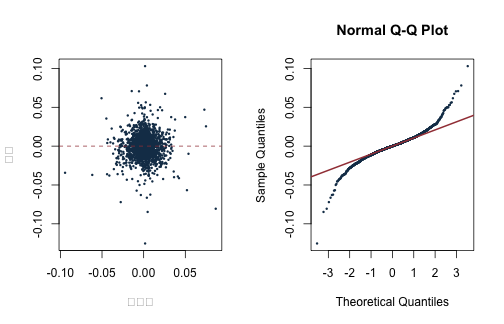

本附錄對應第 1 章，使用固定的 S\&P 500 日報酬面板練習 R 物件、dplyr 資料處理與手動 OLS。例子把 AAPL 當日報酬對 MSFT、NVDA 的等權平均當日報酬做線性投影，只用來核對矩陣代數；它不是即時預測，也不具有因果解讀。


``` r
knitr::opts_chunk$set(
  echo = TRUE, message = FALSE, warning = FALSE,
  fig.width = 7, fig.height = 4.5
)
stopifnot(requireNamespace("dplyr", quietly = TRUE))
stopifnot(requireNamespace("tibble", quietly = TRUE))
library(dplyr)
```

```
## 
## Attaching package: 'dplyr'
```

```
## The following objects are masked from 'package:stats':
## 
##     filter, lag
```

```
## The following objects are masked from 'package:base':
## 
##     intersect, setdiff, setequal, union
```

``` r
library(tibble)

root_candidates <- c(".", "..")
is_root <- vapply(root_candidates, function(x) {
  file.exists(file.path(x, "main.tex"))
}, logical(1))
stopifnot(any(is_root))
project_root <- root_candidates[which(is_root)[1]]
project_path <- function(...) file.path(project_root, ...)
```

## 讀取、選欄與資料契約


``` r
data_path <- project_path(
  "data", "processed", "sp500_returns_balanced_2013_2022.csv"
)
manifest_path <- project_path("data", "processed", "manifest.csv")
stopifnot(file.exists(data_path), file.exists(manifest_path))

raw <- read.csv(data_path, check.names = FALSE)
returns <- raw |>
  transmute(
    date = as.Date(date),
    AAPL = as.numeric(AAPL),
    MSFT = as.numeric(MSFT),
    NVDA = as.numeric(NVDA)
  ) |>
  arrange(date)

stopifnot(!anyNA(returns), !anyDuplicated(returns$date))
stopifnot(all(diff(returns$date) > 0))
glimpse(returns)
```

```
## Rows: 2,384
## Columns: 4
## $ date <date> 2013-01-03, 2013-01-04, 2013-01-07, 2013-01-08, 2013-01-09, 2013…
## $ AAPL <dbl> -0.012622072, -0.027854471, -0.005882822, 0.002691439, -0.0156289…
## $ MSFT <dbl> -0.0133961372, -0.0187154612, -0.0018699229, -0.0052453126, 0.005…
## $ NVDA <dbl> 0.0007860068, 0.0329928166, -0.0288975086, -0.0219260948, -0.0224…
```

資料是原課程價格長表建立的固定版本，並已隨公開網站提供。建檔時先在每一股票內依日期計算報酬，再保留 89 檔皆有觀察值的共同交易日；來源、修正理由、MD5 與公開界線見 `data/DATA_SOURCES.md`。

## 向量、資料框與管線


``` r
first_five <- returns$AAPL[1:5]
object_summary <- tibble(
  object = c("first_five", "returns"),
  class = c(class(first_five)[1], class(returns)[1]),
  length_or_rows = c(length(first_five), nrow(returns))
)
object_summary
```

```
## # A tibble: 2 × 3
##   object     class      length_or_rows
##   <chr>      <chr>               <int>
## 1 first_five numeric                 5
## 2 returns    data.frame           2384
```

用 mutate 建立兩檔股票的等權平均，並用 summarise 依年度描述 AAPL。因原檔已是簡單報酬，平均數仍以小數表示。


``` r
analysis_df <- returns |>
  mutate(
    tech_equal = (MSFT + NVDA) / 2,
    year = as.integer(format(date, "%Y"))
  )

annual_summary <- analysis_df |>
  group_by(year) |>
  summarise(
    observations = n(),
    mean_aapl = mean(AAPL),
    sd_aapl = sd(AAPL),
    .groups = "drop"
  )
annual_summary
```

```
## # A tibble: 10 × 4
##     year observations  mean_aapl sd_aapl
##    <int>        <int>      <dbl>   <dbl>
##  1  2013          251  0.000347   0.0179
##  2  2014          252  0.00145    0.0136
##  3  2015          252  0.0000199  0.0168
##  4  2016          252  0.000575   0.0147
##  5  2017          251  0.00164    0.0111
##  6  2018          251 -0.0000573  0.0181
##  7  2019          252  0.00266    0.0165
##  8  2020          253  0.00281    0.0294
##  9  2021          252  0.00131    0.0158
## 10  2022          118 -0.00202    0.0227
```

## 手動 OLS

令 \(y\) 為 AAPL 當日報酬，\(x\) 為 MSFT、NVDA 的等權平均當日報酬。設計矩陣第一欄是截距。


``` r
y <- analysis_df$AAPL
X <- cbind(Intercept = 1, tech_equal = analysis_df$tech_equal)

stopifnot(nrow(X) == length(y), qr(X)$rank == ncol(X))

beta_manual <- solve(crossprod(X), crossprod(X, y))
fitted_manual <- as.numeric(X %*% beta_manual)
residual_manual <- y - fitted_manual

tibble(
  term = rownames(beta_manual),
  estimate = as.numeric(beta_manual)
)
```

```
## # A tibble: 2 × 2
##   term       estimate
##   <chr>         <dbl>
## 1 Intercept  0.000124
## 2 tech_equal 0.569
```

crossprod(X) 等於 \(X^\top X\)，crossprod(X, y) 等於
\(X^\top y\)。正式計算通常偏好 QR 分解，因為直接求逆在近共線時較不穩定；這裡使用公式是為了對照課文。

## 與 lm、QR 解核對


``` r
fit_lm <- lm(AAPL ~ tech_equal, data = analysis_df)
beta_qr <- qr.solve(X, y)

comparison <- tibble(
  term = names(coef(fit_lm)),
  manual = as.numeric(beta_manual),
  qr = as.numeric(beta_qr),
  lm = as.numeric(coef(fit_lm))
)
comparison
```

```
## # A tibble: 2 × 4
##   term          manual       qr       lm
##   <chr>          <dbl>    <dbl>    <dbl>
## 1 (Intercept) 0.000124 0.000124 0.000124
## 2 tech_equal  0.569    0.569    0.569
```

``` r
stopifnot(
  isTRUE(all.equal(as.numeric(beta_manual), as.numeric(beta_qr))),
  isTRUE(all.equal(as.numeric(beta_manual), as.numeric(coef(fit_lm))))
)
```

## 正規方程式與配適分解

含截距 OLS 殘差應與設計矩陣每欄正交。


``` r
orthogonality <- as.numeric(crossprod(X, residual_manual))
names(orthogonality) <- colnames(X)
orthogonality
```

```
##    Intercept   tech_equal 
## 5.342948e-16 2.107689e-16
```

``` r
stopifnot(max(abs(orthogonality)) < 1e-10)

sst <- sum((y - mean(y))^2)
sse <- sum(residual_manual^2)
ssr <- sum((fitted_manual - mean(y))^2)
c(SST = sst, explained = ssr, SSE = sse, difference = sst - ssr - sse)
```

```
##           SST     explained           SSE    difference 
##  7.771318e-01  2.989755e-01  4.781562e-01 -4.996004e-16
```

## 缺值政策必須明寫

以下函數預設遇到缺值就停止；只有呼叫者明確要求時才刪除完整列。這比把 na.rm = TRUE 散落在每個統計量中更容易審核。


``` r
prepare_complete <- function(data, columns, allow_drop = FALSE) {
  stopifnot(all(columns %in% names(data)))
  ok <- complete.cases(data[, columns, drop = FALSE])
  if (!all(ok) && !allow_drop) {
    stop("指定欄位含缺值；請決定刪除、填補或修正來源。")
  }
  data[ok, , drop = FALSE]
}

toy <- tibble(y = c(1, 2, NA), x = c(0, 1, 2))
expected_error <- try(
  prepare_complete(toy, c("y", "x")),
  silent = TRUE
)
inherits(expected_error, "try-error")
```

```
## [1] TRUE
```

``` r
prepare_complete(toy, c("y", "x"), allow_drop = TRUE)
```

```
## # A tibble: 2 × 2
##       y     x
##   <dbl> <dbl>
## 1     1     0
## 2     2     1
```

## 診斷圖


``` r
par(mfrow = c(1, 2))
plot(
  fitted_manual, residual_manual,
  xlab = "配適值", ylab = "殘差",
  pch = 16, cex = 0.45, col = "#173B57"
)
abline(h = 0, lty = 2, col = "#A34045")
qqnorm(residual_manual, pch = 16, cex = 0.45, col = "#173B57")
qqline(residual_manual, col = "#A34045", lwd = 2)
```



``` r
par(mfrow = c(1, 1))
```

日報酬殘差常有厚尾與波動群聚；普通 OLS 係數的代數仍成立，但推論需要檢查時間相依與異質變異。若改成預測問題，所有解釋變數還必須在預測起點可得，並依第 8 章做時間排序的樣本外評估。
