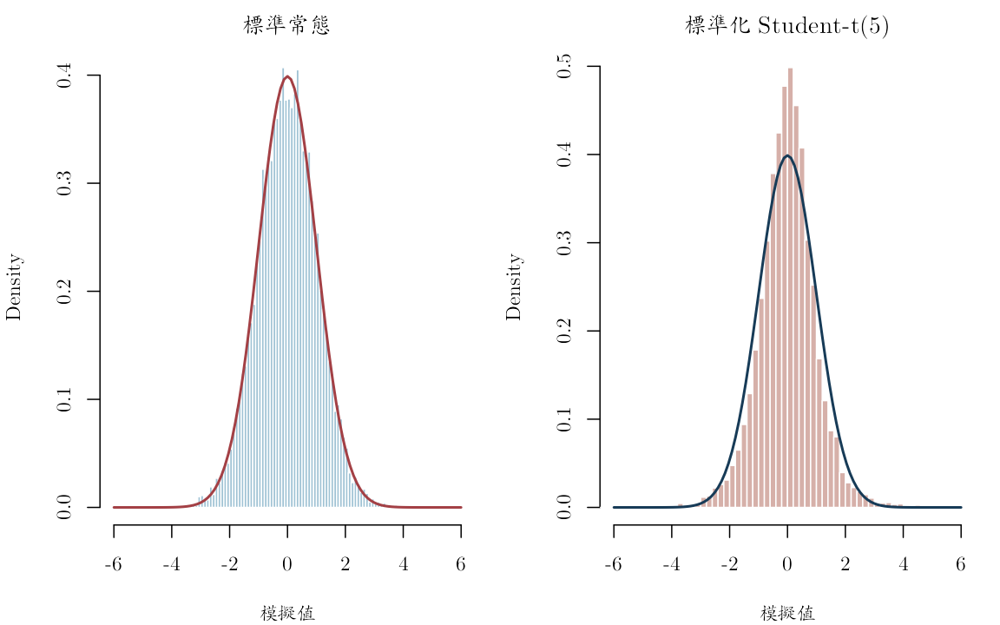
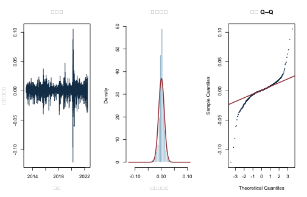
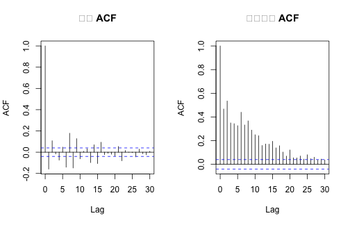

本附錄對應第 3--4 章。先以固定種子比較常態與標準化 Student-$t$ 分配，再分析兩組真實日簡單報酬：1986--2008 年的 Microsoft（MSFT），以及由 89 檔股票組成的 2013--2022 年等權教學投資組合。MSFT 資料源自 Ruey S. Tsay 教科書網站的 `d-msft8608.txt`；股票面板源自原課程 S&P 500 價格檔。固定版本與建置方式見 `data/DATA_SOURCES.md`。

兩組報酬都以小數表示，0.01 代表 1%。等權序列不是官方 S&P 500 指數，也沒有校正成分股生存者偏誤。以下分配與相依性結果是歷史描述，不能解讀成任何市場事件對報酬的因果效果。


``` r
knitr::opts_chunk$set(
  echo = TRUE, message = FALSE, warning = FALSE,
  fig.width = 8, fig.height = 5,
  dev = "ragg_png", dpi = 144,
  dev.args = list(background = "white")
)
set.seed(20260716)

root_candidates <- c(".", "..")
is_root <- vapply(root_candidates, function(x) {
  file.exists(file.path(x, "main.tex"))
}, logical(1))
stopifnot(any(is_root))
project_root <- root_candidates[which(is_root)[1]]
project_path <- function(...) file.path(project_root, ...)

stopifnot(
  requireNamespace("ragg", quietly = TRUE),
  requireNamespace("systemfonts", quietly = TRUE)
)
cwtex_file <- project_path("assets", "fonts", "cwTeXQKai-Medium.ttf")
stopifnot(file.exists(cwtex_file))
if (!"cwTeX Online" %in% systemfonts::registry_fonts()$family) {
  systemfonts::register_font("cwTeX Online", cwtex_file)
}
plot_family <- "cwTeX Online"
```

## 描述統計與 Jarque--Bera 函數

以下峰度採用「常態分配等於 3」的定義；超額峰度是峰度減 3。有限樣本偏態與峰度有不同修正版本，因此正式報告必須交代公式。


``` r
sample_moments <- function(x) {
  x <- x[is.finite(x)]
  centered <- x - mean(x)
  m2 <- mean(centered^2)
  m3 <- mean(centered^3)
  m4 <- mean(centered^4)
  c(
    n = length(x),
    mean = mean(x),
    sd = sd(x),
    skewness = m3 / m2^(3 / 2),
    kurtosis = m4 / m2^2,
    excess_kurtosis = m4 / m2^2 - 3,
    q01 = unname(quantile(x, 0.01)),
    q05 = unname(quantile(x, 0.05)),
    median = median(x),
    q95 = unname(quantile(x, 0.95)),
    q99 = unname(quantile(x, 0.99))
  )
}

jarque_bera <- function(x) {
  m <- sample_moments(x)
  statistic <- m["n"] * (
    m["skewness"]^2 / 6 + m["excess_kurtosis"]^2 / 24
  )
  c(
    statistic = unname(statistic),
    p_value_iid_asymptotic = unname(
      pchisq(statistic, 2, lower.tail = FALSE)
    )
  )
}
```

## 常態與厚尾模擬：只用來核對直覺

自由度 5 的 Student-$t$ 變異數是 $5/(5-2)$。除以理論標準差後，它與標準常態具有相同變異數，但尾端仍較厚。


``` r
n_sim <- 10000L
normal_draw <- rnorm(n_sim)
t5_draw <- rt(n_sim, df = 5) / sqrt(5 / 3)

simulation_summary <- rbind(
  Normal = sample_moments(normal_draw),
  Student_t5 = sample_moments(t5_draw)
)
knitr::kable(round(simulation_summary, 4))
```


|           |     n|   mean|     sd| skewness| kurtosis| excess_kurtosis|     q01|     q05| median|    q95|    q99|
|:----------|-----:|------:|------:|--------:|--------:|---------------:|-------:|-------:|------:|------:|------:|
|Normal     | 10000| 0.0101| 1.0136|  -0.0016|   3.0640|          0.0640| -2.4048| -1.6583| 0.0099| 1.6794| 2.3828|
|Student_t5 | 10000| 0.0007| 1.0129|  -0.1179|   8.1864|          5.1864| -2.6003| -1.5806| 0.0158| 1.5817| 2.6540|


``` r
old_par <- par(
  mfrow = c(1, 2), mar = c(4, 4, 2, 1),
  family = plot_family
)
hist(
  normal_draw, breaks = 80, probability = TRUE,
  xlim = c(-6, 6), col = "#9FC2D4", border = "white",
  main = "標準常態", xlab = "模擬值"
)
curve(dnorm(x), add = TRUE, lwd = 2, col = "#A34045")
hist(
  t5_draw, breaks = 100, probability = TRUE,
  xlim = c(-6, 6), col = "#D6B0A9", border = "white",
  main = "標準化 Student-t(5)", xlab = "模擬值"
)
curve(dnorm(x), add = TRUE, lwd = 2, col = "#173B57")
```



``` r
par(old_par)
```

模擬在這裡只說明「相同變異數不代表相同尾端」；真正的實證問題要由以下固定資料回答。

## 讀取 MSFT 與股票面板


``` r
msft <- read.csv(project_path(
  "data", "processed", "msft_daily_returns_1986_2008.csv"
))
msft$date <- as.Date(msft$date)
msft <- msft[order(msft$date), ]

panel <- read.csv(
  project_path(
    "data", "processed", "sp500_returns_balanced_2013_2022.csv"
  ),
  check.names = FALSE
)
panel$date <- as.Date(panel$date)
R <- as.matrix(panel[, setdiff(names(panel), "date")])
storage.mode(R) <- "double"

stopifnot(
  !anyNA(msft$date), !anyNA(msft$simple_return),
  all(diff(msft$date) > 0),
  !anyNA(panel$date), !anyNA(R),
  all(diff(panel$date) > 0)
)

sp_equal <- rowMeans(R)

data_profile <- data.frame(
  序列 = c("MSFT", "89 檔股票等權教學投資組合"),
  起日 = c(min(msft$date), min(panel$date)),
  迄日 = c(max(msft$date), max(panel$date)),
  觀察值 = c(nrow(msft), nrow(panel)),
  資產數 = c(1L, ncol(R)),
  單位 = "日簡單報酬，小數",
  來源 = c(
    "Tsay 教科書網站 d-msft8608.txt",
    "原課程 S&P 500 價格檔的平衡面板"
  ),
  check.names = FALSE
)
knitr::kable(data_profile)
```


|序列                      |起日       |迄日       | 觀察值| 資產數|單位             |來源                            |
|:-------------------------|:----------|:----------|------:|------:|:----------------|:-------------------------------|
|MSFT                      |1986-03-14 |2008-12-31 |   5752|      1|日簡單報酬，小數 |Tsay 教科書網站 d-msft8608.txt  |
|89 檔股票等權教學投資組合 |2013-01-03 |2022-06-22 |   2384|     89|日簡單報酬，小數 |原課程 S&P 500 價格檔的平衡面板 |

## 真實報酬的偏態、峰度與尾端


``` r
empirical_summary <- rbind(
  MSFT = sample_moments(msft$simple_return),
  SP_equal_weight = sample_moments(sp_equal)
)
knitr::kable(round(empirical_summary, 5))
```


|                |    n|    mean|      sd| skewness| kurtosis| excess_kurtosis|      q01|      q05|  median|     q95|     q99|
|:---------------|----:|-------:|-------:|--------:|--------:|---------------:|--------:|--------:|-------:|-------:|-------:|
|MSFT            | 5752| 0.00123| 0.02359| -0.13209| 12.92329|         9.92329| -0.06108| -0.03306| 0.00000| 0.03846| 0.06344|
|SP_equal_weight | 2384| 0.00076| 0.01075| -0.67951| 22.94458|        19.94458| -0.03040| -0.01555| 0.00106| 0.01469| 0.02507|

``` r
jb_table <- rbind(
  MSFT = jarque_bera(msft$simple_return),
  SP_equal_weight = jarque_bera(sp_equal)
)
knitr::kable(jb_table, digits = 6)
```


|                | statistic| p_value_iid_asymptotic|
|:---------------|---------:|----------------------:|
|MSFT            |  23617.11|                      0|
|SP_equal_weight |  39696.89|                      0|

MSFT 的樣本峰度約為 12.92，等權教學組合約為 22.94，均遠高於常態分配的 3；兩者的 Jarque--Bera 統計量也都很大。這是厚尾與偏態的實證警訊，不代表某一個替代分配已被唯一選定。

Jarque--Bera 的卡方近似依賴獨立同分配與有限高階動差。金融報酬常有條件異質變異，因此極小的漸近 $p$ 值可作常態模型的警訊，卻不能取代完整的時間序列診斷。

## 原課程套件捷徑：`fBasics`

原課程的實作程式在
`slides/L02_Return_properties/W1L2_R_scripts_Descriptive_stat_returns.R`
以 `fBasics::basicStats()` 整理描述統計，並以
`normalTest(..., method = "jb")` 執行 Jarque--Bera 檢定。下列程式保留這個捷徑，但改讀本書的固定公開資料，不在執行期連線下載。


``` r
stopifnot(requireNamespace("fBasics", quietly = TRUE))

empirical_series <- list(
  MSFT = msft$simple_return,
  `S&P 等權教學組合` = sp_equal
)

basic_row <- function(out, row_name) {
  out <- as.matrix(out)
  location <- match(tolower(row_name), tolower(row.names(out)))
  stopifnot(!is.na(location))
  as.numeric(out[location, 1])
}

fbasics_summary <- lapply(empirical_series, fBasics::basicStats)
manual_summary <- lapply(empirical_series, sample_moments)

moment_comparison <- do.call(rbind, lapply(names(empirical_series), function(nm) {
  package_result <- as.matrix(fbasics_summary[[nm]])
  manual_result <- manual_summary[[nm]]
  manual_values <- c(
    manual_result["mean"],
    manual_result["sd"],
    manual_result["skewness"],
    manual_result["excess_kurtosis"]
  )
  package_values <- c(
    basic_row(package_result, "Mean"),
    basic_row(package_result, "Stdev"),
    basic_row(package_result, "Skewness"),
    basic_row(package_result, "Kurtosis")
  )
  data.frame(
    序列 = nm,
    統計量 = c("平均數", "標準差", "偏態", "超額峰度"),
    手動版 = unname(manual_values),
    fBasics = package_values,
    套件減手動 = package_values - unname(manual_values),
    check.names = FALSE
  )
}))
row.names(moment_comparison) <- NULL
knitr::kable(moment_comparison, digits = 7)
```


|序列             |統計量   |     手動版|   fBasics| 套件減手動|
|:----------------|:--------|----------:|---------:|----------:|
|MSFT             |平均數   |  0.0012318|  0.001232|  0.0000002|
|MSFT             |標準差   |  0.0235944|  0.023594| -0.0000004|
|MSFT             |偏態     | -0.1320928| -0.132058|  0.0000348|
|MSFT             |超額峰度 |  9.9232911|  9.918798| -0.0044931|
|S&P 等權教學組合 |平均數   |  0.0007612|  0.000761| -0.0000002|
|S&P 等權教學組合 |標準差   |  0.0107466|  0.010747|  0.0000004|
|S&P 等權教學組合 |偏態     | -0.6795124| -0.679085|  0.0004274|
|S&P 等權教學組合 |超額峰度 | 19.9445772| 19.925332| -0.0192452|

``` r
fbasics_jb <- lapply(empirical_series, function(x) {
  fBasics::normalTest(x, method = "jb")
})

# 保留原套件的完整列印結果，方便學生認識 fHTEST 輸出。
for (nm in names(fbasics_jb)) {
  cat("\n", nm, "\n", sep = "")
  print(fbasics_jb[[nm]])
}
```

```
## 
## MSFT
## 
## Title:
##  Jarque-Bera Normality Test
## 
## Test Results:
##   STATISTIC:
##     X-squared: 23617.1128
##   P VALUE:
##     Asymptotic p Value: < 2.2e-16 
## 
## 
## S&P 等權教學組合
## 
## Title:
##  Jarque-Bera Normality Test
## 
## Test Results:
##   STATISTIC:
##     X-squared: 39696.8887
##   P VALUE:
##     Asymptotic p Value: < 2.2e-16
```

``` r
extract_fhtest <- function(x) {
  test_result <- methods::slot(x, "test")
  c(
    statistic = unname(test_result$statistic),
    p_value = unname(test_result$p.value)
  )
}

jb_comparison <- do.call(rbind, lapply(names(empirical_series), function(nm) {
  manual_result <- jarque_bera(empirical_series[[nm]])
  package_result <- extract_fhtest(fbasics_jb[[nm]])
  data.frame(
    序列 = nm,
    手動JB = manual_result["statistic"],
    fBasics_JB = package_result["statistic"],
    手動p值 = manual_result["p_value_iid_asymptotic"],
    fBasics_p值 = package_result["p_value"],
    check.names = FALSE
  )
}))
row.names(jb_comparison) <- NULL
knitr::kable(jb_comparison, digits = 7)
```


|序列             |   手動JB| fBasics_JB| 手動p值| fBasics_p值|
|:----------------|--------:|----------:|-------:|-----------:|
|MSFT             | 23617.11|   23617.11|       0|           0|
|S&P 等權教學組合 | 39696.89|   39696.89|       0|           0|

平均數與標準差可用來核對資料與單位；偏態、峰度與 Jarque--Bera
數值則可能因有限樣本修正與動差定義不同而略有差異。特別是
`basicStats()` 的 `Kurtosis` 應與上文「常態等於 0」的超額峰度比較，不是直接與「常態等於 3」的峰度比較。兩種做法對這份固定資料的實質結論應一致：兩組報酬都對常態模型提出強烈警訊。


``` r
series_list <- list(
  MSFT = list(date = msft$date, return = msft$simple_return),
  `S&P 等權教學組合` = list(date = panel$date, return = sp_equal)
)

old_par <- par(
  mfrow = c(2, 3), mar = c(4.5, 3.7, 3, 1),
  family = plot_family
)
for (nm in names(series_list)) {
  z <- series_list[[nm]]
  plot(
    z$date, 100 * z$return, type = "l", col = "#173B57",
    xlab = "日期", ylab = "日報酬（%）", main = nm
  )
  hist(
    z$return, breaks = 70, probability = TRUE,
    col = "#9FC2D4", border = "white",
    xlab = "日簡單報酬", main = paste(nm, "分配")
  )
  curve(
    dnorm(x, mean(z$return), sd(z$return)),
    add = TRUE, lwd = 2, col = "#A34045"
  )
  qqnorm(
    z$return, pch = 16, cex = 0.4,
    col = "#173B57", main = paste(nm, "常態 Q--Q")
  )
  qqline(z$return, col = "#A34045", lwd = 2)
}
```



``` r
par(old_par)
```

Q--Q 圖能分開呈現左尾與右尾的偏離。圖形是診斷證據，不是某個厚尾分配已被證明正確。

## 報酬與平方報酬的時間相依


``` r
old_par <- par(
  mfrow = c(2, 2), mar = c(4, 3.5, 4, 1),
  family = plot_family, cex.main = 0.85
)
for (nm in names(series_list)) {
  z <- series_list[[nm]]$return
  acf(z, lag.max = 30, main = paste(nm, "報酬 ACF"))
  acf(z^2, lag.max = 30, main = paste(nm, "平方報酬 ACF"))
}
```



``` r
par(old_par)
```


``` r
lb_row <- function(x, series_name) {
  q_return <- Box.test(x, lag = 20, type = "Ljung-Box")
  q_square <- Box.test(x^2, lag = 20, type = "Ljung-Box")
  data.frame(
    序列 = series_name,
    Q20_報酬 = unname(q_return$statistic),
    p_報酬 = q_return$p.value,
    Q20_平方報酬 = unname(q_square$statistic),
    p_平方報酬 = q_square$p.value,
    check.names = FALSE
  )
}

diagnostics <- rbind(
  lb_row(msft$simple_return, "MSFT"),
  lb_row(sp_equal, "S&P 等權教學組合")
)
knitr::kable(diagnostics, digits = 6)
```


|序列             | Q20_報酬|   p_報酬| Q20_平方報酬| p_平方報酬|
|:----------------|--------:|--------:|------------:|----------:|
|MSFT             |  41.3004| 0.003408|     1156.800|          0|
|S&P 等權教學組合 | 422.1970| 0.000000|     4037.729|          0|

報酬方向的線性相關與平方報酬的波動相依是兩個不同問題。Ljung--Box 結果只檢查指定落後集合的零自相關限制；它不直接證明報酬可交易，也不提供因果機制。

## 定位極端日期


``` r
largest_moves <- function(date, x, label, number = 5L) {
  keep <- order(abs(x), decreasing = TRUE)[seq_len(number)]
  data.frame(
    序列 = label,
    日期 = date[keep],
    日簡單報酬 = x[keep],
    check.names = FALSE
  )
}

extreme_table <- rbind(
  largest_moves(msft$date, msft$simple_return, "MSFT"),
  largest_moves(panel$date, sp_equal, "S&P 等權教學組合")
)
knitr::kable(extreme_table, digits = 6)
```


|序列             |日期       | 日簡單報酬|
|:----------------|:----------|----------:|
|MSFT             |1987-10-19 |  -0.301158|
|MSFT             |2000-10-19 |   0.195652|
|MSFT             |1987-10-26 |  -0.186529|
|MSFT             |2008-10-13 |   0.186047|
|MSFT             |1987-10-21 |   0.179688|
|S&P 等權教學組合 |2020-03-16 |  -0.121581|
|S&P 等權教學組合 |2020-03-24 |   0.105691|
|S&P 等權教學組合 |2020-03-12 |  -0.096315|
|S&P 等權教學組合 |2020-03-13 |   0.087688|
|S&P 等權教學組合 |2020-03-09 |  -0.080871|

這張表只定位需要回查的觀察值。確認是資料錯誤才修正；真實市場極端值正是厚尾與風險分析的重要資訊。
