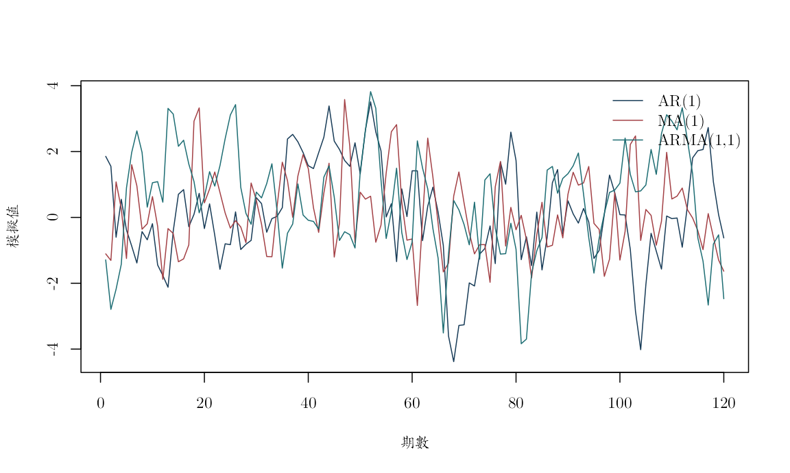
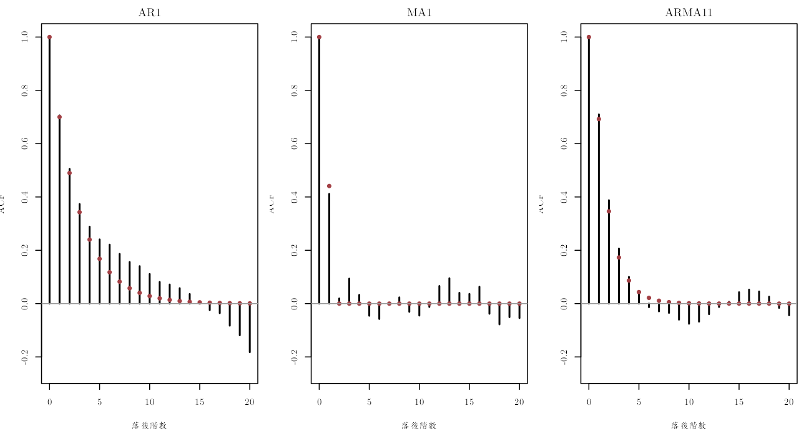
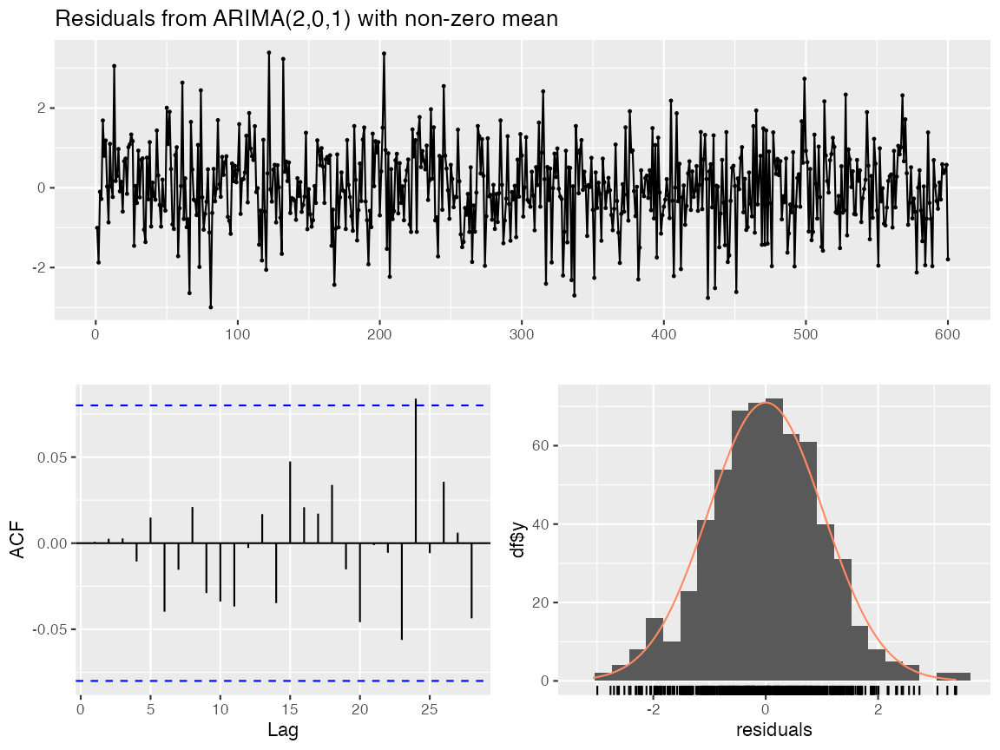
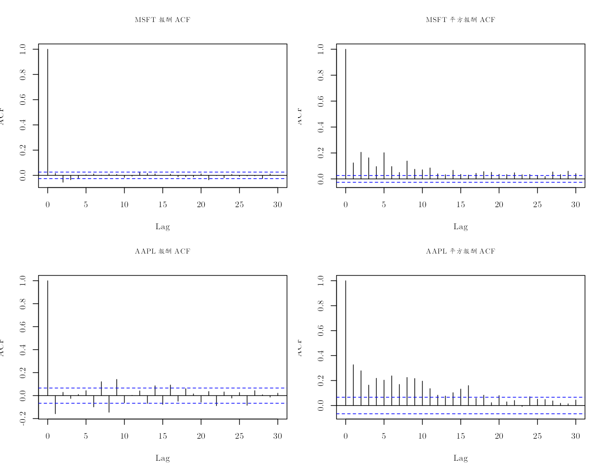

本附錄對應第 4–6 章，要練習從自相關函數（autocorrelation function, ACF）辨認 AR、MA 與 ARMA 動態，同時看清楚理論圖形與真實金融資料之間的距離。第一部分用固定種子模擬三個參數已知的過程，讓我們能把樣本 ACF 直接疊在理論 ACF 上；第二部分改用 MSFT 與 AAPL 日簡單報酬，檢查樣本中的線性相依與波動相依。

MSFT 樣本為 1986-03-14 至 2008-12-31，共 5,752 筆；AAPL 樣本為 2019-01-03 至 2022-06-22，共 874 筆有效報酬。每一筆是一個交易日，兩者單位都是日簡單報酬的小數。資料來源分別是 Tsay 教科書網站與原課程 S&P 500 價格檔，詳見 `data/DATA_SOURCES.md`。真實資料部分使用完整歷史樣本做描述，沒有訓練期、驗證期與測試期之分；以下相關性也沒有因果含意。


``` r
knitr::opts_chunk$set(
  echo = TRUE, message = FALSE, warning = FALSE,
  fig.width = 8, fig.height = 4.8,
  dev = "ragg_png", dpi = 144,
  dev.args = list(background = "white")
)
set.seed(20260716)

root_candidates <- c(".", "..")
is_root <- vapply(root_candidates, function(x) {
  file.exists(file.path(x, "main.tex"))
}, logical(1))
stopifnot(any(is_root))
project_root <- root_candidates[which(is_root)[1]]
project_path <- function(...) file.path(project_root, ...)

stopifnot(
  requireNamespace("ragg", quietly = TRUE),
  requireNamespace("systemfonts", quietly = TRUE)
)
cwtex_file <- project_path("assets", "fonts", "cwTeXQKai-Medium.ttf")
stopifnot(file.exists(cwtex_file))
if (!"cwTeX Online" %in% systemfonts::registry_fonts()$family) {
  systemfonts::register_font("cwTeX Online", cwtex_file)
}
plot_family <- "cwTeX Online"
```

## 先用已知真值觀察三種動態

設定三個平均數為零、創新標準差為 1 的資料生成過程：

\[
\begin{aligned}
\text{AR(1)} &: Y_t=0.70Y_{t-1}+a_t,\\
\text{MA(1)} &: Y_t=a_t+0.60a_{t-1},\\
\text{ARMA(1,1)} &: Y_t=0.50Y_{t-1}+a_t+0.40a_{t-1}.
\end{aligned}
\]

三條序列各有 600 期，觀察單位是模擬期數，沒有日曆日期或貨幣單位。三組創新分別抽自同一個標準常態分配，標準差都是 1，但三條路徑並未逐期共用同一批創新。因此，母體模型的系統性差異只來自 AR 與 MA 係數，有限樣本路徑的差異則同時包含動態差異與不同創新的抽樣波動。這段模擬用來理解模型與檢查程式，不會被當成金融市場的實證證據。


``` r
n_sim <- 600L
phi_ar <- 0.70
theta_ma <- 0.60
phi_arma <- 0.50
theta_arma <- 0.40

# 讓 arima.sim() 依指定真值生成資料；同一種子使三條路徑可重做。
ar1 <- as.numeric(arima.sim(
  model = list(ar = phi_ar), n = n_sim, sd = 1
))
ma1 <- as.numeric(arima.sim(
  model = list(ma = theta_ma), n = n_sim, sd = 1
))
arma11 <- as.numeric(arima.sim(
  model = list(ar = phi_arma, ma = theta_arma),
  n = n_sim, sd = 1
))

simulation_table <- data.frame(
  模型 = c("AR(1)", "MA(1)", "ARMA(1,1)"),
  樣本平均數 = c(mean(ar1), mean(ma1), mean(arma11)),
  樣本變異數 = c(var(ar1), var(ma1), var(arma11)),
  理論變異數 = c(
    1 / (1 - phi_ar^2),
    1 + theta_ma^2,
    1 + (phi_arma + theta_arma)^2 / (1 - phi_arma^2)
  ),
  check.names = FALSE
)
knitr::kable(simulation_table, digits = 4)
```


|模型      | 樣本平均數| 樣本變異數| 理論變異數|
|:---------|----------:|----------:|----------:|
|AR(1)     |     0.0579|     2.2077|     1.9608|
|MA(1)     |    -0.0507|     1.2948|     1.3600|
|ARMA(1,1) |     0.1914|     2.2633|     2.0800|

`樣本變異數` 不會與理論值完全相同，因為每條路徑只有 600 期；差距反映抽樣變動。這裡先看數量級是否合理，再從時間圖觀察衝擊消退的速度與短期起伏。


``` r
old_par <- par(family = plot_family)
matplot(
  1:120,
  cbind(ar1[1:120], ma1[1:120], arma11[1:120]),
  type = "l", lty = 1, lwd = 1,
  col = c("#173B57", "#A34045", "#1D6D73"),
  xlab = "期數", ylab = "模擬值"
)
legend(
  "topright", c("AR(1)", "MA(1)", "ARMA(1,1)"),
  col = c("#173B57", "#A34045", "#1D6D73"),
  lty = 1, bty = "n"
)
```



``` r
par(old_par)
```

## 理論 ACF 與樣本 ACF

真正用 ACF 辨認模型時，我們只看得到樣本柱線；模擬則額外知道理論值，所以可以把紅點疊上去。每一個落後階數比較相距 $k$ 期的觀察值，零階 ACF 固定等於 1。


``` r
lag_max <- 20L
series_sim <- list(AR1 = ar1, MA1 = ma1, ARMA11 = arma11)
theory_sim <- list(
  AR1 = ARMAacf(ar = phi_ar, lag.max = lag_max),
  MA1 = ARMAacf(ma = theta_ma, lag.max = lag_max),
  ARMA11 = ARMAacf(
    ar = phi_arma, ma = theta_arma, lag.max = lag_max
  )
)

old_par <- par(
  mfrow = c(1, 3), mar = c(4, 3.5, 2, 1),
  family = plot_family
)
for (nm in names(series_sim)) {
  # 樣本 ACF 由 600 期資料估計，理論 ACF 則直接由設定參數計算。
  sample_acf <- as.numeric(acf(
    series_sim[[nm]], lag.max = lag_max, plot = FALSE
  )$acf)
  plot(
    0:lag_max, sample_acf, type = "h", lwd = 2,
    ylim = c(-0.25, 1), xlab = "落後階數",
    ylab = "ACF", main = nm
  )
  points(0:lag_max, theory_sim[[nm]], pch = 16, col = "#A34045")
  abline(h = 0, col = "gray60")
}
```



``` r
par(old_par)
```

圖中 MA(1) 的母體 ACF 在一階之後為零，但有限樣本柱線仍會因抽樣誤差略微偏離零；不能把每一根小柱線都當成真正動態。AR 與 ARMA 的 ACF 通常逐步衰減，因此會呈現拖尾。這些是辨認候選模型的線索，正式選階仍要搭配資訊準則與殘差診斷。

## 套件作法：用 `auto.arima()` 選階並以 `checkresiduals()` 診斷

原課程的
`slides/L05_Forecasting_and_CV/W1L5_R_simulated_AR_ARMA_and_then_autoARMA.R`
在模擬 AR 與 ARMA 後，以 `forecast::auto.arima()` 選階、
`checkresiduals()` 檢查殘差，再以 `forecast()` 形成預測。下列程式沿用原課程的工作流程，對同一批固定種子模擬樣本操作。`auto.arima()` 會估計候選模型並依資訊準則比較，卻不會保證找回真實階數；季節性、搜尋範圍與資訊準則仍需自行設定。原程式寫成 `seasonal = "FALSE"`，這裡使用意義明確的邏輯值 `seasonal = FALSE`。


``` r
stopifnot(requireNamespace("forecast", quietly = TRUE))

true_orders <- list(
  AR1 = c(p = 1, d = 0, q = 0),
  MA1 = c(p = 0, d = 0, q = 1),
  ARMA11 = c(p = 1, d = 0, q = 1)
)
true_coefficients <- list(
  AR1 = c(ar1 = phi_ar),
  MA1 = c(ma1 = theta_ma),
  ARMA11 = c(ar1 = phi_arma, ma1 = theta_arma)
)

coefficient_or_zero <- function(coefficients, term) {
  if (term %in% names(coefficients)) unname(coefficients[term]) else 0
}

# 每個模型都只看到各自的 600 期樣本，函數不知道上方設定的真值。
auto_models <- lapply(series_sim, function(z) {
  forecast::auto.arima(ts(z), seasonal = FALSE)
})

# 將選定階數與已知真值並排，觀察有限樣本選模的不確定性。
auto_selection <- do.call(rbind, lapply(names(auto_models), function(nm) {
  fit <- auto_models[[nm]]
  selected <- forecast::arimaorder(fit)[c("p", "d", "q")]
  b <- coef(fit)
  selected_terms <- grep("^(ar|ma)[0-9]+$", names(b), value = TRUE)
  dynamic_terms <- sort(unique(c(
    names(true_coefficients[[nm]]), selected_terms
  )))
  data.frame(
    模擬真值 = nm,
    真p = unname(true_orders[[nm]]["p"]),
    真d = unname(true_orders[[nm]]["d"]),
    真q = unname(true_orders[[nm]]["q"]),
    自動p = unname(selected["p"]),
    自動d = unname(selected["d"]),
    自動q = unname(selected["q"]),
    動態係數 = dynamic_terms,
    真值 = vapply(
      dynamic_terms,
      function(term) coefficient_or_zero(true_coefficients[[nm]], term),
      numeric(1)
    ),
    估計值 = vapply(
      dynamic_terms,
      function(term) coefficient_or_zero(b, term),
      numeric(1)
    ),
    AICc = unname(fit$aicc),
    check.names = FALSE
  )
}))
row.names(auto_selection) <- NULL
knitr::kable(auto_selection, digits = 4)
```


|模擬真值 | 真p| 真d| 真q| 自動p| 自動d| 自動q|動態係數 | 真值| 估計值|     AICc|
|:--------|---:|---:|---:|-----:|-----:|-----:|:--------|----:|------:|--------:|
|AR1      |   1|   0|   0|     1|     0|     0|ar1      |  0.7| 0.7080| 1765.287|
|MA1      |   0|   0|   1|     0|     0|     1|ma1      |  0.6| 0.5866| 1702.242|
|ARMA11   |   1|   0|   1|     2|     0|     1|ar1      |  0.5| 0.5441| 1742.725|
|ARMA11   |   1|   0|   1|     2|     0|     1|ar2      |  0.0| 0.0024| 1742.725|
|ARMA11   |   1|   0|   1|     2|     0|     1|ma1      |  0.4| 0.3538| 1742.725|

讀表時先比較真 $(p,d,q)$ 與自動選定階數，再逐列查看動態係數。長表列出真實模型與所選模型中出現過的 AR、MA 項；某一規格沒有某個階數時，該係數在該規格下就是 0，而不是缺值。例如，自動選到額外的 `ar2` 時，真實 ARMA(1,1) 的 `ar2` 真值會明列為 0。即使階數相同，估計值也會受這一次 600 期路徑影響。`AICc` 是候選模型在這份模擬樣本中的相對分數，不是模型正確的機率。


``` r
forecast::checkresiduals(auto_models$ARMA11, lag = 20)
```



```
## 
## 	Ljung-Box test
## 
## data:  Residuals from ARIMA(2,0,1) with non-zero mean
## Q* = 8.5675, df = 17, p-value = 0.9529
## 
## Model df: 3.   Total lags used: 20
```

``` r
# 以 600 期資料估計後，一次預測尚未觀察的第 601 至 630 期。
course_forecast <- forecast::forecast(
  auto_models$ARMA11,
  h = 30,
  level = c(80, 95)
)
forecast_preview <- data.frame(
  期距 = seq_len(6),
  點預測 = as.numeric(head(course_forecast$mean, 6)),
  下界80 = as.numeric(head(course_forecast$lower[, "80%"], 6)),
  上界80 = as.numeric(head(course_forecast$upper[, "80%"], 6)),
  下界95 = as.numeric(head(course_forecast$lower[, "95%"], 6)),
  上界95 = as.numeric(head(course_forecast$upper[, "95%"], 6)),
  check.names = FALSE
)
knitr::kable(forecast_preview, digits = 4)
```


| 期距|  點預測|  下界80| 上界80|  下界95| 上界95|
|----:|-------:|-------:|------:|-------:|------:|
|    1| -0.9432| -2.2606| 0.3742| -2.9579| 1.0715|
|    2| -0.4310| -2.2015| 1.3395| -3.1387| 2.2767|
|    3| -0.1528| -2.0377| 1.7321| -3.0355| 2.7299|
|    4| -0.0002| -1.9182| 1.9177| -2.9335| 2.9331|
|    5|  0.0834| -1.8444| 2.0113| -2.8649| 3.0318|
|    6|  0.1293| -1.8014| 2.0601| -2.8235| 3.0822|

`checkresiduals()` 把殘差時間圖、ACF 與 Ljung–Box 檢定放在一起。若殘差仍有明顯自相關，下一步應擴大候選階數或重新思考模型，而不是直接採用預測。若診斷沒有明顯警訊，也只能說這些檢查尚未發現問題；預測區間仍依賴已選模型與創新分配的假設。

## 從多項式根判斷定態與可逆

ACF 圖形之外，AR 與 MA 多項式的根提供明確的模型條件。下列程式先列出根與其模，再用 `ARMAtoMA()` 產生衝擊反應係數，與手算遞迴比較。根的「模」是它到複數平面原點的距離，不是係數本身的絕對值。


``` r
root_table <- data.frame(
  部分 = c("AR(1) 的 AR 根", "MA(1) 的 MA 根", "ARMA 的 AR 根", "ARMA 的 MA 根"),
  根 = Re(c(
    polyroot(c(1, -phi_ar)),
    polyroot(c(1, theta_ma)),
    polyroot(c(1, -phi_arma)),
    polyroot(c(1, theta_arma))
  )),
  check.names = FALSE
)
root_table$模 <- abs(root_table$根)
knitr::kable(root_table, digits = 4)
```


|部分           |      根|     模|
|:--------------|-------:|------:|
|AR(1) 的 AR 根 |  1.4286| 1.4286|
|MA(1) 的 MA 根 | -1.6667| 1.6667|
|ARMA 的 AR 根  |  2.0000| 2.0000|
|ARMA 的 MA 根  | -2.5000| 2.5000|

``` r
stopifnot(all(root_table$模 > 1))

j <- 0:12
psi_manual <- c(1, (phi_arma + theta_arma) * phi_arma^(0:11))
psi_r <- c(1, ARMAtoMA(
  ar = phi_arma, ma = theta_arma, lag.max = 12
))
stopifnot(isTRUE(all.equal(psi_manual, psi_r)))
knitr::kable(data.frame(期距 = j, 手算 = psi_manual, R = psi_r), digits = 6)
```


| 期距|     手算|        R|
|----:|--------:|--------:|
|    0| 1.000000| 1.000000|
|    1| 0.900000| 0.900000|
|    2| 0.450000| 0.450000|
|    3| 0.225000| 0.225000|
|    4| 0.112500| 0.112500|
|    5| 0.056250| 0.056250|
|    6| 0.028125| 0.028125|
|    7| 0.014062| 0.014062|
|    8| 0.007031| 0.007031|
|    9| 0.003516| 0.003516|
|   10| 0.001758| 0.001758|
|   11| 0.000879| 0.000879|
|   12| 0.000439| 0.000439|

表中四個根的模都大於 1，因此此處設定的 AR 部分具有因果定態表示，MA 部分也可逆。兩個條件處理不同問題：前者讓目前值可由過去創新表示，後者讓創新可由目前與過去觀察值恢復。`手算` 與 `R` 兩欄重合，則確認衝擊反應的符號與遞迴次序一致。

## 真實 MSFT 與 AAPL 報酬

現在回到真實資料。兩份檔案的樣本期間不同，所以不直接比較單日觀察值；我們只對各自序列計算 ACF 與聯合檢定。日報酬在當日收盤價可得後才完整形成，本頁的同日與落後相關都是事後歷史描述，不是假設在盤中已能取得收盤資訊。


``` r
msft <- read.csv(project_path(
  "data", "processed", "msft_daily_returns_1986_2008.csv"
))
msft$date <- as.Date(msft$date)

aapl <- read.csv(project_path(
  "data", "processed", "aapl_adjusted_daily_2019_2022.csv"
))
aapl$date <- as.Date(aapl$date)
# 第一個價格沒有前一期報酬，僅保留有限的實際報酬列。
aapl <- aapl[is.finite(aapl$simple_return), ]

stopifnot(
  all(diff(msft$date) > 0), !anyNA(msft$simple_return),
  all(diff(aapl$date) > 0), !anyNA(aapl$simple_return)
)

real_profile <- data.frame(
  序列 = c("MSFT", "AAPL"),
  起日 = c(min(msft$date), min(aapl$date)),
  迄日 = c(max(msft$date), max(aapl$date)),
  觀察值 = c(nrow(msft), nrow(aapl)),
  單位 = "日簡單報酬，小數",
  來源 = c("Tsay d-msft8608.txt", "原課程 S&P 500 價格檔"),
  check.names = FALSE
)
knitr::kable(real_profile)
```


|序列 |起日       |迄日       | 觀察值|單位             |來源                  |
|:----|:----------|:----------|------:|:----------------|:---------------------|
|MSFT |1986-03-14 |2008-12-31 |   5752|日簡單報酬，小數 |Tsay d-msft8608.txt   |
|AAPL |2019-01-03 |2022-06-22 |    874|日簡單報酬，小數 |原課程 S&P 500 價格檔 |

資料摘要應重現本頁開頭的起訖日與有效觀察值數。若數字不同，應先檢查是否把 AAPL 第一筆自然缺值算入樣本，或日期是否未按時間排序。


``` r
real_series <- list(
  MSFT = msft$simple_return,
  AAPL = aapl$simple_return
)

old_par <- par(
  mfrow = c(2, 2), mar = c(4, 3.5, 4, 1),
  family = plot_family, cex.main = 0.85
)
for (nm in names(real_series)) {
  z <- real_series[[nm]]
  acf(z, lag.max = 30, main = paste(nm, "報酬 ACF"))
  acf(z^2, lag.max = 30, main = paste(nm, "平方報酬 ACF"))
}
```



``` r
par(old_par)
```

## Ljung–Box 聯合檢查

單看某一根 ACF 柱線容易受到抽樣誤差影響，所以再用 Ljung–Box 統計量聯合檢查前 20 階自相關是否同時為零。原報酬與平方報酬分開檢定，因為前者關心條件平均，後者關心波動大小的持續性。


``` r
lb_row <- function(x, label) {
  q_return <- Box.test(x, lag = 20, type = "Ljung-Box")
  q_square <- Box.test(x^2, lag = 20, type = "Ljung-Box")
  data.frame(
    序列 = label,
    Q20_報酬 = unname(q_return$statistic),
    p_報酬 = q_return$p.value,
    Q20_平方報酬 = unname(q_square$statistic),
    p_平方報酬 = q_square$p.value,
    check.names = FALSE
  )
}

lb_table <- rbind(
  lb_row(msft$simple_return, "MSFT"),
  lb_row(aapl$simple_return, "AAPL")
)
knitr::kable(lb_table, digits = 6)
```


|序列 | Q20_報酬|   p_報酬| Q20_平方報酬| p_平方報酬|
|:----|--------:|--------:|------------:|----------:|
|MSFT |  41.3004| 0.003408|    1156.8001|          0|
|AAPL | 119.5426| 0.000000|     549.4038|          0|

在這兩個固定樣本中，報酬與平方報酬的前 20 階聯合零自相關限制都遭拒絕，平方報酬的統計量尤其大。這表示以白雜訊作為完整描述並不充分，也說明真實資料比三條教學模擬更複雜。

這項拒絕尚未告訴我們應選哪一個 ARMA 階數。合理的下一步，是只在預先設定的訓練期內比較低階候選模型，檢查估計後殘差，再用保留期間評估預測。平方報酬的相依則提示第 11–12 章的條件變異模型；它描述波動持續性，不是平均報酬的因果機制，也不保證足以克服交易成本。

## 從模擬走向實證時要保留的判斷

已知真值模擬告訴我們 ACF 截尾或拖尾在理論上如何形成，也顯示 `auto.arima()` 在有限樣本中可能選到不同階數。真實 MSFT 與 AAPL 報酬則呈現平均與波動相依，無法只靠一張理論 ACF 圖決定模型。本頁還沒有做樣本外預測；R05 將在時間切分後比較 AAPL 的候選 ARMA 模型，讓資訊準則、殘差診斷與測試期各自負責不同的判斷。
