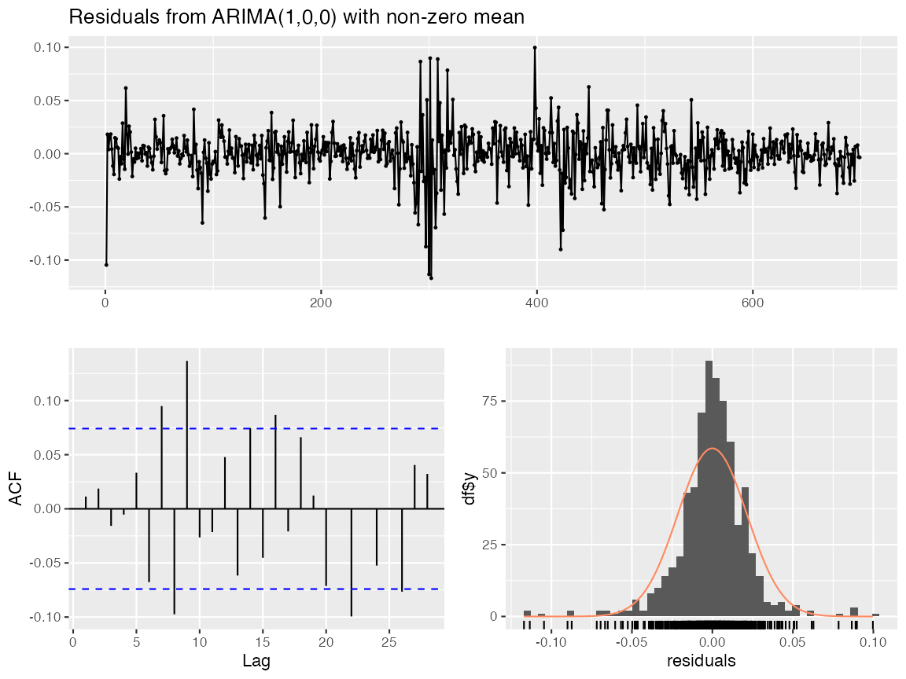
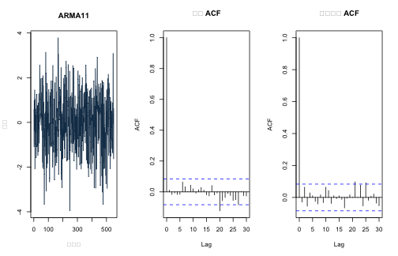
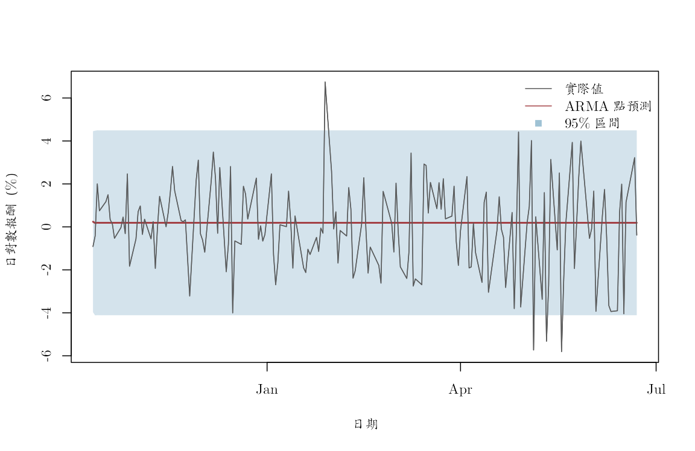

本附錄對應第 6--7 章，以真實 AAPL 日對數報酬示範 ARMA 候選模型、根、殘差診斷與一次形成的多步預測。固定資料源自原課程 S&P 500 價格檔；有效報酬樣本為 2019-01-03 至 2022-06-22，共 874 筆，單位是小數日對數報酬。資料建置方式見 `data/DATA_SOURCES.md`。

模型只描述 AAPL 報酬的條件平均動態。係數、診斷與預測誤差都不能解讀成市場事件對 AAPL 的因果效果，也不構成投資建議。


``` r
knitr::opts_chunk$set(
  echo = TRUE, message = FALSE, warning = FALSE,
  fig.width = 8, fig.height = 4.8,
  dev = "ragg_png", dpi = 144,
  dev.args = list(background = "white")
)

root_candidates <- c(".", "..")
is_root <- vapply(root_candidates, function(x) {
  file.exists(file.path(x, "main.tex"))
}, logical(1))
stopifnot(any(is_root))
project_root <- root_candidates[which(is_root)[1]]
project_path <- function(...) file.path(project_root, ...)

stopifnot(
  requireNamespace("ragg", quietly = TRUE),
  requireNamespace("systemfonts", quietly = TRUE)
)
cwtex_file <- project_path("assets", "fonts", "cwTeXQKai-Medium.ttf")
stopifnot(file.exists(cwtex_file))
if (!"cwTeX Online" %in% systemfonts::registry_fonts()$family) {
  systemfonts::register_font("cwTeX Online", cwtex_file)
}
plot_family <- "cwTeX Online"
```

## 固定資料與時間切分

前 80% 報酬是訓練期，最後 20% 是一次性測試期。候選模型、BIC 與所有參數只能使用訓練期；測試期不參與規格選擇。


``` r
aapl <- read.csv(project_path(
  "data", "processed", "aapl_adjusted_daily_2019_2022.csv"
))
aapl$date <- as.Date(aapl$date)
aapl <- aapl[order(aapl$date), ]
aapl <- aapl[is.finite(aapl$log_return), ]
row.names(aapl) <- NULL

stopifnot(
  !anyNA(aapl$date), !anyNA(aapl$log_return),
  all(diff(aapl$date) > 0)
)

y <- aapl$log_return
dates <- aapl$date
n <- length(y)
train_end <- floor(0.80 * n)
y_train <- y[seq_len(train_end)]
y_test <- y[(train_end + 1L):n]

split_table <- data.frame(
  區段 = c("訓練期", "測試期"),
  起日 = dates[c(1L, train_end + 1L)],
  迄日 = dates[c(train_end, n)],
  觀察值 = c(train_end, n - train_end),
  資料來源 = "原課程 S&P 500 價格檔的 AAPL 固定版本",
  單位 = "日對數報酬，小數",
  check.names = FALSE
)
knitr::kable(split_table)
```


|區段   |起日       |迄日       | 觀察值|資料來源                              |單位             |
|:------|:----------|:----------|------:|:-------------------------------------|:----------------|
|訓練期 |2019-01-03 |2021-10-11 |    699|原課程 S&P 500 價格檔的 AAPL 固定版本 |日對數報酬，小數 |
|測試期 |2021-10-12 |2022-06-22 |    175|原課程 S&P 500 價格檔的 AAPL 固定版本 |日對數報酬，小數 |

這裡評估的是「在訓練期末一次形成、之後不重新估計」的多步預測。逐期重估或滾動視窗的評估見 R06。

## 只在訓練期比較低階候選模型

候選集合在看測試結果以前固定。`stats::arima()` 對定態 ARMA 所報的 `intercept` 是序列平均數，而不是
$Y_t=c+\phi Y_{t-1}+a_t$ 中的 $c$。


``` r
candidate_orders <- list(
  ARMA00 = c(0, 0, 0),
  AR10 = c(1, 0, 0),
  MA01 = c(0, 0, 1),
  ARMA11 = c(1, 0, 1),
  AR20 = c(2, 0, 0),
  MA02 = c(0, 0, 2),
  ARMA21 = c(2, 0, 1),
  ARMA12 = c(1, 0, 2)
)

fits <- lapply(candidate_orders, function(ord) {
  arima(
    y_train,
    order = ord,
    include.mean = TRUE,
    method = "ML"
  )
})
stopifnot(all(vapply(fits, function(z) z$code == 0, logical(1))))

model_table <- data.frame(
  模型 = names(fits),
  p = vapply(candidate_orders, function(z) z[1], numeric(1)),
  q = vapply(candidate_orders, function(z) z[3], numeric(1)),
  對數概似 = vapply(fits, function(z) as.numeric(logLik(z)), numeric(1)),
  AIC = vapply(fits, AIC, numeric(1)),
  BIC = vapply(fits, BIC, numeric(1)),
  check.names = FALSE
)
model_table <- model_table[order(model_table$BIC), ]
row.names(model_table) <- NULL
knitr::kable(model_table, digits = 3)
```


|模型   |  p|  q| 對數概似|       AIC|       BIC|
|:------|--:|--:|--------:|---------:|---------:|
|AR10   |  1|  0| 1692.238| -3378.477| -3364.828|
|MA01   |  0|  1| 1691.150| -3376.300| -3362.651|
|ARMA11 |  1|  1| 1692.452| -3376.904| -3358.705|
|AR20   |  2|  0| 1692.444| -3376.887| -3358.689|
|MA02   |  0|  2| 1692.226| -3376.451| -3358.253|
|ARMA12 |  1|  2| 1692.452| -3374.905| -3352.156|
|ARMA21 |  2|  1| 1692.452| -3374.903| -3352.155|
|ARMA00 |  0|  0| 1678.042| -3352.084| -3342.985|

``` r
selected_name <- model_table$模型[1]
selected_fit <- fits[[selected_name]]
selected_order <- candidate_orders[[selected_name]]
selected_name
```

```
## [1] "AR10"
```

BIC 是訓練期內的相對比較，不是測試期成績，也不保證候選集合包含正確模型。

## 原課程套件捷徑：`auto.arima()`

原課程的
`slides/L04_ARMA/W1L4_R_template_for_estimating_ARMA.R`
以 `forecast::auto.arima()` 選階、`checkresiduals()` 診斷，再以
`forecast()` 形成預測。
`slides/L05_Forecasting_and_CV/W1L5_R_prediction_cv.R`
另示範了不使用逐步搜尋的 AIC 選階。下列兩個套件版本都只讀訓練期：第一個把階數範圍與資訊準則限制成上一節的手動候選集合，方便核對；第二個保留原課程的較自動 AIC 搜尋。


``` r
stopifnot(requireNamespace("forecast", quietly = TRUE))

# p <= 2、q <= 2 且 p + q <= 3，正好對應上文八個候選模型。
fit_auto_matched <- forecast::auto.arima(
  y_train,
  d = 0,
  stationary = TRUE,
  seasonal = FALSE,
  max.p = 2,
  max.q = 2,
  max.order = 3,
  ic = "bic",
  stepwise = FALSE,
  approximation = FALSE,
  allowmean = TRUE
)

# 原課程 AIC 工作流；不用測試期決定階數。
fit_auto_course <- forecast::auto.arima(
  y_train,
  seasonal = FALSE,
  ic = "aic",
  stepwise = FALSE,
  approximation = FALSE
)

order_text <- function(fit) {
  order <- forecast::arimaorder(fit)[c("p", "d", "q")]
  sprintf("ARIMA(%d,%d,%d)", order["p"], order["d"], order["q"])
}

selection_comparison <- data.frame(
  方法 = c(
    "手動候選集／BIC",
    "forecast 受限搜尋／BIC",
    "forecast 原課程搜尋／AIC"
  ),
  選定模型 = c(
    sprintf(
      "ARIMA(%d,%d,%d)",
      selected_order[1], selected_order[2], selected_order[3]
    ),
    order_text(fit_auto_matched),
    order_text(fit_auto_course)
  ),
  對數概似 = c(
    as.numeric(logLik(selected_fit)),
    as.numeric(logLik(fit_auto_matched)),
    as.numeric(logLik(fit_auto_course))
  ),
  AIC = c(
    AIC(selected_fit), AIC(fit_auto_matched), AIC(fit_auto_course)
  ),
  BIC = c(
    BIC(selected_fit), BIC(fit_auto_matched), BIC(fit_auto_course)
  ),
  check.names = FALSE
)
knitr::kable(selection_comparison, digits = 3)
```


|方法                     |選定模型     | 對數概似|       AIC|       BIC|
|:------------------------|:------------|--------:|---------:|---------:|
|手動候選集／BIC          |ARIMA(1,0,0) | 1692.238| -3378.477| -3364.828|
|forecast 受限搜尋／BIC   |ARIMA(1,0,0) | 1692.238| -3378.477| -3364.828|
|forecast 原課程搜尋／AIC |ARIMA(2,0,3) | 1708.172| -3402.344| -3370.497|

受限套件搜尋是對手動表的程式核對；若估計方法與參數化相同，應選到相同的相對勝者。AIC 版本的候選範圍與懲罰不同，即使選到不同階數也不是程式錯誤。這個對照也說明「自動選階」仍需把資訊準則、搜尋範圍與訓練期寫清楚。

## 係數、定態根與可逆根


``` r
coefficient_table <- data.frame(
  參數 = names(coef(selected_fit)),
  估計值 = as.numeric(coef(selected_fit)),
  標準誤 = sqrt(diag(selected_fit$var.coef)),
  check.names = FALSE
)
knitr::kable(coefficient_table, digits = 6)
```


|          |參數      |    估計值|   標準誤|
|:---------|:---------|---------:|--------:|
|ar1       |ar1       | -0.202870| 0.037686|
|intercept |intercept |  0.001906| 0.000677|

``` r
extract_roots <- function(fit) {
  b <- coef(fit)
  ar_coef <- b[grep("^ar[0-9]+$", names(b))]
  ma_coef <- b[grep("^ma[0-9]+$", names(b))]

  ar_roots <- if (length(ar_coef)) {
    polyroot(c(1, -ar_coef))
  } else {
    complex()
  }
  ma_roots <- if (length(ma_coef)) {
    polyroot(c(1, ma_coef))
  } else {
    complex()
  }

  rbind(
    if (length(ar_roots)) data.frame(
      部分 = "AR", 實部 = Re(ar_roots), 虛部 = Im(ar_roots), 模 = Mod(ar_roots)
    ),
    if (length(ma_roots)) data.frame(
      部分 = "MA", 實部 = Re(ma_roots), 虛部 = Im(ma_roots), 模 = Mod(ma_roots)
    )
  )
}

root_table <- extract_roots(selected_fit)
if (nrow(root_table)) {
  knitr::kable(root_table, digits = 5)
  stopifnot(all(root_table$模 > 1))
} else {
  cat("所選模型沒有 AR 或 MA 根需要檢查。\n")
}
```

AR 根在單位圓外表示估計模型具有因果定態表示；MA 根在單位圓外表示可逆。根接近 1 時，有限樣本推論與遠期預測仍可能不穩定。

## 訓練期殘差診斷


``` r
selected_residual <- as.numeric(residuals(selected_fit))
selected_residual <- selected_residual[is.finite(selected_residual)]
p_plus_q <- selected_order[1] + selected_order[3]

q_mean <- Box.test(
  selected_residual, lag = 20, type = "Ljung-Box",
  fitdf = p_plus_q
)
q_square <- Box.test(
  selected_residual^2, lag = 20, type = "Ljung-Box"
)

diagnostic_table <- data.frame(
  檢查對象 = c("殘差", "平方殘差"),
  Q20 = c(unname(q_mean$statistic), unname(q_square$statistic)),
  自由度 = c(unname(q_mean$parameter), unname(q_square$parameter)),
  p值 = c(q_mean$p.value, q_square$p.value),
  check.names = FALSE
)
knitr::kable(diagnostic_table, digits = 6)
```


|檢查對象 |       Q20| 自由度|     p值|
|:--------|---------:|------:|-------:|
|殘差     |  54.18846|     19| 3.1e-05|
|平方殘差 | 355.02037|     20| 0.0e+00|

本次 AR(1) 殘差的 Ljung--Box $p$ 值約為 $3.1\times10^{-5}$，平方殘差的數值更接近零。也就是說，BIC 所選模型只是候選集合內的相對勝者，並未清除全部平均與波動相依。


``` r
matched_order <- forecast::arimaorder(fit_auto_matched)[c("p", "d", "q")]
matched_residual <- as.numeric(residuals(fit_auto_matched))
matched_residual <- matched_residual[is.finite(matched_residual)]
matched_df <- matched_order["p"] + matched_order["q"]

matched_q_mean <- Box.test(
  matched_residual,
  lag = 20,
  type = "Ljung-Box",
  fitdf = matched_df
)
matched_q_square <- Box.test(
  matched_residual^2,
  lag = 20,
  type = "Ljung-Box"
)

diagnostic_comparison <- data.frame(
  方法 = rep(c("手動候選集", "forecast 受限搜尋"), each = 2),
  檢查對象 = rep(c("殘差", "平方殘差"), 2),
  Q20 = c(
    unname(q_mean$statistic), unname(q_square$statistic),
    unname(matched_q_mean$statistic),
    unname(matched_q_square$statistic)
  ),
  p值 = c(
    q_mean$p.value, q_square$p.value,
    matched_q_mean$p.value, matched_q_square$p.value
  ),
  check.names = FALSE
)
knitr::kable(diagnostic_comparison, digits = 7)
```


|方法              |檢查對象 |       Q20|      p值|
|:-----------------|:--------|---------:|--------:|
|手動候選集        |殘差     |  54.18846| 3.09e-05|
|手動候選集        |平方殘差 | 355.02037| 0.00e+00|
|forecast 受限搜尋 |殘差     |  54.19123| 3.09e-05|
|forecast 受限搜尋 |平方殘差 | 355.02619| 0.00e+00|

``` r
# 原課程使用的一行診斷：同時列出殘差圖、ACF 與 Ljung--Box 檢定。
forecast::checkresiduals(fit_auto_matched, lag = 20)
```



```
## 
## 	Ljung-Box test
## 
## data:  Residuals from ARIMA(1,0,0) with non-zero mean
## Q* = 54.191, df = 19, p-value = 3.089e-05
## 
## Model df: 1.   Total lags used: 20
```

若受限搜尋與手動程式選到相同模型，上表應幾乎重合。小數點差異可來自套件的初始化與數值容差；若模型或自由度不同，則必須先統一階數、估計法與 `fitdf`，才能比較 Ljung--Box 數值。


``` r
old_par <- par(
  mfrow = c(1, 3), mar = c(4.5, 3.5, 4, 1),
  family = plot_family, cex.main = 0.88
)
plot(
  dates[seq_along(selected_residual)], 100 * selected_residual,
  type = "l", col = "#173B57",
  xlab = "日期", ylab = "殘差（%）", main = selected_name
)
acf(selected_residual, lag.max = 30, main = "殘差 ACF")
acf(selected_residual^2, lag.max = 30, main = "平方殘差 ACF")
```



``` r
par(old_par)
```

若殘差仍有線性相依，所選低階平均數模型只是候選集合中的相對勝者，不是充分模型。平方殘差的相依則是第 11--12 章 ARCH/GARCH 模型的動機。

## 鎖定模型的一次多步預測


``` r
h <- length(y_test)
forecast_object <- predict(selected_fit, n.ahead = h)

forecast_table <- data.frame(
  日期 = dates[(train_end + 1L):n],
  實際值 = y_test,
  ARMA預測 = as.numeric(forecast_object$pred),
  預測標準誤 = as.numeric(forecast_object$se),
  check.names = FALSE
)
forecast_table$下界95 <- forecast_table$ARMA預測 -
  1.96 * forecast_table$預測標準誤
forecast_table$上界95 <- forecast_table$ARMA預測 +
  1.96 * forecast_table$預測標準誤
forecast_table$ARMA誤差 <- forecast_table$實際值 -
  forecast_table$ARMA預測

knitr::kable(head(forecast_table, 8), digits = 6)
```


|日期       |    實際值| ARMA預測| 預測標準誤|    下界95|   上界95|  ARMA誤差|
|:----------|---------:|--------:|----------:|---------:|--------:|---------:|
|2021-10-12 | -0.009145| 0.002420|   0.021496| -0.039711| 0.044552| -0.011565|
|2021-10-13 | -0.004249| 0.001802|   0.021933| -0.041188| 0.044791| -0.006051|
|2021-10-14 |  0.020024| 0.001927|   0.021951| -0.041097| 0.044952|  0.018097|
|2021-10-15 |  0.007485| 0.001902|   0.021952| -0.041124| 0.044928|  0.005583|
|2021-10-18 |  0.011737| 0.001907|   0.021952| -0.041119| 0.044933|  0.009830|
|2021-10-19 |  0.014968| 0.001906|   0.021952| -0.041120| 0.044932|  0.013062|
|2021-10-20 |  0.003356| 0.001906|   0.021952| -0.041120| 0.044932|  0.001450|
|2021-10-21 |  0.001473| 0.001906|   0.021952| -0.041120| 0.044932| -0.000433|


``` r
score_row <- function(actual, forecast, label) {
  error <- actual - forecast
  data.frame(
    模型 = label,
    RMSE = sqrt(mean(error^2)),
    MAE = mean(abs(error)),
    平均誤差 = mean(error),
    check.names = FALSE
  )
}

score_table <- rbind(
  score_row(y_test, forecast_table$ARMA預測, selected_name),
  score_row(y_test, rep(0, h), "零報酬"),
  score_row(y_test, rep(mean(y_train), h), "訓練期平均數")
)
score_table$常態區間涵蓋率 <- c(
  mean(
    y_test >= forecast_table$下界95 &
      y_test <= forecast_table$上界95
  ),
  NA_real_, NA_real_
)
knitr::kable(score_table, digits = 6)
```


|模型         |     RMSE|      MAE|  平均誤差| 常態區間涵蓋率|
|:------------|--------:|--------:|---------:|--------------:|
|AR10         | 0.020809| 0.016036| -0.002191|       0.977143|
|零報酬       | 0.020694| 0.015951| -0.000283|             NA|
|訓練期平均數 | 0.020805| 0.016031| -0.002162|             NA|

在這 175 筆固定測試資料中，零報酬基準的 RMSE 與 MAE 都略低於訓練期 BIC 所選的 AR(1)。這個負結果很重要：樣本內模型選擇準則較佳，不保證樣本外預測勝過簡單基準。

## 原課程套件捷徑：`forecast()` 與 `accuracy()`

下列程式對前面兩個 `auto.arima()` 模型執行原課程的
`forecast()` 與 `accuracy()` 工作流。兩個階數都在訓練期鎖定；測試期只用來計分。


``` r
course_forecast_matched <- forecast::forecast(
  fit_auto_matched,
  h = h,
  level = 95
)
course_forecast_aic <- forecast::forecast(
  fit_auto_course,
  h = h,
  level = 95
)

accuracy_row <- function(object, actual, label) {
  package_accuracy <- forecast::accuracy(object, actual)
  test_accuracy <- package_accuracy[nrow(package_accuracy), , drop = FALSE]
  data.frame(
    模型 = label,
    RMSE = unname(test_accuracy[1, "RMSE"]),
    MAE = unname(test_accuracy[1, "MAE"]),
    平均誤差 = unname(test_accuracy[1, "ME"]),
    常態區間涵蓋率 = mean(
      actual >= as.numeric(object$lower[, 1]) &
        actual <= as.numeric(object$upper[, 1])
    ),
    check.names = FALSE
  )
}

manual_accuracy <- score_row(
  y_test,
  forecast_table$ARMA預測,
  paste0("手動候選：", selected_name)
)
manual_accuracy$常態區間涵蓋率 <- mean(
  y_test >= forecast_table$下界95 &
    y_test <= forecast_table$上界95
)

zero_accuracy <- score_row(y_test, rep(0, h), "零報酬")
zero_accuracy$常態區間涵蓋率 <- NA_real_

package_forecast_comparison <- rbind(
  manual_accuracy,
  accuracy_row(
    course_forecast_matched,
    y_test,
    paste0("forecast 受限BIC：", order_text(fit_auto_matched))
  ),
  accuracy_row(
    course_forecast_aic,
    y_test,
    paste0("forecast 原課程AIC：", order_text(fit_auto_course))
  ),
  zero_accuracy
)
row.names(package_forecast_comparison) <- NULL
knitr::kable(package_forecast_comparison, digits = 7)
```


|模型                             |      RMSE|       MAE|   平均誤差| 常態區間涵蓋率|
|:--------------------------------|---------:|---------:|----------:|--------------:|
|手動候選：AR10                   | 0.0208091| 0.0160361| -0.0021910|      0.9771429|
|forecast 受限BIC：ARIMA(1,0,0)   | 0.0208091| 0.0160361| -0.0021907|      0.9771429|
|forecast 原課程AIC：ARIMA(2,0,3) | 0.0208093| 0.0160548| -0.0022301|      0.9771429|
|零報酬                           | 0.0206943| 0.0159514| -0.0002826|             NA|

若手動 BIC 與受限 `auto.arima()` 選到同一階數，兩者點預測與評分應幾乎相同；這是程式實作的交叉核對。原課程 AIC 版本可能選到不同階數，因而產生不同預測。`accuracy()` 讓計分更簡短，卻不會改變樣本外紀律：模型、資訊準則與預測起點仍必須在讀取測試答案以前固定。


``` r
old_par <- par(family = plot_family)
plot(
  forecast_table$日期, 100 * forecast_table$實際值,
  type = "l", col = "gray35",
  xlab = "日期", ylab = "日對數報酬（%）"
)
polygon(
  c(forecast_table$日期, rev(forecast_table$日期)),
  100 * c(forecast_table$下界95, rev(forecast_table$上界95)),
  border = NA, col = adjustcolor("#9FC2D4", alpha.f = 0.45)
)
lines(
  forecast_table$日期, 100 * forecast_table$ARMA預測,
  col = "#A34045", lwd = 2
)
lines(
  forecast_table$日期, 100 * forecast_table$實際值,
  col = "gray35"
)
legend(
  "topright", c("實際值", "ARMA 點預測", "95% 區間"),
  col = c("gray35", "#A34045", "#9FC2D4"),
  lty = c(1, 1, NA), pch = c(NA, NA, 15), bty = "n"
)
```



``` r
par(old_par)
```

常態區間主要反映未來創新，沒有完整納入參數、階數選擇、厚尾與條件異質變異的不確定性。固定測試期涵蓋率也不是母體涵蓋率的證明。

## 小型模擬只作單元檢查

最後用已知 ARMA(1,1) 真值檢查 `arima()` 的符號慣例與估計流程。它不參與 AAPL 的模型選擇或實證結論。


``` r
set.seed(20260721)
truth <- c(ar1 = 0.55, ma1 = -0.35)
simulated_check <- as.numeric(arima.sim(
  model = list(ar = truth["ar1"], ma = truth["ma1"]),
  n = 5000, sd = 0.01
))
fit_check <- arima(
  simulated_check, order = c(1, 0, 1),
  include.mean = TRUE, method = "ML"
)
check_table <- data.frame(
  參數 = names(truth),
  真值 = truth,
  估計值 = coef(fit_check)[names(truth)],
  check.names = FALSE
)
knitr::kable(check_table, digits = 4)
```


|    |參數 |  真值|  估計值|
|:---|:----|-----:|-------:|
|ar1 |ar1  |  0.55|  0.5673|
|ma1 |ma1  | -0.35| -0.3769|

``` r
stopifnot(max(abs(check_table$估計值 - check_table$真值)) < 0.10)
```

## 建模紀錄

可重現報告至少保留固定資料版本、訓練截止日、候選集合、估計方法、截距參數化、BIC、根、殘差診斷、預測期距與區間假設。若看過測試結果後再換模型，該期間就必須重新歸類為驗證期。
