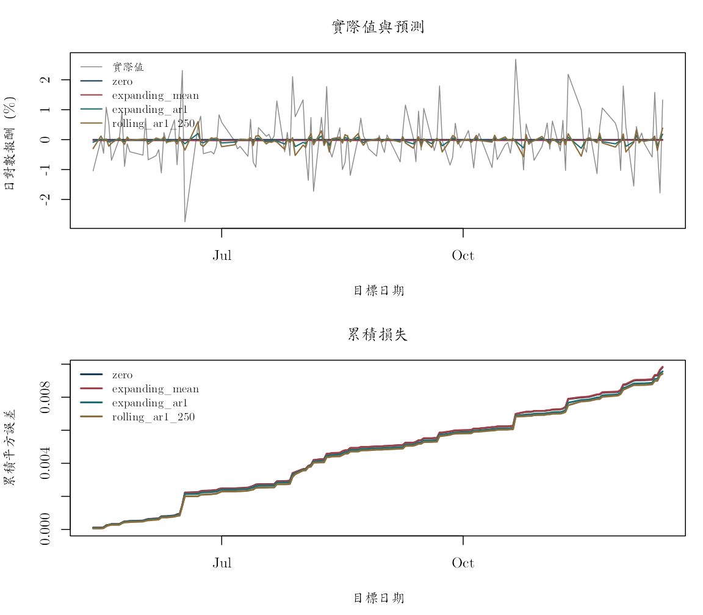

本附錄對應第 8 章，專門回答樣本外評估最容易出錯的一個問題：在每個預測起點，我們是否真的只使用當時已知的資料？例子以 FRED 的 JPY/USD（`DEXJPUS`）與 TWD/USD（`DEXTAUS`）建構交叉匯率，逐日起點預測下一個有效共同觀察日的 TWD/JPY 對數報酬。

`twd_per_jpy` 表示「1 日圓值多少新臺幣」，報酬欄位是小數日對數報酬；0.01 代表約 1%。合併後的固定檔涵蓋 2020-01-02 至 2022-12-16，每一列是一個 FRED 觀察日期，建置與缺值規則見 `data/DATA_SOURCES.md`。本頁把資料中的觀察日期視為可用日期；若要即時部署，還要另行核對兩條 FRED 序列實際發布的時間與修訂版本，不能假設觀察值在當日任何時點都已可取得。

下列比較只描述固定樣本中的預測誤差。模型沒有使用利率、政策或其他結構變數，因此結果不具有因果解讀，也不構成可交易績效的宣稱。


``` r
knitr::opts_chunk$set(
  echo = TRUE, message = FALSE, warning = FALSE,
  fig.width = 8, fig.height = 5,
  dev = "ragg_png", dpi = 144,
  dev.args = list(background = "white")
)

root_candidates <- c(".", "..")
is_root <- vapply(root_candidates, function(x) {
  file.exists(file.path(x, "main.tex"))
}, logical(1))
stopifnot(any(is_root))
project_root <- root_candidates[which(is_root)[1]]
project_path <- function(...) file.path(project_root, ...)

stopifnot(
  requireNamespace("ragg", quietly = TRUE),
  requireNamespace("systemfonts", quietly = TRUE)
)
cwtex_file <- project_path("assets", "fonts", "cwTeXQKai-Medium.ttf")
stopifnot(file.exists(cwtex_file))
if (!"cwTeX Online" %in% systemfonts::registry_fonts()$family) {
  systemfonts::register_font("cwTeX Online", cwtex_file)
}
plot_family <- "cwTeX Online"
```

## 固定資料與預測目標

FRED 兩市場的休市日不完全相同，所以合併檔的個別匯率欄會出現缺值。本附錄只保留預先計算且為有限值的 `log_return_twd_per_jpy`，沒有用未來值回填休市日。這樣一來，預測目標 $y_{t+1}$ 指的是「下一個兩條匯率都能形成有效交叉匯率報酬的觀察日」，不一定是下一個日曆日。


``` r
fx <- read.csv(project_path(
  "data", "processed", "fred_jpy_twd_daily_2020_2022.csv"
))
fx$date <- as.Date(fx$date)
# 先按觀察日期排序，後面的起點與目標索引才具有時間意義。
fx <- fx[order(fx$date), ]

required <- c(
  "date", "jpy_per_usd", "twd_per_usd",
  "twd_per_jpy", "log_return_twd_per_jpy"
)
stopifnot(all(required %in% names(fx)), all(diff(fx$date) > 0))

missing_table <- data.frame(
  欄位 = required[-1],
  缺值數 = colSums(is.na(fx[required[-1]])),
  check.names = FALSE
)
knitr::kable(missing_table)
```


|                       |欄位                   | 缺值數|
|:----------------------|:----------------------|------:|
|jpy_per_usd            |jpy_per_usd            |     32|
|twd_per_usd            |twd_per_usd            |     32|
|twd_per_jpy            |twd_per_jpy            |     32|
|log_return_twd_per_jpy |log_return_twd_per_jpy |     63|

``` r
usable <- fx[is.finite(fx$log_return_twd_per_jpy), ]
y <- usable$log_return_twd_per_jpy
dates <- usable$date
n <- length(y)

stopifnot(!anyNA(y), all(diff(dates) > 0))

data_profile <- data.frame(
  序列 = "TWD per JPY 交叉匯率對數報酬",
  起日 = min(dates),
  迄日 = max(dates),
  有效報酬數 = n,
  單位 = "小數日對數報酬",
  原始來源 = "FRED DEXJPUS 與 DEXTAUS",
  check.names = FALSE
)
knitr::kable(data_profile)
```


|序列                         |起日       |迄日       | 有效報酬數|單位           |原始來源                |
|:----------------------------|:----------|:----------|----------:|:--------------|:-----------------------|
|TWD per JPY 交叉匯率對數報酬 |2020-01-03 |2022-12-16 |        709|小數日對數報酬 |FRED DEXJPUS 與 DEXTAUS |

缺值表先呈現原始合併檔各欄的缺值數，讓讀者知道最後樣本為何少於檔案列數。篩選後共有 709 筆有效日對數報酬，期間為 2020-01-03 至 2022-12-16。這 709 筆才是下列切分與預測的觀察單位；若更改缺值或跨市場對齊規則，所有切點與評分都要重新計算。

## 依時間固定訓練、驗證與測試期

前 60% 是初始訓練期，用來提供每個候選模型的第一段歷史資料；接下來 20% 是驗證期，只用來比較滾動視窗與模型；最後 20% 是測試期，負責評估已選定的規格。金融時間序列不能隨機打散，否則未來觀察值會混入早期模型的估計與調校。


``` r
train_end <- floor(0.60 * n)
validation_end <- floor(0.80 * n)

# 切點只依事前比例決定，不參考任何模型的驗證或測試分數。
split_table <- data.frame(
  區段 = c("訓練期", "驗證期", "測試期"),
  起始索引 = c(1L, train_end + 1L, validation_end + 1L),
  結束索引 = c(train_end, validation_end, n),
  check.names = FALSE
)
split_table$起日 <- dates[split_table$起始索引]
split_table$迄日 <- dates[split_table$結束索引]
split_table$觀察值 <- with(
  split_table, 結束索引 - 起始索引 + 1L
)
knitr::kable(split_table)
```


|區段   | 起始索引| 結束索引|起日       |迄日       | 觀察值|
|:------|--------:|--------:|:----------|:----------|------:|
|訓練期 |        1|      425|2020-01-03 |2021-10-06 |    425|
|驗證期 |      426|      567|2021-10-07 |2022-05-12 |    142|
|測試期 |      568|      709|2022-05-13 |2022-12-16 |    142|

表中訓練期有 425 筆，從 2020-01-03 到 2021-10-06；驗證期有 142 筆，從 2021-10-07 到 2022-05-12；測試期也有 142 筆，從 2022-05-13 到 2022-12-16。在任一預測起點 $t$，程式只能使用截至第 $t$ 筆已知報酬，並預測尚未觀察的第 $t+1$ 筆。

## 單一起點的預測函數

先把「某一個起點可以看到什麼」寫成函數，再把函數套到許多起點。輸入包括完整報酬向量、目前起點、模型名稱與滾動視窗；輸出則明列訓練起點、訓練終點、目標索引、預測與事後實際值。把這些索引留在結果中，稍後才能逐列檢查資訊時序。


``` r
forecast_at_origin <- function(y, origin, model, window = NA_integer_) {
  # 目標固定為 origin + 1；任何模型分支都不得讀取這一筆來估計。
  stopifnot(origin >= 3L, origin < length(y))

  if (model == "zero") {
    training_start <- 1L
    prediction <- 0
  } else if (model == "expanding_mean") {
    training_start <- 1L
    prediction <- mean(y[training_start:origin])
  } else if (model == "rolling_mean") {
    stopifnot(is.finite(window), origin >= window)
    # 滾動視窗只保留當時最近的 window 筆，較舊資訊在此規格中不再使用。
    training_start <- origin - window + 1L
    prediction <- mean(y[training_start:origin])
  } else if (model == "expanding_ar1") {
    training_start <- 1L
    z <- y[training_start:origin]
    # AR(1) 的每一列用 z_{s-1} 解釋 z_s；最後一筆 y[origin] 只進入預測式。
    beta <- qr.solve(cbind(1, z[-length(z)]), z[-1])
    prediction <- beta[1] + beta[2] * y[origin]
  } else if (model == "rolling_ar1") {
    stopifnot(is.finite(window), origin >= window)
    training_start <- origin - window + 1L
    z <- y[training_start:origin]
    beta <- qr.solve(cbind(1, z[-length(z)]), z[-1])
    prediction <- beta[1] + beta[2] * y[origin]
  } else {
    stop("未知模型。")
  }

  data.frame(
    origin = origin,
    target_index = origin + 1L,
    training_start = training_start,
    training_end = origin,
    forecast = as.numeric(prediction),
    # actual 只隨輸出帶回供事後計分，不進入上方任何估計步驟。
    actual = y[origin + 1L]
  )
}

evaluate_origins <- function(y, origins, model, window = NA_integer_) {
  # 每個起點獨立重估，模擬真實時間向前走時可取得的資訊。
  out <- do.call(rbind, lapply(origins, function(origin) {
    forecast_at_origin(y, origin, model, window)
  }))
  out$model <- model
  out$window <- window
  out$error <- out$actual - out$forecast
  out$model_label <- if (is.finite(window)) {
    paste0(model, "_", window)
  } else {
    model
  }
  stopifnot(
    # 這兩項條件是資料時序的最低要求：訓練結束於起點，且早於目標。
    all(out$training_end == out$origin),
    all(out$training_end < out$target_index)
  )
  out
}
```

## 驗證期選擇滾動規格

候選規格包括 20、60、120、250 個有效觀察值的滾動平均，以及 60、120、250 期的滾動 AR(1)。所有視窗都在讀取測試期以前列出；每個驗證目標只用其起點以前的資料形成一步預測。視窗與模型按驗證期 RMSE 選一次，MAE 則協助觀察排序是否對極端誤差敏感。


``` r
validation_origins <- train_end:(validation_end - 1L)
candidate_specs <- rbind(
  data.frame(model = "rolling_mean", window = c(20L, 60L, 120L, 250L)),
  data.frame(model = "rolling_ar1", window = c(60L, 120L, 250L))
)

validation_results <- lapply(seq_len(nrow(candidate_specs)), function(i) {
  evaluate_origins(
    y, validation_origins,
    model = candidate_specs$model[i],
    window = candidate_specs$window[i]
  )
})

# 對每個候選規格使用完全相同的驗證目標日期，分數才可比較。
validation_score <- do.call(rbind, lapply(seq_len(nrow(candidate_specs)), function(i) {
  z <- validation_results[[i]]
  data.frame(
    模型 = candidate_specs$model[i],
    視窗 = candidate_specs$window[i],
    RMSE = sqrt(mean(z$error^2)),
    MAE = mean(abs(z$error)),
    check.names = FALSE
  )
}))
validation_score <- validation_score[order(validation_score$RMSE), ]
row.names(validation_score) <- NULL
knitr::kable(validation_score, digits = 7)
```


|模型         | 視窗|      RMSE|       MAE|
|:------------|----:|---------:|---------:|
|rolling_ar1  |  250| 0.0048233| 0.0036531|
|rolling_ar1  |  120| 0.0048261| 0.0036490|
|rolling_mean |  250| 0.0048415| 0.0036668|
|rolling_mean |  120| 0.0048465| 0.0036683|
|rolling_ar1  |   60| 0.0048830| 0.0037129|
|rolling_mean |   60| 0.0049024| 0.0037357|
|rolling_mean |   20| 0.0049426| 0.0037453|

``` r
selected_model <- validation_score$模型[1]
selected_window <- validation_score$視窗[1]
c(selected_model = selected_model, selected_window = selected_window)
```

```
##  selected_model selected_window 
##   "rolling_ar1"           "250"
```

這份驗證資料選出 250 期滾動 AR(1)。它表示在既定候選集合中，較長視窗的 AR(1) 驗證期 RMSE 最低；這不是 250 期視窗在所有時期都最佳的證明。選定後，模型與視窗不再因測試期結果調整。

## 選定規格後的一次性測試

測試期比較零報酬、擴展平均、擴展 AR(1) 與驗證期選出的滾動規格。每一個起點都用當時已經觀察到的歷史資料重新估計。當某一日的實際報酬公布後，它可以進入下一個起點的訓練視窗；但在預測該日本身時，這個實際值仍完全不可見。這正是逐日起點的一步預測設計。


``` r
test_origins <- validation_end:(n - 1L)

# 所有模型使用相同起點與目標日，差異只來自預測規則。
test_results <- rbind(
  evaluate_origins(y, test_origins, "zero"),
  evaluate_origins(y, test_origins, "expanding_mean"),
  evaluate_origins(y, test_origins, "expanding_ar1"),
  evaluate_origins(
    y, test_origins, selected_model, window = selected_window
  )
)

test_results$origin_date <- dates[test_results$origin]
test_results$target_date <- dates[test_results$target_index]
test_results$training_start_date <- dates[test_results$training_start]
test_results$training_end_date <- dates[test_results$training_end]

knitr::kable(head(test_results[c(
  "model_label", "origin_date", "target_date",
  "training_start_date", "training_end_date",
  "forecast", "actual"
)], 8), digits = 7)
```


|model_label |origin_date |target_date |training_start_date |training_end_date | forecast|     actual|
|:-----------|:-----------|:-----------|:-------------------|:-----------------|--------:|----------:|
|zero        |2022-05-12  |2022-05-13  |2020-01-03          |2022-05-12        |        0| -0.0104596|
|zero        |2022-05-13  |2022-05-16  |2020-01-03          |2022-05-13        |        0| -0.0000523|
|zero        |2022-05-16  |2022-05-17  |2020-01-03          |2022-05-16        |        0| -0.0046028|
|zero        |2022-05-17  |2022-05-18  |2020-01-03          |2022-05-17        |        0|  0.0108216|
|zero        |2022-05-18  |2022-05-19  |2020-01-03          |2022-05-18        |        0|  0.0053627|
|zero        |2022-05-19  |2022-05-20  |2020-01-03          |2022-05-19        |        0| -0.0069319|
|zero        |2022-05-20  |2022-05-23  |2020-01-03          |2022-05-20        |        0|  0.0002881|
|zero        |2022-05-23  |2022-05-24  |2020-01-03          |2022-05-23        |        0|  0.0092556|

輸出把每一筆測試預測的資訊範圍攤開：`training_end_date` 應等於 `origin_date`，而且早於 `target_date`。滾動模型的 `training_start_date` 會隨起點向前移動；擴展模型則持續保留最初觀察值。


``` r
score_one <- function(z) {
  data.frame(
    模型 = z$model_label[1],
    觀察值 = nrow(z),
    RMSE = sqrt(mean(z$error^2)),
    MAE = mean(abs(z$error)),
    平均誤差 = mean(z$error),
    check.names = FALSE
  )
}

score_table <- do.call(
  rbind,
  lapply(split(test_results, test_results$model_label), score_one)
)
score_table <- score_table[order(score_table$RMSE), ]
row.names(score_table) <- NULL
knitr::kable(score_table, digits = 7)
```


|模型            | 觀察值|      RMSE|       MAE|  平均誤差|
|:---------------|------:|---------:|---------:|---------:|
|rolling_ar1_250 |    142| 0.0081441| 0.0060522| 0.0005755|
|expanding_ar1   |    142| 0.0082058| 0.0061228| 0.0004600|
|zero            |    142| 0.0083126| 0.0062443| 0.0001272|
|expanding_mean  |    142| 0.0083264| 0.0062311| 0.0004108|

RMSE 會放大少數大誤差的影響，MAE 對每筆絕對誤差給相同權重，平均誤差則檢查整體高估或低估。142 筆測試預測中，250 期滾動 AR(1) 的 RMSE 為 0.0081441，低於零報酬基準的 0.0083126；差距約為 0.00017 個小數報酬單位，幅度不大。

這些分數只描述 2022-05-13 至 2022-12-16 的固定測試期，而且該段期間出現較高波動。可以說驗證期選出的規格在這一段略勝零報酬基準，還不能推論長期排序、統計顯著性或扣除交易成本後的可交易性。若要加強結論，應使用新的未見期間或多個事前規劃的預測樣本，而不是回頭調整這 142 筆的規格。

## 套件作法：用 `Arima()` 與 `tsCV()` 重做滾動預測

原課程教師程式 `slides/L05_Forecasting_and_CV/W1L5_R_prediction_cv.R`
使用 `forecast::Arima()`、`forecast::forecast()` 與 `forecast::tsCV()` 處理
估計、預測與時間序列交叉驗證。下列程式沿用原課程的工作流程，但繼續使用本書的固定
CSV 與同一組測試起點，不重新下載 FRED 資料。`tsCV()` 會替我們依序呼叫預測函數並整理誤差，卻不負責決定模型、視窗或測試期；這些選擇仍沿用前面在驗證期選定的設定。

這裡有一個值得特別注意的估計差異：前面的手動版在每個 250 期視窗使用 OLS 估計
AR(1)；`forecast::Arima(..., method = "ML")` 則以高斯最大概似估計同一個
AR(1) 規格。兩者使用相同的目標、視窗與資訊時點，預測應當接近，但不必逐期完全相同。


``` r
stopifnot(requireNamespace("forecast", quietly = TRUE))

comparison_window <- 250L
stopifnot(
  selected_model == "rolling_ar1",
  selected_window == comparison_window
)

package_ar1_forecast <- function(z, h) {
  # z 只含該起點可見的 250 筆；函數內不得再存取外部完整序列。
  fit <- forecast::Arima(
    z,
    order = c(1L, 0L, 0L),
    include.mean = TRUE,
    method = "ML"
  )
  forecast::forecast(fit, h = h)
}

package_forecast_at_origin <- function(y, origin, window) {
  training_start <- origin - window + 1L
  z <- y[training_start:origin]
  # 每個起點重新以 ML 配適，再形成唯一的一步預測。
  fc <- package_ar1_forecast(z, h = 1L)
  data.frame(
    origin = origin,
    target_index = origin + 1L,
    training_start = training_start,
    training_end = origin,
    forecast = as.numeric(fc$mean[1]),
    actual = y[origin + 1L]
  )
}

package_test <- do.call(rbind, lapply(test_origins, function(origin) {
  package_forecast_at_origin(y, origin, comparison_window)
}))
package_test$error <- package_test$actual - package_test$forecast

# tsCV 的第 t 列是以第 t 期為預測起點的誤差；
# window = 250 確保預測函數每次只收到最近 250 筆已知報酬。
package_cv_errors <- forecast::tsCV(
  stats::ts(y),
  forecastfunction = package_ar1_forecast,
  h = 1L,
  window = comparison_window,
  initial = comparison_window
)
package_cv_test <- as.numeric(package_cv_errors)[test_origins]

stopifnot(
  all(is.finite(package_cv_test)),
  max(abs(package_cv_test - package_test$error)) < 1e-10,
  all(package_test$training_end < package_test$target_index)
)

manual_ar1_test <- test_results[
  test_results$model == "rolling_ar1" &
    test_results$window == comparison_window,
]
stopifnot(identical(manual_ar1_test$origin, package_test$origin))

package_comparison <- data.frame(
  方法 = c(
    "手動 OLS：250 期滾動 AR(1)",
    "forecast：250 期滾動 AR(1) ML"
  ),
  RMSE = c(
    sqrt(mean(manual_ar1_test$error^2)),
    sqrt(mean(package_test$error^2))
  ),
  MAE = c(
    mean(abs(manual_ar1_test$error)),
    mean(abs(package_test$error))
  ),
  平均誤差 = c(
    mean(manual_ar1_test$error),
    mean(package_test$error)
  ),
  check.names = FALSE
)
knitr::kable(package_comparison, digits = 7)
```


|方法                          |      RMSE|       MAE|  平均誤差|
|:-----------------------------|---------:|---------:|---------:|
|手動 OLS：250 期滾動 AR(1)    | 0.0081441| 0.0060522| 0.0005755|
|forecast：250 期滾動 AR(1) ML | 0.0081438| 0.0060516| 0.0005755|

``` r
forecast_difference <- data.frame(
  逐期預測差異指標 = c("平均絕對差", "最大絕對差"),
  數值 = c(
    mean(abs(manual_ar1_test$forecast - package_test$forecast)),
    max(abs(manual_ar1_test$forecast - package_test$forecast))
  ),
  check.names = FALSE
)
knitr::kable(forecast_difference, digits = 9)
```


|逐期預測差異指標 |       數值|
|:----------------|----------:|
|平均絕對差       | 1.0473e-05|
|最大絕對差       | 3.8143e-05|

比較表中的手動 OLS 與套件 ML 分數若很接近，表示兩種估計法在這段資料上的逐期預測差異不大；`forecast_difference` 則把平均與最大預測差直接量化。`tsCV()` 在這裡不負責選模，250 期視窗已經由驗證期選定；它只是用套件重做同一組滾動起點，並確認誤差與逐起點迴圈一致。若先用全樣本 `auto.arima()` 選好模型，再對早期起點執行 `tsCV()`，未來的選模資訊仍會被帶回過去。

## 預測路徑與累積損失

總分會把 142 筆誤差濃縮成一個數字，卻看不出差距在哪些日期形成。上圖把實際值與四條預測放在一起，下圖累加每一期平方誤差；每次陡升都代表某個目標日對最終 RMSE 有較大影響。


``` r
model_labels <- unique(test_results$model_label)
colors <- c("#173B57", "#A34045", "#1D6D73", "#8A6D3B")

old_par <- par(
  mfrow = c(2, 1), mar = c(4.5, 4, 3, 1),
  family = plot_family
)
actual_path <- test_results[test_results$model_label == model_labels[1], ]
plot(
  actual_path$target_date, 100 * actual_path$actual,
  type = "l", col = "gray55",
  xlab = "目標日期", ylab = "日對數報酬（%）",
  main = "實際值與預測"
)
for (j in seq_along(model_labels)) {
  z <- test_results[test_results$model_label == model_labels[j], ]
  lines(z$target_date, 100 * z$forecast, col = colors[j], lwd = 1.4)
}
legend(
  "topleft", c("實際值", model_labels),
  col = c("gray55", colors[seq_along(model_labels)]),
  lty = 1, lwd = c(1, rep(1.4, length(model_labels))),
  bty = "n", cex = 0.8
)

total_loss <- vapply(
  split(test_results$error, test_results$model_label),
  function(e) sum(e^2), numeric(1)
)
plot(
  actual_path$target_date,
  rep(NA_real_, nrow(actual_path)),
  type = "n",
  xlim = range(actual_path$target_date),
  ylim = c(0, max(total_loss)),
  xlab = "目標日期", ylab = "累積平方誤差",
  main = "累積損失"
)
for (j in seq_along(model_labels)) {
  z <- test_results[test_results$model_label == model_labels[j], ]
  lines(z$target_date, cumsum(z$error^2), col = colors[j], lwd = 2)
}
legend(
  "topleft", model_labels,
  col = colors[seq_along(model_labels)],
  lty = 1, lwd = 2, bty = "n", cex = 0.8
)
```



``` r
par(old_par)
```

累積損失可以定位哪些日期主導 RMSE。若某次跳升來自資料錯誤，就回到來源修正；若是真實匯率變動，則應保留，並承認模型在那類市場狀況下預測較差。極端誤差本身不是刪除觀察值的理由。

## 逐列確認訓練日期早於預測目標

最後不只相信函數名稱，而是直接用輸出的日期檢查每一列。有效的預測必須同時滿足：訓練終點就是該次預測起點，而且訓練終點早於目標日期。這項檢查若失敗，應先修正索引與日期對齊，再解讀任何分數。


``` r
leakage_audit <- within(
  test_results[c(
    "model_label", "origin_date", "target_date",
    "training_start_date", "training_end_date"
  )],
  valid_timing <- training_end_date == origin_date &
    training_end_date < target_date
)

knitr::kable(as.data.frame(table(leakage_audit$valid_timing)))
```


|Var1 | Freq|
|:----|----:|
|TRUE |  568|

``` r
stopifnot(all(leakage_audit$valid_timing))
```

列聯表應只出現 `TRUE`。這確認了目前幾個預測函數的日期時序，但不會自動檢查未來新增的資料轉換；每加入一個步驟，都要重新問它在哪些觀察值上估計。

若未來加入標準化、缺值填補、PCA 或變數選擇，這些轉換也必須放入每個預測起點，只用當時可見的訓練資料配適。先以全樣本估計平均數、主成分或選入變數，再回頭做早期滾動預測，仍會洩漏未來資訊。

## 這次樣本外比較應如何收束

這份固定 TWD/JPY 資料顯示，驗證期選出的 250 期滾動 AR(1) 在測試期的 RMSE 略低於零報酬基準，手動 OLS 與套件 ML 作法也得到接近的預測分數。由逐列日期可以確認，每次估計只使用起點當時可見的報酬，目標日資料沒有提前進入模型。

目前還不能判定這項小幅優勢能延續到其他匯率時期，也沒有納入即時發布落差、資料修訂、交易成本或模型選擇不確定性。實務上應保存固定資料版本、報價方向、三段日期、候選視窗、驗證分數、規格選定時點與逐起點預測紀錄，再把模型帶到新的未見期間。如果看過本次測試結果後進行敏感度分析，應清楚標示為後續探索，不能取代原先選定規格的主要結果。
