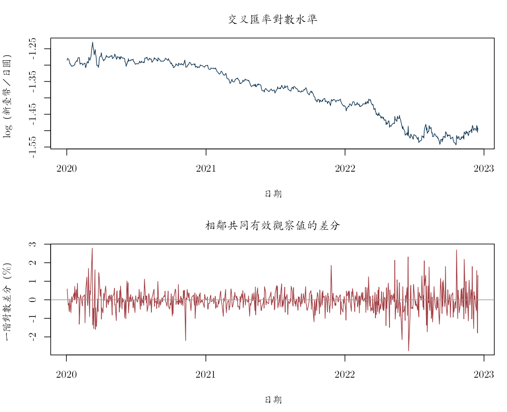
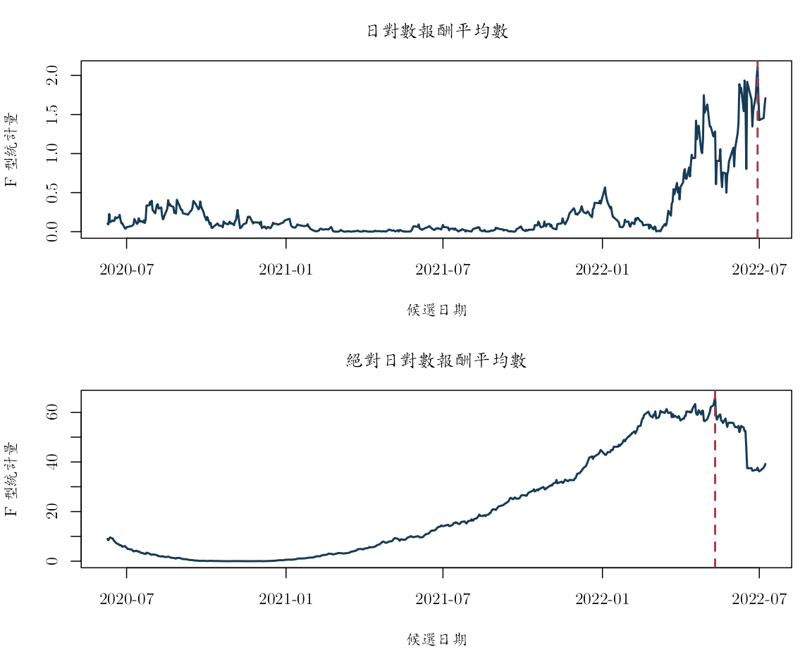
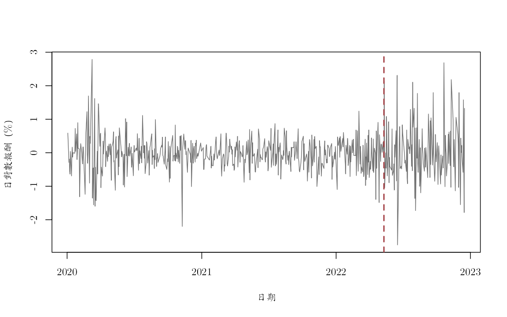

同一條匯率序列，為什麼水準圖看來很持續，差分後卻像在零附近波動？若樣本中間又有一段波動明顯變大，我們應該如何區分單根、差分與結構變動？本附錄對應第 9–10 章，用一份固定的 TWD/JPY 日資料逐步回答這些問題。

原始序列為 FRED 的 JPY/USD（`DEXJPUS`）與 TWD/USD（`DEXTAUS`），交叉換算後的 `twd_per_jpy` 表示「1 日圓值多少新臺幣」。每筆觀察值對應一個日期；水準單位是新臺幣／日圓，對數差分與對數報酬原始以小數表示，繪圖時才乘以 100 改成百分比。固定檔涵蓋 2020-01-02 至 2022-12-16，來源與建置規則見 `data/DATA_SOURCES.md`。

兩個市場的休市日不完全一致，所以合併檔含有缺值。程式會先按日期排序，再留下共同有效的匯率水準；因此「相鄰觀察值」不一定相差一個日曆日。單根檢定使用全部有效樣本，沒有訓練期或測試期的角色；結構變動搜尋也是用全樣本回看歷史。這些結果適合用來說明樣本中的持續性與不穩定跡象，若要作預測或事件因果解釋，還需另外設計資訊時點與識別條件。


``` r
knitr::opts_chunk$set(
  echo = TRUE, message = FALSE, warning = FALSE,
  fig.width = 8, fig.height = 5,
  dev = "ragg_png", dpi = 144,
  dev.args = list(background = "white")
)

root_candidates <- c(".", "..")
is_root <- vapply(root_candidates, function(x) {
  file.exists(file.path(x, "main.tex"))
}, logical(1))
stopifnot(any(is_root))
project_root <- root_candidates[which(is_root)[1]]
project_path <- function(...) file.path(project_root, ...)

stopifnot(
  requireNamespace("ragg", quietly = TRUE),
  requireNamespace("systemfonts", quietly = TRUE)
)
cwtex_file <- project_path("assets", "fonts", "cwTeXQKai-Medium.ttf")
stopifnot(file.exists(cwtex_file))
if (!"cwTeX Online" %in% systemfonts::registry_fonts()$family) {
  systemfonts::register_font("cwTeX Online", cwtex_file)
}
plot_family <- "cwTeX Online"
```

## 先確認資料的日期、單位與缺值

第一步要回答的不是「有沒有單根」，而是程式實際讀到什麼資料。下列程式將日期轉成 R 的日期格式，先排序並排除無效值，然後分別建立水準與報酬樣本。若省略排序，`diff()` 計算的就不一定是時間先後的變化。


``` r
fx <- read.csv(project_path(
  "data", "processed", "fred_jpy_twd_daily_2020_2022.csv"
))
fx$date <- as.Date(fx$date)
# 差分與落後運算都依賴列的時間順序，因此先排序再做任何時間序列轉換。
fx <- fx[order(fx$date), ]
stopifnot(all(diff(fx$date) > 0))

level_data <- fx[
  is.finite(fx$twd_per_jpy),
  c("date", "twd_per_jpy")
]
return_data <- fx[
  is.finite(fx$log_return_twd_per_jpy),
  c("date", "log_return_twd_per_jpy")
]

stopifnot(
  all(level_data$twd_per_jpy > 0),
  all(diff(level_data$date) > 0),
  all(diff(return_data$date) > 0)
)

data_profile <- data.frame(
  序列 = c("TWD per JPY 水準", "TWD per JPY 日對數報酬"),
  起日 = c(min(level_data$date), min(return_data$date)),
  迄日 = c(max(level_data$date), max(return_data$date)),
  有效觀察值 = c(nrow(level_data), nrow(return_data)),
  單位 = c("新臺幣／日圓", "小數日對數報酬"),
  來源 = "FRED DEXJPUS 與 DEXTAUS",
  check.names = FALSE
)
knitr::kable(data_profile)
```


|序列                   |起日       |迄日       | 有效觀察值|單位           |來源                    |
|:----------------------|:----------|:----------|----------:|:--------------|:-----------------------|
|TWD per JPY 水準       |2020-01-02 |2022-12-16 |        740|新臺幣／日圓   |FRED DEXJPUS 與 DEXTAUS |
|TWD per JPY 日對數報酬 |2020-01-03 |2022-12-16 |        709|小數日對數報酬 |FRED DEXJPUS 與 DEXTAUS |

表中的有效觀察值數就是後續迴歸真正使用的樣本數。水準與報酬的起日可能不同，因為第一筆水準沒有前一期可供計算報酬。

## 先從圖形問：持續性發生在水準還是差分？

對數水準圖用來看長期移動，一階差分圖則把注意力放在兩個相鄰共同有效日期之間的百分比變化。這一步先幫我們決定檢定規格要包含哪些確定項，並提醒我們注意離群值與波動群聚。


``` r
log_level <- log(level_data$twd_per_jpy)
log_difference <- diff(log_level)

old_par <- par(
  mfrow = c(2, 1), mar = c(4.5, 4, 3, 1),
  family = plot_family
)
plot(
  level_data$date, log_level, type = "l", col = "#173B57",
  xlab = "日期", ylab = "log（新臺幣／日圓）",
  main = "交叉匯率對數水準"
)
plot(
  level_data$date[-1], 100 * log_difference,
  type = "l", col = "#A34045",
  xlab = "日期", ylab = "一階對數差分（%）",
  main = "相鄰共同有效觀察值的差分"
)
abline(h = 0, col = "gray60")
```



``` r
par(old_par)
```

圖中的水準呈現高持續性，差分則大致在零附近波動。這是「水準可能含單根、差分可能較穩定」的初步線索；正式判讀還要依賴檢定迴歸、確定項與適當的參考分配。

## 手動作法：把 ADF 迴歸寫成 R

現在要問的是：加入差分落後值後，落後水準的係數是否對拒絕單根提供足夠證據？手動版先把應變數、落後水準與差分落後值對齊，再以 OLS 取得 γ 的係數與標準誤。這個對齊步驟會決定每一列使用哪一期資訊，也會決定有效樣本數。

估計式為

\[
\Delta Y_t=c+\gamma Y_{t-1}
+\sum_{j=1}^{p}\delta_j\Delta Y_{t-j}+u_t.
\]

函數回傳的統計量是 $\widehat{\gamma}$ 除以 OLS 標準誤。這裡的 OLS 標準誤只是組成 ADF 統計量的一部分；在單根虛無下，統計量並不服從一般常態或 Student-$t$ 參考分配。


``` r
adf_statistic <- function(
    y, lags = 0L,
    deterministic = c("constant", "trend", "none")) {
  deterministic <- match.arg(deterministic)
  y <- as.numeric(y)
  stopifnot(all(is.finite(y)), lags >= 0L)

  # 一階差分會少一筆觀察值；idx 再略過前 lags 期，
  # 使應變數與所有差分落後值共用同一組日期。
  dy <- diff(y)
  idx <- (lags + 1L):length(dy)
  response <- dy[idx]
  X <- matrix(numeric(0), nrow = length(idx), ncol = 0L)

  if (deterministic %in% c("constant", "trend")) {
    X <- cbind(intercept = 1, X)
  }
  if (deterministic == "trend") {
    X <- cbind(X, trend = idx + 1L)
  }
  X <- cbind(X, level_lag = y[idx])

  if (lags > 0L) {
    # 每一欄是一個差分落後期。若未對齊，γ 會和錯誤期別的變化一起估計。
    lagged_differences <- sapply(seq_len(lags), function(j) {
      dy[idx - j]
    })
    if (lags == 1L) {
      lagged_differences <- matrix(lagged_differences, ncol = 1L)
    }
    colnames(lagged_differences) <- paste0("diff_lag", seq_len(lags))
    X <- cbind(X, lagged_differences)
  }

  # ADF 統計量使用 level_lag 那一欄的係數與 OLS 標準誤；
  # 後續另用單根虛無下的臨界值判讀，不在這裡套用一般 t 分配。
  fit <- lm.fit(X, response)
  residual_df <- length(response) - fit$rank
  sigma2 <- sum(fit$residuals^2) / residual_df
  covariance <- sigma2 * solve(crossprod(X))
  standard_error <- sqrt(diag(covariance))
  gamma_index <- match("level_lag", colnames(X))

  c(
    statistic = unname(
      fit$coefficients[gamma_index] / standard_error[gamma_index]
    ),
    gamma = unname(fit$coefficients[gamma_index]),
    regression_observations = length(response)
  )
}
```

## 用明確的單根虛無建立教學臨界值

上一節已算出統計量，接下來還需要與單根虛無下的參考分配比較。為了讓讀者看見臨界值如何從虛無模型產生，下面模擬「相同樣本長度、常數項、5 個差分落後、i.i.d. 常態隨機漫步」。這是有意簡化的教學參考分配，不是正式套件使用的 MacKinnon $p$ 值。模擬次數 $B=999$，所以分位數臨界值本身仍有 Monte Carlo 誤差。


``` r
simulate_adf_critical <- function(
    n, lags = 5L, deterministic = "constant",
    B = 999L, seed = 1L) {
  set.seed(seed)
  # 每次都在單根虛無下生成一條隨機漫步，
  # 並重複「與實證序列相同」的 ADF 迴歸規格。
  statistics <- replicate(B, {
    null_series <- cumsum(rnorm(n))
    adf_statistic(
      null_series, lags = lags,
      deterministic = deterministic
    )["statistic"]
  })
  unname(quantile(statistics, c(0.01, 0.05, 0.10)))
}

lags <- 5L
critical_level <- simulate_adf_critical(
  length(log_level), lags = lags, seed = 20260718
)
critical_difference <- simulate_adf_critical(
  length(log_difference), lags = lags, seed = 20260719
)

critical_table <- data.frame(
  序列 = c("對數水準", "一階對數差分"),
  臨界值1pct = c(critical_level[1], critical_difference[1]),
  臨界值5pct = c(critical_level[2], critical_difference[2]),
  臨界值10pct = c(critical_level[3], critical_difference[3]),
  check.names = FALSE
)
knitr::kable(critical_table, digits = 4)
```


|序列         | 臨界值1pct| 臨界值5pct| 臨界值10pct|
|:------------|----------:|----------:|-----------:|
|對數水準     |    -3.4278|    -2.8721|     -2.6171|
|一階對數差分 |    -3.4347|    -2.8695|     -2.5559|

臨界值是負數；ADF 統計量越向左，越不利於單根虛無。水準與差分的樣本數略有差異，因此這裡分別模擬臨界值，而不是把同一個數字套在兩張表上。


``` r
adf_level <- adf_statistic(
  log_level, lags = lags, deterministic = "constant"
)
adf_difference <- adf_statistic(
  log_difference, lags = lags, deterministic = "constant"
)

adf_table <- data.frame(
  序列 = c("log(TWD per JPY)", "一階對數差分"),
  ADF_like統計量 = c(
    adf_level["statistic"], adf_difference["statistic"]
  ),
  gamma估計值 = c(adf_level["gamma"], adf_difference["gamma"]),
  迴歸觀察值 = c(
    adf_level["regression_observations"],
    adf_difference["regression_observations"]
  ),
  模擬5pct臨界值 = c(critical_level[2], critical_difference[2]),
  check.names = FALSE
)
adf_table$在指定教學設計下拒絕 <-
  adf_table$ADF_like統計量 < adf_table$模擬5pct臨界值
knitr::kable(adf_table, digits = 5)
```


|序列             | ADF_like統計量| gamma估計值| 迴歸觀察值| 模擬5pct臨界值|在指定教學設計下拒絕 |
|:----------------|--------------:|-----------:|----------:|--------------:|:--------------------|
|log(TWD per JPY) |       -0.44839|    -0.00112|        734|       -2.87207|FALSE                |
|一階對數差分     |      -12.13708|    -1.27037|        733|       -2.86945|TRUE                 |

在這個明確指定的教學設計下，對數水準的統計量沒有越過 5% 左尾臨界值，因此樣本對拒絕單根的支持不足；一階差分則落在左尾，支持這個迴歸規格所設定的定態對立假設。後續建模可以先從差分序列開始，再檢查殘差相依、條件異質變異與結構穩定性。由於本模擬使用 i.i.d. 常態創新，這些資料特徵若與設定不同，參考分配也會跟著改變。

## 套件作法：用 `adf.test()` 與 `ur.ers()` 完成單根檢定

原課程的實作流程曾在
`slides/L06_Nonstationarity/W2L1_adf_test_tseries_package.R`
使用 `tseries::adf.test()`；另一份程式
`slides/L04_ARMA/W1L4_R_template_for_estimating_ARMA.R`
示範 `urca::ur.ers()` 的 DF–GLS 檢定。以下沿用這套作法，並固定在前述 TWD/JPY CSV 上，讓手動版與套件版面對同一組觀察值。

`adf.test()` 會幫我們建立檢定迴歸、計算統計量，並以套件內的近似表回報 $p$ 值；`ur.ers()` 則會執行 GLS 去平均或去趨勢後的 DF–GLS 檢定。對 `ur.ers(type = "DF-GLS")` 而言，參數名稱雖是 `lag.max`，函數實際上會固定使用所指定的差分落後階數，不會在 0 到 `lag.max` 之間自動選階。以下設 `lag.max = lags = 5`，因此四個 DF–GLS 規格都確切納入 5 個差分落後項。函數並不會替研究者決定經濟上應否納入趨勢、這個差分落後階數是否足夠，或樣本期間是否有結構變動。

三個結果不能只按函數名稱排在同一欄比較：

1. 前面的手動類 ADF 迴歸含常數、不含趨勢，並使用本附錄模擬的特定虛無臨界值。
2. `tseries::adf.test()` 的檢定迴歸同時含常數與線性趨勢；其套件
   $p$ 值對應這個規格，不是前面常數項規格的 $p$ 值。
3. ERS 的 DF–GLS 先以廣義最小平方法去平均或去趨勢，再檢定轉換後序列。
   `model = "constant"` 與 `model = "trend"` 因此代表不同的確定項假設。


``` r
stopifnot(
  requireNamespace("tseries", quietly = TRUE),
  requireNamespace("urca", quietly = TRUE)
)

tseries_level <- tseries::adf.test(
  log_level, alternative = "stationary", k = lags
)
tseries_difference <- tseries::adf.test(
  log_difference, alternative = "stationary", k = lags
)

tseries_table <- data.frame(
  序列 = c("log(TWD per JPY)", "一階對數差分"),
  確定項規格 = "常數與線性趨勢",
  差分落後階數 = lags,
  ADF統計量 = c(
    unname(tseries_level$statistic),
    unname(tseries_difference$statistic)
  ),
  套件p值 = c(tseries_level$p.value, tseries_difference$p.value),
  check.names = FALSE
)
knitr::kable(tseries_table, digits = 5)
```


|序列             |確定項規格     | 差分落後階數| ADF統計量| 套件p值|
|:----------------|:--------------|------------:|---------:|-------:|
|log(TWD per JPY) |常數與線性趨勢 |            5|  -3.36968| 0.05867|
|一階對數差分     |常數與線性趨勢 |            5| -12.13712| 0.01000|

``` r
dfgls_fits <- list(
  level_constant = urca::ur.ers(
    log_level,
    type = "DF-GLS", model = "constant", lag.max = lags
  ),
  level_trend = urca::ur.ers(
    log_level,
    type = "DF-GLS", model = "trend", lag.max = lags
  ),
  difference_constant = urca::ur.ers(
    log_difference,
    type = "DF-GLS", model = "constant", lag.max = lags
  ),
  difference_trend = urca::ur.ers(
    log_difference,
    type = "DF-GLS", model = "trend", lag.max = lags
  )
)

extract_dfgls_5pct <- function(fit) {
  critical <- fit@cval
  labels <- if (is.null(dim(critical))) {
    names(critical)
  } else {
    colnames(critical)
  }
  index <- grep("5", labels, fixed = TRUE)[1]
  stopifnot(length(index) == 1L, is.finite(index))
  if (is.null(dim(critical))) {
    unname(critical[index])
  } else {
    unname(critical[1, index])
  }
}

dfgls_table <- data.frame(
  序列 = rep(c("log(TWD per JPY)", "一階對數差分"), each = 2L),
  GLS確定項轉換 = rep(c("去平均", "去常數與線性趨勢"), 2L),
  差分落後階數 = lags,
  DF_GLS統計量 = vapply(
    dfgls_fits,
    function(fit) as.numeric(fit@teststat)[1],
    numeric(1)
  ),
  套件5pct臨界值 = vapply(
    dfgls_fits, extract_dfgls_5pct, numeric(1)
  ),
  check.names = FALSE
)
dfgls_table$按套件5pct臨界值拒絕 <-
  dfgls_table$DF_GLS統計量 < dfgls_table$套件5pct臨界值
knitr::kable(dfgls_table, digits = 5)
```


|                    |序列             |GLS確定項轉換    | 差分落後階數| DF_GLS統計量| 套件5pct臨界值|按套件5pct臨界值拒絕 |
|:-------------------|:----------------|:----------------|------------:|------------:|--------------:|:--------------------|
|level_constant      |log(TWD per JPY) |去平均           |            5|      0.80957|          -1.94|FALSE                |
|level_trend         |log(TWD per JPY) |去常數與線性趨勢 |            5|     -1.96961|          -2.89|FALSE                |
|difference_constant |一階對數差分     |去平均           |            5|     -3.72806|          -1.94|TRUE                 |
|difference_trend    |一階對數差分     |去常數與線性趨勢 |            5|     -6.10097|          -2.89|TRUE                 |

`tseries::adf.test()` 表中的 `0.01` 是套件回報的下界，表示插值 $p$ 值小於 0.01，不是恰好等於 1%。該函數使用常數與線性趨勢，DF–GLS 先作 GLS 確定項轉換，前面的手動類 ADF 迴歸則只含常數項；三張表的差異因而同時反映函數實作與檢定問題的差異。當短樣本同時有高持續性與緩慢漂移時，建議把「有無趨勢」的結果並列為規格敏感度，而不是根據哪個函數較容易拒絕來選結論。差分序列通過單根檢定後，仍要繼續檢查條件異質變異與結構穩定性。

## 回顧樣本：報酬平均數或波動尺度何時改變？

單根檢定假設整段樣本有同一組動態。若樣本期間的平均報酬或波動尺度改變，前面的單一規格可能把兩種狀態混在一起。以下以兩段常數平均數模型計算每個候選日期的平方和 $F$ 型統計量，每一側至少保留 15% 樣本，分別查看：

1. 日對數報酬的平均數；
2. 絕對日對數報酬的平均數，作為波動尺度的描述性代理。

這裡的日期是看過全樣本才選出，最大統計量的參考分配會反映「搜尋了很多候選日期」這件事。加上金融報酬常有異質變異與時間相依，下表因而只報告搜尋路徑、最大值與分段平均數，不套用單一已知日期的普通 $F$ 的 $p$ 值。


``` r
break_F <- function(y, tau) {
  n <- length(y)
  # 受限模型只有一個全樣本平均數；未受限模型允許 tau 前後各有一個平均數。
  ssr_restricted <- sum((y - mean(y))^2)
  ssr_unrestricted <-
    sum((y[1:tau] - mean(y[1:tau]))^2) +
    sum((y[(tau + 1L):n] - mean(y[(tau + 1L):n]))^2)
  (ssr_restricted - ssr_unrestricted) /
    (ssr_unrestricted / (n - 2L))
}

scan_break <- function(y, dates, trim = 0.15) {
  n <- length(y)
  # 修剪兩端可避免只用少數觀察值建立某一段，否則分段平均數會非常不穩定。
  candidates <- ceiling(trim * n):floor((1 - trim) * n)
  path <- vapply(candidates, function(tau) {
    break_F(y, tau)
  }, numeric(1))
  selected <- candidates[which.max(path)]
  list(
    candidates = candidates,
    path = path,
    selected = selected,
    date = dates[selected],
    statistic = max(path),
    pre_mean = mean(y[1:selected]),
    post_mean = mean(y[(selected + 1L):n])
  )
}

fx_return <- return_data$log_return_twd_per_jpy
mean_break <- scan_break(fx_return, return_data$date)
scale_break <- scan_break(abs(fx_return), return_data$date)

break_table <- data.frame(
  搜尋序列 = c("日對數報酬", "絕對日對數報酬"),
  回顧估計日期 = c(mean_break$date, scale_break$date),
  最大F型統計量 = c(mean_break$statistic, scale_break$statistic),
  斷點前平均值_pct = 100 * c(
    mean_break$pre_mean, scale_break$pre_mean
  ),
  斷點後平均值_pct = 100 * c(
    mean_break$post_mean, scale_break$post_mean
  ),
  check.names = FALSE
)
knitr::kable(break_table, digits = 5)
```


|搜尋序列       |回顧估計日期 | 最大F型統計量| 斷點前平均值_pct| 斷點後平均值_pct|
|:--------------|:------------|-------------:|----------------:|----------------:|
|日對數報酬     |2022-06-29   |       2.10323|         -0.03386|          0.05083|
|絕對日對數報酬 |2022-05-11   |      66.23193|          0.34222|          0.63496|


``` r
old_par <- par(
  mfrow = c(2, 1), mar = c(4.5, 4, 3, 1),
  family = plot_family
)
plot(
  return_data$date[mean_break$candidates], mean_break$path,
  type = "l", lwd = 2, col = "#173B57",
  xlab = "候選日期", ylab = "F 型統計量",
  main = "日對數報酬平均數"
)
abline(v = mean_break$date, col = "#A34045", lty = 2, lwd = 2)

plot(
  return_data$date[scale_break$candidates], scale_break$path,
  type = "l", lwd = 2, col = "#173B57",
  xlab = "候選日期", ylab = "F 型統計量",
  main = "絕對日對數報酬平均數"
)
abline(v = scale_break$date, col = "#A34045", lty = 2, lwd = 2)
```



``` r
par(old_par)
```


``` r
old_par <- par(family = plot_family)
plot(
  return_data$date, 100 * fx_return,
  type = "l", col = "gray45",
  xlab = "日期", ylab = "日對數報酬（%）"
)
abline(v = scale_break$date, col = "#A34045", lty = 2, lwd = 2)
```



``` r
par(old_par)
```

絕對報酬的分段平均數顯示，樣本後段的平均波動尺度較高。這個日期是使用全樣本回顧選出，適合當作歷史分段的候選點。若要用在預測，必須改成逐期只用當時以前資料的偵測規則；若要與某個市場事件連結，則需要事前指定的日期與另外的識別論證。

## 從結果回到建模決定

這份資料的水準序列呈現高持續性，一階差分在手動與套件規格下都提供較強的定態證據。實務上可先對差分序列建模，然後檢查落後階數、殘差相依、條件異質變異與波動期間。確定項規格的結果應並列報告，因為常數、趨勢與 GLS 轉換對應不同的對立假設。

變動點搜尋另外告訴我們，樣本後段的絕對報酬平均值較高。這項結果會降低「全樣本共用同一動態」的可信度，也提醒我們之後比較預測模型時應另做穩定性分析。由於搜尋日期來自全樣本，它目前是描述性的歷史分段點，不是早於該日期就已知的預測資訊。

若要把本附錄延伸為正式實證，下一步是以專為未知變動點設計的推論方法處理日期搜尋，並在異質變異與時間相依下重新評量單根結果的規格敏感度。
