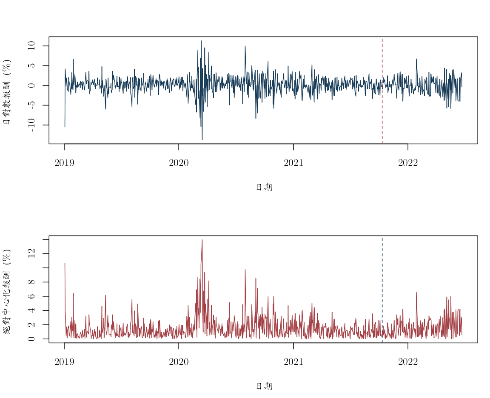
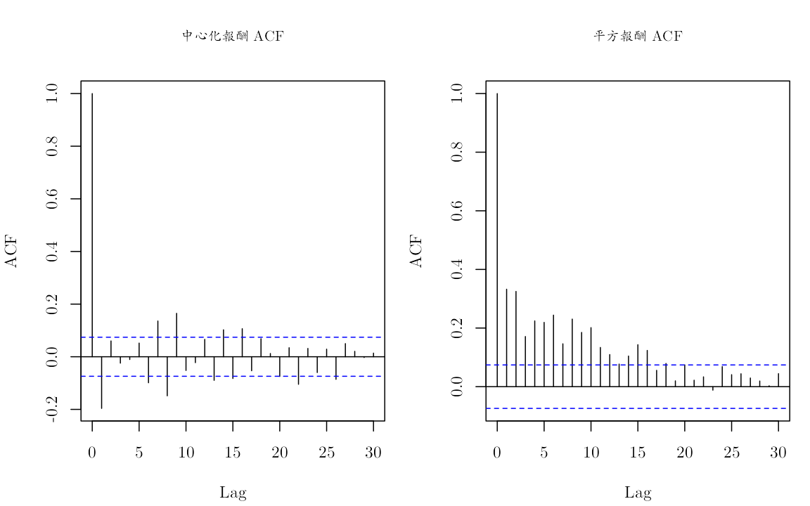
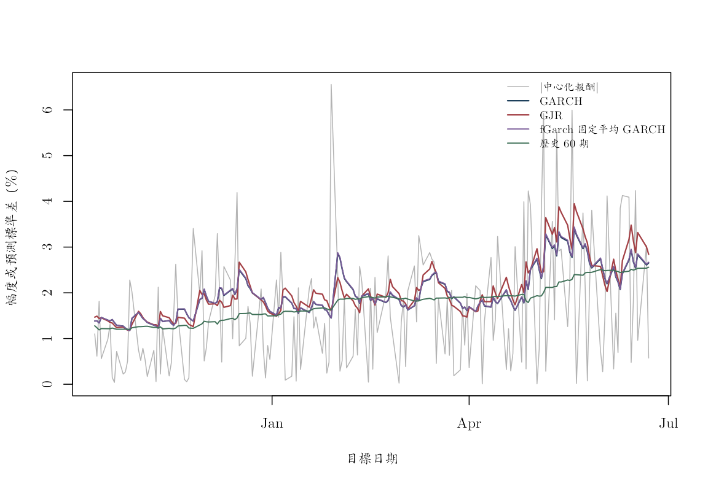

本附錄對應第 11--12 章，使用真實 AAPL 日對數報酬估計 GARCH(1,1) 與 GJR--GARCH(1,1)。資料源自原課程 S&P 500 價格檔；有效樣本為 2019-01-03 至 2022-06-22，共 874 筆，單位是小數日對數報酬。固定版本與建置方式見 `data/DATA_SOURCES.md`。

最後 20% 樣本保留作一次性測試。平均數、變異數參數與初始尺度都只由前 80% 訓練期估計；測試期每一期先形成波動預測，才讀入當期實現報酬更新下一期狀態。主線先用 R 內建的 `optim()` 透明重建遞迴與目標函數，再加入原課程教師講義使用的 `fGarch::garchFit()` 捷徑；兩條路徑都只使用固定資料與相同訓練期。

條件波動模型描述歷史上的條件變異動態；正負報酬的不對稱關聯不能自動解讀成「壞消息造成波動」的因果效果，也不構成投資建議。


``` r
knitr::opts_chunk$set(
  echo = TRUE, message = FALSE, warning = FALSE,
  fig.width = 8, fig.height = 5,
  dev = "ragg_png", dpi = 144,
  dev.args = list(background = "white")
)

required_r <- "4.3.0"
stopifnot(getRversion() >= required_r)

root_candidates <- c(".", "..")
is_root <- vapply(root_candidates, function(x) {
  file.exists(file.path(x, "main.tex"))
}, logical(1))
stopifnot(any(is_root))
project_root <- root_candidates[which(is_root)[1]]
project_path <- function(...) file.path(project_root, ...)

stopifnot(
  requireNamespace("ragg", quietly = TRUE),
  requireNamespace("systemfonts", quietly = TRUE)
)
cwtex_file <- project_path("assets", "fonts", "cwTeXQKai-Medium.ttf")
stopifnot(file.exists(cwtex_file))
if (!"cwTeX Online" %in% systemfonts::registry_fonts()$family) {
  systemfonts::register_font("cwTeX Online", cwtex_file)
}
plot_family <- "cwTeX Online"
```

## 讀取資料並鎖定訓練期


``` r
aapl <- read.csv(project_path(
  "data", "processed", "aapl_adjusted_daily_2019_2022.csv"
))
aapl$date <- as.Date(aapl$date)
aapl <- aapl[order(aapl$date), ]
aapl <- aapl[is.finite(aapl$log_return), ]
row.names(aapl) <- NULL

stopifnot(
  !anyNA(aapl$date), !anyNA(aapl$log_return),
  all(diff(aapl$date) > 0)
)

n <- nrow(aapl)
train_end <- floor(0.80 * n)
train_dates <- aapl$date[seq_len(train_end)]
test_dates <- aapl$date[(train_end + 1L):n]

# 常數平均數只用訓練期估計，之後固定。
mu_train <- mean(aapl$log_return[seq_len(train_end)])
train <- aapl$log_return[seq_len(train_end)] - mu_train
test <- aapl$log_return[(train_end + 1L):n] - mu_train

split_table <- data.frame(
  區段 = c("訓練期", "測試期"),
  起日 = c(min(train_dates), min(test_dates)),
  迄日 = c(max(train_dates), max(test_dates)),
  觀察值 = c(length(train), length(test)),
  報酬單位 = "日對數報酬，小數",
  資料來源 = "原課程 S&P 500 價格檔的 AAPL 固定版本",
  check.names = FALSE
)
knitr::kable(split_table)
```


|區段   |起日       |迄日       | 觀察值|報酬單位         |資料來源                              |
|:------|:----------|:----------|------:|:----------------|:-------------------------------------|
|訓練期 |2019-01-03 |2021-10-11 |    699|日對數報酬，小數 |原課程 S&P 500 價格檔的 AAPL 固定版本 |
|測試期 |2021-10-12 |2022-06-22 |    175|日對數報酬，小數 |原課程 S&P 500 價格檔的 AAPL 固定版本 |

``` r
data.frame(
  訓練期平均日對數報酬 = mu_train,
  訓練期報酬標準差 = sd(train),
  check.names = FALSE
)
```

```
##   訓練期平均日對數報酬 訓練期報酬標準差
## 1          0.001879715       0.02195292
```

以下 $a_t=r_t-\widehat{\mu}_{\mathrm{train}}$。固定訓練期平均數可讓波動預測的資訊邊界一目了然；它不是平均數與變異數聯合最大概似估計。

## 報酬與平方報酬的相依


``` r
old_par <- par(
  mfrow = c(2, 1), mar = c(4.5, 4, 3, 1),
  family = plot_family
)
plot(
  aapl$date, 100 * aapl$log_return,
  type = "l", col = "#173B57",
  xlab = "日期", ylab = "日對數報酬（%）"
)
abline(v = max(train_dates), lty = 2, col = "#A34045")
plot(
  aapl$date, 100 * abs(aapl$log_return - mu_train),
  type = "l", col = "#A34045",
  xlab = "日期", ylab = "絕對中心化報酬（%）"
)
abline(v = max(train_dates), lty = 2, col = "#173B57")
```



``` r
par(old_par)
```


``` r
old_par <- par(
  mfrow = c(1, 2), mar = c(4.2, 4, 4, 1),
  family = plot_family, cex.main = 0.9
)
acf(train, lag.max = 30, main = "中心化報酬 ACF")
acf(train^2, lag.max = 30, main = "平方報酬 ACF")
```



``` r
par(old_par)
```

方向相關與波動相關是不同問題。平均數模型沒有明顯相關，不代表條件變異數是常數。

## ARCH--LM 輔助迴歸


``` r
arch_lm <- function(residual, lags = 10L) {
  stopifnot(lags >= 1L, length(residual) > 5L * lags)
  x2 <- residual^2
  n <- length(x2)
  response <- x2[(lags + 1L):n]
  X <- sapply(seq_len(lags), function(j) {
    x2[(lags + 1L - j):(n - j)]
  })
  colnames(X) <- paste0("lag", seq_len(lags))
  fit <- lm(response ~ X)
  statistic <- nobs(fit) * summary(fit)$r.squared
  data.frame(
    落後階數 = lags,
    LM統計量 = statistic,
    卡方近似p值 = pchisq(
      statistic, df = lags, lower.tail = FALSE
    ),
    check.names = FALSE
  )
}

knitr::kable(arch_lm(train, lags = 10), digits = 6)
```


| 落後階數| LM統計量| 卡方近似p值|
|--------:|--------:|-----------:|
|       10| 166.9343|           0|

訓練期 ARCH--LM 統計量約為 166.93，卡方近似 $p$ 值在目前數值精度下顯示為 0，清楚反對常數條件變異的簡化模型。

ARCH--LM 的小 $p$ 值只是反對「指定落後的平方殘差係數同時為零」，不會自動決定 GARCH 階數或創新分配。

## GARCH 與 GJR--GARCH 規格

對稱 GARCH(1,1) 設定 $\gamma=0$；GJR 模型使用

\[
h_t=\omega+\alpha a_{t-1}^2
+\gamma\mathbf 1(a_{t-1}<0)a_{t-1}^2
+\beta h_{t-1}.
\]

在對稱創新下，GJR 的二階持續性以
$\alpha+\beta+\gamma/2$ 衡量。下列參數轉換強制
$\omega>0$、$\alpha\geq0$、$\beta\geq0$、$\gamma\geq0$，並把持續性限制在 0.999 以下。


``` r
map_garch <- function(eta) {
  raw <- exp(eta[2:3])
  denominator <- 1 + sum(raw)
  c(
    omega = exp(eta[1]),
    alpha = 0.999 * raw[1] / denominator,
    beta = 0.999 * raw[2] / denominator,
    gamma = 0
  )
}

map_gjr <- function(eta) {
  raw <- exp(eta[2:4])
  denominator <- 1 + sum(raw)
  c(
    omega = exp(eta[1]),
    alpha = 0.999 * raw[1] / denominator,
    beta = 0.999 * raw[2] / denominator,
    gamma = 2 * 0.999 * raw[3] / denominator
  )
}

filter_variance <- function(a, par) {
  n <- length(a)
  h <- numeric(n)
  h[1] <- var(a)
  for (t in 2:n) {
    h[t] <- par["omega"] +
      par["alpha"] * a[t - 1]^2 +
      par["gamma"] * as.numeric(a[t - 1] < 0) * a[t - 1]^2 +
      par["beta"] * h[t - 1]
  }
  h
}

gaussian_nll <- function(eta, a, model = c("garch", "gjr")) {
  model <- match.arg(model)
  par <- if (model == "garch") map_garch(eta) else map_gjr(eta)
  h <- filter_variance(a, par)
  if (any(!is.finite(h)) || any(h <= 0)) return(1e100)
  0.5 * sum(log(2 * pi) + log(h[-1]) + a[-1]^2 / h[-1])
}
```

常態準最大概似（quasi-maximum likelihood, QML）不宣稱 AAPL 創新服從常態分配。這裡也沒有計算穩健 sandwich 標準誤，因此重點放在條件變異遞迴與樣本外損失，而不是係數顯著性。

## 多起點最佳化

手動最佳化可能受初始值影響。以下為每個模型使用三組具經濟意義的起點，保留收斂且目標函數最小的結果。


``` r
garch_start <- function(v, alpha, beta) {
  persistence <- alpha + beta
  slack <- 0.999 - persistence
  stopifnot(slack > 0)
  c(
    log(v * (1 - persistence)),
    log(alpha / slack),
    log(beta / slack)
  )
}

gjr_start <- function(v, alpha, beta, gamma) {
  persistence <- alpha + beta + gamma / 2
  slack <- 0.999 - persistence
  stopifnot(slack > 0)
  c(
    log(v * (1 - persistence)),
    log(alpha / slack),
    log(beta / slack),
    log((gamma / 2) / slack)
  )
}

fit_multistart <- function(starts, a, model) {
  fits <- lapply(starts, function(start) {
    optim(
      start, gaussian_nll, a = a, model = model,
      method = "BFGS",
      control = list(maxit = 3000, reltol = 1e-10)
    )
  })
  acceptable <- vapply(fits, function(z) {
    z$convergence == 0 && is.finite(z$value)
  }, logical(1))
  stopifnot(any(acceptable))
  candidates <- which(acceptable)
  fits[[candidates[which.min(vapply(
    fits[candidates], function(z) z$value, numeric(1)
  ))]]]
}

v_train <- var(train)
garch_starts <- list(
  garch_start(v_train, 0.08, 0.87),
  garch_start(v_train, 0.10, 0.80),
  garch_start(v_train, 0.05, 0.92)
)
gjr_starts <- list(
  gjr_start(v_train, 0.05, 0.88, 0.08),
  gjr_start(v_train, 0.05, 0.84, 0.10),
  gjr_start(v_train, 0.03, 0.90, 0.10)
)

fit_garch <- fit_multistart(garch_starts, train, "garch")
fit_gjr <- fit_multistart(gjr_starts, train, "gjr")
par_garch <- map_garch(fit_garch$par)
par_gjr <- map_gjr(fit_gjr$par)

parameter_table <- rbind(
  GARCH = c(
    par_garch,
    persistence = unname(
      par_garch["alpha"] + par_garch["beta"]
    ),
    Gaussian_QML_objective = fit_garch$value
  ),
  GJR = c(
    par_gjr,
    persistence = unname(
      par_gjr["alpha"] + par_gjr["beta"] +
        par_gjr["gamma"] / 2
    ),
    Gaussian_QML_objective = fit_gjr$value
  )
)
knitr::kable(parameter_table, digits = 7)
```


|      |    omega|     alpha|      beta|     gamma| persistence| Gaussian_QML_objective|
|:-----|--------:|---------:|---------:|---------:|-----------:|----------------------:|
|GARCH | 1.98e-05| 0.1460643| 0.8067101| 0.0000000|   0.9527744|              -1794.201|
|GJR   | 2.25e-05| 0.0739291| 0.7930422| 0.1614216|   0.9476821|              -1799.158|

``` r
stopifnot(
  par_garch["alpha"] + par_garch["beta"] < 0.999,
  par_gjr["alpha"] + par_gjr["beta"] + par_gjr["gamma"] / 2 < 0.999
)
```

GJR 的不對稱係數估計值約為 0.1614，訓練期高斯 QML 目標函數也較低；這是條件關聯與配適結果，沒有穩健標準誤時不作顯著性宣稱，更不能作因果解讀。

兩個模型的目標函數可以在同一訓練資料上比較，但多一個參數會提高彈性；不能只看訓練期目標函數就宣告 GJR 必然有較佳預測。

## 原課程套件捷徑：`fGarch::garchFit()`

本節取自原課程教師程式
`slides/L07_ARCH_GARCH/W2L2_R_template_GARCH.R`。該程式以
`garchFit(~ arma(1,0) + garch(1,1), cond.dist = "QMLE")` 聯合估計
AR(1) 平均數與 GARCH(1,1)，並以
`garchFit(~ arma(1,0) + aparch(1,1), delta = 2)` 示範非對稱規格。
以下保留兩個公式，但把即時下載的 AAPL 換成同一份固定 CSV，且一律只用訓練期。

為了與前面的手動 GARCH 作公平核對，另外配適一個「對齊規格」：先扣除已凍結的
$\widehat{\mu}_{\mathrm{train}}$，再設定 `include.mean = FALSE`。這個版本與手動
GARCH 使用相同的固定平均數與變異數方程；兩者仍可能因初始變異數與概似實作細節而有
小幅差異。APARCH 的 `gamma1` 則屬於套件的符號與冪次參數化，不能直接當成前面
GJR 指標函數中的 $\gamma$ 比較。


``` r
stopifnot(requireNamespace("fGarch", quietly = TRUE))

raw_train <- aapl$log_return[seq_len(train_end)]

fgarch_lecture_garch <- fGarch::garchFit(
  ~ arma(1, 0) + garch(1, 1),
  data = raw_train,
  cond.dist = "QMLE",
  trace = FALSE
)

fgarch_lecture_aparch <- fGarch::garchFit(
  ~ arma(1, 0) + aparch(1, 1),
  data = raw_train,
  delta = 2,
  include.delta = FALSE,
  cond.dist = "norm",
  trace = FALSE
)

fgarch_aligned <- fGarch::garchFit(
  ~ garch(1, 1),
  data = train,
  include.mean = FALSE,
  cond.dist = "QMLE",
  trace = FALSE
)

coefficient_or_na <- function(coefficient, term) {
  if (term %in% names(coefficient)) {
    unname(coefficient[term])
  } else {
    NA_real_
  }
}

coef_lecture_garch <- fgarch_lecture_garch@fit$coef
coef_lecture_aparch <- fgarch_lecture_aparch@fit$coef
coef_aligned <- fgarch_aligned@fit$coef

fgarch_specification_table <- data.frame(
  規格 = c(
    "原課程 AR(1)-GARCH；QMLE",
    "原課程 AR(1)-APARCH；delta=2",
    "對齊手動版：固定平均 GARCH；QMLE"
  ),
  平均數處理 = c(
    "聯合估計 AR(1)",
    "聯合估計 AR(1)",
    "固定訓練期平均數"
  ),
  mu = c(
    coefficient_or_na(coef_lecture_garch, "mu"),
    coefficient_or_na(coef_lecture_aparch, "mu"),
    mu_train
  ),
  ar1 = c(
    coefficient_or_na(coef_lecture_garch, "ar1"),
    coefficient_or_na(coef_lecture_aparch, "ar1"),
    NA_real_
  ),
  omega = c(
    coefficient_or_na(coef_lecture_garch, "omega"),
    coefficient_or_na(coef_lecture_aparch, "omega"),
    coefficient_or_na(coef_aligned, "omega")
  ),
  alpha1 = c(
    coefficient_or_na(coef_lecture_garch, "alpha1"),
    coefficient_or_na(coef_lecture_aparch, "alpha1"),
    coefficient_or_na(coef_aligned, "alpha1")
  ),
  beta1 = c(
    coefficient_or_na(coef_lecture_garch, "beta1"),
    coefficient_or_na(coef_lecture_aparch, "beta1"),
    coefficient_or_na(coef_aligned, "beta1")
  ),
  gamma1_APARCH = c(
    NA_real_,
    coefficient_or_na(coef_lecture_aparch, "gamma1"),
    NA_real_
  ),
  check.names = FALSE
)
knitr::kable(fgarch_specification_table, digits = 7)
```


|規格                             |平均數處理       |        mu|        ar1|    omega|    alpha1|     beta1| gamma1_APARCH|
|:--------------------------------|:----------------|---------:|----------:|--------:|---------:|---------:|-------------:|
|原課程 AR(1)-GARCH；QMLE         |聯合估計 AR(1)   | 0.0031347| -0.0816236| 1.87e-05| 0.1546890| 0.8057698|            NA|
|原課程 AR(1)-APARCH；delta=2     |聯合估計 AR(1)   | 0.0026045| -0.0662198| 2.13e-05| 0.1484408| 0.7940558|     0.2645228|
|對齊手動版：固定平均 GARCH；QMLE |固定訓練期平均數 | 0.0018797|         NA| 1.96e-05| 0.1485739| 0.8064884|            NA|

``` r
par_fgarch_aligned <- c(
  omega = coefficient_or_na(coef_aligned, "omega"),
  alpha = coefficient_or_na(coef_aligned, "alpha1"),
  beta = coefficient_or_na(coef_aligned, "beta1"),
  gamma = 0
)
stopifnot(
  all(is.finite(par_fgarch_aligned)),
  par_fgarch_aligned["omega"] > 0,
  par_fgarch_aligned["alpha"] >= 0,
  par_fgarch_aligned["beta"] >= 0,
  par_fgarch_aligned["alpha"] + par_fgarch_aligned["beta"] < 1
)

common_gaussian_objective <- function(a, par) {
  h <- filter_variance(a, par)
  0.5 * sum(
    log(2 * pi) + log(h[-1]) + a[-1]^2 / h[-1]
  )
}

aligned_comparison <- rbind(
  手動_optim固定平均 = c(
    par_garch[c("omega", "alpha", "beta")],
    persistence = unname(par_garch["alpha"] + par_garch["beta"]),
    共同目標函數 = common_gaussian_objective(train, par_garch)
  ),
  fGarch固定平均 = c(
    par_fgarch_aligned[c("omega", "alpha", "beta")],
    persistence = unname(
      par_fgarch_aligned["alpha"] + par_fgarch_aligned["beta"]
    ),
    共同目標函數 = common_gaussian_objective(
      train, par_fgarch_aligned
    )
  )
)
knitr::kable(aligned_comparison, digits = 7)
```


|                   |    omega|     alpha|      beta| persistence| 共同目標函數|
|:------------------|--------:|---------:|---------:|-----------:|------------:|
|手動_optim固定平均 | 1.98e-05| 0.1460643| 0.8067101|   0.9527744|    -1794.201|
|fGarch固定平均     | 1.96e-05| 0.1485739| 0.8064884|   0.9550623|    -1794.191|

前一張規格表的第一、二列回答原課程的聯合平均數—波動問題；第三列才是用來核對本附錄手動固定平均版本的橋梁。緊接著的兩列對照表只比較後者與手動 `optim()`。若兩個對齊版本的參數不完全相同，應先查看初始化與概似定義，而不是把差異誤認為資料或公式錯誤。

## 標準化殘差診斷


``` r
diagnose_variance <- function(a, par, label) {
  h <- filter_variance(a, par)
  z <- a / sqrt(h)
  q_z <- Box.test(z, lag = 20, type = "Ljung-Box")
  q_z2 <- Box.test(z^2, lag = 20, type = "Ljung-Box")
  data.frame(
    模型 = label,
    Q20_標準化殘差 = unname(q_z$statistic),
    p_標準化殘差 = q_z$p.value,
    Q20_平方標準化殘差 = unname(q_z2$statistic),
    p_平方標準化殘差 = q_z2$p.value,
    check.names = FALSE
  )
}

diagnostic_table <- rbind(
  diagnose_variance(train, par_garch, "GARCH"),
  diagnose_variance(train, par_gjr, "GJR"),
  diagnose_variance(
    train, par_fgarch_aligned, "fGarch 固定平均 GARCH"
  )
)
knitr::kable(diagnostic_table, digits = 6)
```


|模型                  | Q20_標準化殘差| p_標準化殘差| Q20_平方標準化殘差| p_平方標準化殘差|
|:---------------------|--------------:|------------:|------------------:|----------------:|
|GARCH                 |       24.51595|     0.220581|           19.23106|         0.506856|
|GJR                   |       23.05409|     0.286146|           18.75490|         0.537805|
|fGarch 固定平均 GARCH |       24.40605|     0.225105|           19.26644|         0.504573|

Ljung--Box 結果是診斷線索，不是模型正確的證明；尾端形狀、符號不對稱、參數邊界與樣本穩定性仍需另查。

## 無資料洩漏的一步波動預測


``` r
one_step_h <- function(previous_a, previous_h, par) {
  par["omega"] +
    par["alpha"] * previous_a^2 +
    par["gamma"] * as.numeric(previous_a < 0) * previous_a^2 +
    par["beta"] * previous_h
}

forecast_locked <- function(train, test, par) {
  h_train <- filter_variance(train, par)
  previous_a <- tail(train, 1)
  previous_h <- tail(h_train, 1)
  forecast <- numeric(length(test))

  for (j in seq_along(test)) {
    forecast[j] <- one_step_h(previous_a, previous_h, par)
    # test[j] 在 forecast[j] 形成後，才進入下一期狀態。
    previous_a <- test[j]
    previous_h <- forecast[j]
  }
  forecast
}

hhat_garch <- forecast_locked(train, test, par_garch)
hhat_gjr <- forecast_locked(train, test, par_gjr)
hhat_fgarch <- forecast_locked(train, test, par_fgarch_aligned)

# 60 期歷史變異數基準：每一期只用目標日以前的觀察。
all_centered <- c(train, test)
hhat_hist60 <- numeric(length(test))
for (j in seq_along(test)) {
  target_index <- train_end + j
  past_index <- (target_index - 60L):(target_index - 1L)
  hhat_hist60[j] <- var(all_centered[past_index])
}

stopifnot(
  all(hhat_garch > 0),
  all(hhat_gjr > 0),
  all(hhat_fgarch > 0),
  all(hhat_hist60 > 0)
)
```

### QLIKE 與平方損失


``` r
qlike <- function(realized_square, variance_forecast) {
  log(variance_forecast) + realized_square / variance_forecast
}

loss_row <- function(h, label) {
  data.frame(
    模型 = label,
    QLIKE = mean(qlike(test^2, h)),
    平方損失_x1e8 = 1e8 * mean((test^2 - h)^2),
    平均預測日波動_pct = 100 * mean(sqrt(h)),
    check.names = FALSE
  )
}

loss_table <- rbind(
  loss_row(hhat_hist60, "歷史 60 期"),
  loss_row(hhat_garch, "GARCH"),
  loss_row(hhat_gjr, "GJR"),
  loss_row(hhat_fgarch, "fGarch 固定平均 GARCH")
)
knitr::kable(loss_table, digits = 8)
```


|模型                  |     QLIKE| 平方損失_x1e8| 平均預測日波動_pct|
|:---------------------|---------:|-------------:|------------------:|
|歷史 60 期            | -6.781018|      42.37544|           1.766730|
|GARCH                 | -6.794816|      42.28975|           1.979972|
|GJR                   | -6.806984|      43.85074|           2.041123|
|fGarch 固定平均 GARCH | -6.794924|      42.33644|           1.988171|

上表分別以 QLIKE 與放大 $10^8$ 倍後的平方損失排序；兩個指標的最小值直接由表中的數字判讀。套件對齊版也使用相同的固定平均數、逐期資訊集合與損失函數，因此這一列比較的是估計實作差異，不是額外看過測試期後才選出的新模型。

`test^2` 是不可觀察條件變異數的高雜訊代理，因此 QLIKE 與平方損失可能給不同排序。這正是同時報告多種損失函數、避免只挑有利指標的理由。


``` r
old_par <- par(family = plot_family)
plot(
  test_dates, 100 * abs(test),
  type = "l", col = "gray70",
  xlab = "目標日期", ylab = "幅度或預測標準差（%）"
)
lines(test_dates, 100 * sqrt(hhat_garch), col = "#173B57", lwd = 1.5)
lines(test_dates, 100 * sqrt(hhat_gjr), col = "#A34045", lwd = 1.5)
lines(test_dates, 100 * sqrt(hhat_fgarch), col = "#7A5C99", lwd = 1.3)
lines(test_dates, 100 * sqrt(hhat_hist60), col = "#3F7158", lwd = 1.3)
legend(
  "topright",
  c(
    "|中心化報酬|", "GARCH", "GJR",
    "fGarch 固定平均 GARCH", "歷史 60 期"
  ),
  col = c(
    "gray70", "#173B57", "#A34045", "#7A5C99", "#3F7158"
  ),
  lty = 1, lwd = c(1, 1.5, 1.5, 1.3, 1.3),
  bty = "n", cex = 0.8
)
```



``` r
par(old_par)
```

### 時間邊界檢查


``` r
origin_dates <- c(max(train_dates), head(test_dates, -1))
timing_table <- data.frame(
  目標日期 = test_dates,
  可用到的最後日期 = origin_dates,
  時序正確 = origin_dates < test_dates,
  check.names = FALSE
)
knitr::kable(head(timing_table, 8))
```


|目標日期   |可用到的最後日期 |時序正確 |
|:----------|:----------------|:--------|
|2021-10-12 |2021-10-11       |TRUE     |
|2021-10-13 |2021-10-12       |TRUE     |
|2021-10-14 |2021-10-13       |TRUE     |
|2021-10-15 |2021-10-14       |TRUE     |
|2021-10-18 |2021-10-15       |TRUE     |
|2021-10-19 |2021-10-18       |TRUE     |
|2021-10-20 |2021-10-19       |TRUE     |
|2021-10-21 |2021-10-20       |TRUE     |

``` r
stopifnot(all(timing_table$時序正確))
```

## 模擬只作單元檢查

下列固定種子模擬不產生任何 AAPL 實證數字，只檢查 GJR 遞迴是否保持正變異數，以及同幅度負面衝擊是否在 $\gamma>0$ 時給出較高的下一期變異數。


``` r
simulate_gjr <- function(
    n, omega, alpha, beta, gamma,
    burn = 300L, seed = 808L) {
  persistence <- alpha + beta + gamma / 2
  stopifnot(
    omega > 0, alpha >= 0, beta >= 0,
    gamma >= 0, persistence < 1
  )
  set.seed(seed)
  total <- n + burn
  z <- rnorm(total)
  a <- numeric(total)
  h <- numeric(total)
  h[1] <- omega / (1 - persistence)
  a[1] <- sqrt(h[1]) * z[1]
  for (t in 2:total) {
    h[t] <- omega + alpha * a[t - 1]^2 +
      gamma * as.numeric(a[t - 1] < 0) * a[t - 1]^2 +
      beta * h[t - 1]
    a[t] <- sqrt(h[t]) * z[t]
  }
  keep <- (burn + 1L):total
  data.frame(a = a[keep], h = h[keep])
}

unit_truth <- c(
  omega = 2e-6, alpha = 0.05, beta = 0.88, gamma = 0.08
)
unit_sim <- simulate_gjr(
  n = 500,
  omega = unit_truth["omega"],
  alpha = unit_truth["alpha"],
  beta = unit_truth["beta"],
  gamma = unit_truth["gamma"]
)

h_reference <- mean(unit_sim$h)
positive_next <- one_step_h(0.02, h_reference, unit_truth)
negative_next <- one_step_h(-0.02, h_reference, unit_truth)

unit_table <- data.frame(
  檢查 = c("模擬最小變異數", "+2% 衝擊的下一期變異數", "-2% 衝擊的下一期變異數"),
  數值 = c(min(unit_sim$h), positive_next, negative_next),
  check.names = FALSE
)
knitr::kable(unit_table, digits = 8)
```


|檢查                   |      數值|
|:----------------------|---------:|
|模擬最小變異數         | 2.303e-05|
|+2% 衝擊的下一期變異數 | 6.539e-05|
|-2% 衝擊的下一期變異數 | 9.739e-05|

``` r
stopifnot(
  all(is.finite(unit_sim$h)),
  all(unit_sim$h > 0),
  negative_next > positive_next
)
```

## 可重現結論

本附錄把真實實證與模擬檢查分開：AAPL 係數、診斷與測試損失全部由固定資料實跑；模擬只檢查符號與遞迴。手動 `optim()` 與教師講義的 `fGarch::garchFit()` 結果並列，且套件對齊版沿用同一個固定平均數與測試期資訊邊界。正式報告還應保存 R 版本、`fGarch` 版本、訓練截止日、多起點設定、所有收斂碼、損失函數與逐期預測。


``` r
sessionInfo()
```

```
## R version 4.5.2 (2025-10-31)
## Platform: aarch64-apple-darwin20
## Running under: macOS Tahoe 26.5.1
## 
## Matrix products: default
## BLAS:   /System/Library/Frameworks/Accelerate.framework/Versions/A/Frameworks/vecLib.framework/Versions/A/libBLAS.dylib 
## LAPACK: /Library/Frameworks/R.framework/Versions/4.5-arm64/Resources/lib/libRlapack.dylib;  LAPACK version 3.12.1
## 
## locale:
## [1] C.UTF-8/C.UTF-8/C.UTF-8/C/C.UTF-8/C.UTF-8
## 
## time zone: Asia/Tokyo
## tzcode source: internal
## 
## attached base packages:
## [1] stats     graphics  grDevices utils     datasets  methods   base     
## 
## other attached packages:
## [1] tibble_3.3.0 dplyr_1.2.1 
## 
## loaded via a namespace (and not attached):
##  [1] shape_1.4.6.1       gtable_0.3.6        xfun_0.57          
##  [4] ggplot2_4.0.3       collapse_2.1.7      lattice_0.22-7     
##  [7] quadprog_1.5-8      vctrs_0.7.2         tools_4.5.2        
## [10] Rdpack_2.6.6        generics_0.1.4      curl_7.0.0         
## [13] parallel_4.5.2      sandwich_3.1-1      xts_0.14.2         
## [16] pkgconfig_2.0.3     gbutils_0.5.1       Matrix_1.7-4       
## [19] tidyverse_2.0.0     RColorBrewer_1.1-3  S7_0.2.1           
## [22] lifecycle_1.0.5     compiler_4.5.2      farver_2.1.2       
## [25] maxLik_1.5-2.2      textshaping_1.0.5   codetools_0.2-20   
## [28] htmltools_0.5.9     glmnet_4.1-10       Formula_1.2-5      
## [31] pillar_1.11.1       MASS_7.3-65         plm_2.6-7          
## [34] iterators_1.0.14    foreach_1.5.2       nlme_3.1-168       
## [37] fracdiff_1.5-4      pls_2.9-0           fBasics_4052.98    
## [40] tidyselect_1.2.1    bdsmatrix_1.3-7     digest_0.6.39      
## [43] labeling_0.4.3      splines_4.5.2       tseries_0.10-62    
## [46] miscTools_0.6-30    fastmap_1.2.0       grid_4.5.2         
## [49] colorspace_2.1-2    cli_3.6.5           magrittr_2.0.4     
## [52] utf8_1.2.6          survival_3.8-3      withr_3.0.2        
## [55] scales_1.4.0        forecast_9.0.2      TTR_0.24.4         
## [58] rmarkdown_2.31      quantmod_0.4.29     otel_0.2.0         
## [61] timeDate_4052.112   ragg_1.5.2          zoo_1.8-15         
## [64] timeSeries_4052.112 fGarch_4052.93      urca_1.3-4         
## [67] evaluate_1.0.5      knitr_1.51          rbibutils_2.4.1    
## [70] lmtest_0.9-40       rlang_1.1.7         spatial_7.3-18     
## [73] Rcpp_1.1.0          glue_1.8.0          R6_2.6.1           
## [76] cvar_0.6            systemfonts_1.3.2
```
