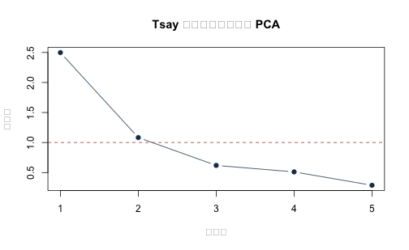
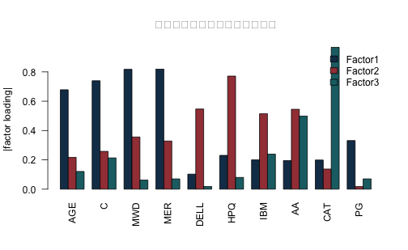

本附錄對應第 15 章，以 Tsay《Analysis of Financial Time Series》第三版課程資料中的兩組真實股票月報酬作為主體：五家公司資料用於 PCA 與跨期低秩重建，十家公司 Barra 範例用於最大概似因子分析與 varimax 旋轉。合成低秩資料只保留在最後作程式真值核對，不再充當主要實證。

五公司檔涵蓋 1990 年 1 月至 2008 年 12 月，共 228 月；十公司檔涵蓋 1990 年 1 月至 2003 年 12 月，共 168 月。數值沿用原課程檔，以**月報酬百分點**表示，例如 4.5 代表約 4.5%；五公司檔為月對數報酬。資料來自原課程指向的 Ruey S. Tsay／Chicago Booth 教材檔案；公開版隨附作者授權的兩份 processed CSV，故本附錄可離線自含重跑。若另由上游教材檔重建，仍須保存教材版本與下載日。PCA 與因子分析在此只描述共同變動與低秩重建，不識別因果衝擊，也不直接證明未來報酬可預測。


``` r
knitr::opts_chunk$set(
  echo = TRUE, message = FALSE, warning = FALSE,
  fig.width = 7, fig.height = 4.3
)
stopifnot(getRversion() >= "4.3.0")
set.seed(1010)
```

## 1. 載入兩組真實資料


``` r
locate_project_file <- function(relative_path) {
  candidates <- c(
    relative_path,
    file.path("..", relative_path),
    file.path("../..", relative_path)
  )
  hit <- candidates[file.exists(candidates)]
  if (length(hit) == 0L) stop("找不到專案檔案：", relative_path)
  normalizePath(hit[1], mustWork = TRUE)
}

five_file <- locate_project_file(
  "data/processed/tsay_five_stock_monthly_returns_1990_2008.csv"
)
barra_file <- locate_project_file(
  "data/processed/tsay_barra_monthly_returns_1990_2003.csv"
)
manifest_file <- locate_project_file("data/processed/manifest.csv")

five <- read.csv(five_file, stringsAsFactors = FALSE, check.names = FALSE)
barra <- read.csv(barra_file, stringsAsFactors = FALSE, check.names = FALSE)
manifest <- read.csv(manifest_file, stringsAsFactors = FALSE)
five$month <- as.Date(five$month)
barra$month <- as.Date(barra$month)
five <- five[order(five$month), ]
barra <- barra[order(barra$month), ]

keys <- c(
  "data/processed/tsay_five_stock_monthly_returns_1990_2008.csv",
  "data/processed/tsay_barra_monthly_returns_1990_2003.csv"
)
manifest_rows <- manifest[match(keys, manifest$file), , drop = FALSE]

stopifnot(
  nrow(five) == 228L, ncol(five) == 6L,
  nrow(barra) == 168L, ncol(barra) == 11L,
  !anyNA(five), !anyNA(barra),
  identical(unname(tools::md5sum(five_file)), manifest_rows$md5[1]),
  identical(unname(tools::md5sum(barra_file)), manifest_rows$md5[2]),
  all(diff(five$month) > 0), all(diff(barra$month) > 0)
)

rbind(
  data.frame(
    dataset = "Tsay five-stock PCA",
    first_month = min(five$month), last_month = max(five$month),
    months = nrow(five), stocks = ncol(five) - 1L,
    unit = "monthly log-return percentage points"
  ),
  data.frame(
    dataset = "Tsay Barra factor analysis",
    first_month = min(barra$month), last_month = max(barra$month),
    months = nrow(barra), stocks = ncol(barra) - 1L,
    unit = "monthly return percentage points"
  )
)
```

```
##                      dataset first_month last_month months stocks
## 1        Tsay five-stock PCA  1990-01-01 2008-12-01    228      5
## 2 Tsay Barra factor analysis  1990-01-01 2003-12-01    168     10
##                                   unit
## 1 monthly log-return percentage points
## 2     monthly return percentage points
```


``` r
data.frame(
  dataset = c("five-stock", "Barra ten-stock"),
  original_course_file = c("m-5clog-9008.txt", "m-barra-9003.txt"),
  source = c(
    "Ruey S. Tsay, Analysis of Financial Time Series, 3e, Example 9.2",
    "Ruey S. Tsay, Analysis of Financial Time Series, 3e, Example 9.4"
  ),
  identification_boundary = c(
    "PCA 是共同變動的描述，不識別經濟衝擊",
    "旋轉負荷量不是已命名或具因果意義的結構因子"
  )
)
```

```
##           dataset original_course_file
## 1      five-stock     m-5clog-9008.txt
## 2 Barra ten-stock     m-barra-9003.txt
##                                                             source
## 1 Ruey S. Tsay, Analysis of Financial Time Series, 3e, Example 9.2
## 2 Ruey S. Tsay, Analysis of Financial Time Series, 3e, Example 9.4
##                      identification_boundary
## 1       PCA 是共同變動的描述，不識別經濟衝擊
## 2 旋轉負荷量不是已命名或具因果意義的結構因子
```

## 2. 五公司真實月報酬的 PCA

五家公司為 IBM、HPQ、INTC、JPM 與 BAC。先依時間固定分成 60% 估計期、20% 驗證期、20% 測試期；標準化中心、尺度與負荷量只能由估計期得到。


``` r
X_five <- as.matrix(five[, -1, drop = FALSE])
storage.mode(X_five) <- "double"
n_five <- nrow(X_five)
estimate_end <- floor(0.60 * n_five)
validation_end <- floor(0.80 * n_five)
estimate_id <- seq_len(estimate_end)
validation_id <- (estimate_end + 1L):validation_end
test_id <- (validation_end + 1L):n_five

data.frame(
  sample = c("估計", "驗證", "測試"),
  first_month = five$month[c(min(estimate_id), min(validation_id), min(test_id))],
  last_month = five$month[c(max(estimate_id), max(validation_id), max(test_id))],
  months = c(length(estimate_id), length(validation_id), length(test_id))
)
```

```
##   sample first_month last_month months
## 1   估計  1990-01-01 2001-04-01    136
## 2   驗證  2001-05-01 2005-02-01     46
## 3   測試  2005-03-01 2008-12-01     46
```


``` r
pca_estimate <- prcomp(
  X_five[estimate_id, , drop = FALSE],
  center = TRUE,
  scale. = TRUE
)
eigenvalues <- pca_estimate$sdev^2
PVE <- eigenvalues / sum(eigenvalues)
explained <- data.frame(
  component = seq_along(PVE),
  eigenvalue = eigenvalues,
  PVE = PVE,
  cumulative_PVE = cumsum(PVE)
)
explained
```

```
##   component eigenvalue        PVE cumulative_PVE
## 1         1  2.4976099 0.49952198      0.4995220
## 2         2  1.0830169 0.21660338      0.7161254
## 3         3  0.6193526 0.12387051      0.8399959
## 4         4  0.5114440 0.10228880      0.9422847
## 5         5  0.2885766 0.05771533      1.0000000
```


``` r
plot(
  explained$component, explained$eigenvalue,
  type = "b", pch = 19, col = "#173B57",
  xlab = "主成分", ylab = "特徵值",
  main = "Tsay 五公司真實月報酬 PCA"
)
abline(h = 1, lty = 2, col = "#A34045")
```



### 2.1 以矩陣特徵分解核對


``` r
Z_estimate <- scale(
  X_five[estimate_id, , drop = FALSE],
  center = pca_estimate$center,
  scale = pca_estimate$scale
)
eigen_direct <- eigen(cov(Z_estimate), symmetric = TRUE)
stopifnot(isTRUE(all.equal(
  unname(eigenvalues), unname(eigen_direct$values), tolerance = 1e-10
)))

projection_prcomp <- tcrossprod(pca_estimate$rotation[, 1:2, drop = FALSE])
projection_eigen <- tcrossprod(eigen_direct$vectors[, 1:2, drop = FALSE])
data.frame(
  largest_eigenvalue_difference = max(abs(eigenvalues - eigen_direct$values)),
  two_component_projection_difference =
    max(abs(projection_prcomp - projection_eigen))
)
```

```
##   largest_eigenvalue_difference two_component_projection_difference
## 1                  2.220446e-15                        6.938894e-16
```

主成分可整欄反號，所以應比較投影空間或配適，而不是把某一個負荷量的正負號當成唯一識別。

## 3. 事先鎖定維度並做跨期重建

先以估計期累積解釋比例達 80% 的最小維度作透明規則；驗證期只報診斷，不再改規則。


``` r
r_selected <- which(explained$cumulative_PVE >= 0.80)[1]
data.frame(
  selected_components = r_selected,
  training_cumulative_PVE = explained$cumulative_PVE[r_selected]
)
```

```
##   selected_components training_cumulative_PVE
## 1                   3               0.8399959
```


``` r
reconstruct_from_pca <- function(fit, newdata, r) {
  Z <- scale(newdata, center = fit$center, scale = fit$scale)
  V <- fit$rotation[, seq_len(r), drop = FALSE]
  Z_hat <- (Z %*% V) %*% t(V)
  X_hat <- sweep(Z_hat, 2, fit$scale, "*")
  sweep(X_hat, 2, fit$center, "+")
}

reconstruction_score <- function(actual, reconstructed) {
  c(
    MSE = mean((actual - reconstructed)^2),
    fraction_variation_reconstructed =
      1 - sum((actual - reconstructed)^2) /
      sum((actual - matrix(colMeans(actual), nrow(actual), ncol(actual),
                           byrow = TRUE))^2)
  )
}

validation_hat <- reconstruct_from_pca(
  pca_estimate, X_five[validation_id, , drop = FALSE], r_selected
)
validation_score <- reconstruction_score(
  X_five[validation_id, , drop = FALSE], validation_hat
)
validation_score
```

```
##                              MSE fraction_variation_reconstructed 
##                       15.6180780                        0.8536273
```

鎖定維度後，以估計期加驗證期重新估計一次 PCA，再只在最後測試期評量。


``` r
development_id <- c(estimate_id, validation_id)
pca_development <- prcomp(
  X_five[development_id, , drop = FALSE],
  center = TRUE, scale. = TRUE
)
test_hat <- reconstruct_from_pca(
  pca_development, X_five[test_id, , drop = FALSE], r_selected
)
test_score <- reconstruction_score(
  X_five[test_id, , drop = FALSE], test_hat
)
data.frame(
  selected_components = r_selected,
  validation_MSE = unname(validation_score["MSE"]),
  test_MSE = unname(test_score["MSE"]),
  test_fraction_variation_reconstructed =
    unname(test_score["fraction_variation_reconstructed"])
)
```

```
##   selected_components validation_MSE test_MSE
## 1                   3       15.61808  12.4048
##   test_fraction_variation_reconstructed
## 1                             0.8247913
```

這是用同月五檔報酬計算同月分數與重建，不是以前一期資訊預測下一期報酬。

## 4. Barra 十公司真實月報酬的因子分析

`factanal()` 的最大概似因子分析把各股票變異拆成共同性與個別變異。以下使用完整的 1990--2003 描述樣本估計三因子並作 varimax 旋轉；沒有保留期績效或因果解讀。


``` r
X_barra <- as.matrix(barra[, -1, drop = FALSE])
storage.mode(X_barra) <- "double"
fa_three <- factanal(
  X_barra,
  factors = 3,
  rotation = "varimax",
  scores = "regression"
)
loadings_matrix <- unclass(fa_three$loadings)

factor_summary <- data.frame(
  stock = rownames(loadings_matrix),
  communality = rowSums(loadings_matrix^2),
  uniqueness = fa_three$uniquenesses
)
round(loadings_matrix, 3)
```

```
##      Factor1 Factor2 Factor3
## AGE    0.678   0.217   0.121
## C      0.740   0.258   0.213
## MWD    0.818   0.356   0.062
## MER    0.819   0.328   0.070
## DELL   0.103   0.547   0.019
## HPQ    0.231   0.771   0.080
## IBM    0.200   0.514   0.239
## AA     0.195   0.545   0.499
## CAT    0.199   0.137   0.968
## PG     0.331  -0.018   0.070
```

``` r
factor_summary
```

```
##      stock communality uniqueness
## AGE    AGE   0.5213440  0.4786595
## C        C   0.6590180  0.3409821
## MWD    MWD   0.7989332  0.2010671
## MER    MER   0.7836121  0.2163876
## DELL  DELL   0.3098410  0.6901433
## HPQ    HPQ   0.6547619  0.3452369
## IBM    IBM   0.3616132  0.6383908
## AA      AA   0.5835561  0.4164444
## CAT    CAT   0.9950005  0.0050000
## PG      PG   0.1150995  0.8848912
```

``` r
fa_three$PVAL
```

```
##  objective 
## 0.08890732
```


``` r
barplot(
  t(abs(loadings_matrix)), beside = TRUE,
  col = c("#173B57", "#A34045", "#1D6D73"),
  names.arg = rownames(loadings_matrix),
  las = 2, ylab = "|factor loading|",
  main = "真實十公司月報酬的旋轉負荷量"
)
legend(
  "topright", paste0("Factor", 1:3),
  fill = c("#173B57", "#A34045", "#1D6D73"), bty = "n"
)
```



旋轉後的群組可協助描述共同變動，但公司名稱與統計負荷量本身不足以把因子命名為特定產業、風險或結構性衝擊。

## 5. 小型低秩真值單元測試

模擬只用於確認「保留正確共同維度可以接近真共同部分」的程式性質，不作實證結論。


``` r
set.seed(1010)
n_sim <- 600L
F_true <- matrix(rnorm(n_sim * 2L), ncol = 2L)
B_true <- rbind(
  c(0.9, 0.1), c(0.8, 0.2), c(0.7, 0.1),
  c(0.1, 0.9), c(0.2, 0.8), c(0.1, 0.7)
)
common_true <- F_true %*% t(B_true)
X_sim <- common_true + matrix(rnorm(n_sim * 6L, sd = 0.15), ncol = 6L)
pc_sim <- prcomp(X_sim, center = TRUE, scale. = FALSE)
common_hat_centered <-
  pc_sim$x[, 1:2, drop = FALSE] %*% t(pc_sim$rotation[, 1:2, drop = FALSE])
common_true_centered <- scale(common_true, center = TRUE, scale = FALSE)
common_correlation <- cor(
  as.vector(common_true_centered), as.vector(common_hat_centered)
)
stopifnot(common_correlation > 0.95)
data.frame(
  true_rank = 2L,
  retained_components = 2L,
  correlation_with_true_common_part = common_correlation
)
```

```
##   true_rank retained_components correlation_with_true_common_part
## 1         2                   2                         0.9944641
```

## 6. 可重現結論與界線

1. PCA 主結果來自 1990--2008 五公司真實月報酬；FA 主結果來自 1990--2003 十公司真實月報酬。
2. 所有數值沿用來源檔的月百分點尺度，沒有和小數報酬混用。
3. PCA 的中心、尺度、負荷量與維度規則都在測試期之前鎖定。
4. 因子分析使用完整樣本作描述，不冒充跨期預測或結構識別。
5. 合成資料只作真值單元測試；公開 repo 隨附作者授權的凍結 CSV，可直接重跑真實資料主結果。


``` r
sessionInfo()
```

```
## R version 4.5.2 (2025-10-31)
## Platform: aarch64-apple-darwin20
## Running under: macOS Tahoe 26.5.1
## 
## Matrix products: default
## BLAS:   /System/Library/Frameworks/Accelerate.framework/Versions/A/Frameworks/vecLib.framework/Versions/A/libBLAS.dylib 
## LAPACK: /Library/Frameworks/R.framework/Versions/4.5-arm64/Resources/lib/libRlapack.dylib;  LAPACK version 3.12.1
## 
## locale:
## [1] C.UTF-8/C.UTF-8/C.UTF-8/C/C.UTF-8/C.UTF-8
## 
## time zone: Asia/Tokyo
## tzcode source: internal
## 
## attached base packages:
## [1] stats     graphics  grDevices utils     datasets  methods   base     
## 
## other attached packages:
## [1] tibble_3.3.0 dplyr_1.2.1 
## 
## loaded via a namespace (and not attached):
##  [1] utf8_1.2.6        R6_2.6.1          tidyselect_1.2.1  xfun_0.57        
##  [5] magrittr_2.0.4    glue_1.8.0        knitr_1.51        pkgconfig_2.0.3  
##  [9] generics_0.1.4    lifecycle_1.0.5   cli_3.6.5         vctrs_0.7.2      
## [13] textshaping_1.0.5 systemfonts_1.3.2 compiler_4.5.2    tools_4.5.2      
## [17] ragg_1.5.2        evaluate_1.0.5    pillar_1.11.1     otel_0.2.0       
## [21] rlang_1.1.7
```
