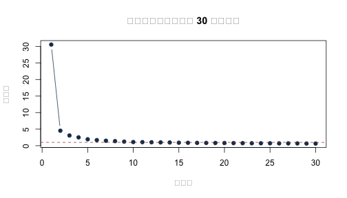
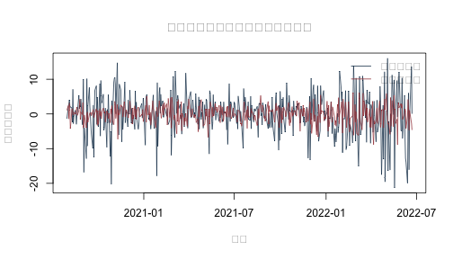

在長格式股票資料中，若直接對整欄價格使用 `lag()`，會發生什麼事？又要如何在不讓未來資料進入中心化與負荷量估計的情況下，用 PCA 壓縮多檔股票報酬？本附錄先用一個小例子重現跨股票落後值的錯誤，再把同一套資料整理原則帶到真實股票報酬的時間切分、降維與跨期重建。

固定資料涵蓋 2013 年 1 月 3 日至 2022 年 6 月 22 日，共 2,384 個共同交易日與 89 檔股票。寬表中的一列是一個交易日，一欄是一檔股票；欄值是在各股票內按日期計算的日簡單報酬，採小數單位，例如 0.01 代表 1%。這 89 檔只是在共同日期都有觀察值的平衡子樣本，**不是完整的 S&P 500 指數成分股歷史**。平衡化可能帶來成分股選擇與存活者偏誤，因此以下結果用來說明資料整理與描述性降維，不衡量整體市場績效，也不構成交易策略或因果效果的證據。

原課程檔含價格、公司、權重與市場識別欄位，但原始供應商、成分股形成日與資料版本沒有完整留存。隨書提供 `sp500_returns_balanced_2013_2022.csv` 固定衍生面板，讓本 Rmd 可以直接重做；若要從原始市場資料重新建置，仍須補齊上游來源與形成日，再依「先按股票分組、組內排序、組內落後」的整理原則計算報酬。這項限制主要影響來源追溯、股票母體與經濟外推。

原課程的對應程式是
`slides/L09_Statistical_factor_models/W2L4_hands-on_R_factors/sp500/pca_sp500.R`：
第 38–48 行直接用 `stats::prcomp()` 做 PCA，第 50–66 行再用
`stats::factanal(..., factors = 3, rotation = "varimax", lower = 0.01)` 做三因子分析。
因此本附錄保留「先看清資料整理原則與時間切分，再呼叫成熟套件函數」的兩層教法；
`prcomp()` 代為處理中心化、尺度與矩陣分解，`factanal()` 代為處理最大概似估計與旋轉；學生不必重寫最佳化器，仍要自己決定時間切分、標準化方式、保留維度與解讀範圍。


``` r
knitr::opts_chunk$set(
  echo = TRUE, message = FALSE, warning = FALSE,
  fig.width = 7, fig.height = 4
)
stopifnot(getRversion() >= "4.3.0")
set.seed(1111)
```

## 先確認固定資料的期間、維度與版本

本檔不使用 `setwd()`、不安裝套件，也不在執行時下載資料。下列函數容許讀者從專案根目錄或 `online_appendix/` 執行，並在開始分析前確認日期順序、股票數、缺值與固定檔案版本。


``` r
locate_project_file <- function(relative_path) {
  candidates <- c(
    relative_path,
    file.path("..", relative_path),
    file.path("../..", relative_path)
  )
  hit <- candidates[file.exists(candidates)]
  if (length(hit) == 0L) {
    stop("找不到專案檔案：", relative_path)
  }
  normalizePath(hit[1], mustWork = TRUE)
}

returns_file <- locate_project_file(
  "data/processed/sp500_returns_balanced_2013_2022.csv"
)
manifest_file <- locate_project_file("data/processed/manifest.csv")
```


``` r
return_df <- read.csv(
  returns_file,
  check.names = FALSE,
  stringsAsFactors = FALSE
)
manifest <- read.csv(manifest_file, stringsAsFactors = FALSE)

dates <- as.Date(return_df$date)
R_all <- as.matrix(return_df[, -1, drop = FALSE])
storage.mode(R_all) <- "double"

manifest_key <- "data/processed/sp500_returns_balanced_2013_2022.csv"
manifest_row <- manifest[manifest$file == manifest_key, , drop = FALSE]
actual_md5 <- unname(tools::md5sum(returns_file))

stopifnot(
  nrow(manifest_row) == 1L,
  nrow(return_df) == manifest_row$rows,
  ncol(return_df) == manifest_row$columns,
  identical(actual_md5, manifest_row$md5),
  nrow(return_df) == 2384L,
  ncol(R_all) == 89L,
  !anyNA(dates),
  !anyDuplicated(dates),
  all(diff(dates) > 0),
  !anyNA(R_all),
  all(is.finite(R_all)),
  !anyDuplicated(colnames(R_all))
)

data.frame(
  first_date = min(dates),
  last_date = max(dates),
  trading_days = nrow(R_all),
  stocks = ncol(R_all),
  md5 = actual_md5
)
```

```
##   first_date  last_date trading_days stocks                              md5
## 1 2013-01-03 2022-06-22         2384     89 09c9690effb82b3fabdccaa982397e83
```

輸出應顯示 2,384 個遞增且不重複的交易日、89 檔股票，而且沒有缺值。檢查碼只確認本次分析讀到的是隨書固定版本；它不能替代上游供應者、成分股形成日、資料版本或經濟意義的查核。

## 為什麼不能在整張長表直接做 `lag()`？

若長格式價格表依日期與股票代碼排序後，直接對整欄價格取落後值，某一列的「前一期」往往會是另一檔股票。下列微型資料刻意重現此錯誤。


``` r
toy_price <- data.frame(
  date = rep(as.Date("2024-01-01") + 0:2, each = 2),
  symbol = rep(c("AAA", "BBB"), times = 3),
  price = c(100, 50, 110, 45, 121, 49.5)
)
toy_price <- toy_price[order(toy_price$date, toy_price$symbol), ]

# 錯誤：完全沒有按股票分組。
toy_price$return_wrong <- c(
  NA_real_,
  diff(toy_price$price) / head(toy_price$price, -1)
)
toy_price
```

```
##         date symbol price return_wrong
## 1 2024-01-01    AAA 100.0           NA
## 2 2024-01-01    BBB  50.0   -0.5000000
## 3 2024-01-02    AAA 110.0    1.2000000
## 4 2024-01-02    BBB  45.0   -0.5909091
## 5 2024-01-03    AAA 121.0    1.6888889
## 6 2024-01-03    BBB  49.5   -0.5909091
```

輸出會讓錯誤一目了然：`BBB` 第一天拿 `AAA` 第一天的價格當分母，`AAA` 第二天又拿 `BBB` 第一天當分母。這些數字看似都是有限值，卻沒有任何金融意義。正確做法是先按股票分組、在每一組內按日期排序，然後才計算報酬。


``` r
within_symbol_return <- function(data) {
  required <- c("date", "symbol", "price")
  stopifnot(all(required %in% names(data)))

  groups <- split(data, data$symbol, drop = TRUE)
  corrected <- lapply(groups, function(one_stock) {
    one_stock <- one_stock[order(one_stock$date), , drop = FALSE]
    one_stock$return <- c(
      NA_real_,
      diff(one_stock$price) / head(one_stock$price, -1)
    )
    one_stock
  })
  corrected <- do.call(rbind, corrected)
  rownames(corrected) <- NULL
  corrected[order(corrected$date, corrected$symbol), ]
}

toy_correct <- within_symbol_return(toy_price[, c("date", "symbol", "price")])
toy_correct
```

```
##         date symbol price return
## 1 2024-01-01    AAA 100.0     NA
## 4 2024-01-01    BBB  50.0     NA
## 2 2024-01-02    AAA 110.0    0.1
## 5 2024-01-02    BBB  45.0   -0.1
## 3 2024-01-03    AAA 121.0    0.1
## 6 2024-01-03    BBB  49.5    0.1
```

``` r
# 可執行的方向與分組單元測試。
first_in_group <- !duplicated(toy_correct$symbol)
stopifnot(
  all(is.na(toy_correct$return[first_in_group])),
  isTRUE(all.equal(
    toy_correct$return[toy_correct$symbol == "AAA"][-1],
    c(0.10, 0.10), tolerance = 1e-12
  )),
  isTRUE(all.equal(
    toy_correct$return[toy_correct$symbol == "BBB"][-1],
    c(-0.10, 0.10), tolerance = 1e-12
  ))
)
```

單元測試確認 AAA 的兩期報酬都是 10%，BBB 則先跌 10%、再漲 10%；每檔股票第一筆價格沒有前一期，因此報酬保留為 `NA`，不硬填成 0。隨書固定面板也是依「先按股票代碼分組，再計算報酬」的程序建立。

## 如何安排估計、驗證與測試交易日？

先查看每檔股票日報酬的平均數、標準差與極端值。這些摘要不等同於投資績效比較，尤其資料是經平衡化後的子樣本。


``` r
stock_summary <- data.frame(
  symbol = colnames(R_all),
  mean = colMeans(R_all),
  sd = apply(R_all, 2, sd),
  minimum = apply(R_all, 2, min),
  maximum = apply(R_all, 2, max)
)

stock_summary[order(stock_summary$sd, decreasing = TRUE)[1:10], ]
```

```
##      symbol         mean         sd    minimum   maximum
## AMD     AMD 0.0021343661 0.03689526 -0.2422907 0.5229008
## TSLA   TSLA 0.0025735523 0.03590150 -0.2106283 0.2439505
## MU       MU 0.0013139785 0.02875429 -0.1981856 0.1334149
## NVDA   NVDA 0.0020572043 0.02730032 -0.1875588 0.2980671
## PXD     PXD 0.0007199667 0.02655846 -0.3691970 0.2043432
## EOG     EOG 0.0006389926 0.02515343 -0.3200724 0.1657025
## BA       BA 0.0006138625 0.02438963 -0.2384841 0.2431861
## FTNT   FTNT 0.0013749644 0.02425128 -0.1926457 0.2191214
## COP     COP 0.0005927422 0.02348466 -0.2484006 0.2521384
## NEM     NEM 0.0004797220 0.02309381 -0.1222814 0.1401824
```

為避免未來資料影響中心化、尺度與主成分負荷量，本例固定切成連續三段：前 65% 為估計期、接著 15% 為驗證期、最後 20% 為測試期。估計期建立 PCA 與 80% 維度規則；驗證期只觀察固定負荷量的重建；選定維度後，估計期與驗證期合稱發展期，用來重估最後一組負荷量；測試期直到最後才使用。日資料不能先隨機打散再切分。


``` r
T_total <- nrow(R_all)
train_end <- floor(0.65 * T_total)
validation_end <- floor(0.80 * T_total)

train_id <- seq_len(train_end)
validation_id <- seq.int(train_end + 1L, validation_end)
test_id <- seq.int(validation_end + 1L, T_total)

split_table <- data.frame(
  sample = c("估計期", "驗證期", "測試期"),
  first_date = dates[c(min(train_id), min(validation_id), min(test_id))],
  last_date = dates[c(max(train_id), max(validation_id), max(test_id))],
  observations = c(length(train_id), length(validation_id), length(test_id))
)
split_table
```

```
##   sample first_date  last_date observations
## 1 估計期 2013-01-03 2019-02-28         1549
## 2 驗證期 2019-03-01 2020-07-30          358
## 3 測試期 2020-07-31 2022-06-22          477
```

表中的截止日決定每個統計量可以看見哪些資料。之後若改動分割比例，也應把它視為另一個研究設計，而不是在看過測試結果後微調。

## 套件作法：用 `prcomp()` 只在估計期建立 PCA

個股波動尺度不同，因此本例先用**估計期**平均數與標準差把各欄標準化，再做 PCA。驗證期與測試期不得各自重新標準化。

原課程直接使用 `prcomp()`。本附錄沿用這個作法，但把函數可見的資料明確限制在
估計期。函數代為計算中心、尺度、主成分方向與分數；研究者仍須決定是否標準化、
何時截止估計，以及後面如何選維度。其後用 `eigen()` 核對所有特徵值，而不是另造一個 PCA 估計器。


``` r
pca_train <- prcomp(
  R_all[train_id, , drop = FALSE],
  center = TRUE,
  scale. = TRUE
)

eigenvalues <- pca_train$sdev^2
pve <- eigenvalues / sum(eigenvalues)
explained <- data.frame(
  component = seq_along(pve),
  eigenvalue = eigenvalues,
  PVE = pve,
  cumulative_PVE = cumsum(pve)
)
head(explained, 15)
```

```
##    component eigenvalue        PVE cumulative_PVE
## 1          1 30.5947665 0.34376142      0.3437614
## 2          2  4.5354152 0.05095972      0.3947211
## 3          3  3.0965127 0.03479228      0.4295134
## 4          4  2.5156583 0.02826582      0.4577792
## 5          5  1.9382370 0.02177794      0.4795572
## 6          6  1.6861223 0.01894519      0.4985024
## 7          7  1.4989376 0.01684200      0.5153444
## 8          8  1.3802086 0.01550796      0.5308523
## 9          9  1.2246514 0.01376013      0.5446125
## 10        10  1.1079264 0.01244861      0.5570611
## 11        11  1.0760845 0.01209084      0.5691519
## 12        12  1.0379729 0.01166262      0.5808145
## 13        13  0.9993702 0.01122888      0.5920434
## 14        14  0.9749119 0.01095407      0.6029975
## 15        15  0.8995359 0.01010715      0.6131046
```

前 15 個特徵值讓我們看見共同變動並非集中在一、兩個方向。陡坡圖適合觀察下降速度，但本例不靠肉眼事後選維度，而是在下一節用事先寫好的 80% 累積解釋比例規則。


``` r
Z_train <- scale(
  R_all[train_id, , drop = FALSE],
  center = pca_train$center,
  scale = pca_train$scale
)
direct_eigen <- eigen(cor(Z_train), symmetric = TRUE, only.values = TRUE)$values

stopifnot(isTRUE(all.equal(
  unname(eigenvalues), unname(direct_eigen), tolerance = 1e-9
)))
```


``` r
plot(
  explained$component[1:30],
  explained$eigenvalue[1:30],
  type = "b", pch = 19, col = "#173B57",
  xlab = "主成分", ylab = "特徵值",
  main = "估計期相關矩陣的前 30 個特徵值"
)
abline(h = 1, lty = 2, col = "#A34045")
```



### 負荷量與正負號不定性

特徵向量整欄乘以 \(-1\) 仍是同一個主成分。因此，不能把 PC1 負荷量的正負號當成可識別的經濟方向。下表依絕對值列出前兩個主成分的重要股票，並保留原符號以利重現。


``` r
largest_loadings <- function(fit, component, n = 12L) {
  loading <- fit$rotation[, component]
  keep <- order(abs(loading), decreasing = TRUE)[seq_len(n)]
  data.frame(
    component = paste0("PC", component),
    symbol = names(loading)[keep],
    loading = unname(loading[keep]),
    absolute_loading = abs(unname(loading[keep]))
  )
}

rbind(
  largest_loadings(pca_train, 1),
  largest_loadings(pca_train, 2)
)
```

```
##    component symbol    loading absolute_loading
## 1        PC1    HON  0.1440392        0.1440392
## 2        PC1     MA  0.1360299        0.1360299
## 3        PC1    MMC  0.1348022        0.1348022
## 4        PC1   FISV  0.1340674        0.1340674
## 5        PC1    TMO  0.1328993        0.1328993
## 6        PC1    ADP  0.1328473        0.1328473
## 7        PC1    DHR  0.1325424        0.1325424
## 8        PC1    ACN  0.1303539        0.1303539
## 9        PC1      V  0.1302504        0.1302504
## 10       PC1    JPM  0.1294404        0.1294404
## 11       PC1    EMR  0.1271807        0.1271807
## 12       PC1    ETN  0.1266206        0.1266206
## 13       PC2    DUK -0.3254492        0.3254492
## 14       PC2      D -0.2962972        0.2962972
## 15       PC2    NEE -0.2918643        0.2918643
## 16       PC2    SRE -0.2434229        0.2434229
## 17       PC2    PEP -0.2341949        0.2341949
## 18       PC2     KO -0.2203414        0.2203414
## 19       PC2     PG -0.2077691        0.2077691
## 20       PC2     VZ -0.1907459        0.1907459
## 21       PC2     PM -0.1756574        0.1756574
## 22       PC2   NVDA  0.1510703        0.1510703
## 23       PC2    AMT -0.1465163        0.1465163
## 24       PC2     MU  0.1441544        0.1441544
```

將估計期 PC1 分數與 89 檔股票的等權平均報酬相比，可作為「共同移動」的描述性核對；這個等權組合不是 S&P 500 指數。


``` r
equal_weight_train <- rowMeans(R_all[train_id, , drop = FALSE])
pc1_train <- pca_train$x[, 1]

data.frame(
  correlation = cor(pc1_train, equal_weight_train),
  absolute_correlation = abs(cor(pc1_train, equal_weight_train))
)
```

```
##   correlation absolute_correlation
## 1   0.9945361            0.9945361
```

PC1 與 89 檔股票等權平均報酬的絕對相關約為 0.995，支持「第一主成分捕捉廣泛共同移動」的描述。相關的正負號可隨主成分整欄反號而改變；而且這個等權平均不是市值加權 S&P 500 指數。

### 套件作法：用 `factanal()` 估計三個共同因子

原課程也提供統計因子模型的套件作法。以下完全沿用原程式的
`factanal()`、三因子、varimax 與 `lower = 0.01` 設定，但只把估計期送入函數。
它和 PCA 的目標不同：PCA 排序總變異的正交方向；最大概似因子分析則以
「共同因子加個別變異」近似相關矩陣。因此應比較共同性、個別變異與重建相關
矩陣的誤差，不要求兩者負荷量逐格相同。`factanal()` 代為進行最大概似估計與旋轉；
研究者仍須決定因子數、旋轉方式、個別變異下界，並檢查邊界解與整體配適。
`factanal()` 回報的 `PVAL` 是概似比檢定的 $p$ 值；只有在觀察值可視為獨立同分配的
多變量常態樣本、最大概似解位於參數空間內部等參考條件下，才可使用通常的
卡方近似。以下因此把它標成「名目概似比 $p$ 值」，並另外檢查是否有個別變異
停在 `lower = 0.01` 的人為下界。


``` r
fa_lower_bound <- 0.01
fa_train <- stats::factanal(
  R_all[train_id, , drop = FALSE],
  factors = 3,
  method = "mle",
  rotation = "varimax",
  lower = fa_lower_bound
)
fa_loadings <- unclass(fa_train$loadings)
fa_at_lower_bound <-
  abs(fa_train$uniquenesses - fa_lower_bound) < 1e-7
fa_model_correlation <- tcrossprod(fa_loadings)
diag(fa_model_correlation) <-
  diag(fa_model_correlation) + fa_train$uniquenesses
fa_empirical_correlation <- cor(R_all[train_id, , drop = FALSE])

fa_top_loadings <- do.call(rbind, lapply(seq_len(ncol(fa_loadings)), function(j) {
  keep <- order(abs(fa_loadings[, j]), decreasing = TRUE)[1:10]
  data.frame(
    factor = paste0("Factor", j),
    symbol = rownames(fa_loadings)[keep],
    loading = fa_loadings[keep, j],
    absolute_loading = abs(fa_loadings[keep, j]),
    row.names = NULL
  )
}))

data.frame(
  estimator = c("stats::prcomp", "stats::factanal"),
  fitted_on = "training period only",
  main_output = c(
    "ordered principal-component directions and scores",
    "rotated common-factor loadings and uniquenesses"
  )
)
```

```
##         estimator            fitted_on
## 1   stats::prcomp training period only
## 2 stats::factanal training period only
##                                         main_output
## 1 ordered principal-component directions and scores
## 2   rotated common-factor loadings and uniquenesses
```

``` r
data.frame(
  factors = fa_train$factors,
  correlation_reconstruction_RMSE = sqrt(mean(
    (fa_empirical_correlation - fa_model_correlation)^2
  )),
  minimum_uniqueness = min(fa_train$uniquenesses),
  maximum_uniqueness = max(fa_train$uniquenesses),
  minimum_uniqueness_at_0_01_boundary = any(fa_at_lower_bound),
  boundary_symbols = paste(
    names(fa_train$uniquenesses)[fa_at_lower_bound],
    collapse = ", "
  ),
  nominal_likelihood_ratio_p_value = unname(fa_train$PVAL)
)
```

```
##   factors correlation_reconstruction_RMSE minimum_uniqueness maximum_uniqueness
## 1       3                      0.04543616               0.01          0.9718212
##   minimum_uniqueness_at_0_01_boundary boundary_symbols
## 1                                TRUE      GOOG, GOOGL
##   nominal_likelihood_ratio_p_value
## 1                                0
```

``` r
fa_top_loadings
```

```
##     factor symbol   loading absolute_loading
## 1  Factor1    JPM 0.7479158        0.7479158
## 2  Factor1    BAC 0.7216907        0.7216907
## 3  Factor1    WFC 0.6879486        0.6879486
## 4  Factor1    HON 0.6858981        0.6858981
## 5  Factor1    ETN 0.6799282        0.6799282
## 6  Factor1    EMR 0.6732746        0.6732746
## 7  Factor1     MA 0.6407425        0.6407425
## 8  Factor1    TXN 0.6332394        0.6332394
## 9  Factor1    MMC 0.6243780        0.6243780
## 10 Factor1    ADI 0.6226653        0.6226653
## 11 Factor2    DUK 0.8362718        0.8362718
## 12 Factor2    NEE 0.8118155        0.8118155
## 13 Factor2      D 0.7995546        0.7995546
## 14 Factor2    SRE 0.7042550        0.7042550
## 15 Factor2    PEP 0.6505500        0.6505500
## 16 Factor2     KO 0.6056677        0.6056677
## 17 Factor2     PG 0.5631149        0.5631149
## 18 Factor2    AMT 0.5242250        0.5242250
## 19 Factor2     VZ 0.4919582        0.4919582
## 20 Factor2     PM 0.4914175        0.4914175
## 21 Factor3  GOOGL 0.9234105        0.9234105
## 22 Factor3   GOOG 0.9232837        0.9232837
## 23 Factor3   AMZN 0.4782895        0.4782895
## 24 Factor3   META 0.3947261        0.3947261
## 25 Factor3   MSFT 0.3930120        0.3930120
## 26 Factor3     MA 0.3371884        0.3371884
## 27 Factor3   ADBE 0.3357633        0.3357633
## 28 Factor3   BKNG 0.3241127        0.3241127
## 29 Factor3      V 0.3140103        0.3140103
## 30 Factor3    CRM 0.3040167        0.3040167
```

三因子重建相關矩陣的 RMSE 約為 0.045，名目概似比 $p$ 值接近 0。在獨立同分配的多變量常態觀察且最大概似解位於參數空間內部的參考條件下，這會拒絕「三因子足以精確描述母體相關矩陣」的虛無假設。不過，最小個別變異正好碰到 0.01 下界，已是邊界解；日報酬的厚尾與時間相依也使獨立同分配多變量常態的參考條件可疑。因此這個數字只能稱為名目 $p$ 值，不能當成一般條件下仍有效的正式模型檢定。此時負荷量仍可用來做探索性描述，卻不宜把三因子模型說成完整或已通過配適檢查。

旋轉後的因子可交換次序或整欄反號；前十大負荷量是描述性標籤線索，不是產業
分類真值，也不能把統計共同因子自動命名為可交易風險因子。

## 要保留多少個主成分？

若以同一組變數的重建誤差選維度，保留全部 89 個主成分必然達到零誤差。為避免看過測試期才改規則，本例在分析前指定：選擇估計期累積解釋比例首次達 80% 的最小主成分個數。


``` r
target_pve <- 0.80
r_selected <- which(explained$cumulative_PVE >= target_pve)[1]

data.frame(
  target_PVE = target_pve,
  selected_components = r_selected,
  achieved_training_PVE = explained$cumulative_PVE[r_selected]
)
```

```
##   target_PVE selected_components achieved_training_PVE
## 1        0.8                  39             0.8006484
```

這份估計樣本需要 39 個主成分才首次達到 80%，累積比例約為 80.06%。89 檔股票並沒有被壓縮成極少數方向，這本身就是值得報告的資料特徵。80% 不是自然法則，而是一條事先寫明的教學規則；研究者也可改用經濟損失函數或驗證期準則，但必須在查看最終測試期以前決定。

## 固定的 39 維空間能否延伸到較晚期間？

下列函數固定使用估計樣本所得到的中心、尺度與負荷量，把新資料投影到前 \(r\) 個主成分後再重建。


``` r
standardized_reconstruction <- function(fit, newdata, r) {
  stopifnot(r >= 0L, r <= ncol(fit$rotation))
  # 新交易日沿用舊樣本的中心、尺度與負荷量，不在保留期重新標準化。
  Z <- scale(newdata, center = fit$center, scale = fit$scale)
  if (r == 0L) {
    Z_hat <- matrix(0, nrow = nrow(Z), ncol = ncol(Z))
  } else {
    V <- fit$rotation[, seq_len(r), drop = FALSE]
    Z_hat <- (Z %*% V) %*% t(V)
  }
  list(actual = Z, reconstructed = Z_hat)
}

reconstruction_diagnostics <- function(object) {
  sse <- sum((object$actual - object$reconstructed)^2)
  sst <- sum(object$actual^2)
  c(
    standardized_MSE = mean((object$actual - object$reconstructed)^2),
    out_of_sample_fraction_reconstructed = 1 - sse / sst
  )
}
```

先用驗證期確認所選維度的表現，但不再改動 80% 規則。


``` r
r_grid <- sort(unique(c(1L, 2L, 5L, 10L, 20L, r_selected, 40L, 60L, 89L)))
r_grid <- r_grid[r_grid <= ncol(R_all)]

validation_table <- do.call(rbind, lapply(r_grid, function(r) {
  diagnostic <- reconstruction_diagnostics(
    standardized_reconstruction(
      pca_train,
      R_all[validation_id, , drop = FALSE],
      r
    )
  )
  data.frame(r = r, t(diagnostic), row.names = NULL)
}))
validation_table
```

```
##    r standardized_MSE out_of_sample_fraction_reconstructed
## 1  1     1.499017e+00                            0.5571620
## 2  2     1.347329e+00                            0.6019735
## 3  5     1.144295e+00                            0.6619536
## 4 10     9.659564e-01                            0.7146381
## 5 20     7.976416e-01                            0.7643615
## 6 39     5.120067e-01                            0.8487435
## 7 40     4.967072e-01                            0.8532633
## 8 60     2.357579e-01                            0.9303527
## 9 89     7.503907e-30                            1.0000000
```

驗證表顯示，39 個成分重建約 84.9% 的標準化變動；保留全部 89 個成分當然會得到近乎零誤差，因此不能用同一組變數的重建誤差無限制地增加維度。這張表用來理解壓縮與重建的取捨，不再改動先前選定的 39。

選定 \(r\) 後，把估計期與驗證期合併重新估計中心、尺度與負荷量；最終測試期仍完全未參與估計或選擇。


``` r
development_id <- c(train_id, validation_id)
pca_development <- prcomp(
  R_all[development_id, , drop = FALSE],
  center = TRUE,
  scale. = TRUE
)

test_object <- standardized_reconstruction(
  pca_development,
  R_all[test_id, , drop = FALSE],
  r_selected
)
test_diagnostic <- reconstruction_diagnostics(test_object)

data.frame(
  selected_components = r_selected,
  test_standardized_MSE = unname(test_diagnostic[1]),
  test_fraction_reconstructed = unname(test_diagnostic[2])
)
```

```
##   selected_components test_standardized_MSE test_fraction_reconstructed
## 1                  39             0.2543771                   0.7877665
```

測試期標準化 MSE 約為 0.254，重建比例約為 78.8%，接近但略低於原先的 80% 目標。這是「同一期觀察值的降維重建」：程式先觀察交易日 $t$ 的 89 維報酬，才計算當日分數，不是用 $t-1$ 期預測 $t$ 期報酬。若研究問題是預測，還須另外建立只使用當時可取得資料的因子動態，並以真正的樣本外預測損失評量。

## 測試期分數的時間圖

測試期分數用發展期的固定負荷量計算，不會重新估計 PCA。圖形只呈現共同波動的相對尺度，PC 的正負號仍可整欄翻轉。


``` r
Z_test <- scale(
  R_all[test_id, , drop = FALSE],
  center = pca_development$center,
  scale = pca_development$scale
)
test_scores <- Z_test %*% pca_development$rotation[, 1:2, drop = FALSE]

matplot(
  dates[test_id], test_scores,
  type = "l", lty = 1, col = c("#173B57", "#A34045"),
  xlab = "日期", ylab = "主成分分數",
  main = "以發展期負荷量計算的測試期分數"
)
legend(
  "topright", legend = c("第一主成分", "第二主成分"),
  col = c("#173B57", "#A34045"), lty = 1, bty = "n"
)
```



## 從降維結果回到資料與研究問題

這個案例最重要的第一步發生在 PCA 以前：報酬必須在股票內計算，否則後面再精密的矩陣分解也只是在整理錯誤資料。固定面板讓程式可以重做，但 89 檔平衡子樣本的形成方式仍限制了結果能否代表 S&P 500 全體成分股；若要作市場層面的推論，應補齊供應者、歷史成分股形成日與資料版本。

在降維部分，39 個主成分於測試期保留約 78.8% 的同日標準化變動。這表示資料可壓縮，但不是只靠一、兩個成分就足夠，也不表示未來報酬可預測。PC 的正負號可翻轉，旋轉因子的次序也可交換；經濟命名需要額外資料與理論，而不是只看負荷量最大的股票。

若下一步要做預測，應在每個預測起點重新確認可用股票母體，只用過去資料估計中心、尺度、負荷量與因子動態，再用未來實現值評量。若目標只是同日共變動描述，則可以把重點放在低秩近似的穩定性、股票宇宙敏感度與不同維度規則的比較。


``` r
sessionInfo()
```

```
## R version 4.5.2 (2025-10-31)
## Platform: aarch64-apple-darwin20
## Running under: macOS Tahoe 26.5.1
## 
## Matrix products: default
## BLAS:   /System/Library/Frameworks/Accelerate.framework/Versions/A/Frameworks/vecLib.framework/Versions/A/libBLAS.dylib 
## LAPACK: /Library/Frameworks/R.framework/Versions/4.5-arm64/Resources/lib/libRlapack.dylib;  LAPACK version 3.12.1
## 
## locale:
## [1] C.UTF-8/C.UTF-8/C.UTF-8/C/C.UTF-8/C.UTF-8
## 
## time zone: Asia/Tokyo
## tzcode source: internal
## 
## attached base packages:
## [1] stats     graphics  grDevices utils     datasets  methods   base     
## 
## loaded via a namespace (and not attached):
##  [1] shape_1.4.6.1       gtable_0.3.6        xfun_0.57          
##  [4] ggplot2_4.0.3       collapse_2.1.7      lattice_0.22-7     
##  [7] quadprog_1.5-8      vctrs_0.7.2         tools_4.5.2        
## [10] Rdpack_2.6.6        generics_0.1.4      curl_7.1.0         
## [13] parallel_4.5.2      sandwich_3.1-2      tibble_3.3.0       
## [16] xts_0.14.2          pkgconfig_2.0.3     gbutils_0.5.1      
## [19] Matrix_1.7-4        tidyverse_2.0.0     RColorBrewer_1.1-3 
## [22] S7_0.2.2            lifecycle_1.0.5     compiler_4.5.2     
## [25] farver_2.1.2        MatrixModels_0.5-4  maxLik_1.5-2.2     
## [28] textshaping_1.0.5   codetools_0.2-20    SparseM_1.84-2     
## [31] quantreg_6.1        htmltools_0.5.9     glmnet_4.1-10      
## [34] Formula_1.2-5       pillar_1.11.1       MASS_7.3-65        
## [37] plm_2.6-7           iterators_1.0.14    foreach_1.5.2      
## [40] nlme_3.1-168        fracdiff_1.5-4      pls_2.9-0          
## [43] fBasics_4052.98     tidyselect_1.2.1    bdsmatrix_1.3-7    
## [46] digest_0.6.39       dplyr_1.2.1         labeling_0.4.3     
## [49] splines_4.5.2       tseries_0.10-62     miscTools_0.6-30   
## [52] fastmap_1.2.0       grid_4.5.2          colorspace_2.1-3   
## [55] cli_3.6.5           magrittr_2.0.4      survival_3.8-3     
## [58] withr_3.0.3         scales_1.4.0        forecast_9.0.2     
## [61] TTR_0.24.4          rmarkdown_2.31      quantmod_0.4.29    
## [64] otel_0.2.0          timeDate_4052.112   ragg_1.5.2         
## [67] zoo_1.8-15          timeSeries_4052.112 fGarch_4052.93     
## [70] urca_1.3-4          evaluate_1.0.5      knitr_1.51         
## [73] rbibutils_2.4.1     lmtest_0.9-40       rlang_1.1.7        
## [76] spatial_7.3-18      Rcpp_1.1.0          glue_1.8.0         
## [79] R6_2.6.1            cvar_0.6            systemfonts_1.3.2
```
