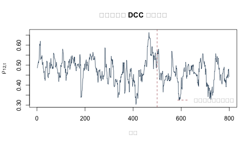

動態條件相關（dynamic conditional correlation, DCC）模型如何把標準化新衝擊轉成隨時間變動的相關矩陣？在跨期資本資產定價模型（intertemporal capital asset pricing model, ICAPM）的應用裡，第一階段估得的條件共變異數進入公司追蹤資料後，又可以如何估計第二階段的報酬關聯？本附錄把這兩個問題分開處理：先用固定種子的三變數合成資料走過 DCC 遞迴，再用 47 家公司、497 個交易日的固定第二階段資料，示範時間切分、公司固定效果與保留期診斷。

現有資料足以重做 DCC 演算法練習與第二階段個案，但沒有保存從原始價格與狀態變數開始的完整清理流程、第一階段 GARCH／DCC 估計、懲罰式追蹤資料分量迴歸（PQRFE）調整，以及相依資料的完整拔靴推論。`cov_X`、`cov_vix` 與 `cov_liq` 是由第一階段估得的條件共變異數；進入第二階段後，它們扮演生成解釋變數（generated regressors）的角色。因為缺少當時的第一階段程式，我們無法回溯確認每一天的共變異數是否只使用當時可得資訊。這個限制會一路影響後面的預測與推論用語。

依 Chen and Lin（2015）的資料章，原研究以 2010 年 1 月 5 日至 2011 年 12 月 30 日的臺灣 50 成分股為基礎：個股日價格與十年期指標公債利率來自臺灣經濟新報（TEJ），臺灣 50 指數來自臺灣證券交易所，臺指 VIX 來自臺灣期貨交易所，30 日融資性商業本票利率來自合作金庫票券金融；排除樣本期內才上市／改制者後為 47 家公司、497 個交易日。論文的報酬定義是日對數超額報酬乘以 100，因此 `return` 沿用百分點尺度；三個 `cov_*` 欄則沿用第一階段估得之條件共變異數的原數值尺度，不另行換算。

固定 CSV 把實際日期與公司代碼匿名化為 `day=1,...,497` 與 `firm=1,...,47`，只保留第二階段六欄。長表中的一列是一個「公司—交易日」觀察，共 23,359 列；`return` 是日對數超額報酬百分點，三個 `cov_*` 欄則沿用既有原值，沒有足夠資訊再轉換尺度。隨書提供這份整理後的 CSV，讓 DCC 教學單元與第二階段個案可以離線重做；來源說明界定了樣本，卻不會補回缺少的第一階段與 PQRFE 推論。


``` r
knitr::opts_chunk$set(
  echo = TRUE, message = FALSE, warning = FALSE,
  fig.width = 7, fig.height = 4
)
stopifnot(getRversion() >= "4.3.0")
stopifnot(requireNamespace("quantreg", quietly = TRUE))
set.seed(1212)
```

## 執行環境與固定資料

本檔不使用 `setwd()`、不安裝套件，也不下載即時資料。基本結果只依賴 R 內建函數；最後的中位數迴歸敏感度分析使用 `quantreg`。R00 已把它列入本書必要套件；若未安裝，本頁會在開始時停止，而不會跳過程式後仍顯示固定數值結論。


``` r
version_table <- data.frame(
  component = c("R", "stats", "quantreg"),
  version = c(
    R.version.string,
    as.character(packageVersion("stats")),
    as.character(packageVersion("quantreg"))
  )
)
version_table
```

```
##   component                      version
## 1         R R version 4.5.2 (2025-10-31)
## 2     stats                        4.5.2
## 3  quantreg                          6.1
```


``` r
locate_project_file <- function(relative_path) {
  candidates <- c(
    relative_path,
    file.path("..", relative_path),
    file.path("../..", relative_path)
  )
  hit <- candidates[file.exists(candidates)]
  if (length(hit) == 0L) {
    stop("找不到專案檔案：", relative_path)
  }
  normalizePath(hit[1], mustWork = TRUE)
}

panel_file <- locate_project_file(
  "data/processed/taiwan_icapm_second_stage_47x497.csv"
)
manifest_file <- locate_project_file("data/processed/manifest.csv")
```

隨書資料位於 `data/processed/taiwan_icapm_second_stage_47x497.csv`。MD5 只用來確認讀到同一份固定版本；讀者可以重做後面的第二階段計算，但不能由這個檔案還原原始價格、第一階段參數或逐日資訊集合。

## DCC 遞迴如何產生隨時間變動的相關矩陣？

### 先建立三變數標準化新衝擊

先產生 800 期、三條序列的相關常態新衝擊；每一列是一個期別，每一欄是一個市場或狀態變數。前 500 期是估計期，決定平均數、標準差與長期相關矩陣；後 300 期是保留期，只讓已實現的新衝擊逐期更新濾波狀態，不重新估計這三項量。


``` r
T_dcc <- 800L
N_dcc <- 3L
dcc_train_id <- 1:500
dcc_test_id <- 501:800

R_population <- matrix(
  c(
    1.00, 0.45, 0.20,
    0.45, 1.00, 0.30,
    0.20, 0.30, 1.00
  ),
  nrow = N_dcc,
  byrow = TRUE
)
stopifnot(min(eigen(R_population, symmetric = TRUE)$values) > 0)

innovation_raw <- matrix(rnorm(T_dcc * N_dcc), ncol = N_dcc) %*%
  chol(R_population)
colnames(innovation_raw) <- c("market", "volatility_state", "liquidity_state")

# 標準化中心、尺度與長期相關都只由前 500 期估計。
training_center <- colMeans(innovation_raw[dcc_train_id, , drop = FALSE])
training_scale <- apply(innovation_raw[dcc_train_id, , drop = FALSE], 2, sd)
epsilon <- scale(
  innovation_raw,
  center = training_center,
  scale = training_scale
)

Q_bar <- cor(epsilon[dcc_train_id, , drop = FALSE])
round(Q_bar, 3)
```

```
##                  market volatility_state liquidity_state
## market            1.000            0.485           0.206
## volatility_state  0.485            1.000           0.337
## liquidity_state   0.206            0.337           1.000
```

這張矩陣是估計期標準化新衝擊的樣本相關，應大致接近模擬設定中的 0.45、0.20 與 0.30，但有限樣本不會逐位數相等。它在後續遞迴中扮演長期拉回目標。

### DCC(1,1) 濾波器

指定 $a=0.03$、$b=0.94$，所以 $a+b=0.97<1$。$a$ 控制上一期新衝擊對目前相關狀態的影響，$b$ 控制原有狀態的持續性，剩下的 $1-a-b$ 把矩陣拉回 $\bar Q$。這兩個數字不是由臺灣資料估計而來，只用於理解與核對狀態遞迴

\[
Q_t=(1-a-b)\bar Q+a\varepsilon_{t-1}\varepsilon_{t-1}^\top+bQ_{t-1}
\]

接著令 \(Q_t^*=\operatorname{diag}(Q_t)\)，也就是把 $Q_t$ 的對角元素放在
對角線、其餘元素設為 0 的對角矩陣；$(Q_t^*)^{-1/2}$ 的第 $i$ 個對角元素
就是 $1/\sqrt{Q_{t,ii}}$。DCC 條件相關矩陣因此為

\[
R_t=(Q_t^*)^{-1/2}Q_t(Q_t^*)^{-1/2}.
\]

左右兩側的逆平方根會把每個共變異數除以相應的條件標準差，使 $R_t$ 的對角線為 1。


``` r
dcc_filter <- function(standardized_innovation, a, b, Q_bar) {
  stopifnot(
    is.matrix(standardized_innovation),
    a >= 0, b >= 0, a + b < 1,
    nrow(Q_bar) == ncol(standardized_innovation),
    ncol(Q_bar) == ncol(standardized_innovation),
    min(eigen(Q_bar, symmetric = TRUE)$values) > 0
  )

  TT <- nrow(standardized_innovation)
  NN <- ncol(standardized_innovation)
  Q_array <- array(NA_real_, dim = c(NN, NN, TT))
  R_array <- array(NA_real_, dim = c(NN, NN, TT))

  normalize_to_correlation <- function(Q) {
    d <- sqrt(diag(Q))
    Q / outer(d, d)
  }

  Q_array[, , 1] <- Q_bar
  R_array[, , 1] <- normalize_to_correlation(Q_bar)

  for (t in 2:TT) {
    previous_outer <- tcrossprod(standardized_innovation[t - 1, ])
    Q_array[, , t] <-
      (1 - a - b) * Q_bar +
      a * previous_outer +
      b * Q_array[, , t - 1]
    R_array[, , t] <- normalize_to_correlation(Q_array[, , t])
  }

  list(Q = Q_array, R = R_array)
}

dcc_a <- 0.03
dcc_b <- 0.94
dcc_result <- dcc_filter(epsilon, dcc_a, dcc_b, Q_bar)
```

### 正規化後仍是合法的相關矩陣嗎？


``` r
minimum_Q_eigenvalue <- vapply(seq_len(T_dcc), function(t) {
  min(eigen(dcc_result$Q[, , t], symmetric = TRUE, only.values = TRUE)$values)
}, numeric(1))

minimum_R_eigenvalue <- vapply(seq_len(T_dcc), function(t) {
  min(eigen(dcc_result$R[, , t], symmetric = TRUE, only.values = TRUE)$values)
}, numeric(1))

largest_diagonal_error <- max(vapply(seq_len(T_dcc), function(t) {
  max(abs(diag(dcc_result$R[, , t]) - 1))
}, numeric(1)))

largest_asymmetry <- max(vapply(seq_len(T_dcc), function(t) {
  max(abs(dcc_result$R[, , t] - t(dcc_result$R[, , t])))
}, numeric(1)))

stopifnot(
  min(minimum_Q_eigenvalue) > 0,
  min(minimum_R_eigenvalue) > 0,
  largest_diagonal_error < 1e-12,
  largest_asymmetry < 1e-12
)

data.frame(
  minimum_Q_eigenvalue = min(minimum_Q_eigenvalue),
  minimum_R_eigenvalue = min(minimum_R_eigenvalue),
  largest_R_diagonal_error = largest_diagonal_error,
  largest_R_asymmetry = largest_asymmetry
)
```

```
##   minimum_Q_eigenvalue minimum_R_eigenvalue largest_R_diagonal_error
## 1            0.3795239            0.3346327             2.220446e-16
##   largest_R_asymmetry
## 1                   0
```

最小特徵值在全部 800 期都保持為正，$R_t$ 的對角線誤差只在浮點數精度，對稱誤差為零。這些檢查說明程式產生的是正定、對角線為 1 的相關矩陣；它們只驗證這組參數與遞迴的數值性質，沒有估計或驗證真實臺灣市場的 DCC 規格。


``` r
rho_12 <- dcc_result$R[1, 2, ]
plot(
  seq_len(T_dcc), rho_12,
  type = "l", col = "#173B57",
  xlab = "期數", ylab = expression(rho[12 * ",t"]),
  main = "合成資料的 DCC 條件相關"
)
abline(v = max(dcc_train_id), lty = 2, col = "#A34045")
legend(
  "bottomright", legend = "估計期／保留期分界",
  lty = 2, col = "#A34045", bty = "n"
)
```



虛線之後的保留期新衝擊可以逐期進入已選定參數的濾波器，但參數 $(\bar Q,a,b)$ 不用保留期重新估計。這呈現了即時濾波的資訊順序：先形成當期狀態，等新衝擊實現後再更新下一期。圖形仍是合成資料的演算法示範，不是臺灣 DCC 估計結果。

## 第二階段資料是否真的是平衡追蹤資料？


``` r
panel <- read.csv(panel_file, stringsAsFactors = FALSE)
manifest <- read.csv(manifest_file, stringsAsFactors = FALSE)

manifest_key <- "data/processed/taiwan_icapm_second_stage_47x497.csv"
manifest_row <- manifest[manifest$file == manifest_key, , drop = FALSE]
actual_md5 <- unname(tools::md5sum(panel_file))

expected_names <- c("day", "firm", "return", "cov_X", "cov_vix", "cov_liq")
stopifnot(
  identical(names(panel), expected_names),
  nrow(manifest_row) == 1L,
  nrow(panel) == manifest_row$rows,
  ncol(panel) == manifest_row$columns,
  identical(actual_md5, manifest_row$md5),
  nrow(panel) == 23359L,
  !anyNA(panel),
  all(vapply(panel, is.numeric, logical(1))),
  all(vapply(panel, function(x) all(is.finite(x)), logical(1))),
  !anyDuplicated(panel[c("day", "firm")])
)

data.frame(
  rows = nrow(panel),
  firms = length(unique(panel$firm)),
  days = length(unique(panel$day)),
  md5 = actual_md5
)
```

```
##    rows firms days                              md5
## 1 23359    47  497 98fb791d16ee3b3e536ef0ce33381e93
```

第一張表應顯示 23,359 列、47 家公司與 497 日，而且每個「公司—交易日」鍵只出現一次。MD5 用來辨認固定檔案版本，不表示三個生成解釋變數已通過第一階段資訊時間檢查。

### 平衡追蹤結構測試


``` r
observations_by_firm <- table(panel$firm)
firms_by_day <- table(panel$day)

stopifnot(
  identical(sort(unique(panel$firm)), 1:47),
  identical(sort(unique(panel$day)), 1:497),
  all(observations_by_firm == 497L),
  all(firms_by_day == 47L)
)

data.frame(
  quantity = c(
    "每家公司最少日數", "每家公司最多日數",
    "每日最少公司數", "每日最多公司數"
  ),
  value = c(
    min(observations_by_firm), max(observations_by_firm),
    min(firms_by_day), max(firms_by_day)
  )
)
```

```
##           quantity value
## 1 每家公司最少日數   497
## 2 每家公司最多日數   497
## 3   每日最少公司數    47
## 4   每日最多公司數    47
```

欄位 `cov_X`、`cov_vix`、`cov_liq` 是第一階段估得的條件共變異數，在第二階段作為生成解釋變數。以下保留原檔尺度，不自行把它們重新解讀成百分比或小數單位。


``` r
summary(panel[c("return", "cov_X", "cov_vix", "cov_liq")])
```

```
##      return              cov_X            cov_vix            cov_liq          
##  Min.   :-7.362482   Min.   :0.06796   Min.   :-12.1305   Min.   :-0.0494139  
##  1st Qu.:-1.034991   1st Qu.:0.84434   1st Qu.: -1.1787   1st Qu.:-0.0034409  
##  Median :-0.007912   Median :1.18083   Median : -0.6805   Median :-0.0012879  
##  Mean   :-0.001485   Mean   :1.43038   Mean   : -1.0592   Mean   :-0.0018979  
##  3rd Qu.: 1.021664   3rd Qu.:1.76456   3rd Qu.: -0.4590   3rd Qu.: 0.0001013  
##  Max.   : 7.046405   Max.   :9.21821   Max.   :  0.3682   Max.   : 0.0840229
```

摘要統計要分開讀：`return` 是百分點報酬，因此數值 1 代表約 1%；三個生成解釋變數保留第一階段的尺度，彼此係數大小不能在沒有尺度轉換資訊時直接比較成經濟效果強弱。極端值也提醒我們，後面的平均數迴歸可能受到尾端觀察影響，這正是最後加入中位數敏感度分析的理由。

## 為什麼第二階段也要按共同日期切分？

前 397 日為訓練期，最後 100 日為測試期，本例沒有另設驗證期。所有公司使用相同日期分界，讓每個測試日的 47 家公司同時留在保留期，也保留共同市場日期衝擊。若把 23,359 列隨機打散，同一天的部分公司可能進入訓練、另一部分進入測試，會破壞真正的資訊順序。


``` r
training_last_day <- 397L
panel_train <- panel[panel$day <= training_last_day, , drop = FALSE]
panel_test <- panel[panel$day > training_last_day, , drop = FALSE]

stopifnot(
  nrow(panel_train) == 47L * 397L,
  nrow(panel_test) == 47L * 100L,
  max(panel_train$day) < min(panel_test$day),
  identical(sort(unique(panel_train$firm)), sort(unique(panel_test$firm)))
)

data.frame(
  sample = c("訓練期", "測試期"),
  first_day = c(min(panel_train$day), min(panel_test$day)),
  last_day = c(max(panel_train$day), max(panel_test$day)),
  rows = c(nrow(panel_train), nrow(panel_test))
)
```

```
##   sample first_day last_day  rows
## 1 訓練期         1      397 18659
## 2 測試期       398      497  4700
```

這項切分保證第二階段的斜率與公司固定效果沒有直接使用測試期報酬。可是，測試期的三個 `cov_*` 欄是在第一階段預先生成；缺少原始程式時，我們無法確認它們是否完全依當時資訊濾波。因此後面的 RMSE 與 MAE 用來看第二階段關係能否延伸到較晚日期，不稱為完整的即時預測績效。

## 公司內變動與報酬有何關聯？

模型為

\[
y_{it}=\alpha_i+\beta_X\,covX_{it}
+\beta_V\,covVIX_{it}+\beta_L\,covLIQ_{it}+e_{it}.
\]

下列函數先在每家公司內去平均，移除不隨時間改變的公司水準，再以 OLS 求三個共同斜率；之後用訓練期平均殘差重建每家公司固定效果。因此，$\beta$ 回答的是「同一家公司某日的生成解釋變數偏離該公司平均時，報酬如何共同變動」，不是公司之間的橫斷面差異。


``` r
fit_within_ols <- function(data, outcome, predictors, id) {
  y <- data[[outcome]]
  X <- as.matrix(data[, predictors, drop = FALSE])
  group <- data[[id]]

  y_within <- y - ave(y, group, FUN = mean)
  X_within <- vapply(seq_along(predictors), function(j) {
    X[, j] - ave(X[, j], group, FUN = mean)
  }, numeric(nrow(data)))
  colnames(X_within) <- predictors

  beta <- drop(qr.solve(crossprod(X_within), crossprod(X_within, y_within)))
  names(beta) <- predictors
  alpha_observation <- y - drop(X %*% beta)
  alpha <- tapply(alpha_observation, group, mean)
  residual <- y - unname(alpha[as.character(group)]) - drop(X %*% beta)

  list(
    beta = beta,
    alpha = alpha,
    residual = residual,
    X_within = X_within,
    y_within = y_within
  )
}

predict_within_ols <- function(object, newdata, predictors, id) {
  firm_key <- as.character(newdata[[id]])
  if (anyNA(object$alpha[firm_key])) {
    stop("測試資料含訓練期未出現的公司，無法套用固定效果。")
  }
  X_new <- as.matrix(newdata[, predictors, drop = FALSE])
  unname(object$alpha[firm_key]) + drop(X_new %*% object$beta)
}

predictors <- c("cov_X", "cov_vix", "cov_liq")
within_fit <- fit_within_ols(
  panel_train,
  outcome = "return",
  predictors = predictors,
  id = "firm"
)

data.frame(
  predictor = names(within_fit$beta),
  estimate = unname(within_fit$beta)
)
```

```
##   predictor    estimate
## 1     cov_X  -0.1342485
## 2   cov_vix  -0.1580951
## 3   cov_liq -19.0472011
```

三個點估計在這段訓練樣本中都是負值，但 `cov_liq` 的數值尺度與另外兩欄不同，不能只因係數絕對值較大就說流動性關聯最強。這些是既有生成解釋變數上的描述性第二階段關聯；沒有識別因果效果，也沒有處理第一階段估計誤差，因此一般 OLS 標準誤不足以支撐完整推論。

### 套件作法：用 `plm()` 重估單向公司固定效果

原課程 `slides/L09_Statistical_factor_models/W2L4_hands-on_R_factors/icapm/InteractivePDM3.R` 載入 `plm`，並以 `phtt::Eup()` 估計交互固定效果。`Eup()` 不是上面的單向公司固定效果；此外，`phtt` 與目前 R 版本有相容性問題，無法直接從 CRAN 安裝，舊課程檔也曾記錄類似問題。因此我們不把另一個模型硬說成 `Eup()` 的複製。

下列作法使用原課程已載入的 `plm`，精確重估上面的**單向公司固定效果模型**。`plm()` 代為建立追蹤資料索引、進行公司內轉換（within transformation）並估計係數；研究者仍須決定固定效果方向、時間切分、解釋變數、標準誤，以及如何處理生成解釋變數的第一階段不確定性。這裡的目的，是確認套件與手動去平均在相同模型下得到相同斜率；完整交互固定效果仍須另行建立相容的 `phtt` 環境。


``` r
stopifnot(requireNamespace("plm", quietly = TRUE))

panel_train_plm <- plm::pdata.frame(
  panel_train,
  index = c("firm", "day"),
  drop.index = FALSE,
  row.names = TRUE
)
plm_within_fit <- plm::plm(
  return ~ cov_X + cov_vix + cov_liq,
  data = panel_train_plm,
  model = "within",
  effect = "individual"
)

plm_comparison <- data.frame(
  predictor = predictors,
  manual_within = unname(within_fit$beta[predictors]),
  plm_within = unname(stats::coef(plm_within_fit)[predictors]),
  check.names = FALSE
)
plm_comparison$absolute_difference <- abs(
  plm_comparison$manual_within - plm_comparison$plm_within
)
knitr::kable(plm_comparison, digits = 10)
```


|predictor | manual_within|  plm_within| absolute_difference|
|:---------|-------------:|-----------:|-------------------:|
|cov_X     |    -0.1342485|  -0.1342485|                   0|
|cov_vix   |    -0.1580951|  -0.1580951|                   0|
|cov_liq   |   -19.0472011| -19.0472011|                   0|

``` r
stopifnot(max(plm_comparison$absolute_difference) < 1e-8)
```

兩種作法的斜率逐位數一致，說明手動去平均與 `plm()` 在同一模型下做的是同一件事。這項一致性只涵蓋點估計；標準誤仍須處理共同日期衝擊、公司內序列相依與第一階段生成變數，不能由套件預設值代替研究設計。

### 加入生成解釋變數是否改善保留期損失？

基準模型只使用每家公司訓練期平均報酬。兩個模型都不能看測試期報酬來調參。


``` r
prediction_within <- predict_within_ols(
  within_fit, panel_test, predictors = predictors, id = "firm"
)
training_firm_mean <- tapply(panel_train$return, panel_train$firm, mean)
prediction_baseline <- unname(
  training_firm_mean[as.character(panel_test$firm)]
)

point_loss <- function(actual, predicted) {
  c(
    RMSE = sqrt(mean((actual - predicted)^2)),
    MAE = mean(abs(actual - predicted))
  )
}

evaluation <- rbind(
  fixed_effect_only = point_loss(panel_test$return, prediction_baseline),
  fixed_effect_plus_covariances = point_loss(panel_test$return, prediction_within)
)
evaluation
```

```
##                                   RMSE      MAE
## fixed_effect_only             2.662622 1.972796
## fixed_effect_plus_covariances 2.673590 1.980052
```

在最後 100 日，公司固定效果基準的 RMSE 約為 2.663、MAE 約為 1.973；加入三個生成解釋變數後，兩項損失反而略升至約 2.674 與 1.980。就這次固定切分而言，這三個第二階段解釋變數沒有改善點預測損失。這是關係穩定性的診斷，不是「風險因子無效」的因果結論；若第一階段欄位曾使用未來資料平滑，第二階段切分也無法自行排除資訊洩漏。

## 同一天的公司殘差是否仍共同移動？

若同一天的公司殘差共同移動，把每一列當獨立觀察值會低估不確定性。將測試期殘差排成「日期 \(\times\) 公司」矩陣，查看平均絕對相關與第一特徵值占比。


``` r
test_residual <- panel_test$return - prediction_within
residual_frame <- transform(panel_test, residual = test_residual)
residual_matrix <- xtabs(residual ~ day + firm, data = residual_frame)

residual_correlation <- cor(residual_matrix)
off_diagonal <- residual_correlation[upper.tri(residual_correlation)]
residual_eigenvalues <- eigen(
  residual_correlation,
  symmetric = TRUE,
  only.values = TRUE
)$values

data.frame(
  mean_off_diagonal_correlation = mean(off_diagonal),
  mean_absolute_off_diagonal_correlation = mean(abs(off_diagonal)),
  first_eigenvalue_share = residual_eigenvalues[1] / sum(residual_eigenvalues)
)
```

```
##   mean_off_diagonal_correlation mean_absolute_off_diagonal_correlation
## 1                     0.4900879                              0.4900879
##   first_eigenvalue_share
## 1              0.5206245
```

測試期殘差的平均公司間相關約為 0.49，第一個相關矩陣特徵值占比約為 52.1%，顯示強烈的共同日期成分。這也解釋了為什麼把 4,700 個測試列當成獨立觀察會過度樂觀。正式推論應考慮共同日期衝擊、雙向叢聚、交互固定效果，或保留時間與橫斷面相依結構的拔靴法。

## 換成條件中位數後，結論是否改變？

下列程式使用 `quantreg` 估計未懲罰的公司虛擬變數中位數迴歸。它**不是**第 16 章公式中的懲罰式 PQRFE，也沒有提供相依資料下的有效推論；目的只在比較條件平均與條件中位數的點估計／保留期查核損失。


``` r
check_loss <- function(actual, predicted, tau) {
  u <- actual - predicted
  mean(u * (tau - (u < 0)))
}

panel_train$firm_factor <- factor(panel_train$firm)
panel_test$firm_factor <- factor(
  panel_test$firm,
  levels = levels(panel_train$firm_factor)
)

median_fit <- quantreg::rq(
  return ~ cov_X + cov_vix + cov_liq + firm_factor,
  tau = 0.5,
  data = panel_train,
  method = "fn"
)
median_prediction <- as.numeric(predict(median_fit, newdata = panel_test))

training_firm_median <- tapply(panel_train$return, panel_train$firm, median)
median_baseline <- unname(
  training_firm_median[as.character(panel_test$firm)]
)

median_slopes <- coef(median_fit)[c("cov_X", "cov_vix", "cov_liq")]
print(data.frame(
  predictor = names(median_slopes),
  median_regression_estimate = unname(median_slopes)
))
```

```
##   predictor median_regression_estimate
## 1     cov_X                 0.02288162
## 2   cov_vix                -0.12990358
## 3   cov_liq               -11.76551890
```

``` r
print(data.frame(
  model = c("公司訓練期中位數", "未懲罰固定效果中位數迴歸"),
  test_check_loss = c(
    check_loss(panel_test$return, median_baseline, 0.5),
    check_loss(panel_test$return, median_prediction, 0.5)
  )
))
```

```
##                      model test_check_loss
## 1         公司訓練期中位數       0.9836075
## 2 未懲罰固定效果中位數迴歸       0.9894237
```

中位數斜率的確與平均數斜率不同，其中 `cov_X` 甚至改為小幅正值；不過保留期查核損失由公司中位數基準的約 0.984 上升到約 0.989，沒有顯示這個未懲罰規格帶來改善。斜率差異本身也不足以宣稱結構性風險趨避隨分量改變；那需要識別條件、完整 PQRFE 規格，以及能反映兩階段估計誤差與資料相依的推論。

## 從第二階段結果回到研究範圍

DCC 模擬顯示，給定合法的參數與估計期長期相關矩陣，遞迴可以逐期產生正定、對角線為 1 的條件相關矩陣。臺灣固定資料則確認 47 家公司與 497 日形成完整平衡追蹤資料，並讓我們實際計算公司內斜率、保留期損失與殘差共同移動。就這次切分而言，加入三個生成解釋變數並沒有勝過單純的公司固定效果基準，而殘差仍保留很強的共同日期成分。

這些結果回答的是第二階段條件關聯與穩定性。由於原始價格建檔、第一階段 GARCH／DCC／ADCC、生成解釋變數的估計不確定性、完整 PQRFE 調整與相依資料拔靴法不在現有檔案中，我們尚不能評斷原研究的全部估計是否能逐步重建，也不能把點估計解讀為因果效果或結構偏好參數。

若要把這個個案往前推進，最優先的是找回第一階段資料與程式，逐日記錄每個共變異數在形成時可用的資訊；接著再建立交互固定效果、PQRFE 與適合公司—日期相依結構的推論。完成這些步驟後，保留期比較才有資格被解讀為完整兩階段流程的表現。


``` r
sessionInfo()
```

```
## R version 4.5.2 (2025-10-31)
## Platform: aarch64-apple-darwin20
## Running under: macOS Tahoe 26.5.1
## 
## Matrix products: default
## BLAS:   /System/Library/Frameworks/Accelerate.framework/Versions/A/Frameworks/vecLib.framework/Versions/A/libBLAS.dylib 
## LAPACK: /Library/Frameworks/R.framework/Versions/4.5-arm64/Resources/lib/libRlapack.dylib;  LAPACK version 3.12.1
## 
## locale:
## [1] C.UTF-8/C.UTF-8/C.UTF-8/C/C.UTF-8/C.UTF-8
## 
## time zone: Asia/Tokyo
## tzcode source: internal
## 
## attached base packages:
## [1] stats     graphics  grDevices utils     datasets  methods   base     
## 
## loaded via a namespace (and not attached):
##  [1] shape_1.4.6.1       gtable_0.3.6        xfun_0.57          
##  [4] ggplot2_4.0.3       collapse_2.1.7      lattice_0.22-7     
##  [7] quadprog_1.5-8      vctrs_0.7.2         tools_4.5.2        
## [10] Rdpack_2.6.6        generics_0.1.4      curl_7.1.0         
## [13] parallel_4.5.2      sandwich_3.1-2      tibble_3.3.0       
## [16] xts_0.14.2          pkgconfig_2.0.3     gbutils_0.5.1      
## [19] Matrix_1.7-4        tidyverse_2.0.0     RColorBrewer_1.1-3 
## [22] S7_0.2.2            lifecycle_1.0.5     compiler_4.5.2     
## [25] farver_2.1.2        MatrixModels_0.5-4  maxLik_1.5-2.2     
## [28] textshaping_1.0.5   codetools_0.2-20    SparseM_1.84-2     
## [31] quantreg_6.1        htmltools_0.5.9     glmnet_4.1-10      
## [34] Formula_1.2-5       pillar_1.11.1       MASS_7.3-65        
## [37] plm_2.6-7           iterators_1.0.14    foreach_1.5.2      
## [40] nlme_3.1-168        fracdiff_1.5-4      pls_2.9-0          
## [43] fBasics_4052.98     tidyselect_1.2.1    bdsmatrix_1.3-7    
## [46] digest_0.6.39       dplyr_1.2.1         labeling_0.4.3     
## [49] splines_4.5.2       tseries_0.10-62     miscTools_0.6-30   
## [52] fastmap_1.2.0       grid_4.5.2          colorspace_2.1-3   
## [55] cli_3.6.5           magrittr_2.0.4      survival_3.8-3     
## [58] withr_3.0.3         scales_1.4.0        forecast_9.0.2     
## [61] TTR_0.24.4          rmarkdown_2.31      quantmod_0.4.29    
## [64] otel_0.2.0          timeDate_4052.112   ragg_1.5.2         
## [67] zoo_1.8-15          timeSeries_4052.112 fGarch_4052.93     
## [70] urca_1.3-4          evaluate_1.0.5      knitr_1.51         
## [73] rbibutils_2.4.1     lmtest_0.9-40       rlang_1.1.7        
## [76] spatial_7.3-18      Rcpp_1.1.0          glue_1.8.0         
## [79] R6_2.6.1            cvar_0.6            systemfonts_1.3.2
```
