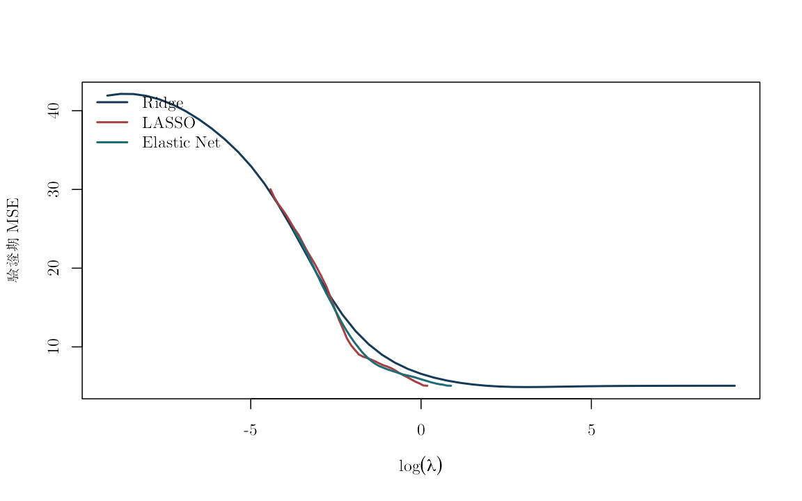
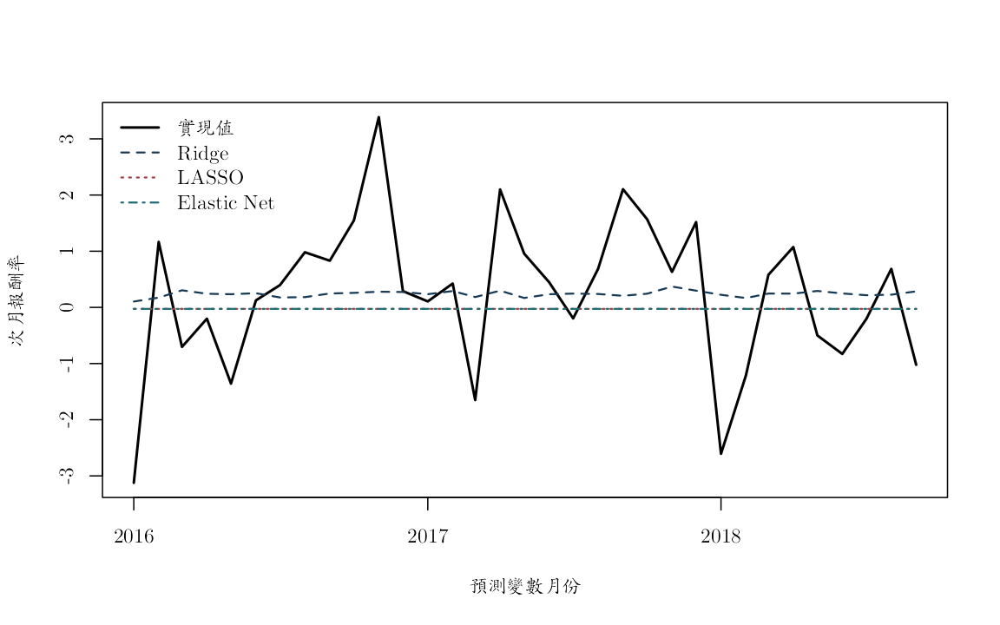

本附錄要回答一個很實際的預測問題：日本總體與金融變數很多，而且彼此高度相關時，正則化能否比簡單模型更準確地預測下一個月的日本股市報酬？我們使用 2007 年 10 月至 2018 年 10 月的固定月資料，共 133 個月份，依序比較 OLS、Ridge、LASSO、Elastic Net 與 post-LASSO。每一列代表一個月份；金融市場欄使用第 \(t\) 月月末值，發布時點不明的總體欄則保守地使用第 \(t-1\) 月標示值，一起預測第 \(t+1\) 月的 `return_j`。

這份快照整理自原課程的 `data_t.csv` 與 `yield_10.csv`。原變數說明記載了股價、匯率、工業生產、利率、美股、失業、CPI、M3、WTI、人口結構、外資、貿易與十年期殖利率的單位及季節調整狀態，但沒有留下原供應者、網址、下載日、首次發布日或歷史版本。以下分析因此只能稱為**按月份排序的擬樣本外比較**，不能當作已通過即時資料檢查的交易回測。係數反映指定模型與時間切分下的預測關聯，沒有因果效果的解讀。

## 先確認執行環境與固定資料

- R 4.1 以上；手動版使用 R 內建函數，套件核對使用 `glmnet`；`knitr` 負責轉檔，`ragg` 與 `systemfonts` 負責以 cwTeX 字型產生圖檔。
- 資料：`data/processed/japan_monthly_2007_2018.csv`。
- 建置紀錄與 MD5：`data/processed/manifest.csv`。
- 可從教科書專案根目錄或 `online_appendix/` 轉成網頁；資料位置由相對路徑搜尋函數判定。
- 本頁可直接讀取隨專案保存的整理後 CSV；若要從上游來源重新建檔，仍須另行補齊資料供應者、下載日與歷史版本。


``` r
knitr::opts_chunk$set(
  echo = TRUE,
  message = FALSE,
  warning = FALSE,
  fig.width = 8,
  fig.height = 5,
  dev = "ragg_png", dpi = 144,
  dev.args = list(background = "white")
)
set.seed(20260716)

root_candidates <- c(".", "..")
is_root <- vapply(root_candidates, function(x) {
  file.exists(file.path(x, "main.tex"))
}, logical(1))
stopifnot(any(is_root))
project_root <- root_candidates[which(is_root)[1]]
project_path <- function(...) file.path(project_root, ...)

stopifnot(
  requireNamespace("glmnet", quietly = TRUE),
  requireNamespace("ragg", quietly = TRUE),
  requireNamespace("systemfonts", quietly = TRUE)
)
cwtex_file <- project_path("assets", "fonts", "cwTeXQKai-Medium.ttf")
stopifnot(file.exists(cwtex_file))
if (!"cwTeX Online" %in% systemfonts::registry_fonts()$family) {
  systemfonts::register_font("cwTeX Online", cwtex_file)
}
plot_family <- "cwTeX Online"
```

讀檔後先做三件事：把日期轉成 R 的日期格式、依月份排序，再核對資料列數與欄數。時間排序放在任何落後值或樣本切分之前；若順序錯了，後面的「下一期」便不再是日曆上的下一個月。


``` r
locate_project_file <- function(relative_path) {
  candidates <- c(
    relative_path,
    file.path("..", relative_path),
    file.path("../..", relative_path)
  )
  hit <- candidates[file.exists(candidates)]
  if (length(hit) == 0L) stop("找不到專案檔案：", relative_path)
  normalizePath(hit[1], mustWork = TRUE)
}

data_path <- locate_project_file(
  "data/processed/japan_monthly_2007_2018.csv"
)
manifest_path <- locate_project_file("data/processed/manifest.csv")

manifest <- read.csv(manifest_path, stringsAsFactors = FALSE)
jp <- read.csv(data_path, stringsAsFactors = FALSE, check.names = FALSE)
jp$date <- as.Date(jp$date)
jp <- jp[order(jp$date), ]

stopifnot(nrow(jp) == 133L, ncol(jp) == 30L)
manifest[grepl("japan_monthly", manifest$file), ]
```

```
##                                         file rows columns
## 8 data/processed/japan_monthly_2007_2018.csv  133      30
##                                md5
## 8 46b39f6fdde5d581ad31c83348d99933
##                                                          description
## 8 Japanese monthly macro-finance panel with 10-year government yield
##                  built_at
## 8 2026-07-16 09:57:40 UTC
```

``` r
data.frame(
  起始月份 = min(jp$date),
  結束月份 = max(jp$date),
  月數 = nrow(jp),
  觀察單位 = "日本總體金融月資料",
  報酬尺度 = "沿用來源檔尺度，未自行重新命名",
  check.names = FALSE
)
```

```
##     起始月份   結束月份 月數           觀察單位                       報酬尺度
## 1 2007-10-01 2018-10-01  133 日本總體金融月資料 沿用來源檔尺度，未自行重新命名
```

輸出應顯示 133 個月、30 欄，而且首末月份與資料說明一致。表中的「報酬尺度」刻意保留來源檔尺度的說法，提醒我們不要在尚未核對公式前自行把它換成百分比或小數報酬。

## 依資料可得時點對齊預測問題

我們要預測的量是第 \(t+1\) 月 `return_j`。股價、利率與油價等金融市場欄假設可在第 \(t\) 月月末取得；實質匯率、工業生產、失業、CPI、貨幣、人口、外資與貿易等總體欄缺少首次發布日與歷史版本，因此統一再落後一個月。這項保守處理仍無法還原資料修訂或個別發布延遲，只是避免把所有「標示為第 \(t\) 月」的統計都當成第 \(t\) 月底已知。

程式先把應變數向前移一列，形成 `target_next`；日期、當期 `return_j` 與新建的目標欄都不放入解釋變數矩陣。接著才按上面的可得性假設建立解釋變數，最後一次刪除缺值。如此每一列仍代表同一個預測形成月份。


``` r
jp$target_next <- c(jp$return_j[-1], NA_real_)
predictor_names <- setdiff(
  names(jp),
  c("date", "return_j", "target_next")
)

# 金融市場欄使用 t 月月末值；其餘欄一律採 t-1 月標示值。
market_names <- c(
  "spj", "inr", "inr_change", "spf", "return_f",
  "opi", "opi_change", "yield_10", "yield_10_change"
)
stopifnot(all(market_names %in% predictor_names))
macro_names <- setdiff(predictor_names, market_names)

X_available <- jp[, predictor_names, drop = FALSE]
X_available[, macro_names] <- rbind(
  rep(NA_real_, length(macro_names)),
  X_available[-nrow(X_available), macro_names, drop = FALSE]
)

availability_table <- data.frame(
  資料類別 = c("金融市場與利率", "發布時點不明的總體統計"),
  本頁採用時點 = c("t 月月末值", "t-1 月標示值"),
  主要欄位 = c(
    paste(market_names, collapse = ", "),
    paste(macro_names, collapse = ", ")
  ),
  仍未解決的限制 = c(
    "固定檔未保存日內形成時點",
    "固定檔未保存首次發布日與歷史版本"
  ),
  check.names = FALSE
)
knitr::kable(availability_table)
```


|資料類別               |本頁採用時點 |主要欄位                                                                                                                                |仍未解決的限制                   |
|:----------------------|:------------|:---------------------------------------------------------------------------------------------------------------------------------------|:--------------------------------|
|金融市場與利率         |t 月月末值   |spj, inr, inr_change, spf, return_f, opi, opi_change, yield_10, yield_10_change                                                         |固定檔未保存日內形成時點         |
|發布時點不明的總體統計 |t-1 月標示值 |rer, rer_change, ipi, ipi_change, unr, unr_change, cpi, bmj, bmj_growth, yng, mid, old, dro, dro_growth, dry, dep, dep_growth, fpi, trd |固定檔未保存首次發布日與歷史版本 |

``` r
model_df <- data.frame(
  date = jp$date,
  target_next = jp$target_next,
  X_available,
  check.names = FALSE
)
model_df <- model_df[complete.cases(model_df), ]
X_raw <- as.matrix(model_df[, predictor_names])
storage.mode(X_raw) <- "double"
y <- model_df$target_next
dates <- model_df$date

c(observations = length(y), predictors = ncol(X_raw))
```

```
## observations   predictors 
##          130           28
```

``` r
head(data.frame(
  forecast_origin_month = dates,
  macro_label_month = jp$date[match(dates, jp$date) - 1L],
  target_next = y
), 3)
```

```
##   forecast_origin_month macro_label_month target_next
## 1            2007-12-01        2007-11-01   -4.528597
## 2            2008-01-01        2007-12-01   -1.002648
## 3            2008-02-01        2008-01-01   -3.373635
```

`head()` 是最重要的人工核對之一：第一欄是預測形成月份，第二欄是總體資料的標示月份，第三欄是下一個月的報酬。這裡若錯一列，後面再精密的正則化也只是在估計錯置的預測問題。程式以資料列索引形成上一個月的標籤，避免另引入日期套件。

## 只由訓練資料估計前處理

Ridge、LASSO 與 Elastic Net 的懲罰會受到解釋變數尺度影響，因此每個訓練視窗都要重新估計平均數與標準差。驗證期或測試期只能套用當時訓練資料算出的轉換；若先用全樣本標準化，未來月份的分布已經悄悄進入模型。


``` r
prep_x <- function(X_train, X_new = NULL) {
  # 平均數、標準差與近常數欄的判定都只看當次訓練資料。
  mu <- colMeans(X_train)
  s <- apply(X_train, 2, sd)
  keep <- is.finite(s) & s > 1e-10
  X_train_s <- sweep(sweep(X_train[, keep, drop = FALSE], 2, mu[keep]),
                       2, s[keep], "/")
  ans <- list(
    train = X_train_s,
    mean = mu[keep],
    sd = s[keep],
    keep = keep
  )
  if (!is.null(X_new)) {
    # 新資料沿用訓練期尺度，避免驗證期或測試期參與前處理。
    ans$new <- sweep(sweep(X_new[, keep, drop = FALSE], 2, mu[keep]),
                     2, s[keep], "/")
  }
  ans
}

soft_threshold <- function(z, penalty) {
  sign(z) * pmax(abs(z) - penalty, 0)
}
```

## 三種正則化估計器

三種方法都在平方預測誤差與係數大小之間取捨。Ridge 使用平方懲罰，通常保留所有變數但縮小係數；LASSO 使用絕對值懲罰，可以把部分係數壓到零；Elastic Net 則混合兩者。以下函數共同最小化

\[
\frac{1}{2n}\lVert y-Xb\rVert_2^2+
\lambda\left\{\alpha\lVert b\rVert_1+
\frac{1-\alpha}{2}\lVert b\rVert_2^2\right\}.
\]


``` r
fit_ridge <- function(X, y_centered, lambda) {
  # 標準化後的 Ridge 有閉式解；lambda 越大，係數縮得越靠近零。
  p <- ncol(X)
  solve(crossprod(X) / nrow(X) + lambda * diag(p),
        crossprod(X, y_centered) / nrow(X))[, 1]
}

fit_enet_cd <- function(X, y_centered, lambda, alpha = 1,
                        max_iter = 20000L, tol = 1e-6) {
  n <- nrow(X)
  p <- ncol(X)
  beta <- numeric(p)
  residual <- y_centered
  x2 <- colSums(X^2) / n
  converged <- FALSE

  for (iter in seq_len(max_iter)) {
    beta_old <- beta
    for (j in seq_len(p)) {
      # 先加回第 j 欄目前的貢獻，再更新該座標；如此每次都使用
      # 「除第 j 欄以外」的部分殘差。
      residual <- residual + X[, j] * beta[j]
      z <- sum(X[, j] * residual) / n
      beta[j] <- soft_threshold(z, lambda * alpha) /
        (x2[j] + lambda * (1 - alpha))
      residual <- residual - X[, j] * beta[j]
    }
    if (max(abs(beta - beta_old)) < tol) {
      converged <- TRUE
      break
    }
  }
  if (!converged) {
    stop(
      "座標下降法未在 max_iter 內收斂：lambda=", signif(lambda, 5),
      "，alpha=", alpha, "；請檢查尺度、網格或容許誤差。"
    )
  }
  attr(beta, "iterations") <- iter
  attr(beta, "converged") <- converged
  beta
}

predict_scaled <- function(X_train, y_train, X_new,
                           lambda, method, alpha = 1) {
  # 截距用訓練期應變數平均數；斜率在標準化解釋變數上估計。
  pp <- prep_x(X_train, X_new)
  y_bar <- mean(y_train)
  yc <- y_train - y_bar
  beta <- switch(
    method,
    ridge = fit_ridge(pp$train, yc, lambda),
    enet = fit_enet_cd(pp$train, yc, lambda, alpha)
  )
  list(
    pred = as.numeric(y_bar + pp$new %*% beta),
    beta = beta,
    names = colnames(pp$train),
    y_bar = y_bar,
    prep = pp
  )
}
```

## 依時間排序的驗證折

最末 25% 的月份保留為最終測試期，在完成所有調校前都不查看。前 75% 同時扮演初始訓練期與驗證期：每一折固定訓練起點、逐步擴大可用歷史，再評量緊接其後的 8 個月。這個擴展視窗是在重演真實預測者隨時間取得新資料的過程，因此不隨機打亂月份。


``` r
n <- length(y)
# 測試期只負責最後一次比較，不參與 lambda 或 alpha 的選擇。
test_start <- floor(0.75 * n) + 1L
idx_tv <- seq_len(test_start - 1L)
idx_test <- test_start:n

validation_size <- 8L
first_train <- max(45L, floor(0.55 * length(idx_tv)))
train_ends <- unique(as.integer(seq(
  first_train,
  length(idx_tv) - validation_size,
  length.out = 4
)))

folds <- lapply(train_ends, function(e) {
  list(train = seq_len(e), validation = (e + 1L):(e + validation_size))
})

data.frame(
  train_end = dates[vapply(folds, function(z) max(z$train), integer(1))],
  validation_start = dates[vapply(folds, function(z) min(z$validation), integer(1))],
  validation_end = dates[vapply(folds, function(z) max(z$validation), integer(1))]
)
```

```
##    train_end validation_start validation_end
## 1 2012-04-01       2012-05-01     2012-12-01
## 2 2013-04-01       2013-05-01     2013-12-01
## 3 2014-04-01       2014-05-01     2014-12-01
## 4 2015-04-01       2015-05-01     2015-12-01
```

## 調校 \(\lambda\) 與 \(\alpha\)

調校的問題不是哪個 λ 讓訓練誤差最低，而是哪個 λ 對下一段未見月份的預測誤差最低。LASSO 與 Elastic Net 的網格分別從「所有斜率恰為零」的門檻
`lambda_max / alpha` 向下延伸兩個數量級；Ridge 的網格則涵蓋八個數量級。
每一折都重新估計中心與尺度。把零係數門檻明列為端點，可分辨資料真的偏好
只有截距的預測，或只是調校網格沒有包住最小值。


``` r
lambda_max_by_fold <- vapply(folds, function(fold) {
  pp <- prep_x(X_raw[fold$train, , drop = FALSE])
  yy <- y[fold$train]
  max(abs(crossprod(pp$train, yy - mean(yy)))) / length(yy)
}, numeric(1))
lambda_max <- max(lambda_max_by_fold)
lambda_lasso <- exp(seq(
  log(lambda_max), log(lambda_max * 0.01), length.out = 40
))
elastic_alpha <- 0.5
lambda_elastic <- exp(seq(
  log(lambda_max / elastic_alpha),
  log(lambda_max / elastic_alpha * 0.01),
  length.out = 40
))
lambda_ridge <- exp(seq(log(1e-4), log(1e4), length.out = 49))

cv_loss <- function(lambda_grid, method, alpha = 1) {
  out <- matrix(NA_real_, nrow = length(folds), ncol = length(lambda_grid))
  for (v in seq_along(folds)) {
    tr <- folds[[v]]$train
    va <- folds[[v]]$validation
    for (j in seq_along(lambda_grid)) {
      fit <- predict_scaled(
        X_raw[tr, , drop = FALSE], y[tr],
        X_raw[va, , drop = FALSE],
        lambda = lambda_grid[j], method = method, alpha = alpha
      )
      out[v, j] <- mean((y[va] - fit$pred)^2)
    }
  }
  colMeans(out)
}

loss_ridge <- cv_loss(lambda_ridge, "ridge")
loss_lasso <- cv_loss(lambda_lasso, "enet", alpha = 1)
loss_enet <- cv_loss(lambda_elastic, "enet", alpha = elastic_alpha)

best_ridge <- lambda_ridge[which.min(loss_ridge)]
best_lasso <- lambda_lasso[which.min(loss_lasso)]
best_enet <- lambda_elastic[which.min(loss_enet)]

data.frame(
  模型 = c("Ridge", "LASSO", "Elastic Net"),
  lambda = c(best_ridge, best_lasso, best_enet),
  驗證期MSE = c(min(loss_ridge), min(loss_lasso), min(loss_enet)),
  網格位置 = c(
    "網格內點",
    if (which.min(loss_lasso) == 1L) "零斜率門檻" else "網格內點",
    if (which.min(loss_enet) == 1L) "零斜率門檻" else "網格內點"
  ),
  check.names = FALSE
)
```

```
##          模型    lambda 驗證期MSE   網格位置
## 1       Ridge 21.544347  4.893671   網格內點
## 2       LASSO  1.203807  5.062211 零斜率門檻
## 3 Elastic Net  2.407615  5.062211 零斜率門檻
```

``` r
stopifnot(which.min(loss_ridge) %in% 2:(length(lambda_ridge) - 1L))
```

Ridge 的最小值落在擴大網格內部。LASSO 與 Elastic Net 則選到各自的
「零斜率門檻」：這個上端點是依所有驗證折中最大的零係數門檻建立，
再增大 \(\lambda\) 只會繼續維持全部斜率為零。換言之，這兩個邊界解表示驗證期偏好只有截距的預測；網格已經涵蓋需要的上界。

## 套件作法：用 `glmnet()` 核對三種正則化模型

手動版讓我們看見閉式解與座標下降的每一步；實務上通常會交給成熟套件計算。以下讓 `glmnet()` 使用完全相同的時間折、前處理方式、\(\lambda\) 網格與 Elastic Net 混合權重。每一折仍只用該折訓練期估計中心與尺度，並把同一轉換套到驗證期。程式特別傳入 `family = stats::gaussian()` 這個 family 物件，避免字串型 Gaussian 快速介面在內部重新縮放應變數；如此 \(\lambda\) 才和上面手動目標函數使用同一尺度。


``` r
glmnet_fold_loss <- function(lambda_grid, alpha) {
  out <- matrix(NA_real_, nrow = length(folds), ncol = length(lambda_grid))
  lambda_path <- sort(unique(lambda_grid), decreasing = TRUE)

  for (v in seq_along(folds)) {
    tr <- folds[[v]]$train
    va <- folds[[v]]$validation
    pp <- prep_x(
      X_raw[tr, , drop = FALSE],
      X_raw[va, , drop = FALSE]
    )
    y_bar <- mean(y[tr])
    fit <- glmnet::glmnet(
      pp$train, y[tr] - y_bar,
      family = stats::gaussian(),
      alpha = alpha,
      lambda = lambda_path,
      standardize = FALSE,
      intercept = FALSE,
      thresh = 1e-12,
      maxit = 1000000L
    )
    stopifnot(fit$jerr == 0L, length(fit$lambda) == length(lambda_path))
    fold_prediction <- predict(
      fit, newx = pp$new, s = lambda_grid,
      type = "response"
    )
    out[v, ] <- colMeans((y[va] - y_bar - fold_prediction)^2)
  }
  colMeans(out)
}

glmnet_loss_ridge <- glmnet_fold_loss(lambda_ridge, alpha = 0)
glmnet_loss_lasso <- glmnet_fold_loss(lambda_lasso, alpha = 1)
glmnet_loss_enet <- glmnet_fold_loss(lambda_elastic, alpha = elastic_alpha)

best_ridge_glmnet <- lambda_ridge[which.min(glmnet_loss_ridge)]
best_lasso_glmnet <- lambda_lasso[which.min(glmnet_loss_lasso)]
best_enet_glmnet <- lambda_elastic[which.min(glmnet_loss_enet)]

data.frame(
  模型 = c("Ridge", "LASSO", "Elastic Net"),
  手動版lambda = c(best_ridge, best_lasso, best_enet),
  套件版lambda = c(best_ridge_glmnet, best_lasso_glmnet, best_enet_glmnet),
  手動版驗證期MSE = c(min(loss_ridge), min(loss_lasso), min(loss_enet)),
  套件版驗證期MSE = c(
    min(glmnet_loss_ridge), min(glmnet_loss_lasso), min(glmnet_loss_enet)
  ),
  check.names = FALSE
)
```

```
##          模型 手動版lambda 套件版lambda 手動版驗證期MSE 套件版驗證期MSE
## 1       Ridge    21.544347    21.544347        4.893671        4.893671
## 2       LASSO     1.203807     1.203807        5.062211        5.062211
## 3 Elastic Net     2.407615     2.407615        5.062211        5.062211
```

在這份固定資料中，兩版對三種模型都選到相同的 \(\lambda\)，驗證期 MSE 在表列精度下也一致。這項結果確認前處理與懲罰尺度已經對齊；它不是 `glmnet` 必須逐位複製手動程式的一般定理。換資料或改數值容許誤差後，路徑演算法仍可能在平坦的驗證谷底選到相鄰網格點。


``` r
old_par <- par(family = plot_family)
plot(log(lambda_ridge), loss_ridge, type = "l", lwd = 2,
     xlab = expression(log(lambda)), ylab = "驗證期 MSE", col = "#173B57")
lines(log(lambda_lasso), loss_lasso, lwd = 2, col = "#A34045")
lines(log(lambda_elastic), loss_enet, lwd = 2, col = "#1D6D73")
legend("topleft", c("Ridge", "LASSO", "Elastic Net"),
       col = c("#173B57", "#A34045", "#1D6D73"), lwd = 2, bty = "n")
```



``` r
par(old_par)
```

## 用保留的測試期做最後一次模型比較

現在才把前面的訓練期與驗證期合併，依已選定的調校參數重新估計各模型，然後對最末 25% 月份產生預測。歷史平均是共同基準；擬樣本外 \(R^2\) 大於零表示模型的測試期 MSE 小於歷史平均，負值則表示複雜模型反而較差。這個分數遵守月份切分，仍受發布日與歷史版本未知的限制。


``` r
X_tv <- X_raw[idx_tv, , drop = FALSE]
y_tv <- y[idx_tv]
X_test <- X_raw[idx_test, , drop = FALSE]
y_test <- y[idx_test]

predict_glmnet_scaled <- function(X_train, y_train, X_new,
                                  lambda_path, selected_lambda, alpha) {
  pp <- prep_x(X_train, X_new)
  y_bar <- mean(y_train)
  fit <- glmnet::glmnet(
    pp$train, y_train - y_bar,
    family = stats::gaussian(),
    alpha = alpha,
    lambda = sort(unique(lambda_path), decreasing = TRUE),
    standardize = FALSE,
    intercept = FALSE,
    thresh = 1e-12,
    maxit = 1000000L
  )
  stopifnot(fit$jerr == 0L, length(fit$lambda) == length(unique(lambda_path)))
  list(
    pred = as.numeric(
      y_bar + predict(fit, newx = pp$new, s = selected_lambda)
    ),
    fit = fit,
    lambda = selected_lambda,
    prep = pp
  )
}

ridge <- predict_scaled(X_tv, y_tv, X_test, best_ridge, "ridge")
lasso <- predict_scaled(X_tv, y_tv, X_test, best_lasso, "enet", alpha = 1)
enet <- predict_scaled(
  X_tv, y_tv, X_test, best_enet, "enet", alpha = elastic_alpha
)

# 套件版以自己的驗證期選擇重新估計；測試期仍只在此處使用一次。
ridge_glmnet <- predict_glmnet_scaled(
  X_tv, y_tv, X_test, lambda_ridge, best_ridge_glmnet, alpha = 0
)
lasso_glmnet <- predict_glmnet_scaled(
  X_tv, y_tv, X_test, lambda_lasso, best_lasso_glmnet, alpha = 1
)
enet_glmnet <- predict_glmnet_scaled(
  X_tv, y_tv, X_test, lambda_elastic, best_enet_glmnet,
  alpha = elastic_alpha
)

# 以 QR pivot 選出線性獨立欄，再估計降秩 OLS。這一步是必要的，
# 因為欄數多且高度相關時，完整 OLS 設計矩陣可能秩虧；此基準只比較預測，
# 不把被保留的某一組欄解讀成唯一的經濟結構。
rank_reduced_ols_predict <- function(X_train, y_train, X_new,
                                     tolerance = 1e-8) {
  X_train <- cbind(Intercept = 1, as.matrix(X_train))
  X_new <- cbind(Intercept = 1, as.matrix(X_new))
  qrx <- qr(X_train, tol = tolerance, LAPACK = FALSE)
  keep <- sort(qrx$pivot[seq_len(qrx$rank)])
  fit <- lm.fit(X_train[, keep, drop = FALSE], y_train)
  prediction <- as.numeric(
    X_new[, keep, drop = FALSE] %*% fit$coefficients
  )
  stopifnot(all(is.finite(prediction)))
  list(
    pred = prediction,
    rank = qrx$rank,
    columns = ncol(X_train),
    kept = colnames(X_train)[keep],
    dropped = setdiff(colnames(X_train), colnames(X_train)[keep])
  )
}

# OLS 也先沿用訓練期中心與尺度，避免原始量綱使 QR 選欄與矩陣
# 運算受到純數值尺度主導；這不使用測試期的平均數或標準差。
pp_ols <- prep_x(X_tv, X_test)
ols <- rank_reduced_ols_predict(pp_ols$train, y_tv, pp_ols$new)
ols_pred <- ols$pred
data.frame(
  基準模型 = "以 QR 分解降秩的 OLS",
  設計矩陣欄數 = ols$columns,
  數值秩 = ols$rank,
  移除欄數 = length(ols$dropped),
  check.names = FALSE
)
```

```
##               基準模型 設計矩陣欄數 數值秩 移除欄數
## 1 以 QR 分解降秩的 OLS           29     28        1
```

``` r
# post-LASSO 先由 LASSO 選變數，再在同一訓練期加驗證期重新 OLS。
# 若沒有變數被選到，合理的 post-LASSO 就退回只有截距的歷史平均。
selected <- which(abs(lasso$beta) > 1e-8)
if (length(selected) == 0L) {
  post_pred <- rep(mean(y_tv), length(y_test))
  post_rank <- 1L
} else {
  pp_final <- lasso$prep
  post_fit <- rank_reduced_ols_predict(
    pp_final$train[, selected, drop = FALSE],
    y_tv,
    pp_final$new[, selected, drop = FALSE]
  )
  post_pred <- post_fit$pred
  post_rank <- post_fit$rank
}

pred <- data.frame(
  date = dates[idx_test],
  actual = y_test,
  HistoricalMean = rep(mean(y_tv), length(y_test)),
  OLS_QR = ols_pred,
  Ridge = ridge$pred,
  LASSO = lasso$pred,
  ElasticNet = enet$pred,
  PostLASSO = post_pred,
  Ridge_glmnet = ridge_glmnet$pred,
  LASSO_glmnet = lasso_glmnet$pred,
  ElasticNet_glmnet = enet_glmnet$pred
)

stopifnot(all(vapply(
  pred[setdiff(names(pred), "date")],
  function(x) all(is.finite(x)),
  logical(1)
)))
```

接著用 MSE、MAE 與擬樣本外 \(R^2\) 比較所有預測。三個指標都只使用測試期；`HistoricalMean` 也固定在共同預測起點以前的平均數，確保基準與候選模型擁有相同資訊。


``` r
score <- function(actual, forecast, baseline) {
  mse <- mean((actual - forecast)^2)
  c(
    MSE = mse,
    MAE = mean(abs(actual - forecast)),
    OOS_R2 = 1 - mse / mean((actual - baseline)^2)
  )
}

model_names <- setdiff(names(pred), c("date", "actual", "HistoricalMean"))
metrics <- t(vapply(
  model_names,
  function(nm) score(pred$actual, pred[[nm]], pred$HistoricalMean),
  numeric(3)
))
stopifnot(all(is.finite(metrics)))
round(metrics, 4)
```

```
##                       MSE    MAE   OOS_R2
## OLS_QR            21.8511 3.8456 -10.9173
## Ridge              1.7193 1.0100   0.0623
## LASSO              1.8336 1.0743   0.0000
## ElasticNet         1.8336 1.0743   0.0000
## PostLASSO          1.8336 1.0743   0.0000
## Ridge_glmnet       1.7193 1.0100   0.0623
## LASSO_glmnet       1.8336 1.0743   0.0000
## ElasticNet_glmnet  1.8336 1.0743   0.0000
```

手動 Ridge 與 `glmnet` Ridge 的擬樣本外 \(R^2\) 分別約為 0.062 與 0.062，都是本次測試期中唯一高於歷史平均的正則化規格，但改善幅度不大。降秩 OLS 的誤差遠高於歷史平均，顯示小樣本、高相關解釋變數會讓未受限制的線性配適非常不穩定。兩版 LASSO、Elastic Net 與 post-LASSO 都退回只有截距的預測，因此表現與歷史平均相同。這個結果也說明「選不到變數」本身是一項可解讀的驗證期決策，不需要為了得到一張係數名單而重新調校。

下一張表再把 `glmnet` 固定在手動版選出的 \(\lambda\)，直接檢查同一目標函數下的測試期預測。這一步把求解器差異和調校差異分開；若差距不小，就應先檢查目標函數的常數、標準化方式、截距與 \(\lambda\) 定義，而不是把差異含糊地歸因於套件。


``` r
ridge_glmnet_same_lambda <- predict_glmnet_scaled(
  X_tv, y_tv, X_test, lambda_ridge, best_ridge, alpha = 0
)
lasso_glmnet_same_lambda <- predict_glmnet_scaled(
  X_tv, y_tv, X_test, lambda_lasso, best_lasso, alpha = 1
)
enet_glmnet_same_lambda <- predict_glmnet_scaled(
  X_tv, y_tv, X_test, lambda_elastic, best_enet,
  alpha = elastic_alpha
)

data.frame(
  模型 = c("Ridge", "LASSO", "Elastic Net"),
  固定lambda = c(best_ridge, best_lasso, best_enet),
  測試期預測最大絕對差 = c(
    max(abs(ridge$pred - ridge_glmnet_same_lambda$pred)),
    max(abs(lasso$pred - lasso_glmnet_same_lambda$pred)),
    max(abs(enet$pred - enet_glmnet_same_lambda$pred))
  ),
  check.names = FALSE
)
```

```
##          模型 固定lambda 測試期預測最大絕對差
## 1       Ridge  21.544347         1.185866e-10
## 2       LASSO   1.203807         0.000000e+00
## 3 Elastic Net   2.407615         0.000000e+00
```

本次三種模型在同一 \(\lambda\) 下的測試期預測最大差距皆不超過 1.19e-10；因此表中的手動版與套件版確實在數值容許誤差內估計同一個問題。


``` r
coef_table <- data.frame(
  解釋變數 = lasso$names,
  LASSO係數 = lasso$beta,
  ElasticNet係數 = enet$beta,
  check.names = FALSE
)
coef_table <- coef_table[order(abs(coef_table$LASSO係數), decreasing = TRUE), ]
head(coef_table, 12)
```

```
##      解釋變數 LASSO係數 ElasticNet係數
## 1         spj         0              0
## 2         rer         0              0
## 3  rer_change         0              0
## 4         ipi         0              0
## 5  ipi_change         0              0
## 6         inr         0              0
## 7  inr_change         0              0
## 8         spf         0              0
## 9    return_f         0              0
## 10        unr         0              0
## 11 unr_change         0              0
## 12        cpi         0              0
```

``` r
cat("LASSO 非零解釋變數個數：", sum(abs(lasso$beta) > 1e-8), "\n")
```

```
## LASSO 非零解釋變數個數： 0
```

係數表確認 LASSO 在最終配適中沒有留下非零斜率。它表示這組資料、這個時間切分與這項損失函數沒有支持更複雜的稀疏預測；它不表示所有候選變數在其他期間都沒有資訊。


``` r
old_par <- par(family = plot_family)
matplot(
  pred$date,
  pred[, c("actual", "Ridge", "LASSO", "ElasticNet")],
  type = "l", lty = c(1, 2, 3, 4), lwd = c(2, 1.5, 1.5, 1.5),
  col = c("black", "#173B57", "#A34045", "#1D6D73"),
  xlab = "預測變數月份", ylab = "次月報酬率"
)
legend(
  "topleft", c("實現值", "Ridge", "LASSO", "Elastic Net"),
  lty = c(1, 2, 3, 4), lwd = c(2, 1.5, 1.5, 1.5),
  col = c("black", "#173B57", "#A34045", "#1D6D73"), bty = "n"
)
```



``` r
par(old_par)
```

## 這份比較告訴我們什麼？

這份短月資料最清楚的訊息，是未受限制的 OLS 在測試期付出很大代價，而適度縮減的 Ridge 略勝歷史平均；手動版與 `glmnet` 都支持同一方向。LASSO 與 Elastic Net 選擇只有截距，則提醒我們：在小樣本中，保留一個簡單基準往往比勉強挑出變數更重要。

`return_j` 仍沿用固定檔的原有尺度，尚未核對公式前不宜和其他來源的報酬直接拼接。總體欄雖已保守地多落後一個月，仍沒有歷史版本與確切發布日，因此上述正 \(R^2\) 只能解讀為固定快照上的擬樣本外表現，不能宣稱當時可交易。正則化係數只描述這個預測字典、時間切分與損失函數下的用途；即使某個係數非零，也不等於統計顯著或因果效果。

測試期在這一輪分析中只使用一次。若看完結果後決定更換變數、切分或調校網格，新的選擇便已利用這段測試資料，下一輪應另留一段真正未見的月份再做評量。


``` r
sessionInfo()
```

```
## R version 4.5.2 (2025-10-31)
## Platform: aarch64-apple-darwin20
## Running under: macOS Tahoe 26.5.1
## 
## Matrix products: default
## BLAS:   /System/Library/Frameworks/Accelerate.framework/Versions/A/Frameworks/vecLib.framework/Versions/A/libBLAS.dylib 
## LAPACK: /Library/Frameworks/R.framework/Versions/4.5-arm64/Resources/lib/libRlapack.dylib;  LAPACK version 3.12.1
## 
## locale:
## [1] C.UTF-8/C.UTF-8/C.UTF-8/C/C.UTF-8/C.UTF-8
## 
## time zone: Asia/Tokyo
## tzcode source: internal
## 
## attached base packages:
## [1] stats     graphics  grDevices utils     datasets  methods   base     
## 
## loaded via a namespace (and not attached):
##  [1] codetools_0.2-20  shape_1.4.6.1     xfun_0.57         Matrix_1.7-4     
##  [5] lattice_0.22-7    splines_4.5.2     iterators_1.0.14  knitr_1.51       
##  [9] lifecycle_1.0.5   cli_3.6.5         foreach_1.5.2     grid_4.5.2       
## [13] textshaping_1.0.5 systemfonts_1.3.2 compiler_4.5.2    tools_4.5.2      
## [17] ragg_1.5.2        evaluate_1.0.5    Rcpp_1.1.0        survival_3.8-3   
## [21] otel_0.2.0        rlang_1.1.7       glmnet_4.1-10
```
