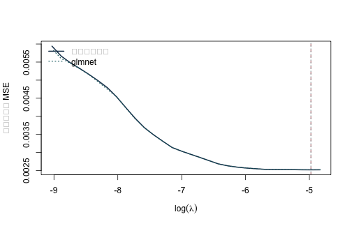
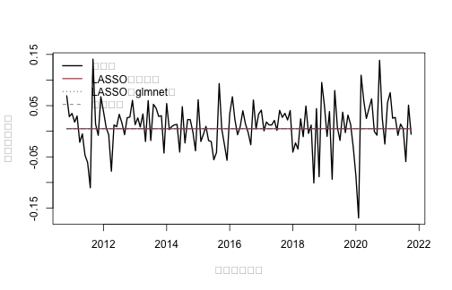
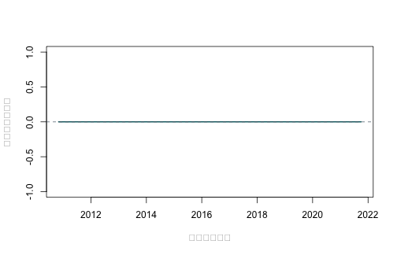

本附錄要問的是：面對 125 個因子、總體變數與交互作用，我們能否從當時可用的資訊中挑出一組變數，改善下一個月的製造業超額報酬預測？資料涵蓋 1967 年 1 月至 2021 年 11 月，共 659 個月份、10 個產業；每一列是一個「產業 × 月份」觀察。本頁先固定製造業，讓第 \(t\) 月的金融因子與第 \(t-1\) 月的總體變數預測第 \(t+1\) 月 `ret`。`ret`、Fama–French 與 global-q 因子都是月小數報酬，例如 0.01 代表 1%；總體變數則保留各自的比率、利差或對數尺度。

原課程的 `fffqmacro.R` 從 Kenneth French Data Library 取得 FF3 與十產業投資組合、從 global-q 取得 q5 因子、從 Welch–Goyal 工作簿取得總體預測變數，並以 FRED `CPIAUCNS` 輔助建檔；`ret` 是十產業總報酬減去當月 FF 無風險利率。快照沒有保留每一個總體欄的首次發布日與當時版本，因此 13 個總體欄一律再落後一個月。因子欄也只有月份標籤與事後整理的固定值；使用 \(F_t\) 等於假設第 \(t\) 月因子已經實現且可在形成預測時取得。

這套對齊方式降低了部分前視風險，仍無法還原歷史資料修訂、因子形成權重或逐月發布時點。以下結果因此是在明示可得性假設下的擬樣本外比較，尚不足以稱為即時可交易回測。Fama–French 建構法後來也由 CRSP FIZ 改為 CIZ；這項變更牽涉資料格式與月報酬累積方式，現在重新下載的序列未必等於這份 2021 年快照。被 LASSO 選入只代表對這項預測任務有用，沒有因果效果或風險價格的含義。

## 先準備套件與固定資料

- 手動版使用 R 內建函數與 `knitr`；套件版使用原課程採用的 `glmnet`。
- 執行時不安裝套件、不呼叫網路、不使用 `setwd()`。
- 固定資料：`data/processed/ff_qf_macro_industries_1967_2021.csv`。
- 資料建置與再散布注意事項：`data/DATA_SOURCES.md`。
- 本頁直接使用專案內保存的合併 CSV；若另由上游來源重建，必須記錄各供應者版本與轉換規則。


``` r
knitr::opts_chunk$set(
  echo = TRUE, message = FALSE, warning = FALSE,
  fig.width = 7, fig.height = 4.5
)
if (!requireNamespace("glmnet", quietly = TRUE)) {
  stop("本附錄的套件作法需要 glmnet；請先在合法可重現環境中安裝。")
}
```

讀檔後先依產業與月份排序，再核對面板大小。這一步確認每個產業都有同樣的 659 個月份，也讓稍後的落後值確實留在同一產業內。


``` r
locate_project_file <- function(relative_path) {
  candidates <- c(
    relative_path,
    file.path("..", relative_path),
    file.path("../..", relative_path)
  )
  hit <- candidates[file.exists(candidates)]
  if (length(hit) == 0L) stop("找不到專案檔案：", relative_path)
  normalizePath(hit[1], mustWork = TRUE)
}

path <- locate_project_file(
  "data/processed/ff_qf_macro_industries_1967_2021.csv"
)
d <- read.csv(path, stringsAsFactors = FALSE, check.names = FALSE)
d$month <- as.Date(d$month)
d <- d[order(d$industry, d$month), ]

stopifnot(nrow(d) == 6590L, ncol(d) == 24L)
table(d$industry)
```

```
## 
## Durbl Enrgy HiTec  Hlth Manuf NoDur Other Shops Telcm Utils 
##   659   659   659   659   659   659   659   659   659   659
```

``` r
range(d$month)
```

```
## [1] "1967-01-01" "2021-11-01"
```

``` r
data.frame(
  first_month = min(d$month),
  last_month = max(d$month),
  months = length(unique(d$month)),
  industries = length(unique(d$industry)),
  return_unit = "decimal per month"
)
```

```
##   first_month last_month months industries       return_unit
## 1  1967-01-01 2021-11-01    659         10 decimal per month
```

輸出應顯示 6,590 列、10 個產業與 659 個月份。報酬欄的單位是每月小數報酬；後面的 MSE 因此也是「月小數報酬平方」，不宜直接和百分比尺度的損失比較。

## 先確認月份鍵與共同預測變數

同一產業、同一月份只能有一列；每個產業也必須涵蓋相同月份。因子與總體變數是全市場共同資訊，所以在同一月份的十個產業列上應完全相同。若這些條件不成立，可能是鍵結重複、月份漏列或變數在合併時錯位。


``` r
key <- paste(d$industry, d$month)
stopifnot(!anyDuplicated(key))

months_by_industry <- tapply(d$month, d$industry, length)
stopifnot(length(unique(months_by_industry)) == 1L)

common_predictors <- grep("^(factor_|macro_)", names(d), value = TRUE)
stopifnot(length(common_predictors) == 21L)

# 同一月份的共同預測變數應在十個產業完全相同；否則表示合併鍵有問題。
check_common <- aggregate(
  d[, common_predictors],
  by = list(month = d$month),
  FUN = function(x) max(x) - min(x)
)
stopifnot(max(as.matrix(check_common[, -1]), na.rm = TRUE) < 1e-12)
```

## 建立 \(X_t\rightarrow Y_{t+1}\) 的預測字典

本示範先固定 `Manuf`。目標是下一個月的製造業超額報酬，資訊集包含固定快照中的當月因子、再落後一個月的總體變數，以及兩者交互作用。若改成其他產業，仍要沿用相同測試起點、驗證折與調校規則，才可公平比較產業間結果。


``` r
industry_name <- "Manuf"
one <- d[d$industry == industry_name, ]
one <- one[order(one$month), ]

factor_names <- grep("^factor_", names(one), value = TRUE)
macro_names <- grep("^macro_", names(one), value = TRUE)

# 金融因子使用固定快照中標示為 t 月的值；這是本頁明示的可得性假設。
# 總體欄缺少首次發布日與歷史版本，所以統一再落後一個月，
# 避免把同月稍晚才公布的數值放進較早形成的預測。
X_factor <- as.matrix(one[, factor_names, drop = FALSE])
X_macro_lag1 <- rbind(
  rep(NA_real_, length(macro_names)),
  as.matrix(one[-nrow(one), macro_names, drop = FALSE])
)
colnames(X_macro_lag1) <- macro_names
X_main <- cbind(X_factor, X_macro_lag1)
storage.mode(X_main) <- "double"

interaction_list <- vector("list", length(factor_names) * length(macro_names))
interaction_names <- character(length(interaction_list))
k <- 1L
for (f in seq_along(factor_names)) {
  for (m in seq_along(macro_names)) {
    interaction_list[[k]] <- X_main[, factor_names[f]] * X_main[, macro_names[m]]
    interaction_names[k] <- paste(factor_names[f], macro_names[m], sep = ":")
    k <- k + 1L
  }
}
X_int <- do.call(cbind, interaction_list)
colnames(X_int) <- interaction_names
X <- cbind(X_main, X_int)

# 在指定可得性假設下，以第 t 月因子與 t-1 月總體欄預測 t+1 月報酬。
# 第一列沒有落後總體欄，最後一列沒有次月目標，因此兩列不進入估計。
y <- c(one$ret[-1], NA_real_)
keep <- complete.cases(X, y)
X <- X[keep, , drop = FALSE]
y <- y[keep]
dates <- one$month[keep]

stopifnot(ncol(X) == 125L)
c(observations = nrow(X), dictionary_columns = ncol(X))
```

```
##       observations dictionary_columns 
##                657                125
```

``` r
head(data.frame(
  factor_month = dates,
  macro_information_month = one$month[match(dates, one$month) - 1L],
  target_next = y
), 3)
```

```
##   factor_month macro_information_month target_next
## 1   1967-02-01              1967-01-01      0.0541
## 2   1967-03-01              1967-02-01      0.0342
## 3   1967-04-01              1967-03-01     -0.0405
```

最後得到 657 個可用預測起點與 125 欄字典：21 個主效果加上 \(8\times13=104\) 個交互作用。`head()` 同時列出因子月份、總體資訊月份與次月應變數，讓讀者直接核對三個時點是否符合研究問題。

## 手動作法：看懂 LASSO 如何更新係數

LASSO 的懲罰取決於變數尺度，所以每一個訓練視窗都要自行估計平均數與標準差，再把同一轉換套到緊接其後的驗證期。以下座標下降法逐欄更新係數；手動寫出來的目的，是看清楚軟門檻如何把小係數設為零，以及截距為何不受懲罰。


``` r
soft_threshold <- function(z, lambda) sign(z) * pmax(abs(z) - lambda, 0)

standardize_train <- function(X_train, X_new = NULL) {
  # 中心、尺度與近常數欄的判定都只使用當次訓練視窗。
  mu <- colMeans(X_train)
  s <- apply(X_train, 2, sd)
  keep <- is.finite(s) & s > 1e-10
  train <- sweep(sweep(X_train[, keep, drop = FALSE], 2, mu[keep]),
                 2, s[keep], "/")
  ans <- list(train = train, mean = mu[keep], sd = s[keep], keep = keep)
  if (!is.null(X_new)) {
    # 驗證期與測試期沿用訓練期轉換，避免未來分布洩漏。
    ans$new <- sweep(sweep(X_new[, keep, drop = FALSE], 2, mu[keep]),
                     2, s[keep], "/")
  }
  ans
}

lasso_cd <- function(X, y_centered, lambda, max_iter = 5000L, tol = 1e-7) {
  n <- nrow(X)
  p <- ncol(X)
  beta <- numeric(p)
  residual <- y_centered
  x2 <- colSums(X^2) / n
  for (iter in seq_len(max_iter)) {
    old <- beta
    for (j in seq_len(p)) {
      # 加回第 j 欄舊貢獻後，對部分殘差做一次軟門檻更新。
      residual <- residual + X[, j] * beta[j]
      z <- sum(X[, j] * residual) / n
      beta[j] <- soft_threshold(z, lambda) / x2[j]
      residual <- residual - X[, j] * beta[j]
    }
    if (max(abs(beta - old)) < tol) break
  }
  attr(beta, "iterations") <- iter
  beta
}

fit_predict_lasso <- function(X_train, y_train, X_new, lambda) {
  pp <- standardize_train(X_train, X_new)
  y_bar <- mean(y_train)
  beta <- lasso_cd(pp$train, y_train - y_bar, lambda)
  list(
    pred = as.numeric(y_bar + pp$new %*% beta),
    beta = beta,
    names = colnames(pp$train),
    prep = pp,
    intercept = y_bar
  )
}
```

## 先保留測試期，再用擴展視窗調校

最後 20% 的月份只用於一次最終評量。前 80% 內建立五個擴展視窗折：每折都用較早月份訓練，再以緊接其後的 24 個月驗證。這裡選的是對未來月份預測誤差較小的 \(\lambda\)，而不是讓訓練配適最好看的 \(\lambda\)。


``` r
n <- length(y)
# 測試期在 best_lambda 決定前不參與任何前處理或模型選擇。
test_start <- floor(0.80 * n) + 1L
tv <- seq_len(test_start - 1L)
test <- test_start:n

validation_size <- 24L
train_ends <- unique(as.integer(seq(
  floor(0.50 * length(tv)),
  length(tv) - validation_size,
  length.out = 5
)))
folds <- lapply(train_ends, function(e) {
  list(train = seq_len(e), validation = (e + 1L):(e + validation_size))
})

data.frame(
  train_end = dates[vapply(folds, function(z) max(z$train), integer(1))],
  validation_start = dates[vapply(folds, function(z) min(z$validation), integer(1))],
  validation_end = dates[vapply(folds, function(z) max(z$validation), integer(1))]
)
```

```
##    train_end validation_start validation_end
## 1 1988-11-01       1988-12-01     1990-11-01
## 2 1993-10-01       1993-11-01     1995-10-01
## 3 1998-10-01       1998-11-01     2000-10-01
## 4 2003-10-01       2003-11-01     2005-10-01
## 5 2008-10-01       2008-11-01     2010-10-01
```


``` r
pp0 <- standardize_train(X[folds[[1]]$train, , drop = FALSE])
y0 <- y[folds[[1]]$train]
lambda_max <- max(abs(crossprod(pp0$train, y0 - mean(y0)))) / length(y0)
lambda_grid <- exp(seq(log(lambda_max), log(lambda_max * 0.015), length.out = 30))

fold_loss <- matrix(NA_real_, nrow = length(folds), ncol = length(lambda_grid))
for (v in seq_along(folds)) {
  tr <- folds[[v]]$train
  va <- folds[[v]]$validation
  for (j in seq_along(lambda_grid)) {
    fit <- fit_predict_lasso(
      X[tr, , drop = FALSE], y[tr],
      X[va, , drop = FALSE], lambda_grid[j]
    )
    fold_loss[v, j] <- mean((y[va] - fit$pred)^2)
  }
}

mean_loss <- colMeans(fold_loss)
best_lambda <- lambda_grid[which.min(mean_loss)]
data.frame(best_lambda = best_lambda, validation_mse = min(mean_loss))
```

```
##   best_lambda validation_mse
## 1 0.006898709    0.002519735
```

驗證結果選出約 0.0069 的 \(\lambda\)，平均驗證 MSE 約為 0.00252。這個數字只用來在同一組驗證月份中比較候選懲罰，真正的預測表現仍要留到測試期判斷。

## 套件作法：用 `glmnet()` 完成 LASSO 路徑估計

原課程 `slides/L11_Factor selection_via_ML/fffqmacro.R` 第 381–397 行直接以
`glmnet()` 估 LASSO／Ridge 路徑，第 428–497 行再以時間序列折調校；精簡版
`lasso_ff_fq_macro.R` 第 85–116 行則示範以統一工作流程呼叫同一個 `glmnet`
引擎。本節沿用這套原課程工作流程，保留上面完全相同的擴展視窗
`folds`、`lambda_grid`、預測期距與最終測試期，並讓套件版套用和手動版相同的訓練期中心與尺度。`glmnet::glmnet()` 代做係數路徑與數值最佳化；分析者仍要決定應變數時點、折的時間順序、\(\lambda\) 網格、測試期與評量指標。本頁自行傳入時間折，不採 `cv.glmnet()` 的隨機 K 折，避免較晚月份進入較早月份的訓練資料。和 R13 相同，這裡傳入 `family = stats::gaussian()`，避免內部重新縮放應變數，使套件版與手動版的 \(\lambda\) 使用同一尺度。


``` r
glmnet_fold_loss <- matrix(
  NA_real_, nrow = length(folds), ncol = length(lambda_grid)
)
for (v in seq_along(folds)) {
  tr <- folds[[v]]$train
  va <- folds[[v]]$validation
  pp_glmnet <- standardize_train(
    X[tr, , drop = FALSE], X[va, , drop = FALSE]
  )
  y_bar_glmnet <- mean(y[tr])
  glmnet_fold_fit <- glmnet::glmnet(
    x = pp_glmnet$train,
    y = y[tr] - y_bar_glmnet,
    family = stats::gaussian(),
    alpha = 1,
    lambda = lambda_grid,
    standardize = FALSE,
    intercept = FALSE,
    thresh = 1e-10,
    maxit = 1000000L
  )
  stopifnot(
    glmnet_fold_fit$jerr == 0L,
    length(glmnet_fold_fit$lambda) == length(lambda_grid)
  )
  glmnet_fold_prediction <- y_bar_glmnet + predict(
    glmnet_fold_fit,
    newx = pp_glmnet$new,
    s = lambda_grid
  )
  glmnet_fold_loss[v, ] <- colMeans(
    (matrix(y[va], nrow = length(va), ncol = length(lambda_grid)) -
       glmnet_fold_prediction)^2
  )
}

glmnet_mean_loss <- colMeans(glmnet_fold_loss)
glmnet_best_lambda <- lambda_grid[which.min(glmnet_mean_loss)]

data.frame(
  作法 = c("手動座標下降", "glmnet 套件"),
  最佳lambda = c(best_lambda, glmnet_best_lambda),
  驗證期MSE = c(min(mean_loss), min(glmnet_mean_loss)),
  使用相同時間折 = TRUE,
  check.names = FALSE
)
```

```
##           作法  最佳lambda   驗證期MSE 使用相同時間折
## 1 手動座標下降 0.006898709 0.002519735           TRUE
## 2  glmnet 套件 0.006898709 0.002519735           TRUE
```

兩個版本現在使用相同目標函數、時間折、訓練期標準化與 \(\lambda\) 尺度；剩下的差異主要來自停止準則與路徑計算方式，因此數值結果應非常接近，但不要求逐位完全相同。兩版係數都位於相同的標準化尺度，還可以進一步核對預測與非零集合。


``` r
plot(log(lambda_grid), mean_loss, type = "l", lwd = 2,
     xlab = expression(log(lambda)), ylab = "平均驗證期 MSE",
     col = "#173B57")
lines(log(lambda_grid), glmnet_mean_loss, lwd = 1.5,
      lty = 3, col = "#1D6D73")
abline(v = log(best_lambda), lty = 2, col = "#A34045")
abline(v = log(glmnet_best_lambda), lty = 3, col = "#1D6D73")
legend(
  "topleft", c("手動座標下降", "glmnet"),
  col = c("#173B57", "#1D6D73"), lty = c(1, 3),
  lwd = c(2, 1.5), bty = "n"
)
```



## 對保留的測試期做最後評量

調校完成後，手動版與 `glmnet` 版各自在「訓練期加驗證期」重新估計一次，再預測最後 20% 月份。歷史平均基準同樣固定在測試起點以前；如此比較的差異來自模型，而不是資訊更新規則不同。


``` r
final <- fit_predict_lasso(
  X[tv, , drop = FALSE], y[tv],
  X[test, , drop = FALSE], best_lambda
)

pp_glmnet_final <- standardize_train(
  X[tv, , drop = FALSE], X[test, , drop = FALSE]
)
y_bar_glmnet_final <- mean(y[tv])
glmnet_final_fit <- glmnet::glmnet(
  x = pp_glmnet_final$train,
  y = y[tv] - y_bar_glmnet_final,
  family = stats::gaussian(),
  alpha = 1,
  lambda = lambda_grid,
  standardize = FALSE,
  intercept = FALSE,
  thresh = 1e-10,
  maxit = 1000000L
)
stopifnot(
  glmnet_final_fit$jerr == 0L,
  length(glmnet_final_fit$lambda) == length(lambda_grid)
)
glmnet_prediction <- as.numeric(y_bar_glmnet_final + predict(
  glmnet_final_fit,
  newx = pp_glmnet_final$new,
  s = glmnet_best_lambda
))

# 固定在「手算版選到的同一 lambda」再比一次，隔離調校差異與估計器差異。
glmnet_prediction_at_manual_lambda <- as.numeric(y_bar_glmnet_final + predict(
  glmnet_final_fit,
  newx = pp_glmnet_final$new,
  s = best_lambda
))

# 固定在共同預測起點可實現的歷史平均基準。
baseline <- rep(mean(y[tv]), length(test))
actual <- y[test]

score <- function(actual, forecast, baseline) {
  mse <- mean((actual - forecast)^2)
  c(
    MSE = mse,
    MAE = mean(abs(actual - forecast)),
    OOS_R2 = 1 - mse / mean((actual - baseline)^2)
  )
}

rbind(
  HistoricalMean = score(actual, baseline, baseline),
  LASSO_manual = score(actual, final$pred, baseline),
  LASSO_glmnet = score(actual, glmnet_prediction, baseline)
)
```

```
##                        MSE        MAE OOS_R2
## HistoricalMean 0.002112716 0.03413743      0
## LASSO_manual   0.002112716 0.03413743      0
## LASSO_glmnet   0.002112716 0.03413743      0
```


``` r
glmnet_coef <- as.matrix(stats::coef(
  glmnet_final_fit, s = glmnet_best_lambda
))[, 1]
glmnet_selected <- setdiff(
  names(glmnet_coef)[abs(glmnet_coef) > 1e-8], "(Intercept)"
)
manual_selected <- final$names[abs(final$beta) > 1e-8]
selected_union <- union(manual_selected, glmnet_selected)
selected_overlap <- if (length(selected_union) == 0L) {
  NA_real_
} else {
  length(intersect(manual_selected, glmnet_selected)) / length(selected_union)
}

data.frame(
  比較項目 = c(
    "各自選擇 lambda 後的測試期預測",
    "固定使用手動版 lambda 的測試期預測",
    "入選變數重疊比例"
  ),
  數值 = c(
    max(abs(final$pred - glmnet_prediction)),
    max(abs(final$pred - glmnet_prediction_at_manual_lambda)),
    selected_overlap
  ),
  解讀 = c(
    "同時包含調校結果與數值實作的差異",
    "固定 lambda，只比較兩種數值實作",
    "Jaccard 比例；兩邊都沒有非零斜率時不定義"
  ),
  check.names = FALSE
)
```

```
##                             比較項目 數值
## 1     各自選擇 lambda 後的測試期預測    0
## 2 固定使用手動版 lambda 的測試期預測    0
## 3                   入選變數重疊比例   NA
##                                       解讀
## 1         同時包含調校結果與數值實作的差異
## 2          固定 lambda，只比較兩種數值實作
## 3 Jaccard 比例；兩邊都沒有非零斜率時不定義
```

``` r
data.frame(
  作法 = c("手動座標下降", "glmnet"),
  非零斜率數 = c(length(manual_selected), length(glmnet_selected)),
  最佳lambda = c(best_lambda, glmnet_best_lambda),
  check.names = FALSE
)
```

```
##           作法 非零斜率數  最佳lambda
## 1 手動座標下降          0 0.006898709
## 2       glmnet          0 0.006898709
```

歷史平均相對自己的 `OOS_R2` 分母與分子相同，故為 0。保守地將總體欄再落後一個月後，兩個 LASSO 版本在最終訓練樣本都沒有留下非零斜率，因而與截距專屬的歷史平均預測一致；`glmnet` 的
\(-2.22\times10^{-16}\) `OOS_R2` 只是浮點數誤差，在報告精度下為 0。資料在這個時點對齊與驗證設計下支持簡單基準；看見結果後若再移動測試起點或重選字典，便需要另一段未見月份重新評量。


``` r
plot(dates[test], actual, type = "l", lwd = 1.8, col = "black",
     xlab = "預測起點月份", ylab = "次月超額報酬")
lines(dates[test], final$pred, col = "#A34045", lwd = 1.5)
lines(dates[test], glmnet_prediction, col = "#1D6D73", lwd = 1.3, lty = 3)
lines(dates[test], baseline, col = "#62717E", lty = 2)
legend("topleft", c("實現值", "LASSO（手動）", "LASSO（glmnet）",
                     "歷史平均"),
       col = c("black", "#A34045", "#1D6D73", "#62717E"),
       lty = c(1, 1, 3, 2), lwd = c(1.8, 1.5, 1.3, 1), bty = "n")
```



## 非零係數與跨折選取頻率

最終係數回答「合併訓練期與驗證期後，哪些欄被留下」；跨折頻率則回答「同一欄在不同歷史訓練終點是否反覆被留下」。兩者合看，才能分辨穩定訊號與對特定樣本切分敏感的選擇。


``` r
selected_final <- data.frame(
  predictor = final$names,
  coefficient = final$beta
)
selected_final <- selected_final[abs(selected_final$coefficient) > 1e-8, ]
selected_final <- selected_final[order(abs(selected_final$coefficient), decreasing = TRUE), ]
head(selected_final, 20)
```

```
## [1] predictor   coefficient
## <0 rows> (or 0-length row.names)
```

``` r
selection <- matrix(0L, nrow = length(folds), ncol = ncol(X),
                    dimnames = list(NULL, colnames(X)))
for (v in seq_along(folds)) {
  tr <- folds[[v]]$train
  # 每一折重新標準化並估計，選取頻率才不會偷用較晚月份的尺度。
  pp <- standardize_train(X[tr, , drop = FALSE])
  b <- lasso_cd(pp$train, y[tr] - mean(y[tr]), best_lambda)
  selection[v, pp$keep] <- as.integer(abs(b) > 1e-8)
}
frequency <- sort(colMeans(selection), decreasing = TRUE)
head(data.frame(predictor = names(frequency), selection_frequency = frequency), 20)
```

```
##                                       predictor selection_frequency
## factor_ff_rf:macro_svar factor_ff_rf:macro_svar                 0.4
## macro_dfy                             macro_dfy                 0.2
## factor_ff_rf:macro_ntis factor_ff_rf:macro_ntis                 0.2
## factor_q_ia:macro_dp       factor_q_ia:macro_dp                 0.2
## factor_q_ia:macro_ep       factor_q_ia:macro_ep                 0.2
## factor_q_roe:macro_infl factor_q_roe:macro_infl                 0.2
## factor_ff_rf                       factor_ff_rf                 0.0
## factor_ff_mkt_excess       factor_ff_mkt_excess                 0.0
## factor_ff_smb                     factor_ff_smb                 0.0
## factor_ff_hml                     factor_ff_hml                 0.0
## factor_q_me                         factor_q_me                 0.0
## factor_q_ia                         factor_q_ia                 0.0
## factor_q_roe                       factor_q_roe                 0.0
## factor_q_eg                         factor_q_eg                 0.0
## macro_dp                               macro_dp                 0.0
## macro_dy                               macro_dy                 0.0
## macro_ep                               macro_ep                 0.0
## macro_de                               macro_de                 0.0
## macro_svar                           macro_svar                 0.0
## macro_bm                               macro_bm                 0.0
```

選取頻率是這組歷史折、字典與固定 `best_lambda` 下的描述，不是 \(p\) 值或「被定價機率」。本次最高選取頻率只有 0.4，而且最終完整訓練樣本沒有任何非零斜率；這比「挑出一張因子名單」更支持簡單基準。高度相關的預測變數仍可能互相替代，所以不可把單一欄的低頻率反向解讀為經濟上完全無關。

## 模型在哪些月份贏過基準？

平均 MSE 會把整段測試期壓成一個數字。累積損失差保留時間順序：曲線下降表示 LASSO 在該段累積少犯錯，上升則表示歷史平均較好。若勝負只集中在少數月份，模型的實務穩定性就值得再檢查。


``` r
loss_difference <- (actual - final$pred)^2 - (actual - baseline)^2
plot(dates[test], cumsum(loss_difference), type = "l", lwd = 2,
     col = "#1D6D73", xlab = "預測起點月份",
     ylab = "累積平方損失差")
abline(h = 0, lty = 2, col = "#62717E")
```



## 若要把分析擴大到十個產業

十個產業可以各自用驗證折選擇 \(\lambda\)，但預測期距、測試月份、字典、折法與候選網格應事先固定。最後要把所有產業一起報告，包括樣本外表現為負的產業；只挑成功案例會誇大方法的穩定性。

這份固定 CSV 適合重跑書中的同一個比較。若改由上游來源重新建檔，還要保存建置說明、下載日期與 Fama–French 版本，並重新檢查資料可得時點。即時下載所得序列不應在未核對前視為同一份歷史快照。


``` r
sessionInfo()
```

```
## R version 4.5.2 (2025-10-31)
## Platform: aarch64-apple-darwin20
## Running under: macOS Tahoe 26.5.1
## 
## Matrix products: default
## BLAS:   /System/Library/Frameworks/Accelerate.framework/Versions/A/Frameworks/vecLib.framework/Versions/A/libBLAS.dylib 
## LAPACK: /Library/Frameworks/R.framework/Versions/4.5-arm64/Resources/lib/libRlapack.dylib;  LAPACK version 3.12.1
## 
## locale:
## [1] C.UTF-8/C.UTF-8/C.UTF-8/C/C.UTF-8/C.UTF-8
## 
## time zone: Asia/Tokyo
## tzcode source: internal
## 
## attached base packages:
## [1] stats     graphics  grDevices utils     datasets  methods   base     
## 
## loaded via a namespace (and not attached):
##  [1] codetools_0.2-20 shape_1.4.6.1    xfun_0.57        Matrix_1.7-4    
##  [5] lattice_0.22-7   splines_4.5.2    iterators_1.0.14 knitr_1.51      
##  [9] cli_3.6.5        foreach_1.5.2    grid_4.5.2       compiler_4.5.2  
## [13] tools_4.5.2      evaluate_1.0.5   Rcpp_1.1.0       survival_3.8-3  
## [17] otel_0.2.0       rlang_1.1.7      glmnet_4.1-10
```
