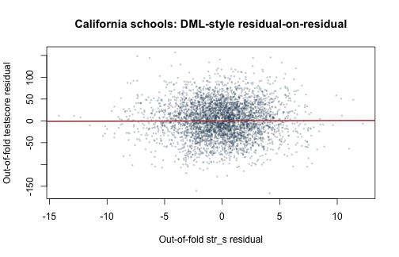
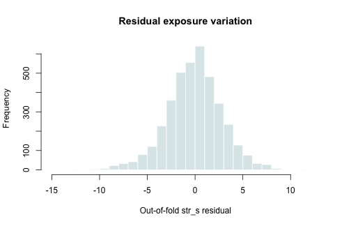
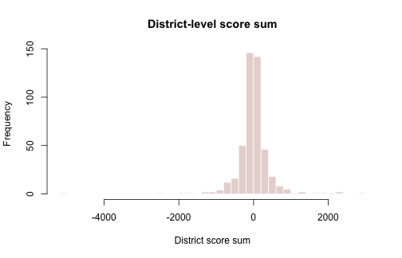

本附錄對應選讀第 20 章，改用真實的 California school-level 橫斷面資料。應變數是五年級英文／語文與數學分數合計 `testscore`，單位為**測驗分數點**；焦點解釋變數 `str_s` 是學校的**每位全職當量教師所對應學生數**。我們用 93 個學校、學區與郵遞區號背景變數示範 double selection 與交叉配適的 DML-style partialling。

所有主要結果都是真實資料的**條件關聯**，不是因果效果。要把係數解讀為班級規模或師生比的因果效果，至少還要有可信的處置時點、無未觀察混淆、適當且非處置後的控制集合、重疊、穩定單位處置值，以及對學區內相依的有效推論；本資料與本附錄沒有驗證這些條件。


``` r
knitr::opts_chunk$set(
  echo = TRUE, message = FALSE, warning = FALSE,
  fig.width = 7, fig.height = 4.5
)
stopifnot(getRversion() >= "4.3.0")
if (!requireNamespace("glmnet", quietly = TRUE)) {
  stop("本附錄需要 glmnet；請先在合法可重現環境中安裝。")
}
set.seed(1515)
```

## 1. 資料、樣本與識別界線

資料來源是原課程的 Stock and Watson《Introduction to Econometrics》第四版 California school test-score 資料與變數表。每列是一所學校，`schoolcode` 在檔內唯一；樣本有 3,932 所學校。凍結檔沒有可供本附錄核實的觀察年度欄位，因此不自行推定年份，也不把橫斷面差異寫成時間變化。

公開版隨附作者授權的 `california_schools.csv` processed 快照，因此本附錄可離線自含重跑。若另由教材來源重建，仍須保存教材版次、資料檔版本、下載日與變數表。


``` r
locate_project_file <- function(relative_path) {
  candidates <- c(
    relative_path,
    file.path("..", relative_path),
    file.path("../..", relative_path)
  )
  hit <- candidates[file.exists(candidates)]
  if (length(hit) == 0L) stop("找不到專案檔案：", relative_path)
  normalizePath(hit[1], mustWork = TRUE)
}

school_file <- locate_project_file("data/processed/california_schools.csv")
manifest_file <- locate_project_file("data/processed/manifest.csv")
school <- read.csv(school_file, stringsAsFactors = FALSE, check.names = FALSE)
manifest <- read.csv(manifest_file, stringsAsFactors = FALSE)

manifest_key <- "data/processed/california_schools.csv"
manifest_row <- manifest[manifest$file == manifest_key, , drop = FALSE]
actual_md5 <- unname(tools::md5sum(school_file))

stopifnot(
  nrow(school) == 3932L,
  ncol(school) == 110L,
  nrow(manifest_row) == 1L,
  identical(actual_md5, manifest_row$md5),
  !anyDuplicated(school$schoolcode),
  !anyNA(school[c("testscore", "str_s", "districtcode")])
)

data.frame(
  schools = nrow(school),
  districts = length(unique(school$districtcode)),
  unique_school_codes = length(unique(school$schoolcode)),
  outcome_unit = "test-score points",
  exposure_unit = "students per teacher FTE",
  observed_year = "not recorded in frozen file",
  md5 = actual_md5
)
```

```
##   schools districts unique_school_codes      outcome_unit
## 1    3932       464                3932 test-score points
##              exposure_unit               observed_year
## 1 students per teacher FTE not recorded in frozen file
##                                md5
## 1 28b3dff5db50448608925cad32feb18a
```

``` r
summary(school[c("testscore", "str_s")])
```

```
##    testscore         str_s      
##  Min.   :575.7   Min.   :10.66  
##  1st Qu.:706.5   1st Qu.:21.08  
##  Median :747.5   Median :23.81  
##  Mean   :752.1   Mean   :23.64  
##  3rd Qu.:792.4   3rd Qu.:26.25  
##  Max.   :983.1   Max.   :33.71
```

## 2. 建立高維背景控制字典

不把英文與數學分項分數放進控制，因為它們機械地組成 `testscore`；也排除姓名、代碼、郵遞區號、師生比本身、學區師生比，以及直接構成學校師生比的學生數與教師 FTE。剩餘數值欄涵蓋餐費資格、英語學習、族群組成、教師經驗、學區財務與郵遞區號人口背景。

這個字典仍可能含同步決定或處置後變數，所以它只是明示的**條件調整集合**，不是已證成的因果混淆集合。


``` r
excluded <- c(
  "countyname", "districtname", "schoolname",
  "countycode", "districtcode", "schoolcode", "charternumber", "zipcode",
  "elarts_score", "math_score", "testscore",
  "str_s", "str_d", "te_fte_s", "te_fte_d",
  "enrollment_star_s", "enrollment_s"
)

control_names <- setdiff(names(school), excluded)
control_names <- control_names[vapply(
  school[control_names], is.numeric, logical(1)
)]
X_raw <- as.matrix(school[, control_names, drop = FALSE])
storage.mode(X_raw) <- "double"

nonconstant <- apply(X_raw, 2, sd) > 1e-10
X_raw <- X_raw[, nonconstant, drop = FALSE]
control_names <- colnames(X_raw)

Y <- school$testscore
D <- school$str_s
cluster <- school$districtcode

stopifnot(
  !anyNA(X_raw), all(is.finite(X_raw)),
  ncol(X_raw) == 93L,
  length(Y) == nrow(X_raw)
)

# 保留控制變數的原始數值；glmnet 會在每一個實際訓練樣本內部重新標準化。
# 這樣外層保留學區的控制變數分布也不會進入 nuisance learner 的前處理。
X <- X_raw
data.frame(
  observations = nrow(X),
  controls = ncol(X),
  outcome = "testscore",
  focal_exposure = "str_s",
  clustering_level = "districtcode"
)
```

```
##   observations controls   outcome focal_exposure clustering_level
## 1         3932       93 testscore          str_s     districtcode
```

## 3. 群組折與 LASSO learner

內外層折都把同一學區的學校放在同一折，避免同一學區同時進入訓練與保留資料。`lambda.1se` 用於較簡約的 double selection；DML-style nuisance fitting 使用 `lambda.min`，而每個外層訓練樣本都重新內層調校。


``` r
make_group_folds <- function(group, K, seed) {
  set.seed(seed)
  groups <- sample(unique(group))
  mapping <- setNames(rep(seq_len(K), length.out = length(groups)), groups)
  unname(mapping[as.character(group)])
}

fit_lasso_cv <- function(X, y, fold_id, s = "lambda.1se") {
  cv <- glmnet::cv.glmnet(
    x = X, y = y,
    alpha = 1, standardize = TRUE, intercept = TRUE,
    foldid = fold_id
  )
  beta <- as.matrix(stats::coef(cv, s = s))[-1, 1]
  names(beta) <- colnames(X)
  list(
    fit = cv,
    beta = beta,
    selected = which(abs(beta) > 1e-10),
    lambda = if (s == "lambda.min") cv$lambda.min else cv$lambda.1se
  )
}
```

## 4. Double selection 的真實條件關聯

先分別用 LASSO 選擇與 `testscore`、`str_s` 有關的控制，再取聯集重估 `testscore` 對 `str_s` 與所選控制的線性投影。標準誤按學區叢聚；這是相依調整，不會創造因果識別。


``` r
selection_fold <- make_group_folds(cluster, K = 10L, seed = 1515)
fit_y <- fit_lasso_cv(X, Y, selection_fold, s = "lambda.1se")
fit_d <- fit_lasso_cv(X, D, selection_fold, s = "lambda.1se")
selected_union <- sort(unique(c(fit_y$selected, fit_d$selected)))

data.frame(
  path = c("Y on X", "D on X", "union"),
  selected_controls = c(
    length(fit_y$selected),
    length(fit_d$selected),
    length(selected_union)
  ),
  lambda = c(fit_y$lambda, fit_d$lambda, NA_real_)
)
```

```
##     path selected_controls    lambda
## 1 Y on X                19 2.3108544
## 2 D on X                15 0.1443038
## 3  union                28        NA
```


``` r
fit_conditional_projection <- function(selected, Y, D, X, cluster) {
  X_selected <- X[, selected, drop = FALSE]
  if (length(selected) > 0L) {
    # 後選擇 OLS 使用全樣本估計；在這裡標準化只改善數值條件，
    # 不改變焦點變數 str_s 的原始單位。
    X_selected <- scale(X_selected)
  }
  Z <- cbind(Intercept = 1, str_s = D, X_selected)

  # 移除可能的精確／近精確線性相依欄；焦點 D 固定保留。
  qrz <- qr(Z, tol = 1e-5, LAPACK = FALSE)
  keep <- sort(qrz$pivot[seq_len(qrz$rank)])
  if (!("str_s" %in% colnames(Z)[keep])) stop("焦點變數在降秩時被移除。")
  Z_use <- Z[, keep, drop = FALSE]

  fit <- lm.fit(Z_use, Y)
  residual <- fit$residuals
  cluster_score <- rowsum(Z_use * residual, cluster, reorder = FALSE)
  bread <- solve(crossprod(Z_use))
  G <- nrow(cluster_score)
  n <- nrow(Z_use)
  k <- ncol(Z_use)
  correction <- (G / (G - 1)) * ((n - 1) / (n - k))
  V_cluster <- correction * bread %*%
    crossprod(cluster_score) %*% bread

  j <- match("str_s", colnames(Z_use))
  c(
    estimate = fit$coefficients[j],
    district_cluster_se = sqrt(V_cluster[j, j]),
    selected_controls = length(selected),
    regression_rank = ncol(Z_use)
  )
}

naive_projection <- fit_conditional_projection(
  integer(0), Y, D, X, cluster
)
double_selection <- fit_conditional_projection(
  selected_union, Y, D, X, cluster
)

rbind(
  unadjusted_linear_projection = naive_projection,
  double_selection_projection = double_selection
)
```

```
##                              estimate.str_s district_cluster_se
## unadjusted_linear_projection       1.904961           0.5591443
## double_selection_projection        0.254675           0.2783569
##                              selected_controls regression_rank
## unadjusted_linear_projection                 0               2
## double_selection_projection                 28              30
```

未調整與調整後係數不同，顯示背景組成很重要；但無論正負或顯著與否，都只能解讀為指定控制字典下的線性條件關聯。

## 5. 學區群組交叉配適的 DML-style partialling

令 \(\ell(X)=E[Y\mid X]\)、\(m(X)=E[D\mid X]\)。每個外層保留學區只接受其他學區訓練出的預測，然後以

\[
\widehat\theta=
\frac{\sum_i \widehat v_i\widehat u_i}
{\sum_i \widehat v_i^2},\qquad
\widehat u_i=Y_i-\widehat\ell(X_i),\quad
\widehat v_i=D_i-\widehat m(X_i)
\]

估計 partialling-out 係數。


``` r
K <- 5L
outer_fold <- make_group_folds(cluster, K = K, seed = 5151)
u_hat <- v_hat <- rep(NA_real_, nrow(X))
nuisance_summary <- vector("list", K)

for (k in seq_len(K)) {
  test_k <- which(outer_fold == k)
  train_k <- which(outer_fold != k)
  inner_fold <- make_group_folds(
    cluster[train_k], K = 5L, seed = 6000L + k
  )

  learner_y <- fit_lasso_cv(
    X[train_k, , drop = FALSE], Y[train_k],
    inner_fold, s = "lambda.min"
  )
  learner_d <- fit_lasso_cv(
    X[train_k, , drop = FALSE], D[train_k],
    inner_fold, s = "lambda.min"
  )

  pred_y <- as.numeric(predict(
    learner_y$fit, newx = X[test_k, , drop = FALSE], s = "lambda.min"
  ))
  pred_d <- as.numeric(predict(
    learner_d$fit, newx = X[test_k, , drop = FALSE], s = "lambda.min"
  ))
  u_hat[test_k] <- Y[test_k] - pred_y
  v_hat[test_k] <- D[test_k] - pred_d

  nuisance_summary[[k]] <- data.frame(
    fold = k,
    schools = length(test_k),
    districts = length(unique(cluster[test_k])),
    Y_MSE = mean(u_hat[test_k]^2),
    D_MSE = mean(v_hat[test_k]^2),
    Y_selected = length(learner_y$selected),
    D_selected = length(learner_d$selected)
  )
}

stopifnot(!anyNA(u_hat), !anyNA(v_hat))
nuisance_summary <- do.call(rbind, nuisance_summary)
nuisance_summary
```

```
##   fold schools districts    Y_MSE    D_MSE Y_selected D_selected
## 1    1     529        93 1627.029 9.602320         40         24
## 2    2     878        93 1607.171 8.585291         23         30
## 3    3     715        93 1561.740 8.316618         24         42
## 4    4    1074        93 1846.106 7.264534         25         33
## 5    5     736        92 1598.094 8.387645         19         39
```


``` r
theta_dml <- sum(v_hat * u_hat) / sum(v_hat^2)
orthogonal_score <- v_hat * (u_hat - theta_dml * v_hat)
J_hat <- mean(v_hat^2)

# 以學區 score 加總估計群組穩健不確定性。
clustered_score <- rowsum(orthogonal_score, cluster, reorder = FALSE)
G <- nrow(clustered_score)
se_cluster <- sqrt(
  (G / (G - 1)) * sum(clustered_score^2) /
    (length(Y)^2 * J_hat^2)
)

data.frame(
  estimator = "cross-fitted DML-style partialling",
  estimate_score_points_per_extra_student_per_FTE = theta_dml,
  district_cluster_se = se_cluster,
  residual_exposure_variance = var(v_hat),
  out_of_fold_Y_R2 = 1 - sum(u_hat^2) / sum((Y - mean(Y))^2),
  out_of_fold_D_R2 = 1 - sum(v_hat^2) / sum((D - mean(D))^2)
)
```

```
##                            estimator
## 1 cross-fitted DML-style partialling
##   estimate_score_points_per_extra_student_per_FTE district_cluster_se
## 1                                      0.07487483           0.3254664
##   residual_exposure_variance out_of_fold_Y_R2 out_of_fold_D_R2
## 1                   8.273584        0.5848237        0.3514682
```

`var(v_hat)` 是剩餘暴露變異的診斷：若它接近零，partialling 係數會缺乏可識別的剩餘比較。本例的正值只表示演算法仍有橫斷面變異，並不驗證條件重疊或因果可比性。


``` r
plot(
  v_hat, u_hat,
  pch = 16, cex = 0.45, col = grDevices::adjustcolor("#173B57", 0.25),
  xlab = "Out-of-fold str_s residual",
  ylab = "Out-of-fold testscore residual",
  main = "California schools: DML-style residual-on-residual"
)
abline(a = 0, b = theta_dml, col = "#A34045", lwd = 2)
```



## 6. 小型真值單元測試

下列合成資料只核對 Frisch--Waugh partialling 公式；不進入加州學校主結果。


``` r
set.seed(1516)
n_unit <- 5000L
X_unit <- matrix(rnorm(n_unit * 3L), ncol = 3L)
v_unit <- rnorm(n_unit)
eps_unit <- rnorm(n_unit)
D_unit <- 0.8 * X_unit[, 1] - 0.5 * X_unit[, 2] + v_unit
theta_true <- 0.6
Y_unit <- theta_true * D_unit +
  0.4 * X_unit[, 1] + 0.7 * X_unit[, 3] + eps_unit

u_unit <- residuals(lm(Y_unit ~ X_unit))
v_unit_hat <- residuals(lm(D_unit ~ X_unit))
theta_unit <- sum(v_unit_hat * u_unit) / sum(v_unit_hat^2)
stopifnot(abs(theta_unit - theta_true) < 0.05)
data.frame(truth = theta_true, partialling_estimate = theta_unit)
```

```
##   truth partialling_estimate
## 1   0.6            0.5957778
```

## 7. 診斷與不可省略的限制


``` r
hist(
  v_hat, breaks = 35, col = "#DDE8EA", border = "white",
  xlab = "Out-of-fold str_s residual",
  main = "Residual exposure variation"
)
hist(
  as.numeric(clustered_score), breaks = 35,
  col = "#E8D7D5", border = "white",
  xlab = "District score sum",
  main = "District-level score sum"
)
```



1. 本資料是學校橫斷面，沒有可核實的處置先後與觀察年度；不能由 cross-fitting 補出時間順序。
2. 93 個控制是教學字典，不是已證成的 back-door set；其中可能有共同結果、同步決定或處置後變數。
3. LASSO 選取與 DML-style residualization 降低高維函數估計偏誤，不會修復未觀察混淆、測量誤差或干擾。
4. 標準誤按學區叢聚，但這不涵蓋資料版本選擇、字典設計與調校規則的全部不確定性。
5. 因此主係數只能寫成「控制所列背景後，`str_s` 每增加一名學生／教師 FTE，`testscore` 平均相差若干點的估計條件關聯」。


``` r
sessionInfo()
```

```
## R version 4.5.2 (2025-10-31)
## Platform: aarch64-apple-darwin20
## Running under: macOS Tahoe 26.5.1
## 
## Matrix products: default
## BLAS:   /System/Library/Frameworks/Accelerate.framework/Versions/A/Frameworks/vecLib.framework/Versions/A/libBLAS.dylib 
## LAPACK: /Library/Frameworks/R.framework/Versions/4.5-arm64/Resources/lib/libRlapack.dylib;  LAPACK version 3.12.1
## 
## locale:
## [1] C.UTF-8/C.UTF-8/C.UTF-8/C/C.UTF-8/C.UTF-8
## 
## time zone: Asia/Tokyo
## tzcode source: internal
## 
## attached base packages:
## [1] stats     graphics  grDevices utils     datasets  methods   base     
## 
## other attached packages:
## [1] tibble_3.3.0 dplyr_1.2.1 
## 
## loaded via a namespace (and not attached):
##  [1] shape_1.4.6.1       gtable_0.3.6        xfun_0.57          
##  [4] ggplot2_4.0.3       collapse_2.1.7      lattice_0.22-7     
##  [7] quadprog_1.5-8      vctrs_0.7.2         tools_4.5.2        
## [10] Rdpack_2.6.6        generics_0.1.4      curl_7.0.0         
## [13] parallel_4.5.2      sandwich_3.1-1      xts_0.14.2         
## [16] pkgconfig_2.0.3     gbutils_0.5.1       Matrix_1.7-4       
## [19] tidyverse_2.0.0     RColorBrewer_1.1-3  S7_0.2.1           
## [22] lifecycle_1.0.5     compiler_4.5.2      farver_2.1.2       
## [25] MatrixModels_0.5-4  maxLik_1.5-2.2      textshaping_1.0.5  
## [28] codetools_0.2-20    SparseM_1.84-2      quantreg_6.1       
## [31] htmltools_0.5.9     glmnet_4.1-10       Formula_1.2-5      
## [34] pillar_1.11.1       MASS_7.3-65         plm_2.6-7          
## [37] iterators_1.0.14    foreach_1.5.2       nlme_3.1-168       
## [40] fracdiff_1.5-4      pls_2.9-0           fBasics_4052.98    
## [43] tidyselect_1.2.1    bdsmatrix_1.3-7     digest_0.6.39      
## [46] labeling_0.4.3      splines_4.5.2       tseries_0.10-62    
## [49] miscTools_0.6-30    fastmap_1.2.0       grid_4.5.2         
## [52] colorspace_2.1-2    cli_3.6.5           magrittr_2.0.4     
## [55] utf8_1.2.6          survival_3.8-3      withr_3.0.2        
## [58] scales_1.4.0        forecast_9.0.2      TTR_0.24.4         
## [61] rmarkdown_2.31      quantmod_0.4.29     otel_0.2.0         
## [64] timeDate_4052.112   ragg_1.5.2          zoo_1.8-15         
## [67] timeSeries_4052.112 fGarch_4052.93      urca_1.3-4         
## [70] evaluate_1.0.5      knitr_1.51          rbibutils_2.4.1    
## [73] lmtest_0.9-40       rlang_1.1.7         spatial_7.3-18     
## [76] Rcpp_1.1.0          glue_1.8.0          R6_2.6.1           
## [79] cvar_0.6            systemfonts_1.3.2
```
