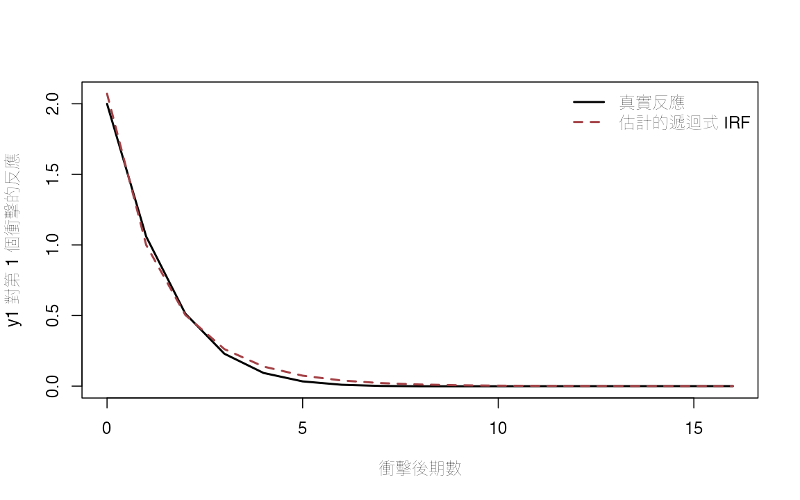
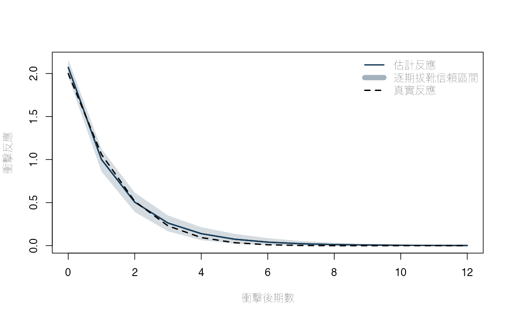
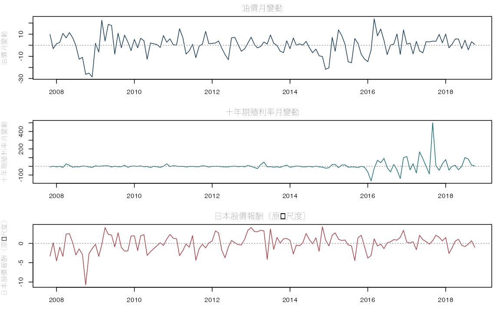
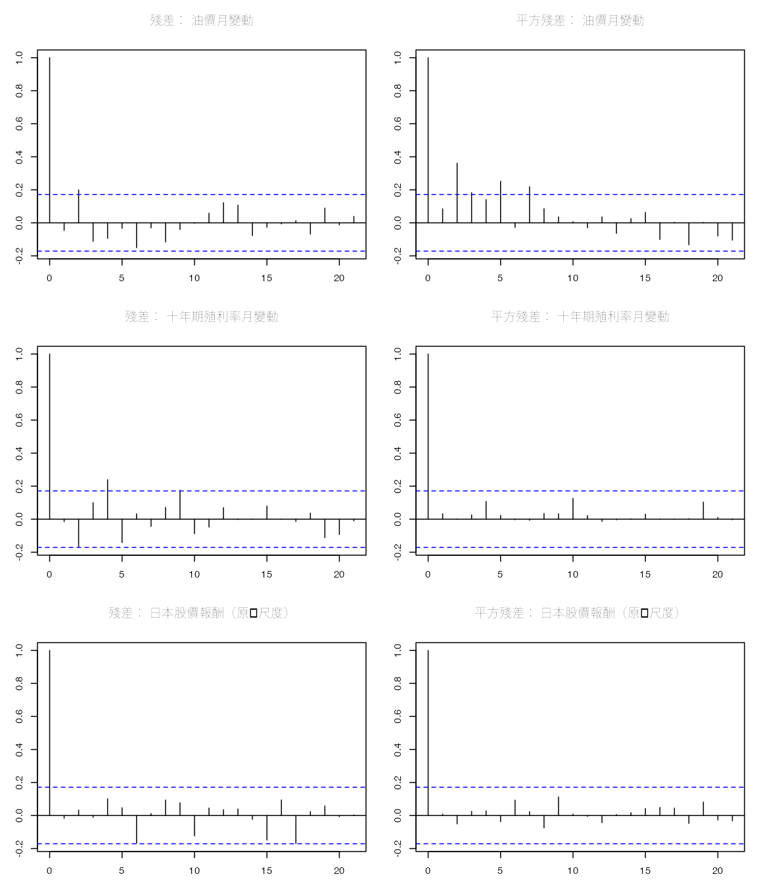
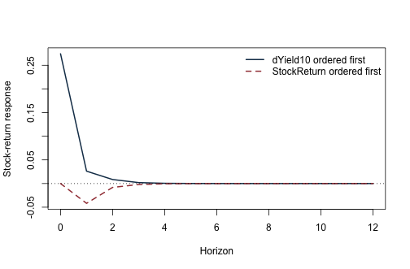

向量自我迴歸（vector autoregression, VAR）最適合回答的問題是：幾個金融變數彼此牽動時，一個「新的變動」會如何在往後數期傳遞？本附錄先用已知答案的 VAR(1) 模擬，確認係數、Cholesky 當期影響矩陣與衝擊反應函數（impulse response function, IRF）的程式方向；再回到日本月資料，觀察油價變動、十年期殖利率變動與股價報酬的動態關係。

日本資料的一列是一個月份，分析期為 2007 年 11 月至 2018 年 10 月，共 132 個完整月份。這不是預測競賽，因此沒有訓練、驗證與測試期；全樣本用來描述縮減式動態，另以落後階數、殘差檢查與 Cholesky 排序敏感度判斷結論能走多遠。沒有外部工具、制度限制或事件資訊時，圖上的「衝擊」只是以特定零限制正交化後的縮減式創新項，不能直接稱為外生油價衝擊或因果效果。

## 先確認執行環境與固定資料

- 模型計算使用 R 內建函數；`knitr` 負責轉檔，`ragg` 與 `systemfonts` 負責以 cwTeX 字型產生圖檔；執行時不連線下載。
- 固定實證資料：`data/processed/japan_monthly_2007_2018.csv`。
- 模擬固定種子；所有矩陣與 IRF 函數明列如下。


``` r
knitr::opts_chunk$set(
  echo = TRUE, message = FALSE, warning = FALSE,
  fig.width = 8, fig.height = 5,
  dev = "ragg_png", dpi = 144,
  dev.args = list(background = "white")
)
set.seed(20260716)

root_candidates <- c(".", "..")
is_root <- vapply(root_candidates, function(x) {
  file.exists(file.path(x, "main.tex"))
}, logical(1))
stopifnot(any(is_root))
project_root <- root_candidates[which(is_root)[1]]
project_path <- function(...) file.path(project_root, ...)

stopifnot(
  requireNamespace("ragg", quietly = TRUE),
  requireNamespace("systemfonts", quietly = TRUE)
)
cwtex_file <- project_path("assets", "fonts", "cwTeXQKai-Medium.ttf")
stopifnot(file.exists(cwtex_file))
if (!"cwTeX Online" %in% systemfonts::registry_fonts()$family) {
  systemfonts::register_font("cwTeX Online", cwtex_file)
}
plot_family <- "cwTeX Online"
```

## 從落後矩陣到衝擊反應：程式在做什麼？

下面四個函數依序完成 VAR 的核心工作。`lag_matrix()` 把每一期可用的落後值排成迴歸矩陣；`fit_var()` 逐方程估計相同解釋變數的縮減式系統；`companion_matrix()` 用來檢查動態根；`ma_coefficients()` 與 `recursive_irf()` 則把 VAR 係數轉成移動平均表示，再套入 Cholesky 當期影響矩陣。程式能完成矩陣運算，分析者仍須決定變數轉換、落後階數、當期排序與識別語言。


``` r
lag_matrix <- function(Y, p) {
  Tn <- nrow(Y)
  stopifnot(p >= 1L, Tn > p)
  X <- matrix(NA_real_, nrow = Tn - p, ncol = ncol(Y) * p)
  nm <- character(ncol(X))
  col <- 1L
  for (lag in seq_len(p)) {
    # 第 lag 個區塊把 Y_{t-lag} 對齊到共同的應變數日期 t。
    block <- Y[(p + 1L - lag):(Tn - lag), , drop = FALSE]
    cols <- col:(col + ncol(Y) - 1L)
    X[, cols] <- block
    nm[cols] <- paste0(colnames(Y), "_L", lag)
    col <- col + ncol(Y)
  }
  colnames(X) <- nm
  X
}

fit_var <- function(Y, p = 1L, include_const = TRUE) {
  Y <- as.matrix(Y)
  Xlag <- lag_matrix(Y, p)
  Ydep <- Y[(p + 1L):nrow(Y), , drop = FALSE]
  X <- if (include_const) cbind(Intercept = 1, Xlag) else Xlag
  coef <- qr.solve(X, Ydep)
  resid <- Ydep - X %*% coef
  n_eff <- nrow(resid)
  K <- ncol(Y)
  # 以共同殘差列估計縮減式創新項共變異數；分母採 ML 的 n_eff。
  sigma_ml <- crossprod(resid) / n_eff
  logdet <- as.numeric(determinant(sigma_ml, logarithm = TRUE)$modulus)
  n_parameters <- K * ncol(X)
  bic <- logdet + log(n_eff) * n_parameters / n_eff

  A <- vector("list", p)
  offset <- if (include_const) 1L else 0L
  for (lag in seq_len(p)) {
    rows <- offset + ((lag - 1L) * K + 1L):(lag * K)
    A[[lag]] <- t(coef[rows, , drop = FALSE])
  }
  list(
    coef = coef, A = A, residuals = resid,
    sigma = sigma_ml, bic = bic, p = p,
    intercept = if (include_const) coef[1, ] else rep(0, K),
    Y = Y
  )
}

companion_matrix <- function(A_list) {
  p <- length(A_list)
  K <- nrow(A_list[[1]])
  F <- matrix(0, K * p, K * p)
  # 第一列區塊放 VAR 係數，其餘單位矩陣只負責把狀態往後推一期。
  F[1:K, ] <- do.call(cbind, A_list)
  if (p > 1L) F[(K + 1):(K * p), 1:(K * (p - 1L))] <- diag(K * (p - 1L))
  F
}

ma_coefficients <- function(A_list, horizon) {
  p <- length(A_list)
  K <- nrow(A_list[[1]])
  Phi <- vector("list", horizon + 1L)
  Phi[[1]] <- diag(K)
  if (horizon >= 1L) {
    for (h in seq_len(horizon)) {
      value <- matrix(0, K, K)
      for (lag in seq_len(min(p, h))) {
        # 遞迴計算 Phi_h = A_1 Phi_{h-1} + ... + A_p Phi_{h-p}。
        value <- value + A_list[[lag]] %*% Phi[[h - lag + 1L]]
      }
      Phi[[h + 1L]] <- value
    }
  }
  Phi
}

recursive_irf <- function(fit, horizon = 12L) {
  # R 的 chol 回傳上三角 R，且 t(R) %*% R = Sigma。
  # 轉置後的 B 是下三角矩陣，等同假設排前面的變數可當期影響排後者。
  B <- t(chol(fit$sigma))
  Phi <- ma_coefficients(fit$A, horizon)
  Theta <- lapply(Phi, function(P) P %*% B)
  list(B = B, Phi = Phi, Theta = Theta)
}
```

## 先用已知答案的 VAR(1) 檢查程式

模擬的好處是我們知道資料如何生成。矩陣 `A_true` 決定變數如何把過去傳到現在，`B_true` 則決定兩個結構創新項在當期如何進入 `y1` 與 `y2`。`B_true` 是下三角矩陣，恰好符合稍後採用的遞迴排序；因此估計誤差之外，這一段沒有識別錯置。


``` r
A_true <- matrix(c(0.50, 0.10,
                   -0.20, 0.40), 2, 2, byrow = TRUE)
B_true <- matrix(c(2.0, 0.0,
                   0.6, 0.8), 2, 2, byrow = TRUE)
Sigma_true <- B_true %*% t(B_true)
eigen(A_true)$values
```

```
## [1] 0.45+0.1322876i 0.45-0.1322876i
```

``` r
Sigma_true
```

```
##      [,1] [,2]
## [1,]  4.0  1.2
## [2,]  1.2  1.0
```

``` r
burn <- 200L
Tn <- 700L
eps <- matrix(rnorm((Tn + burn) * 2), ncol = 2)
Y <- matrix(0, Tn + burn, 2)
for (t in 2:nrow(Y)) {
  # 每期先傳遞上一期狀態，再加入彼此獨立的結構創新項。
  Y[t, ] <- A_true %*% Y[t - 1, ] + B_true %*% eps[t, ]
}
Y <- Y[(burn + 1):(burn + Tn), ]
colnames(Y) <- c("y1", "y2")
```


``` r
fit_sim <- fit_var(Y, p = 1)
irf_sim <- recursive_irf(fit_sim, horizon = 16)

list(
  A_true = A_true,
  A_hat = fit_sim$A[[1]],
  Sigma_true = Sigma_true,
  Sigma_hat = fit_sim$sigma,
  B_true = B_true,
  B_hat = irf_sim$B,
  companion_modulus = Mod(eigen(companion_matrix(fit_sim$A))$values)
)
```

```
## $A_true
##      [,1] [,2]
## [1,]  0.5  0.1
## [2,] -0.2  0.4
## 
## $A_hat
##         y1_L1       y2_L1
## y1  0.4965446 -0.04780143
## y2 -0.1823818  0.35551865
## 
## $Sigma_true
##      [,1] [,2]
## [1,]  4.0  1.2
## [2,]  1.2  1.0
## 
## $Sigma_hat
##          y1       y2
## y1 4.290916 1.225577
## y2 1.225577 1.011608
## 
## $B_true
##      [,1] [,2]
## [1,]  2.0  0.0
## [2,]  0.6  0.8
## 
## $B_hat
##           y1        y2
## y1 2.0714525 0.0000000
## y2 0.5916509 0.8133617
## 
## $companion_modulus
## [1] 0.5430368 0.3090265
```

這份輸出要分兩層閱讀。`A_hat` 與 `Sigma_hat` 應接近其真值，表示縮減式估計方向正確；`B_hat` 接近 `B_true`，則額外依賴真實資料生成過程確實符合相同的下三角排序。`companion_modulus` 都小於 1，表示模擬系統的衝擊會隨時間消退。

R 內建功能沒有矩陣次方運算子；為避免隱藏套件依賴，以下用遞迴函數計算真實 IRF。


``` r
h <- 0:16
Phi_true <- ma_coefficients(list(A_true), max(h))
Theta_true <- lapply(Phi_true, function(P) P %*% B_true)

response <- function(theta_list, response_index, shock_index) {
  vapply(theta_list, function(M) M[response_index, shock_index], numeric(1))
}

plot(h, response(Theta_true, 1, 1), type = "l", lwd = 2,
     ylim = range(c(response(Theta_true, 1, 1),
                    response(irf_sim$Theta, 1, 1))),
     xlab = "衝擊後期數", ylab = "y1 對第 1 個衝擊的反應",
     col = "black")
lines(h, response(irf_sim$Theta, 1, 1), lwd = 2, lty = 2,
      col = "#A34045")
legend("topright", c("真實反應", "估計的遞迴式 IRF"),
       col = c("black", "#A34045"), lwd = 2, lty = c(1, 2), bty = "n")
```



實線是由已知參數算出的真實反應，虛線則只看模擬樣本後估得。兩者接近，說明 IRF 遞迴程式沒有把反應變數、衝擊變數或期距順序弄反；差距仍會因有限樣本而存在。

## 用殘差拔靴法估計逐期信賴區間

這個教學用的拔靴程序固定落後階數為 1，每次按「整個殘差向量」重抽，以保留同期跨方程共變動。每個期距分別取 2.5% 與 97.5% 分位數，所以得到的是逐期信賴區間，不是整條曲線同時成立的信賴帶。它也假設殘差可直接重抽，沒有處理條件異質變異。


``` r
bootstrap_var_irf <- function(fit, horizon = 12L, B_rep = 299L,
                              seed = 20260716) {
  set.seed(seed)
  Y <- fit$Y
  Tn <- nrow(Y)
  K <- ncol(Y)
  U <- sweep(fit$residuals, 2, colMeans(fit$residuals))
  draws <- array(NA_real_, dim = c(B_rep, horizon + 1L, K, K))

  for (b in seq_len(B_rep)) {
    Yb <- matrix(0, Tn, K)
    Yb[1, ] <- Y[1, ]
    # 以列為單位重抽，保留同一期兩個方程殘差之間的共變動。
    sampled <- U[sample(seq_len(nrow(U)), Tn - 1L, replace = TRUE), , drop = FALSE]
    for (t in 2:Tn) {
      Yb[t, ] <- fit$intercept + fit$A[[1]] %*% Yb[t - 1, ] + sampled[t - 1L, ]
    }
    fb <- fit_var(Yb, p = 1)
    ib <- recursive_irf(fb, horizon)
    for (j in 0:horizon) draws[b, j + 1L, , ] <- ib$Theta[[j + 1L]]
  }
  draws
}

boot <- bootstrap_var_irf(fit_sim, horizon = 12, B_rep = 199)
pointwise <- apply(boot[, , 1, 1], 2, quantile, probs = c(0.025, 0.975))
estimate <- response(recursive_irf(fit_sim, 12)$Theta, 1, 1)
truth <- response(Theta_true[1:13], 1, 1)

plot(0:12, estimate, type = "l", lwd = 2, col = "#173B57",
     ylim = range(pointwise, truth), xlab = "衝擊後期數", ylab = "衝擊反應")
polygon(c(0:12, 12:0), c(pointwise[1, ], rev(pointwise[2, ])),
        col = adjustcolor("#173B57", alpha.f = 0.18), border = NA)
lines(0:12, estimate, lwd = 2, col = "#173B57")
lines(0:12, truth, lwd = 2, lty = 2, col = "black")
legend("topright", c("估計反應", "逐期拔靴信賴區間", "真實反應"),
       col = c("#173B57", adjustcolor("#173B57", 0.4), "black"),
       lwd = c(2, 8, 2), lty = c(1, 1, 2), bty = "n")
```



這張圖用來檢查：在模型設定正確的模擬裡，區間是否大致反映有限樣本誤差。它沒有涵蓋所有拔靴法可能失效的情境；若實證殘差有明顯波動叢聚，便應改用能保留條件異質變異的重抽方法，或另採穩健推論。

## 回到日本月資料：先釐清來源、樣本與尺度

固定檔由原課程資料 `slides/L10_Lasso/W2L2_Hands_on_Metrics_methods/data/data_t.csv` 與 `yield_10.csv` 依月份鍵結後整理而成。原始說明把 `opi` 定義為西德州中級原油（WTI）現貨價、把 `inr` 定義為日本貼現率，但沒有記錄所有資料提供者，也沒有交代 `return_j` 的精確轉換公式。因此，本節是**固定課程快照的可重現分析**，不是即時資料庫的重建。

本例使用三個已轉換欄位。每一列的三個數值都屬於同一月份，VAR 因而比較的是「一個月的新變動」如何連到後續月份，而不是不同日頻或不同發布時點資料的任意拼接：

- `opi_change`：WTI 現貨價相對前月的百分比變動；
- `yield_10_change`：十年期殖利率相對前月的百分比變動。殖利率接近零時，這個比率可能非常大；
- `return_j`：檔案內預先計算的日本股價報酬欄位。原始說明沒有保留公式與明確單位，所以以下只稱「原檔尺度」。

原檔有 133 個月，從 2007 年 10 月到 2018 年 10 月。三個變動欄位在第一個月皆缺值；依日期排序並一次刪除不完整列後，VAR 使用 132 個月（2007 年 11 月至 2018 年 10 月）。沒有逐欄刪除後再按列拼接。


``` r
jp_path <- project_path("data", "processed", "japan_monthly_2007_2018.csv")
stopifnot(file.exists(jp_path))
jp <- read.csv(jp_path, stringsAsFactors = FALSE)
jp$date <- as.Date(jp$date)
required <- c("date", "opi_change", "yield_10_change", "return_j")
stopifnot(all(required %in% names(jp)))

jp <- jp[order(jp$date), ]
stopifnot(!anyDuplicated(jp$date))
raw_names <- c("opi_change", "yield_10_change", "return_j")
keep <- complete.cases(jp[, raw_names])

sample_audit <- data.frame(
  source_rows = nrow(jp),
  source_start = min(jp$date),
  source_end = max(jp$date),
  complete_rows = sum(keep),
  analysis_start = min(jp$date[keep]),
  analysis_end = max(jp$date[keep]),
  duplicate_dates = anyDuplicated(jp$date)
)
sample_audit
```

```
##   source_rows source_start source_end complete_rows analysis_start analysis_end
## 1         133   2007-10-01 2018-10-01           132     2007-11-01   2018-10-01
##   duplicate_dates
## 1               0
```

``` r
raw_summary <- data.frame(
  variable = raw_names,
  missing = vapply(jp[raw_names], function(x) sum(is.na(x)), integer(1)),
  mean = vapply(jp[raw_names], function(x) mean(x, na.rm = TRUE), numeric(1)),
  sd = vapply(jp[raw_names], function(x) sd(x, na.rm = TRUE), numeric(1)),
  min = vapply(jp[raw_names], function(x) min(x, na.rm = TRUE), numeric(1)),
  max = vapply(jp[raw_names], function(x) max(x, na.rm = TRUE), numeric(1))
)
raw_summary
```

```
##                        variable missing       mean        sd        min
## opi_change           opi_change       1 0.26249300  8.920919  -28.58635
## yield_10_change yield_10_change       1 4.32846014 57.760973 -168.42105
## return_j               return_j       1 0.01708592  2.224311  -10.76673
##                        max
## opi_change       23.845646
## yield_10_change 500.000000
## return_j          4.284162
```

為了讓 Cholesky 衝擊與反應可在同一張圖比較，VAR 先把每個欄位以完整樣本平均數與標準差標準化。因此後面的反應單位是「樣本標準差」，不是原始百分比或報酬單位。這不改變 VAR 的動態根，也不替資料補上未記錄的單位。

這裡使用完整樣本平均數與標準差，是因為目標是全樣本的描述性 IRF；若改做滾動或虛擬樣本外預測，前處理必須只由每個預測起點以前的資料估計，否則會偷看到未來。


``` r
Z_jp <- as.matrix(jp[keep, raw_names])
dates_jp <- jp$date[keep]
Y_jp <- scale(Z_jp)
colnames(Y_jp) <- c("OilChange", "YieldChange", "StockReturn")

par(mfrow = c(3, 1), mar = c(3, 4, 2, 1))
series_labels <- c("油價月變動", "十年期殖利率月變動", "日本股價報酬（原檔尺度）")
for (j in seq_len(ncol(Z_jp))) {
  plot(dates_jp, Z_jp[, j], type = "l", col = c("#173B57", "#1D6D73", "#A34045")[j],
       xlab = "", ylab = series_labels[j], main = series_labels[j])
  abline(h = 0, lty = 3, col = "grey55")
}
```



``` r
par(mfrow = c(1, 1))
```

## 縮減式 VAR：先決定需要幾期落後值

我們把同一組 132 個月份分別送入 1 至 6 階 VAR，以系統 BIC 最小值選階；`max_root` 是伴隨矩陣特徵根模數的最大值。要注意，`fit_var()` 會隨落後階數刪去前 `p` 期，所以各候選模型的有效列數略有不同。這是本附錄在小樣本中的簡明工作規則，不是經濟理論限制；若落後階數比較是研究結論的核心，宜把所有候選模型裁成相同估計起點再做敏感度檢查。


``` r
lag_grid <- 1:6
candidates <- lapply(lag_grid, function(p) fit_var(Y_jp, p))
bic_table <- data.frame(
  lag = lag_grid,
  BIC = vapply(candidates, function(x) x$bic, numeric(1)),
  max_root = vapply(candidates, function(x) {
    max(Mod(eigen(companion_matrix(x$A))$values))
  }, numeric(1))
)
bic_table
```

```
##   lag       BIC  max_root
## 1   1 0.0889332 0.3446379
## 2   2 0.3874994 0.5707731
## 3   3 0.6573005 0.6007098
## 4   4 0.8802549 0.7455485
## 5   5 1.1944974 0.7856402
## 6   6 1.4710990 0.8286850
```

``` r
p_selected <- bic_table$lag[which.min(bic_table$BIC)]
fit_jp <- candidates[[which.min(bic_table$BIC)]]
c(selected_lag = p_selected,
  effective_rows = nrow(fit_jp$residuals),
  max_companion_root = max(Mod(eigen(companion_matrix(fit_jp$A))$values)))
```

```
##       selected_lag     effective_rows max_companion_root 
##          1.0000000        131.0000000          0.3446379
```

``` r
round(t(fit_jp$coef), 3)
```

```
##             Intercept OilChange_L1 YieldChange_L1 StockReturn_L1
## OilChange      -0.008        0.323         -0.059          0.054
## YieldChange     0.002        0.144         -0.064          0.011
## StockReturn     0.011        0.119         -0.027          0.212
```

本樣本的 BIC 選擇 VAR(1)，有效估計列數為 131，最大伴隨根為 0.345。根在單位圓內只表示這個估計規格的動態穩定；它不保證殘差已成為白噪音。下一步應先看模型還漏掉哪些時間相依，再決定能否賦予曲線較強的結構解讀。

## 殘差診斷：BIC 選完之後還要問什麼？

下表對每一條方程回報 12 階 Ljung–Box 檢定。原殘差版本檢查線性時間相依是否仍未被 VAR 吸收；平方殘差版本則是波動叢聚的初步篩檢。三變量系統的正式殘差診斷還應使用多變量組合檢定，不能因三個單變量檢定看來尚可便直接宣布系統合格。


``` r
lb_lag <- 12L
resid_diag <- do.call(rbind, lapply(seq_len(ncol(Y_jp)), function(j) {
  q_raw <- Box.test(fit_jp$residuals[, j], lag = lb_lag,
                    type = "Ljung-Box", fitdf = ncol(Y_jp) * p_selected)
  q_sq <- Box.test(fit_jp$residuals[, j]^2, lag = lb_lag,
                   type = "Ljung-Box")
  data.frame(
    equation = colnames(Y_jp)[j],
    Q_residual = unname(q_raw$statistic),
    p_residual = q_raw$p.value,
    Q_squared = unname(q_sq$statistic),
    p_squared = q_sq$p.value
  )
}))
resid_diag
```

```
##      equation Q_residual  p_residual Q_squared    p_squared
## 1   OilChange   16.82826 0.051474341 42.980771 2.274971e-05
## 2 YieldChange   23.41347 0.005331567  4.616307 9.695838e-01
## 3 StockReturn   10.61740 0.302848349  4.920975 9.605664e-01
```

``` r
round(cov2cor(fit_jp$sigma), 3)
```

```
##             OilChange YieldChange StockReturn
## OilChange       1.000       0.070       0.293
## YieldChange     0.070       1.000       0.114
## StockReturn     0.293       0.114       1.000
```

``` r
par(mfrow = c(3, 2), mar = c(3, 3, 4, 1))
for (j in seq_len(ncol(Y_jp))) {
  acf(fit_jp$residuals[, j], main = paste("殘差：", series_labels[j]))
  acf(fit_jp$residuals[, j]^2,
      main = paste("平方殘差：", series_labels[j]))
}
```



``` r
par(mfrow = c(1, 1))
```

診斷確實留下警訊：`YieldChange` 方程的殘差 Ljung–Box p 值為 0.0053，表示仍有線性相依值得追查；`OilChange` 方程的平方殘差 p 值為 2.27e-05，則強烈提醒油價變動的波動不是固定不變。因此 VAR(1) 只能當作 BIC 基準。若要正式做區間推論，應比較較長落後階數、檢查異常月份，並採能容許條件異質變異的方法。

## 識別敏感度：油價變動排第一或最後

以下只改變 Cholesky 遞迴排序，VAR 的縮減式資訊集、估計係數與所選落後階數都不變；改變的是我們如何把同期相關的縮減式創新項拆成彼此正交的成分。為了公平比較，每條曲線都除以油價變動本身的當期反應，使衝擊正規化為「標準化油價變動當期增加 1 單位」。


``` r
ordered_irf <- function(Y, order_names, p, horizon = 12L) {
  fit <- fit_var(Y[, order_names, drop = FALSE], p)
  list(order = order_names, irf = recursive_irf(fit, horizon))
}

named_response <- function(object, response_name, shock_name = "OilChange") {
  ri <- match(response_name, object$order)
  si <- match(shock_name, object$order)
  raw <- vapply(object$irf$Theta, function(M) M[ri, si], numeric(1))
  oil_impact <- object$irf$Theta[[1]][si, si]
  raw / oil_impact
}

oil_first <- ordered_irf(
  Y_jp, c("OilChange", "YieldChange", "StockReturn"), p_selected
)
oil_last <- ordered_irf(
  Y_jp, c("YieldChange", "StockReturn", "OilChange"), p_selected
)

irf_sensitivity <- data.frame(
  h = 0:12,
  yield_oil_first = named_response(oil_first, "YieldChange"),
  yield_oil_last = named_response(oil_last, "YieldChange"),
  stock_oil_first = named_response(oil_first, "StockReturn"),
  stock_oil_last = named_response(oil_last, "StockReturn")
)
irf_sensitivity[c(1, 2, 4, 7, 13), ]
```

```
##     h yield_oil_first yield_oil_last stock_oil_first stock_oil_last
## 1   0    7.423121e-02   0.000000e+00    2.987494e-01   0.000000e+00
## 2   1    1.419440e-01   1.435235e-01    1.801813e-01   1.188151e-01
## 4   3    1.383560e-02   1.281014e-02    2.756238e-02   2.371097e-02
## 7   6    5.500336e-04   4.992688e-04    1.197597e-03   1.078459e-03
## 13 12    9.183849e-07   8.315064e-07    2.021513e-06   1.830091e-06
```

``` r
old_par <- par(
  mfrow = c(2, 1), mar = c(4, 4.8, 2, 1),
  family = plot_family
)
plot(irf_sensitivity$h, irf_sensitivity$yield_oil_first,
     type = "l", lwd = 2, col = "#173B57",
     ylim = range(irf_sensitivity[, c("yield_oil_first", "yield_oil_last")]),
     xlab = "期數（月）", ylab = "殖利率變動反應（樣本標準差）")
lines(irf_sensitivity$h, irf_sensitivity$yield_oil_last,
      lwd = 2, lty = 2, col = "#A34045")
abline(h = 0, lty = 3)
legend("topright", c("油價排第一", "油價排最後"),
       col = c("#173B57", "#A34045"), lwd = 2, lty = c(1, 2), bty = "n")

plot(irf_sensitivity$h, irf_sensitivity$stock_oil_first,
     type = "l", lwd = 2, col = "#173B57",
     ylim = range(irf_sensitivity[, c("stock_oil_first", "stock_oil_last")]),
     xlab = "期數（月）", ylab = "股價報酬反應（樣本標準差）")
lines(irf_sensitivity$h, irf_sensitivity$stock_oil_last,
      lwd = 2, lty = 2, col = "#A34045")
abline(h = 0, lty = 3)
legend("topright", c("油價排第一", "油價排最後"),
       col = c("#173B57", "#A34045"), lwd = 2, lty = c(1, 2), bty = "n")
```



``` r
par(old_par)
```

兩組曲線只是不同當期零限制下的正交化創新項反應。油價可能同時反映全球需求、金融情勢與供給消息；沒有外部工具、敘事事件、制度限制或高頻識別時，這些結果不能稱為外生油價衝擊，更不能當作因果效果。排序若明顯改變曲線，讀者真正學到的是「結構解讀依賴尚未驗證的限制」，而不是應該挑選一條較符合故事的曲線。

## 這份 VAR 實證支持哪些結論？

本例可以穩健地說：在 2007 年 11 月至 2018 年 10 月的固定課程資料裡，BIC 選出的縮減式 VAR(1) 動態根位於單位圓內；但殖利率方程仍有殘差相依，油價方程也有明顯的平方殘差相依。這兩項診斷使我們不能把基準規格當成已完成的最終模型。

若要報告衝擊反應，應同時寫出變數轉換、樣本期、落後階數規則、當期排序、影響矩陣 `B` 的正規化，以及至少一個合理的替代排序。信賴區間也要明說是逐期或同時信賴帶，並交代拔靴程序能否反映資料中的條件異質變異。

最重要的是用詞邊界：目前能報告的是「在指定 Cholesky 排序下，一個正交化油價創新項之後的動態反應」。若研究問題真的需要外生油價衝擊的因果效果，下一步必須加入可辯護的外部識別資訊，而不是只在 VAR 內部更換排序。


``` r
sessionInfo()
```

```
## R version 4.5.2 (2025-10-31)
## Platform: aarch64-apple-darwin20
## Running under: macOS Tahoe 26.5.1
## 
## Matrix products: default
## BLAS:   /System/Library/Frameworks/Accelerate.framework/Versions/A/Frameworks/vecLib.framework/Versions/A/libBLAS.dylib 
## LAPACK: /Library/Frameworks/R.framework/Versions/4.5-arm64/Resources/lib/libRlapack.dylib;  LAPACK version 3.12.1
## 
## locale:
## [1] C.UTF-8/C.UTF-8/C.UTF-8/C/C.UTF-8/C.UTF-8
## 
## time zone: Asia/Tokyo
## tzcode source: internal
## 
## attached base packages:
## [1] stats     graphics  grDevices utils     datasets  methods   base     
## 
## loaded via a namespace (and not attached):
##  [1] codetools_0.2-20  shape_1.4.6.1     xfun_0.57         Matrix_1.7-4     
##  [5] lattice_0.22-7    splines_4.5.2     iterators_1.0.14  knitr_1.51       
##  [9] lifecycle_1.0.5   cli_3.6.5         foreach_1.5.2     grid_4.5.2       
## [13] textshaping_1.0.5 systemfonts_1.3.2 compiler_4.5.2    tools_4.5.2      
## [17] ragg_1.5.2        evaluate_1.0.5    Rcpp_1.1.0        survival_3.8-3   
## [21] otel_0.2.0        rlang_1.1.7       glmnet_4.1-10
```
