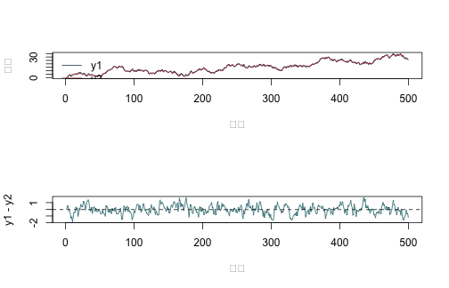
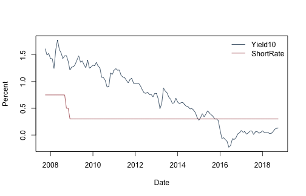
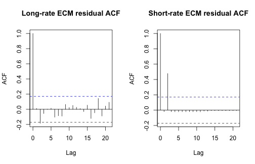

本附錄對應第 22 章。第一部分以已知共整合向量的模擬核對利差、誤差修正與 Johansen 特徵值；第二部分用固定日本短長期利率作真正但探索性的共整合與 ECM 分析。為避免偽造臨界值，本附錄計算特徵值與秩統計量，卻不自行硬編套件臨界值，也不把弱且規格敏感的證據寫成已證明的長期均衡關係。

## 執行條件

- base R 與 `knitr`；不安裝套件、不下載資料。
- 固定資料：`data/processed/japan_monthly_2007_2018.csv`。
- Johansen 函數是教學版不受限截距（unrestricted constant）示範，可對指定的落後差分殘差化，但不替代完整套件及其臨界值表。


``` r
knitr::opts_chunk$set(
  echo = TRUE, message = FALSE, warning = FALSE,
  fig.width = 7, fig.height = 4.5
)
set.seed(20260716)
```

## 已知共整合秩為 1 的教學模擬

建立共同隨機趨勢 \(q_t=q_{t-1}+\eta_t\) 與定態 spread
\(z_t=0.65z_{t-1}+e_t\)，再令 \(y_{2t}=q_t\)、\(y_{1t}=q_t+z_t\)。因此真實共整合向量為 \(\beta=(1,-1)^\top\)。


``` r
Tn <- 500L
eta <- rnorm(Tn)
e <- rnorm(Tn, sd = 0.5)
q <- cumsum(eta)
z <- numeric(Tn)
for (t in 2:Tn) z[t] <- 0.65 * z[t - 1] + e[t]

Y <- cbind(y1 = q + z, y2 = q)
spread <- Y[, 1] - Y[, 2]

par(mfrow = c(2, 1))
matplot(Y, type = "l", lty = 1, col = c("#173B57", "#A34045"),
        ylab = "Level", xlab = "t")
legend("topleft", c("y1", "y2"), col = c("#173B57", "#A34045"),
       lty = 1, bty = "n")
plot(spread, type = "l", col = "#1D6D73", ylab = "y1 - y2", xlab = "t")
abline(h = mean(spread), lty = 2)
```



``` r
par(mfrow = c(1, 1))
```

## AR(1) 持續性診斷

下列函數回報 \(\Delta x_t=a+\rho x_{t-1}+\) 落後差分項的 OLS t 統計量。它不是完整 ADF 檢定器；臨界值依 deterministic terms 與是否為估計殘差而不同。


``` r
adf_regression <- function(x, diff_lags = 0L, include_trend = FALSE,
                           include_intercept = TRUE) {
  x <- as.numeric(x)
  dx <- diff(x)
  n <- length(dx)
  start <- diff_lags + 1L
  y <- dx[start:n]
  x_lag <- x[start:n]
  X <- matrix(numeric(0), nrow = length(y), ncol = 0)
  if (include_intercept) X <- cbind(X, Intercept = 1)
  X <- cbind(X, LevelLag = x_lag)
  if (include_trend) X <- cbind(X, Trend = seq_along(y))
  if (diff_lags > 0L) {
    for (j in seq_len(diff_lags)) {
      X <- cbind(X, dx[(start - j):(n - j)])
      colnames(X)[ncol(X)] <- paste0("dLag", j)
    }
  }
  fit <- lm.fit(X, y)
  df <- length(y) - fit$rank
  sigma2 <- sum(fit$residuals^2) / df
  stopifnot(fit$rank == ncol(X))
  vcov <- sigma2 * solve(crossprod(X))
  level_col <- match("LevelLag", colnames(X))
  c(rho = fit$coefficients["LevelLag"],
    t_stat = fit$coefficients["LevelLag"] / sqrt(vcov[level_col, level_col]))
}

rbind(
  y1_level = adf_regression(Y[, 1], diff_lags = 1),
  y2_level = adf_regression(Y[, 2], diff_lags = 1),
  spread = adf_regression(spread, diff_lags = 1)
)
```

```
##          rho.LevelLag t_stat.LevelLag
## y1_level -0.010508363       -1.690820
## y2_level -0.009143012       -1.614674
## spread   -0.345531963       -9.004964
```

解讀只比較相對 persistence：模擬 levels 應比 spread 更接近單根。不得把一般常態 1.96 當 ADF 臨界值。

## 兩步 ECM


``` r
# 第一步：y1 對 y2 的長期迴歸。
long_run <- lm(y1 ~ y2, data = as.data.frame(Y))
ec_error <- residuals(long_run)

# 第二步：兩個差分方程都含前一期估計均衡誤差。
dY <- diff(Y)
ect_lag <- ec_error[-length(ec_error)]
ecm_y1 <- lm(dY[, 1] ~ ect_lag)
ecm_y2 <- lm(dY[, 2] ~ ect_lag)

data.frame(
  equation = c("Delta y1", "Delta y2"),
  adjustment = c(coef(ecm_y1)["ect_lag"], coef(ecm_y2)["ect_lag"]),
  standard_error = c(summary(ecm_y1)$coef["ect_lag", "Std. Error"],
                     summary(ecm_y2)$coef["ect_lag", "Std. Error"])
)
```

```
##   equation  adjustment standard_error
## 1 Delta y1 -0.28585029     0.07841242
## 2 Delta y2  0.07958777     0.07250540
```

``` r
coef(long_run)
```

```
## (Intercept)          y2 
##   0.1055747   0.9904325
```

因 \(y_1-y_2=z_t\)，正 spread 應由兩個變數的相對變動縮小。正規化方向改變時，\(\alpha\) 符號也會一起改變。

## 教學版 Johansen eigenvalues

對 VECM(1)

\[
\Delta Y_t=\Pi Y_{t-1}+c+u_t,
\]

分別從 \(\Delta Y_t\) 與 \(Y_{t-1}\) 移除截距，再計算 generalized eigenvalues。完整 Johansen 程序需按差分 lag 與 deterministic case 改變 residualization 與臨界值。


``` r
johansen_eigen_demo <- function(Y, diff_lags = 0L) {
  Y <- as.matrix(Y)
  dY <- diff(Y)
  Ylag <- Y[-nrow(Y), , drop = FALSE]
  stopifnot(diff_lags >= 0L, nrow(dY) > diff_lags + ncol(Y))

  index <- (diff_lags + 1L):nrow(dY)
  Z <- matrix(1, nrow = length(index), ncol = 1,
              dimnames = list(NULL, "Intercept"))
  if (diff_lags > 0L) {
    for (lag in seq_len(diff_lags)) {
      block <- dY[index - lag, , drop = FALSE]
      colnames(block) <- paste0(colnames(Y), "_dL", lag)
      Z <- cbind(Z, block)
    }
  }

  # 不受限截距：Delta Y_t 與 Y_{t-1} 都對常數及落後差分殘差化。
  residualize <- function(target, controls) {
    fit <- lm.fit(controls, target)
    target - controls %*% fit$coefficients
  }
  R0 <- residualize(dY[index, , drop = FALSE], Z)
  R1 <- residualize(Ylag[index, , drop = FALSE], Z)
  n <- nrow(R0)
  S00 <- crossprod(R0) / n
  S11 <- crossprod(R1) / n
  S01 <- crossprod(R0, R1) / n
  S10 <- t(S01)

  M <- solve(S11, S10 %*% solve(S00, S01))
  eig <- eigen(M)
  lambda <- sort(Re(eig$values), decreasing = TRUE)
  lambda <- pmin(pmax(lambda, 0), 1 - 1e-12)

  K <- ncol(Y)
  trace_stats <- vapply(0:(K - 1L), function(r) {
    -n * sum(log(1 - lambda[(r + 1L):K]))
  }, numeric(1))
  max_stats <- -n * log(1 - lambda)
  list(
    eigenvalues = lambda,
    trace = setNames(trace_stats, paste0("r<=", 0:(K - 1L))),
    max_eigen = setNames(max_stats, paste0(0:(K - 1L), " vs ", 1:K)),
    n = n,
    diff_lags = diff_lags
  )
}

j_sim <- johansen_eigen_demo(Y)
j_sim
```

```
## $eigenvalues
## [1] 0.181497909 0.005569738
## 
## $trace
##       r<=0       r<=1 
## 102.726452   2.787068 
## 
## $max_eigen
##    0 vs 1    1 vs 2 
## 99.939385  2.787068 
## 
## $n
## [1] 499
## 
## $diff_lags
## [1] 0
```

較大的第一特徵值與較小的第二特徵值符合共整合秩為 1 的資料生成結構，但正式的共整合秩判定必須使用與確定性規格、樣本數及落後階數相符的非標準臨界值。

## 已知 VECM 參數的矩陣核對


``` r
alpha <- matrix(c(-0.2, 0.1), ncol = 1)
beta <- matrix(c(1, -1), ncol = 1)
Pi <- alpha %*% t(beta)
eigen(Pi)$values
```

```
## [1] -0.3  0.0
```

``` r
Pi
```

```
##      [,1] [,2]
## [1,] -0.2  0.2
## [2,]  0.1 -0.1
```

``` r
previous_spread <- 0.5
expected_change <- as.numeric(alpha * previous_spread)
new_spread <- previous_spread + expected_change[1] - expected_change[2]
c(dy1 = expected_change[1], dy2 = expected_change[2], new_spread = new_spread)
```

```
##        dy1        dy2 new_spread 
##      -0.10       0.05       0.35
```

## 固定日本短長期利率：來源、樣本與尺度

凍結檔由原課程的 `data_t.csv` 與 `yield_10.csv` 依月份鍵結後整理而成。原始變數說明把 `inr` 定義為日本貼現率，單位是年百分率且未經季節調整；`yield_10` 是十年期殖利率欄位，數值沿用原檔百分比尺度。不過，資料夾沒有保留這兩欄的完整供應者與下載網址，因此本例只能被描述成固定課程快照。

檔案共有 133 個連續月份（2007 年 10 月至 2018 年 10 月），兩個水準欄位均無缺值。樣本橫跨全球金融危機、量化寬鬆與接近零利率時期；制度轉折會使單一線性共整合向量特別可疑。


``` r
path <- "data/processed/japan_monthly_2007_2018.csv"
jp <- read.csv(path, stringsAsFactors = FALSE)
jp$date <- as.Date(jp$date)
jp <- jp[order(jp$date), ]
stopifnot(!anyDuplicated(jp$date), all(c("inr", "yield_10") %in% names(jp)))

keep <- complete.cases(jp[, c("inr", "yield_10")])
Y_jp <- as.matrix(jp[keep, c("yield_10", "inr")])
dates <- jp$date[keep]
colnames(Y_jp) <- c("Yield10", "ShortRate")

data.frame(
  source_rows = nrow(jp), complete_rows = nrow(Y_jp),
  start = min(dates), end = max(dates),
  duplicate_dates = anyDuplicated(jp$date),
  missing_yield10 = sum(is.na(jp$yield_10)),
  missing_short_rate = sum(is.na(jp$inr))
)
```

```
##   source_rows complete_rows      start        end duplicate_dates
## 1         133           133 2007-10-01 2018-10-01               0
##   missing_yield10 missing_short_rate
## 1               0                  0
```

``` r
data.frame(
  variable = colnames(Y_jp),
  mean = colMeans(Y_jp), sd = apply(Y_jp, 2, sd),
  min = apply(Y_jp, 2, min), max = apply(Y_jp, 2, max)
)
```

```
##            variable     mean        sd   min   max
## Yield10     Yield10 0.710812 0.5342095 -0.23 1.778
## ShortRate ShortRate 0.343609 0.1307631  0.30 0.750
```

``` r
matplot(dates, Y_jp, type = "l", lty = 1,
        col = c("#173B57", "#A34045"),
        xlab = "Date", ylab = "Rate (original percent scale)")
legend("topright", colnames(Y_jp), col = c("#173B57", "#A34045"),
       lty = 1, bty = "n")
```



## Persistence 與 deterministic specification 敏感度

先比較長率、短率與未估參數的單純利差 `Yield10 - ShortRate`。下表列出常數規格下 0、1、2、4 個差分落後期，以及「常數加趨勢、1 個差分落後期」的 ADF 型迴歸係數與 t 統計量。這些 t 值沒有一般常態分配；本附錄刻意不附偽造的 p 值。


``` r
spread_jp <- Y_jp[, "Yield10"] - Y_jp[, "ShortRate"]
series_jp <- list(
  Yield10 = Y_jp[, "Yield10"],
  ShortRate = Y_jp[, "ShortRate"],
  RawSpread = spread_jp
)

constant_grid <- do.call(rbind, lapply(names(series_jp), function(nm) {
  do.call(rbind, lapply(c(0L, 1L, 2L, 4L), function(q) {
    value <- adf_regression(series_jp[[nm]], diff_lags = q)
    data.frame(series = nm, deterministic = "constant", diff_lags = q,
               rho = unname(value[1]), t_stat = unname(value[2]))
  }))
}))
trend_grid <- do.call(rbind, lapply(names(series_jp), function(nm) {
  value <- adf_regression(series_jp[[nm]], diff_lags = 1L, include_trend = TRUE)
  data.frame(series = nm, deterministic = "constant+trend", diff_lags = 1L,
             rho = unname(value[1]), t_stat = unname(value[2]))
}))
rbind(constant_grid, trend_grid)
```

```
##       series  deterministic diff_lags          rho     t_stat
## 1    Yield10       constant         0 -0.018389214 -1.3697718
## 2    Yield10       constant         1 -0.016170408 -1.1870966
## 3    Yield10       constant         2 -0.016197241 -1.1918573
## 4    Yield10       constant         4 -0.013998507 -1.0025149
## 5  ShortRate       constant         0 -0.058855146 -3.3017387
## 6  ShortRate       constant         1 -0.064742517 -3.4780026
## 7  ShortRate       constant         2 -0.063188093 -3.6908101
## 8  ShortRate       constant         4 -0.073065834 -4.0139428
## 9  RawSpread       constant         0 -0.014737875 -0.9609526
## 10 RawSpread       constant         1 -0.012908808 -0.8331237
## 11 RawSpread       constant         2 -0.010382753 -0.6719815
## 12 RawSpread       constant         4 -0.006963792 -0.4416911
## 13   Yield10 constant+trend         1 -0.205200938 -3.5982972
## 14 ShortRate constant+trend         1 -0.059668486 -2.7564921
## 15 RawSpread constant+trend         1 -0.137024579 -3.2028724
```

``` r
rbind(
  dYield10 = adf_regression(diff(Y_jp[, "Yield10"]), diff_lags = 1L),
  dShortRate = adf_regression(diff(Y_jp[, "ShortRate"]), diff_lags = 1L)
)
```

```
##            rho.LevelLag t_stat.LevelLag
## dYield10     -1.1832626       -9.670317
## dShortRate   -0.5282508       -4.761116
```

第一差分相對水準呈現較強的均值回復並不等於兩個水準必然共整合。尤其短率在樣本後段長時間貼近零，常數、趨勢、結構轉折與差分 lag 都會改變非標準檢定的有限樣本分配。

## Engle--Granger 殘差與 Johansen lag 敏感度

先估 `Yield10 = a + b ShortRate + e`。共整合若成立，估計殘差應為定態；但殘差單根檢定的臨界值不同於一般 ADF。以下只回報不同 lag 下的殘差 t 統計量，並把 Johansen 教學統計量在 0 至 3 個差分 lag 下全部列出。


``` r
long_jp <- lm(Yield10 ~ ShortRate, data = as.data.frame(Y_jp))
ect_jp <- residuals(long_jp)
data.frame(
  intercept = coef(long_jp)["(Intercept)"],
  slope = coef(long_jp)["ShortRate"],
  r_squared = summary(long_jp)$r.squared,
  residual_sd = sd(ect_jp)
)
```

```
##               intercept    slope r_squared residual_sd
## (Intercept) 0.006504647 2.049735 0.2517345   0.4621038
```

``` r
eg_residual_grid <- do.call(rbind, lapply(0:4, function(q) {
  value <- adf_regression(ect_jp, diff_lags = q, include_intercept = FALSE)
  data.frame(diff_lags = q, rho = unname(value[1]), t_stat = unname(value[2]))
}))
eg_residual_grid
```

```
##   diff_lags         rho     t_stat
## 1         0 -0.01735221 -0.9593388
## 2         1 -0.01662733 -0.9104236
## 3         2 -0.01516000 -0.8187528
## 4         3 -0.01508995 -0.8058602
## 5         4 -0.01322106 -0.6961770
```

``` r
johansen_grid <- do.call(rbind, lapply(0:3, function(q) {
  result <- johansen_eigen_demo(Y_jp, diff_lags = q)
  data.frame(
    diff_lags = q, n = result$n,
    lambda1 = unname(result$eigenvalues[1]),
    lambda2 = unname(result$eigenvalues[2]),
    trace_r0 = unname(result$trace[1]), trace_r1 = unname(result$trace[2]),
    max_r0_r1 = unname(result$max_eigen[1]),
    max_r1_r2 = unname(result$max_eigen[2])
  )
}))
rownames(johansen_grid) <- NULL
johansen_grid
```

```
##   diff_lags   n    lambda1     lambda2 trace_r0 trace_r1 max_r0_r1 max_r1_r2
## 1         0 132 0.07896105 0.012954906 12.57861 1.721221  10.85739  1.721221
## 2         1 131 0.08797213 0.012846012 13.75683 1.693730  12.06310  1.693730
## 3         2 130 0.09849780 0.007761539 14.49300 1.012936  13.48006  1.012936
## 4         3 129 0.11599648 0.009178353 17.09443 1.189475  15.90496  1.189475
```

Engle--Granger 殘差 t 統計量只介於 -0.96 與 -0.70，沒有呈現模擬共整合例那種明顯均值回復；Johansen 的 `trace_r0` 則隨差分 lag 從 12.58 變到 17.09。這些輸出不能被寫成「已證明日本利率共整合」。正式判定必須使用與 deterministic case、差分 lag、樣本大小相符的非標準臨界值，並檢查制度轉折。當 rank 結論會隨規格翻轉時，應保留 VAR in differences 或其他不強迫長期關係的模型作為基準。

## 探索性 ECM：調整係數與殘差

即使 rank 證據不強，ECM 仍可作為「若採用這條長期迴歸，資料會如何調整」的敏感度計算。以下分別放入 0、1、2 個落後差分；`ECT` 的 OLS t 與 p 值只是條件式描述，沒有校正第一階段估計與 rank 選擇。


``` r
fit_ecm_system <- function(Y, ect, diff_lags = 1L) {
  Y <- as.matrix(Y)
  dY <- diff(Y)
  ect_lag <- ect[-length(ect)]
  index <- (diff_lags + 1L):nrow(dY)
  X <- cbind(Intercept = 1, ECT = ect_lag[index])
  if (diff_lags > 0L) {
    for (lag in seq_len(diff_lags)) {
      block <- dY[index - lag, , drop = FALSE]
      colnames(block) <- paste0("d", colnames(Y), "_L", lag)
      X <- cbind(X, block)
    }
  }

  fits <- lapply(seq_len(ncol(Y)), function(j) {
    y <- dY[index, j]
    fit <- lm.fit(X, y)
    df <- length(y) - fit$rank
    sigma2 <- sum(fit$residuals^2) / df
    V <- sigma2 * solve(crossprod(X))
    se <- sqrt(diag(V))
    t_value <- fit$coefficients / se
    list(
      coefficients = fit$coefficients, se = se, t = t_value,
      p = 2 * pt(abs(t_value), df = df, lower.tail = FALSE),
      residuals = fit$residuals, n = length(y), df = df
    )
  })
  names(fits) <- colnames(Y)
  fits
}
```


``` r
ecm_grid <- do.call(rbind, lapply(0:2, function(q) {
  fits <- fit_ecm_system(Y_jp, ect_jp, diff_lags = q)
  do.call(rbind, lapply(names(fits), function(eq) {
    fit <- fits[[eq]]
    lb <- Box.test(fit$residuals, lag = 12, type = "Ljung-Box",
                   fitdf = 1 + 2 * q)
    data.frame(
      diff_lags = q, equation = paste0("Delta ", eq), n = fit$n,
      ect_adjustment = unname(fit$coefficients["ECT"]),
      ect_se = unname(fit$se["ECT"]), ect_t = unname(fit$t["ECT"]),
      ect_ols_p = unname(fit$p["ECT"]), residual_lb_p = lb$p.value
    )
  }))
}))
rownames(ecm_grid) <- NULL
ecm_grid
```

```
##   diff_lags        equation   n ect_adjustment      ect_se      ect_t ect_ols_p
## 1         0   Delta Yield10 132   -0.021074124 0.015518670 -1.3579851 0.1768207
## 2         0 Delta ShortRate 132   -0.001851880 0.005269455 -0.3514368 0.7258296
## 3         1   Delta Yield10 131   -0.020395657 0.015776920 -1.2927528 0.1984435
## 4         1 Delta ShortRate 131   -0.002093077 0.005391528 -0.3882159 0.6985063
## 5         2   Delta Yield10 130   -0.015438633 0.015712816 -0.9825503 0.3277420
## 6         2 Delta ShortRate 130    0.001750973 0.004840464  0.3617366 0.7181646
##   residual_lb_p
## 1  0.5366255619
## 2  0.0008679892
## 3  0.2923893891
## 4  0.0002758963
## 5  0.3704686705
## 6  0.0270738186
```

``` r
ecm_selected <- fit_ecm_system(Y_jp, ect_jp, diff_lags = 1L)
par(mfrow = c(1, 2))
acf(ecm_selected$Yield10$residuals, main = "Long-rate ECM residual ACF")
acf(ecm_selected$ShortRate$residuals, main = "Short-rate ECM residual ACF")
```



``` r
par(mfrow = c(1, 1))
```

長率方程的 ECT 係數在三個 lag 規格下約為 -0.021 至 -0.015，最小的未校正 OLS p 值仍為 0.177。短率方程的調整係數接近零且會變號，未校正 p 值皆大於 0.70；其 12 階殘差 Ljung--Box p 值最高也只有 0.027。最誠實的結論是：此短樣本對單一穩定共整合關係的支持有限。ECM 數字可用來說明機制，不能包裝成可套利的長期法則。

## 報告與退場規則

1. 先說明各 series 的整合階數證據與 deterministic terms。
2. VECM 的差分 lags 比水準 VAR lags 少一階。
3. 報告跡檢定與最大特徵值檢定所使用的確切規格與臨界值；本教學函數未內建它們。
4. 比較前先把共整合向量正規化為同一尺度與符號。
5. 共整合秩對落後階數、趨勢或子樣本翻轉時，不把單一結果包裝成長期法則。
6. 共整合不等於套利；VECM 創新項也不等於結構衝擊。


``` r
sessionInfo()
```

```
## R version 4.5.2 (2025-10-31)
## Platform: aarch64-apple-darwin20
## Running under: macOS Tahoe 26.5.1
## 
## Matrix products: default
## BLAS:   /System/Library/Frameworks/Accelerate.framework/Versions/A/Frameworks/vecLib.framework/Versions/A/libBLAS.dylib 
## LAPACK: /Library/Frameworks/R.framework/Versions/4.5-arm64/Resources/lib/libRlapack.dylib;  LAPACK version 3.12.1
## 
## locale:
## [1] C.UTF-8/C.UTF-8/C.UTF-8/C/C.UTF-8/C.UTF-8
## 
## time zone: Asia/Tokyo
## tzcode source: internal
## 
## attached base packages:
## [1] stats     graphics  grDevices utils     datasets  methods   base     
## 
## other attached packages:
## [1] tibble_3.3.0 dplyr_1.2.1 
## 
## loaded via a namespace (and not attached):
##  [1] shape_1.4.6.1       gtable_0.3.6        xfun_0.57          
##  [4] ggplot2_4.0.3       collapse_2.1.7      lattice_0.22-7     
##  [7] quadprog_1.5-8      vctrs_0.7.2         tools_4.5.2        
## [10] Rdpack_2.6.6        generics_0.1.4      curl_7.0.0         
## [13] parallel_4.5.2      sandwich_3.1-1      xts_0.14.2         
## [16] pkgconfig_2.0.3     gbutils_0.5.1       Matrix_1.7-4       
## [19] tidyverse_2.0.0     RColorBrewer_1.1-3  S7_0.2.1           
## [22] lifecycle_1.0.5     compiler_4.5.2      farver_2.1.2       
## [25] MatrixModels_0.5-4  maxLik_1.5-2.2      textshaping_1.0.5  
## [28] codetools_0.2-20    SparseM_1.84-2      quantreg_6.1       
## [31] htmltools_0.5.9     glmnet_4.1-10       Formula_1.2-5      
## [34] pillar_1.11.1       MASS_7.3-65         plm_2.6-7          
## [37] iterators_1.0.14    foreach_1.5.2       nlme_3.1-168       
## [40] fracdiff_1.5-4      pls_2.9-0           fBasics_4052.98    
## [43] tidyselect_1.2.1    bdsmatrix_1.3-7     digest_0.6.39      
## [46] labeling_0.4.3      splines_4.5.2       tseries_0.10-62    
## [49] miscTools_0.6-30    fastmap_1.2.0       grid_4.5.2         
## [52] colorspace_2.1-2    cli_3.6.5           magrittr_2.0.4     
## [55] utf8_1.2.6          survival_3.8-3      withr_3.0.2        
## [58] scales_1.4.0        forecast_9.0.2      TTR_0.24.4         
## [61] rmarkdown_2.31      quantmod_0.4.29     otel_0.2.0         
## [64] timeDate_4052.112   ragg_1.5.2          zoo_1.8-15         
## [67] timeSeries_4052.112 fGarch_4052.93      urca_1.3-4         
## [70] evaluate_1.0.5      knitr_1.51          rbibutils_2.4.1    
## [73] lmtest_0.9-40       rlang_1.1.7         spatial_7.3-18     
## [76] Rcpp_1.1.0          glue_1.8.0          R6_2.6.1           
## [79] cvar_0.6            systemfonts_1.3.2
```
