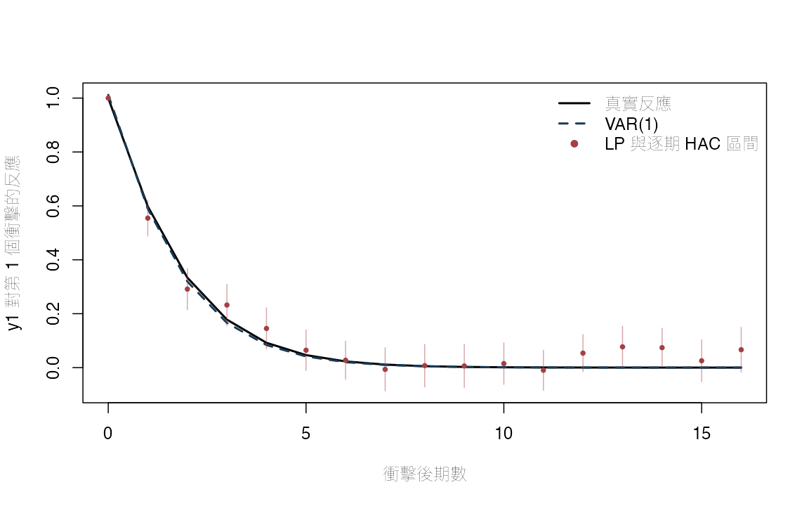
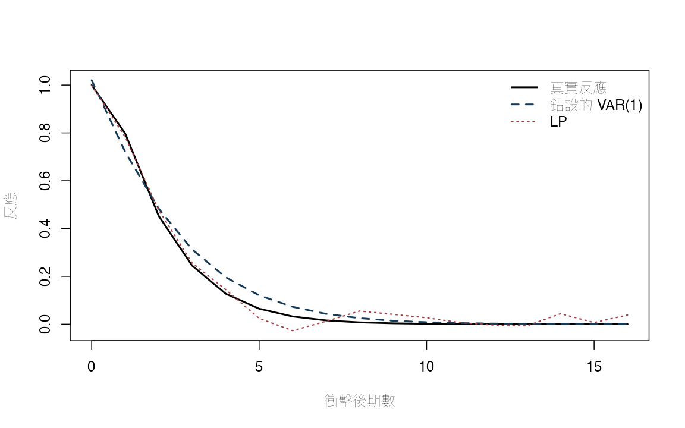
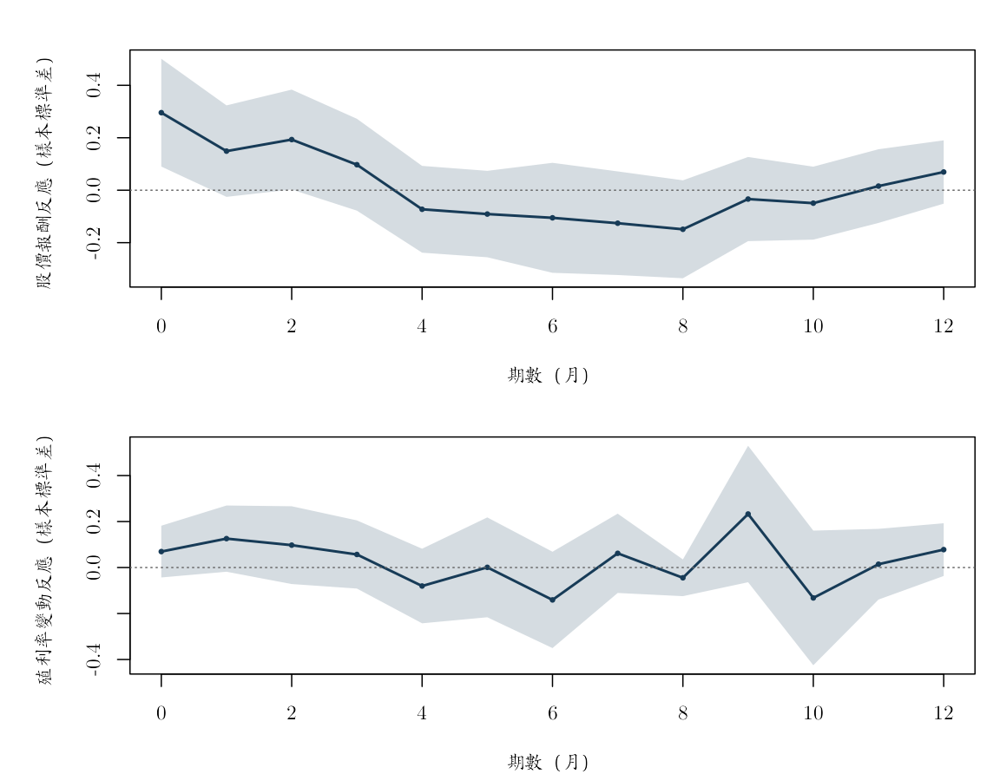
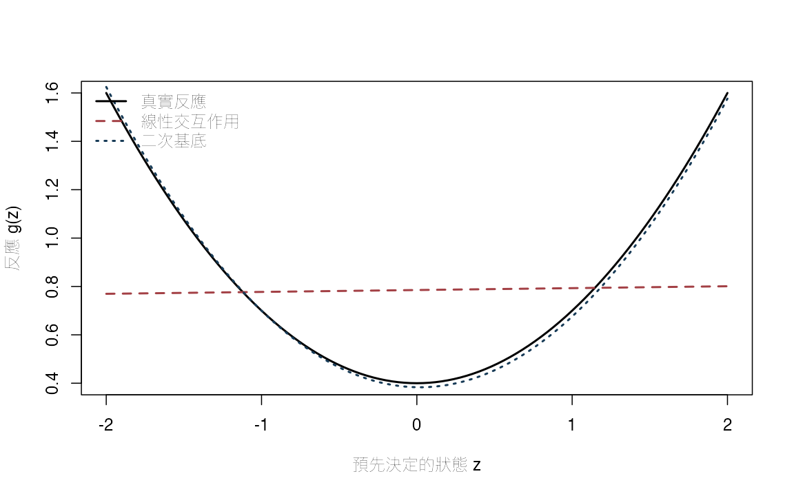

局部投影（local projection, LP）把每個預測期距分開估計。它最直接的問題是：今天出現一單位衝擊後，應變數在當期、下一期、再下一期平均改變多少？本附錄先在衝擊確實外生且可觀察的模擬中，比較向量自我迴歸（vector autoregression, VAR）與 LP 的衝擊反應函數（impulse response function, IRF），並示範異質變異與自相關一致（heteroskedasticity and autocorrelation consistent, HAC）標準誤；接著才回到日本月資料，估計油價月變動與股價報酬、十年期殖利率變動的縮減式條件反應。

這兩段的待估對象不能混在一起。模擬裡的 `shock` 是資料生成過程明示的外生創新項，所以曲線有因果 IRF 的意義；日本資料只有「控制兩期落後資訊後，當月油價變動所對應的條件反應」，沒有外部識別，不能稱為油價供給衝擊的因果效果。最後的增廣逆機率加權（augmented inverse probability weighting, AIPW）與狀態相依例只是靜態評分函數和曲線形狀的程式核對，也不等於完成一個時間序列 IRF 研究。

## 先確認執行環境與三種例子的界線

- 模型計算使用 R 內建函數；`knitr` 負責轉檔，`ragg` 與 `systemfonts` 負責以 cwTeX 字型產生圖檔；不下載資料。
- 模擬使用固定種子；實證使用 `data/processed/japan_monthly_2007_2018.csv`。
- 模擬衝擊的識別由資料生成過程明示；日本資料只有落後資訊條件下的油價變動，沒有外生結構衝擊的識別。


``` r
knitr::opts_chunk$set(
  echo = TRUE, message = FALSE, warning = FALSE,
  fig.width = 8, fig.height = 5,
  dev = "ragg_png", dpi = 144,
  dev.args = list(background = "white")
)
set.seed(20260716)

root_candidates <- c(".", "..")
is_root <- vapply(root_candidates, function(x) {
  file.exists(file.path(x, "main.tex"))
}, logical(1))
stopifnot(any(is_root))
project_root <- root_candidates[which(is_root)[1]]
project_path <- function(...) file.path(project_root, ...)

stopifnot(
  requireNamespace("ragg", quietly = TRUE),
  requireNamespace("systemfonts", quietly = TRUE)
)
cwtex_file <- project_path("assets", "fonts", "cwTeXQKai-Medium.ttf")
stopifnot(file.exists(cwtex_file))
if (!"cwTeX Online" %in% systemfonts::registry_fonts()$family) {
  systemfonts::register_font("cwTeX Online", cwtex_file)
}
plot_family <- "cwTeX Online"
```

## 先建立一個衝擊真的外生的模擬

模擬每一列代表一期。`A` 決定過去的變數如何傳到現在，`B` 決定當期結構創新項如何進入系統，`C` 則容許前一期創新項留下額外的移動平均成分。最重要的是，第一個結構創新項會另存成 `shock`；因此 LP 不必從觀察資料猜測衝擊是什麼。


``` r
simulate_svarma <- function(Tn, A, B, C = matrix(0, nrow(B), ncol(B)),
                            burn = 300L) {
  K <- nrow(A)
  eps <- matrix(rnorm((Tn + burn) * K), ncol = K)
  Y <- matrix(0, Tn + burn, K)
  for (t in 2:nrow(Y)) {
    # 當期值同時接收上一期狀態、當期創新項與可選的前期創新項。
    Y[t, ] <- A %*% Y[t - 1, ] + B %*% eps[t, ] + C %*% eps[t - 1, ]
  }
  keep <- (burn + 1L):(burn + Tn)
  list(Y = Y[keep, , drop = FALSE], shock = eps[keep, 1], eps = eps[keep, ])
}

true_irf <- function(A, B, C, horizon) {
  out <- vector("list", horizon + 1L)
  out[[1]] <- B
  if (horizon >= 1L) out[[2]] <- A %*% B + C
  if (horizon >= 2L) {
    for (h in 2:horizon) out[[h + 1L]] <- A %*% out[[h]]
  }
  out
}

extract_response <- function(irf_list, response = 1L, shock = 1L) {
  vapply(irf_list, function(M) M[response, shock], numeric(1))
}
```


``` r
A <- matrix(c(0.55, 0.12,
              -0.10, 0.35), 2, 2, byrow = TRUE)
B <- matrix(c(1.00, 0.00,
              0.40, 0.75), 2, 2, byrow = TRUE)
C0 <- matrix(0, 2, 2)
H <- 16L

sim <- simulate_svarma(900, A, B, C0)
Y <- sim$Y
shock <- sim$shock
colnames(Y) <- c("y1", "y2")
truth <- extract_response(true_irf(A, B, C0, H), 1, 1)
```

基準模擬有 900 個可用期數，目標是第一個外生衝擊對 `y1` 在第 0 至 16 期的平均因果反應。模擬不需要訓練、驗證與測試切分，因為此處不是挑選預測模型；我們用已知真值直接檢查兩種 IRF 估計法的有限樣本表現。

## LP 與 Newey–West 共變異數

對每個期距 \(h\)，各估一條迴歸：

\[
y_{1,t+h}=a_h+\theta_hs_t+\Gamma_h'W_{t-1}+u_{t+h}^{(h)},
\]

其中控制變數是 \((Y_{t-1},\ldots,Y_{t-p})\)。衝擊在模擬中直接觀察，且與其他時點和其他方程的創新項獨立，所以 \(\theta_h\) 有明確的因果 IRF 待估對象。每個 \(h\) 都換一個應變數，也會少掉最後 \(h\) 列資料；LP 曲線因此是許多相關迴歸的集合，而不是一條方程遞迴出來的。


``` r
newey_west_vcov <- function(X, residuals, bandwidth) {
  # 每列評分向量是 x_t u_t；HAC 中間矩陣會把指定頻寬內的跨期共變動加回來。
  score <- X * as.numeric(residuals)
  meat <- crossprod(score)
  n <- nrow(score)
  if (bandwidth > 0L) {
    for (lag in seq_len(min(bandwidth, n - 1L))) {
      weight <- 1 - lag / (bandwidth + 1)
      # Bartlett 權重隨落後期遞減，並同時加入正向與反向共變異數。
      gamma <- crossprod(score[(lag + 1L):n, , drop = FALSE],
                         score[1:(n - lag), , drop = FALSE])
      meat <- meat + weight * (gamma + t(gamma))
    }
  }
  bread <- solve(crossprod(X))
  bread %*% meat %*% bread
}

estimate_lp <- function(Y, shock, horizon_max = 12L, p = 2L,
                        bandwidth_rule = function(h) max(h, 4L)) {
  Y <- as.matrix(Y)
  if (is.null(colnames(Y))) colnames(Y) <- paste0("y", seq_len(ncol(Y)))
  Tn <- nrow(Y)
  out <- data.frame(h = 0:horizon_max, theta = NA_real_, se_hac = NA_real_,
                    n = NA_integer_, bandwidth = NA_integer_)

  for (h in 0:horizon_max) {
    # 期距愈長，可用的預測起點愈少；不以缺值補齊未來應變數。
    t_index <- (p + 1L):(Tn - h)
    y_h <- Y[t_index + h, 1]
    controls <- do.call(cbind, lapply(seq_len(p), function(lag) {
      Y[t_index - lag, , drop = FALSE]
    }))
    colnames(controls) <- unlist(lapply(seq_len(p), function(lag) {
      paste0(colnames(Y), "_L", lag)
    }))
    X <- cbind(Intercept = 1, Shock = shock[t_index], controls)
    fit <- lm.fit(X, y_h)
    # 頻寬規則是推論選擇，不會改變 OLS 點估計。
    L <- bandwidth_rule(h)
    V <- newey_west_vcov(X, fit$residuals, L)
    out[h + 1L, c("theta", "se_hac", "n", "bandwidth")] <-
      c(fit$coefficients["Shock"], sqrt(V["Shock", "Shock"]), length(y_h), L)
  }
  out
}

lp <- estimate_lp(Y, shock, H, p = 2)
head(lp)
```

```
##   h      theta       se_hac   n bandwidth
## 1 0 1.00000000 7.837684e-18 898         4
## 2 1 0.55460214 3.363868e-02 897         4
## 3 2 0.29132998 3.888439e-02 896         4
## 4 3 0.23219743 3.904792e-02 895         4
## 5 4 0.14518145 3.905648e-02 894         4
## 6 5 0.06446433 3.843893e-02 893         5
```

## 同一份模擬資料的 VAR IRF

VAR(1) 先估一組共同的動態係數，再用 Cholesky 矩陣把縮減式殘差正交化，最後遞迴出所有期距的反應。基準資料生成過程正好是 VAR(1)，而且 `B` 為下三角矩陣，所以這項排序與真實結構一致。這是有意設計的有利情境，不能直接推論 VAR 在所有資料裡都會勝過 LP。


``` r
fit_var1 <- function(Y) {
  Y <- as.matrix(Y)
  X <- cbind(Intercept = 1, Y[-nrow(Y), , drop = FALSE])
  Ydep <- Y[-1, , drop = FALSE]
  coef <- qr.solve(X, Ydep)
  residuals <- Ydep - X %*% coef
  list(
    intercept = coef[1, ],
    A = t(coef[-1, , drop = FALSE]),
    sigma = crossprod(residuals) / nrow(residuals),
    residuals = residuals
  )
}

var1_irf <- function(fit, horizon) {
  # 下三角 Cholesky 影響矩陣把第一個縮減式創新項排在當期最前面。
  B_hat <- t(chol(fit$sigma))
  out <- vector("list", horizon + 1L)
  out[[1]] <- B_hat
  if (horizon >= 1L) {
    for (h in seq_len(horizon)) out[[h + 1L]] <- fit$A %*% out[[h]]
  }
  out
}

fit_v <- fit_var1(Y)
var_estimate <- extract_response(var1_irf(fit_v, H), 1, 1)
```


``` r
ylim <- range(truth, var_estimate,
              lp$theta - 1.96 * lp$se_hac,
              lp$theta + 1.96 * lp$se_hac)
plot(0:H, truth, type = "l", lwd = 2, col = "black", ylim = ylim,
     xlab = "衝擊後期數", ylab = "y1 對第 1 個衝擊的反應")
lines(0:H, var_estimate, lwd = 2, lty = 2, col = "#173B57")
points(0:H, lp$theta, pch = 16, cex = 0.7, col = "#A34045")
segments(0:H, lp$theta - 1.96 * lp$se_hac,
         0:H, lp$theta + 1.96 * lp$se_hac,
         col = adjustcolor("#A34045", alpha.f = 0.45))
legend("topright", c("真實反應", "VAR(1)", "LP 與逐期 HAC 區間"),
       col = c("black", "#173B57", "#A34045"),
       lty = c(1, 2, NA), pch = c(NA, NA, 16), lwd = c(2, 2, NA), bty = "n")
```



在正確且簡約的 VAR 資料生成過程下，VAR 遞迴對所有期距施加同一組動態限制，曲線通常較平滑、估計也可能較精確。LP 分開估計每個期距，限制較少，代價是點估計容易抖動。這一張圖只是一個樣本，不能用來比較平均偏誤或區間涵蓋率；要回答那些問題，必須重複模擬。

## 重複模擬後再比較偏誤與標準差


``` r
monte_carlo <- function(repetitions = 100L, Tn = 350L, horizon = 8L,
                        C = matrix(0, 2, 2), seed = 20260716) {
  set.seed(seed)
  lp_draw <- var_draw <- matrix(NA_real_, repetitions, horizon + 1L)
  for (r in seq_len(repetitions)) {
    # 每次都重生完整樣本，再用同一待估對象比較 LP 與 VAR。
    s <- simulate_svarma(Tn, A, B, C)
    lp_draw[r, ] <- estimate_lp(s$Y, s$shock, horizon, p = 2)$theta
    var_draw[r, ] <- extract_response(var1_irf(fit_var1(s$Y), horizon), 1, 1)
  }
  target <- extract_response(true_irf(A, B, C, horizon), 1, 1)
  data.frame(
    h = 0:horizon,
    truth = target,
    lp_bias = colMeans(lp_draw) - target,
    lp_sd = apply(lp_draw, 2, sd),
    var_bias = colMeans(var_draw) - target,
    var_sd = apply(var_draw, 2, sd)
  )
}

mc_correct <- monte_carlo(repetitions = 80, Tn = 350, horizon = 8, C = C0)
round(mc_correct, 3)
```

```
##   h truth lp_bias lp_sd var_bias var_sd
## 1 0 1.000   0.000 0.000    0.000  0.038
## 2 1 0.598  -0.015 0.051   -0.016  0.051
## 3 2 0.334  -0.012 0.065   -0.016  0.051
## 4 3 0.178  -0.019 0.067   -0.012  0.043
## 5 4 0.092  -0.023 0.070   -0.007  0.032
## 6 5 0.046  -0.016 0.073   -0.004  0.022
## 7 6 0.023  -0.020 0.078   -0.002  0.015
## 8 7 0.011  -0.007 0.060    0.000  0.009
## 9 8 0.005  -0.013 0.067    0.000  0.006
```

表中的 `lp_bias` 與 `var_bias` 是各期平均估計減去真值，`lp_sd` 與 `var_sd` 則衡量跨模擬樣本的波動。在基準設定裡，VAR 正好符合資料生成過程，通常會以較小標準差換取較強的模型限制。有限次蒙地卡羅實驗只是方法的壓力測試，不是理論證明；增加重複次數可降低模擬雜訊，但會增加編譯時間。

## 當低階 VAR 錯設時，兩種方法如何改變？

加入小型 \(C\varepsilon_{t-1}\) 後，資料不再是精確 VAR(1)。真實當期反應為 \(B\)，一期反應為 \(AB+C\)，之後由 \(A\) 傳遞。LP 仍直接把可觀察衝擊放進各期距迴歸；VAR(1) 則被迫以一階自我迴歸吸收額外的移動平均成分。這個比較刻意改變的是動態規格，待估衝擊與正規化方式仍相同。


``` r
C_small <- 0.20 * B
sim_ma <- simulate_svarma(900, A, B, C_small)
truth_ma <- extract_response(true_irf(A, B, C_small, H), 1, 1)
lp_ma <- estimate_lp(sim_ma$Y, sim_ma$shock, H, p = 2)
var_ma <- extract_response(var1_irf(fit_var1(sim_ma$Y), H), 1, 1)

plot(0:H, truth_ma, type = "l", lwd = 2, col = "black",
     ylim = range(truth_ma, lp_ma$theta, var_ma),
     xlab = "衝擊後期數", ylab = "反應")
lines(0:H, var_ma, lwd = 2, lty = 2, col = "#173B57")
lines(0:H, lp_ma$theta, lwd = 1.5, lty = 3, col = "#A34045")
legend("topright", c("真實反應", "錯設的 VAR(1)", "LP"),
       col = c("black", "#173B57", "#A34045"),
       lwd = c(2, 2, 1.5), lty = c(1, 2, 3), bty = "n")
```



``` r
mc_ma <- monte_carlo(repetitions = 80, Tn = 350, horizon = 8, C = C_small)
round(mc_ma, 3)
```

```
##   h truth lp_bias lp_sd var_bias var_sd
## 1 0 1.000   0.000 0.001    0.009  0.039
## 2 1 0.798  -0.016 0.051   -0.101  0.047
## 3 2 0.453  -0.015 0.071    0.002  0.053
## 4 3 0.245  -0.022 0.076    0.040  0.052
## 5 4 0.128  -0.027 0.079    0.045  0.046
## 6 5 0.065  -0.021 0.082    0.036  0.038
## 7 6 0.032  -0.023 0.088    0.026  0.030
## 8 7 0.016  -0.011 0.070    0.017  0.023
## 9 8 0.008  -0.014 0.073    0.010  0.017
```

若 LP 在這個例子較接近真值，正確解讀只是「分期迴歸沒有被同一個錯設 VAR 遞迴限制綁住」。這個資料生成過程只是可核對的小例，並非任何特定論文的重現，也不能用來證明 LP 面對所有錯誤設定都較好或都有正確涵蓋率。

## HAC 頻寬會改變什麼？


``` r
lp_Lh <- estimate_lp(Y, shock, H, p = 2,
                     bandwidth_rule = function(h) max(h, 1L))
lp_L4 <- estimate_lp(Y, shock, H, p = 2,
                     bandwidth_rule = function(h) 4L)
lp_L12 <- estimate_lp(Y, shock, H, p = 2,
                      bandwidth_rule = function(h) 12L)

data.frame(
  h = 0:H,
  se_Lh = lp_Lh$se_hac,
  se_L4 = lp_L4$se_hac,
  se_L12 = lp_L12$se_hac
)
```

```
##     h        se_Lh        se_L4       se_L12
## 1   0 8.662842e-18 7.837684e-18 7.628143e-18
## 2   1 3.415455e-02 3.363868e-02 3.150262e-02
## 3   2 3.790702e-02 3.888439e-02 3.928026e-02
## 4   3 3.889454e-02 3.904792e-02 3.872784e-02
## 5   4 3.905648e-02 3.905648e-02 3.758108e-02
## 6   5 3.843893e-02 3.898045e-02 3.804920e-02
## 7   6 3.607567e-02 3.617650e-02 3.613303e-02
## 8   7 4.080768e-02 3.948255e-02 4.045087e-02
## 9   8 4.020096e-02 3.930276e-02 4.008037e-02
## 10  9 4.102776e-02 4.072232e-02 4.109628e-02
## 11 10 3.931643e-02 3.995293e-02 3.851908e-02
## 12 11 3.799919e-02 3.988689e-02 3.753522e-02
## 13 12 3.504898e-02 3.903523e-02 3.504898e-02
## 14 13 3.919067e-02 4.001536e-02 3.928509e-02
## 15 14 3.678129e-02 3.934185e-02 3.713329e-02
## 16 15 3.976508e-02 4.144410e-02 4.049851e-02
## 17 16 4.244003e-02 4.264808e-02 4.244836e-02
```

HAC 頻寬是推論設定的一部分。上表讓學生確認：在同一條 LP 迴歸下，改變頻寬只會改標準誤，不會改變點估計。若累積應變數寫成 \(y_{t+h}-y_{t-1}\)，相鄰觀察的重疊窗會使機械相依延伸至落後第 \(h\) 階；若寫成 \(y_{t+h}-y_t\)，才延伸至第 \(h-1\) 階。本例的應變數是未來水準 \(y_{t+h}\)，不是這兩種累積量，但仍可能因動態控制變數與預測誤差而有序列相關。頻寬應隨應變數定義與相依結構說明，不宜只保留軟體預設值。

## 回到日本月資料：先界定觀察單位與尺度

固定檔由原課程的 `data_t.csv` 與 `yield_10.csv` 依月份鍵結後整理。原始說明把 `opi` 定義為 WTI 現貨價，`opi_change` 是相對前月的百分比變動；`yield_10_change` 是十年期殖利率相對前月的百分比變動，殖利率接近零時會出現極端比率；`return_j` 是資料內預先計算的日本股價報酬，但原始說明沒有保留它的精確公式與明確單位。資料夾也沒有完整記錄所有供應者。因此，本節只分析固定課程快照，不把數值與其他資料庫直接拼接。

來源檔有 133 個月（2007 年 10 月至 2018 年 10 月）。三個變動欄位的第一個月皆缺值；先按日期排序，再對三欄共同刪除不完整列，得到 132 個月（2007 年 11 月至 2018 年 10 月）。每一列代表同一月份的三項變動，並未進一步處理月內發布先後。因此第 0 期係數是同月條件關聯，不能依欄位排列順序解讀成油價先發生、股價或殖利率隨後反應。

為避免未記錄的原始尺度主導迴歸，三欄都以這 132 月的平均數與標準差標準化。因此實證反應的單位是「應變數的樣本標準差」，油價月變動則以 1 個**無條件樣本標準差**為單位。後面的殘差化不會再除以條件殘差的標準差，所以係數不是以「一個條件創新標準差」為單位。這是全樣本描述性 LP，沒有訓練、驗證與測試期；完整樣本標準化在此只服務曲線比較。若改做虛擬樣本外預測，平均數、標準差與任何模型選擇都必須只用預測起點以前的資料。


``` r
jp_path <- project_path("data", "processed", "japan_monthly_2007_2018.csv")
stopifnot(file.exists(jp_path))
jp <- read.csv(jp_path, stringsAsFactors = FALSE)
jp$date <- as.Date(jp$date)
jp <- jp[order(jp$date), ]
required <- c("date", "opi_change", "return_j", "yield_10_change")
stopifnot(all(required %in% names(jp)), !anyDuplicated(jp$date))

raw_names <- c("opi_change", "return_j", "yield_10_change")
keep <- complete.cases(jp[, raw_names])
Z_raw <- as.matrix(jp[keep, raw_names])
dates_jp <- jp$date[keep]
Z_jp <- scale(Z_raw)
colnames(Z_jp) <- c("OilChange", "StockReturn", "YieldChange")

data.frame(
  source_rows = nrow(jp), complete_rows = nrow(Z_jp),
  source_start = min(jp$date), source_end = max(jp$date),
  analysis_start = min(dates_jp), analysis_end = max(dates_jp),
  duplicate_dates = anyDuplicated(jp$date)
)
```

```
##   source_rows complete_rows source_start source_end analysis_start analysis_end
## 1         133           132   2007-10-01 2018-10-01     2007-11-01   2018-10-01
##   duplicate_dates
## 1               0
```

``` r
data.frame(
  variable = raw_names,
  missing = vapply(jp[raw_names], function(x) sum(is.na(x)), integer(1)),
  mean = colMeans(Z_raw), sd = apply(Z_raw, 2, sd),
  min = apply(Z_raw, 2, min), max = apply(Z_raw, 2, max)
)
```

```
##                        variable missing       mean        sd        min
## opi_change           opi_change       1 0.26249300  8.920919  -28.58635
## return_j               return_j       1 0.01708592  2.224311  -10.76673
## yield_10_change yield_10_change       1 4.32846014 57.760973 -168.42105
##                        max
## opi_change       23.845646
## return_j          4.284162
## yield_10_change 500.000000
```

## 含落後控制的實證 LP：係數究竟比較什麼？

基準式對每個 \(h=0,\ldots,12\) 估計

\[
z_{t+h}=a_h+\theta_h o_t+\sum_{\ell=1}^{2}\Gamma_{h\ell}'
(o_{t-\ell},r_{t-\ell},q_{t-\ell})'+u_{t+h}^{(h)},
\]

其中 \(o_t\) 是以全樣本無條件標準差標準化的油價月變動、\(r_t\) 是標準化股價報酬、\(q_t\) 是標準化殖利率變動。依 Frisch–Waugh–Lovell 定理，\(\theta_h\) 等於先把 \(o_t\) 對同一組落後控制殘差化，再用剩餘變動估計的係數；但程式沒有把這項殘差再標準化。因此，\(\theta_h\) 表示油價月變動增加一個**無條件樣本標準差**、控制兩期落後值後，應變數所對應的條件變動，不是一個「條件創新標準差」的反應。這項變動也不是由外部工具或事件識別出的結構衝擊。基準 HAC 頻寬為 \(\max(h,4)\)，區間是逐期 95% 信賴區間。


``` r
lag_controls <- function(system, index, p) {
  # 所有方程使用同一組系統落後值，確保油價與應變數的資訊集一致。
  controls <- do.call(cbind, lapply(seq_len(p), function(lag) {
    system[index - lag, , drop = FALSE]
  }))
  colnames(controls) <- unlist(lapply(seq_len(p), function(lag) {
    paste0(colnames(system), "_L", lag)
  }))
  controls
}

estimate_reduced_lp <- function(system, response_name,
                                focal_name = "OilChange",
                                horizon_max = 12L, p = 2L,
                                bandwidth_rule = function(h) max(h, 4L)) {
  system <- as.matrix(system)
  Tn <- nrow(system)
  response_col <- match(response_name, colnames(system))
  focal_col <- match(focal_name, colnames(system))
  stopifnot(!is.na(response_col), !is.na(focal_col), p >= 1L)

  out <- data.frame(
    response = response_name, h = 0:horizon_max,
    theta = NA_real_, se_hac = NA_real_, lower = NA_real_, upper = NA_real_,
    n = NA_integer_, bandwidth = NA_integer_, p_lags = p
  )
  for (h in 0:horizon_max) {
    # 第 h 期迴歸只保留仍看得到 system[t+h, ] 的預測起點。
    index <- (p + 1L):(Tn - h)
    y_h <- system[index + h, response_col]
    controls <- lag_controls(system, index, p)
    # 油價欄以全樣本無條件標準差為單位；FWL 等價性由同列控制完成殘差化，
    # 但殘差化後不再除以其條件殘差標準差。
    X <- cbind(Intercept = 1,
               OilChange_OneUnconditionalSD = system[index, focal_col],
               controls)
    fit <- lm.fit(X, y_h)
    stopifnot(fit$rank == ncol(X))
    # HAC 頻寬只決定共變異數估計，不參與 theta 的 OLS 配適。
    L <- as.integer(bandwidth_rule(h))
    V <- newey_west_vcov(X, fit$residuals, L)
    theta <- fit$coefficients["OilChange_OneUnconditionalSD"]
    se <- sqrt(V[
      "OilChange_OneUnconditionalSD", "OilChange_OneUnconditionalSD"
    ])
    out[h + 1L, c("theta", "se_hac", "lower", "upper", "n", "bandwidth")] <-
      c(theta, se, theta - 1.96 * se, theta + 1.96 * se,
        length(y_h), L)
  }
  out
}
```


``` r
H_emp <- 12L
p_emp <- 2L
lp_stock <- estimate_reduced_lp(
  Z_jp, "StockReturn", horizon_max = H_emp, p = p_emp
)
lp_yield <- estimate_reduced_lp(
  Z_jp, "YieldChange", horizon_max = H_emp, p = p_emp
)
lp_empirical <- rbind(lp_stock, lp_yield)
lp_empirical[lp_empirical$h %in% c(0, 1, 3, 6, 12), ]
```

```
##       response  h       theta     se_hac       lower      upper   n bandwidth
## 1  StockReturn  0  0.29567788 0.10485752  0.09015714 0.50119862 130         4
## 2  StockReturn  1  0.14900496 0.08898050 -0.02539683 0.32340674 129         4
## 4  StockReturn  3  0.09724640 0.08935338 -0.07788623 0.27237902 127         4
## 7  StockReturn  6 -0.10528774 0.10699751 -0.31500286 0.10442738 124         6
## 13 StockReturn 12  0.06940062 0.06159401 -0.05132363 0.19012487 118        12
## 14 YieldChange  0  0.06935053 0.05741645 -0.04318570 0.18188676 130         4
## 15 YieldChange  1  0.12574058 0.07349346 -0.01830660 0.26978777 129         4
## 17 YieldChange  3  0.05681455 0.07564610 -0.09145181 0.20508092 127         4
## 20 YieldChange  6 -0.14082395 0.10689945 -0.35034688 0.06869897 124         6
## 26 YieldChange 12  0.07794831 0.05849429 -0.03670051 0.19259712 118        12
##    p_lags
## 1       2
## 2       2
## 4       2
## 7       2
## 13      2
## 14      2
## 15      2
## 17      2
## 20      2
## 26      2
```

``` r
# 列出逐期 95% 區間未涵蓋零的期距；未校正多重比較。
pointwise_nonzero <- lp_empirical[
  lp_empirical$lower > 0 | lp_empirical$upper < 0,
  c("response", "h", "theta", "se_hac", "lower", "upper")
]
pointwise_nonzero
```

```
##      response h     theta     se_hac       lower     upper
## 1 StockReturn 0 0.2956779 0.10485752 0.090157141 0.5011986
## 3 StockReturn 2 0.1930352 0.09718402 0.002554493 0.3835158
```

``` r
# 油價月變動的可預測部分與殘差尺度；此尺度只作診斷，
# 沒有用來重新正規化上面的 LP 係數。
innovation_index <- (p_emp + 1L):nrow(Z_jp)
innovation_X <- cbind(
  Intercept = 1,
  lag_controls(Z_jp, innovation_index, p_emp)
)
innovation_fit <- lm.fit(innovation_X, Z_jp[innovation_index, "OilChange"])
innovation_r2 <- 1 - sum(innovation_fit$residuals^2) /
  sum((Z_jp[innovation_index, "OilChange"] -
         mean(Z_jp[innovation_index, "OilChange"]))^2)
c(p_lags = p_emp, innovation_R2 = innovation_r2,
  innovation_residual_sd = sd(innovation_fit$residuals))
```

```
##                 p_lags          innovation_R2 innovation_residual_sd 
##              2.0000000              0.1408325              0.9295058
```


``` r
old_par <- par(
  mfrow = c(2, 1), mar = c(4, 5.2, 2, 1),
  family = plot_family
)
for (object in list(lp_stock, lp_yield)) {
  response_label <- if (object$response[1] == "StockReturn") {
    "股價報酬反應（樣本標準差）"
  } else {
    "殖利率變動反應（樣本標準差）"
  }
  plot(object$h, object$theta, type = "n",
       ylim = range(object$lower, object$upper),
       xlab = "期數（月）",
       ylab = response_label)
  polygon(c(object$h, rev(object$h)),
          c(object$lower, rev(object$upper)),
          col = adjustcolor("#173B57", alpha.f = 0.18), border = NA)
  lines(object$h, object$theta, lwd = 2, col = "#173B57")
  points(object$h, object$theta, pch = 16, cex = 0.6, col = "#173B57")
  abline(h = 0, lty = 3, col = "grey40")
}
```



``` r
par(old_par)
```

基準規格中，未經多重比較校正而逐期未涵蓋零的只有股價報酬的第 0 與第 2 個月。當期係數為 0.296，逐期 95% 信賴區間為 [0.090, 0.501]；第 2 個月係數為 0.193，區間下界僅為 0.003。這些仍只是固定資訊集下的條件關聯，不是油價的因果效果，也不是整條反應曲線的聯合顯著性。

## 實證落後期與 HAC 頻寬敏感度

先固定基準頻寬規則，比較 1、2、4 個月的系統落後控制，看看點估計是否依賴特定資訊集。再固定兩個落後期，比較 \(L=\max(h,1)\)、固定 \(L=4\) 與固定 \(L=12\)，看看不確定性是否依賴特定頻寬。同一個落後期規格下，改變 HAC 頻寬只會改標準誤，不會改 OLS 點估計。


``` r
lag_sensitivity <- do.call(rbind, lapply(c(1L, 2L, 4L), function(p) {
  do.call(rbind, lapply(c("StockReturn", "YieldChange"), function(response_name) {
    object <- estimate_reduced_lp(
      Z_jp, response_name, horizon_max = H_emp, p = p
    )
    object[object$h %in% c(0, 2, 3, 6, 12),
           c("response", "h", "theta", "se_hac", "n", "p_lags")]
  }))
}))
rownames(lag_sensitivity) <- NULL
lag_sensitivity
```

```
##       response  h       theta     se_hac   n p_lags
## 1  StockReturn  0  0.29874937 0.10610567 131      1
## 2  StockReturn  2  0.17007423 0.09406762 129      1
## 3  StockReturn  3  0.08470456 0.07716267 128      1
## 4  StockReturn  6 -0.11193069 0.10949029 125      1
## 5  StockReturn 12  0.06862051 0.06412245 119      1
## 6  YieldChange  0  0.07423121 0.05731105 131      1
## 7  YieldChange  2  0.07788685 0.08655896 129      1
## 8  YieldChange  3  0.05433397 0.07759161 128      1
## 9  YieldChange  6 -0.14094320 0.10666576 125      1
## 10 YieldChange 12  0.08532047 0.05554306 119      1
## 11 StockReturn  0  0.29567788 0.10485752 130      2
## 12 StockReturn  2  0.19303517 0.09718402 128      2
## 13 StockReturn  3  0.09724640 0.08935338 127      2
## 14 StockReturn  6 -0.10528774 0.10699751 124      2
## 15 StockReturn 12  0.06940062 0.06159401 118      2
## 16 YieldChange  0  0.06935053 0.05741645 130      2
## 17 YieldChange  2  0.09735192 0.08631590 128      2
## 18 YieldChange  3  0.05681455 0.07564610 127      2
## 19 YieldChange  6 -0.14082395 0.10689945 124      2
## 20 YieldChange 12  0.07794831 0.05849429 118      2
## 21 StockReturn  0  0.28262430 0.10358273 128      4
## 22 StockReturn  2  0.16257148 0.09568776 126      4
## 23 StockReturn  3  0.05583951 0.07576911 125      4
## 24 StockReturn  6 -0.08951154 0.10226002 122      4
## 25 StockReturn 12  0.07866287 0.06643118 116      4
## 26 YieldChange  0  0.03296602 0.07802756 128      4
## 27 YieldChange  2  0.07788090 0.08990555 126      4
## 28 YieldChange  3  0.07374069 0.08089777 125      4
## 29 YieldChange  6 -0.10874857 0.07803958 122      4
## 30 YieldChange 12  0.08753388 0.07902115 116      4
```


``` r
bandwidth_objects <- lapply(c("StockReturn", "YieldChange"), function(response_name) {
  Lh <- estimate_reduced_lp(
    Z_jp, response_name, horizon_max = H_emp, p = p_emp,
    bandwidth_rule = function(h) max(h, 1L)
  )
  L4 <- estimate_reduced_lp(
    Z_jp, response_name, horizon_max = H_emp, p = p_emp,
    bandwidth_rule = function(h) 4L
  )
  L12 <- estimate_reduced_lp(
    Z_jp, response_name, horizon_max = H_emp, p = p_emp,
    bandwidth_rule = function(h) 12L
  )
  data.frame(
    response = response_name, h = 0:H_emp, theta = L4$theta,
    se_Lh = Lh$se_hac, se_L4 = L4$se_hac, se_L12 = L12$se_hac
  )
})
bandwidth_sensitivity <- do.call(rbind, bandwidth_objects)
rownames(bandwidth_sensitivity) <- NULL
bandwidth_sensitivity[bandwidth_sensitivity$h %in% c(0, 2, 3, 6, 12), ]
```

```
##       response  h       theta      se_Lh      se_L4     se_L12
## 1  StockReturn  0  0.29567788 0.10975334 0.10485752 0.09290636
## 3  StockReturn  2  0.19303517 0.09698707 0.09718402 0.09950998
## 4  StockReturn  3  0.09724640 0.08444790 0.08935338 0.11267867
## 7  StockReturn  6 -0.10528774 0.10699751 0.10218099 0.12636521
## 13 StockReturn 12  0.06940062 0.06159401 0.06402939 0.06159401
## 14 YieldChange  0  0.06935053 0.06114085 0.05741645 0.03560320
## 16 YieldChange  2  0.09735192 0.08296915 0.08631590 0.07540317
## 17 YieldChange  3  0.05681455 0.06966803 0.07564610 0.07842283
## 20 YieldChange  6 -0.14082395 0.10689945 0.10238319 0.11915542
## 26 YieldChange 12  0.07794831 0.05849429 0.06522293 0.05849429
```

股價報酬第 2 個月的正向係數在一個與四個落後期規格下，其逐期 95\% 信賴區間都涵蓋零，只有兩個落後期的基準規格勉強未涵蓋零，因此並不穩健。第 0 個月的正向係數對落後期數較穩定，但它是同月條件關聯，尤其不能被讀成油價變動先發生、股價其後反應的因果時序。

油價變動會同時反映全球供需、風險偏好、美元與其他遺漏消息；控制兩期落後值仍不足以建立外生性。即使某個逐期區間沒有涵蓋零，這個固定樣本與條件資訊集最多支持縮減式關聯；「外生油價衝擊」「油價供給衝擊」或因果效果都需要額外識別。落後期或頻寬一改結論就變時，敏感度本身就是主要發現，而不應被藏在附註裡。

## AIPW 評分函數：先用靜態例子核對公式

以下是獨立同分配的靜態教學例，待估對象是二元處置的平均處置效果 0.7，不是多期 IRF。它只核對增廣逆機率加權評分函數的方向與程式寫法。真實傾向分數與兩個條件應變數平均數都由資料生成過程已知，所以沒有訓練、調校或交叉配適；在真正的 DML 應用裡，這些干擾函數必須由資料估計，並用樣本分割控制過度配適偏誤。


``` r
set.seed(20260717)
n_aipw <- 3000L
X_aipw <- rnorm(n_aipw)
e_true <- plogis(-0.2 + 0.6 * X_aipw)
D_aipw <- rbinom(n_aipw, 1, e_true)
theta_aipw <- 0.7
mu0 <- 0.5 * X_aipw
mu1 <- theta_aipw + 0.5 * X_aipw
Y_aipw <- ifelse(D_aipw == 1, mu1, mu0) + rnorm(n_aipw)

aipw_score <- mu1 - mu0 +
  D_aipw / e_true * (Y_aipw - mu1) -
  (1 - D_aipw) / (1 - e_true) * (Y_aipw - mu0)

c(AIPW = mean(aipw_score), truth = theta_aipw,
  min_propensity = min(e_true), max_propensity = max(e_true))
```

```
##           AIPW          truth min_propensity max_propensity 
##      0.6216850      0.7000000      0.1182124      0.8925416
```

輸出的 AIPW 平均數應接近真值 0.7，這只說明公式在已知干擾函數的模擬中方向正確。若 \(e(X)\) 接近 0 或 1，逆機率權重會極端；若處置在給定 \(X\) 後仍受未觀察混淆影響，評分函數也不能產生因果效果。要把同一想法延伸到 IRF，還必須清楚定義每個期距的應變數、衝擊時點，以及相依資料下的識別與推論條件。

## 狀態相依性：直線可能看不見彎曲反應

建立 \(g(z)=0.4+0.3z^2\)，讓衝擊與預先決定的狀態獨立。待估對象是「衝擊效果如何隨狀態 \(z\) 改變」的曲線。線性交互作用只能配適直線，已知的二次基底則有機會恢復彎曲；這個例子只說明基底錯設造成的近似偏誤，並未實作篩法估計量或其一致推論。


``` r
set.seed(20260718)
N <- 4000L
Z <- runif(N, -2, 2)
S <- rnorm(N)
g_true <- 0.4 + 0.3 * Z^2
Y_state <- g_true * S + 0.2 * Z + rnorm(N)

linear_fit <- lm(Y_state ~ S * Z + Z)
quadratic_fit <- lm(Y_state ~ S * Z + S:I(Z^2) + Z + I(Z^2))
grid <- seq(-2, 2, length.out = 101)

# 對 shock 係數取解析式；不以兩個任意 shock 值作差。
g_linear <- coef(linear_fit)["S"] + coef(linear_fit)["S:Z"] * grid
g_quad <- coef(quadratic_fit)["S"] + coef(quadratic_fit)["S:Z"] * grid +
  coef(quadratic_fit)["S:I(Z^2)"] * grid^2

plot(grid, 0.4 + 0.3 * grid^2, type = "l", lwd = 2, col = "black",
     xlab = "預先決定的狀態 z", ylab = "反應 g(z)")
lines(grid, g_linear, lwd = 2, lty = 2, col = "#A34045")
lines(grid, g_quad, lwd = 2, lty = 3, col = "#173B57")
legend("topleft", c("真實反應", "線性交互作用", "二次基底"),
       col = c("black", "#A34045", "#173B57"),
       lwd = 2, lty = c(1, 2, 3), bty = "n")
```



圖上若線性交互作用無法跟著兩端上彎，不代表狀態不重要，而是直線基底沒有足夠彈性。二次基底在本例表現好，是因為我們事先知道真實函數就是二次式；真實研究裡，基底或平滑程度也要用不偷看最終結果的程序選擇，並把選擇造成的不確定性納入推論。

## 把三段結果放回各自的問題

模擬段可以比較 VAR 與 LP，因為兩者面對同一個外生衝擊、同一份樣本、同一個待估反應與同一種正規化。正確 VAR 通常較平滑；加入特定移動平均成分後，錯設 VAR 可能產生偏誤。這只是兩個可核對的資料生成過程，不概括所有 VAR 與 LP，也不能把逐期 1.96 倍標準誤區間當成整條曲線同時成立的信賴帶。

日本油價段能說的是：在 2007 年 11 月至 2018 年 10 月的固定樣本裡，油價月變動增加一個無條件樣本標準差、控制兩期系統落後值後，與同月股價報酬呈正向條件關聯；第 2 個月的正向係數對落後期選擇不穩健。這些係數不是以一個條件創新標準差為單位。沒有額外識別資訊時，結論應停在縮減式 LP，不替它加上供給衝擊或因果標籤。

AIPW 與狀態相依段則各自核對一個機制。若要發展成正式的因果 IRF，還需要一致性、無未觀察混淆或其他衝擊識別、重疊，以及相依資料下的有效推論；狀態曲線還要處理基底選擇。程式可以把公式算出來，但研究設計仍決定那些數字能回答什麼問題。


``` r
sessionInfo()
```

```
## R version 4.5.2 (2025-10-31)
## Platform: aarch64-apple-darwin20
## Running under: macOS Tahoe 26.5.1
## 
## Matrix products: default
## BLAS:   /System/Library/Frameworks/Accelerate.framework/Versions/A/Frameworks/vecLib.framework/Versions/A/libBLAS.dylib 
## LAPACK: /Library/Frameworks/R.framework/Versions/4.5-arm64/Resources/lib/libRlapack.dylib;  LAPACK version 3.12.1
## 
## locale:
## [1] C.UTF-8/C.UTF-8/C.UTF-8/C/C.UTF-8/C.UTF-8
## 
## time zone: Asia/Tokyo
## tzcode source: internal
## 
## attached base packages:
## [1] stats     graphics  grDevices utils     datasets  methods   base     
## 
## loaded via a namespace (and not attached):
##  [1] shape_1.4.6.1       gtable_0.3.6        xfun_0.57          
##  [4] ggplot2_4.0.3       collapse_2.1.7      lattice_0.22-7     
##  [7] quadprog_1.5-8      vctrs_0.7.2         tools_4.5.2        
## [10] Rdpack_2.6.6        generics_0.1.4      curl_7.1.0         
## [13] parallel_4.5.2      sandwich_3.1-2      tibble_3.3.0       
## [16] xts_0.14.2          pkgconfig_2.0.3     gbutils_0.5.1      
## [19] Matrix_1.7-4        tidyverse_2.0.0     RColorBrewer_1.1-3 
## [22] S7_0.2.2            lifecycle_1.0.5     compiler_4.5.2     
## [25] farver_2.1.2        MatrixModels_0.5-4  maxLik_1.5-2.2     
## [28] textshaping_1.0.5   codetools_0.2-20    SparseM_1.84-2     
## [31] quantreg_6.1        htmltools_0.5.9     glmnet_4.1-10      
## [34] Formula_1.2-5       pillar_1.11.1       MASS_7.3-65        
## [37] plm_2.6-7           iterators_1.0.14    foreach_1.5.2      
## [40] nlme_3.1-168        fracdiff_1.5-4      pls_2.9-0          
## [43] fBasics_4052.98     tidyselect_1.2.1    bdsmatrix_1.3-7    
## [46] digest_0.6.39       dplyr_1.2.1         labeling_0.4.3     
## [49] splines_4.5.2       tseries_0.10-62     miscTools_0.6-30   
## [52] fastmap_1.2.0       grid_4.5.2          colorspace_2.1-3   
## [55] cli_3.6.5           magrittr_2.0.4      survival_3.8-3     
## [58] withr_3.0.3         scales_1.4.0        forecast_9.0.2     
## [61] TTR_0.24.4          rmarkdown_2.31      quantmod_0.4.29    
## [64] otel_0.2.0          timeDate_4052.112   ragg_1.5.2         
## [67] zoo_1.8-15          timeSeries_4052.112 fGarch_4052.93     
## [70] urca_1.3-4          evaluate_1.0.5      knitr_1.51         
## [73] rbibutils_2.4.1     lmtest_0.9-40       rlang_1.1.7        
## [76] spatial_7.3-18      Rcpp_1.1.0          glue_1.8.0         
## [79] R6_2.6.1            cvar_0.6            systemfonts_1.3.2
```
